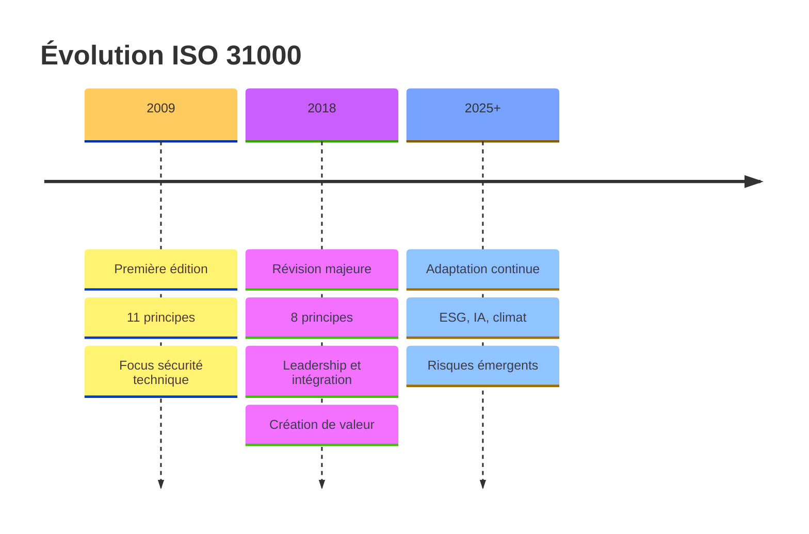
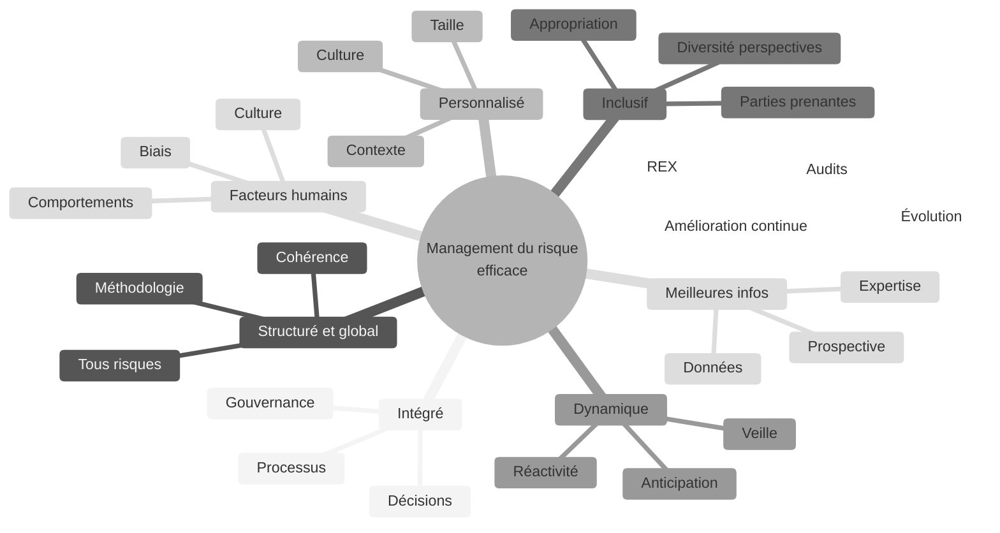
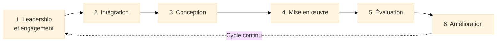
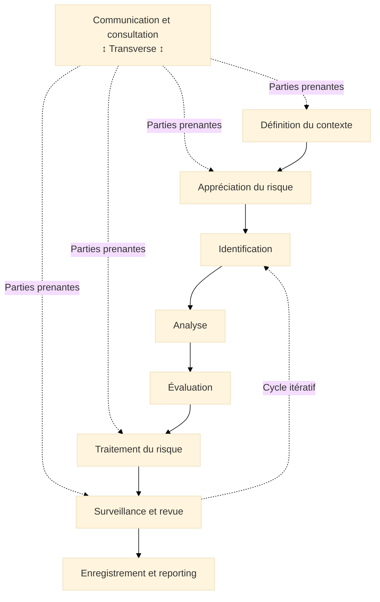
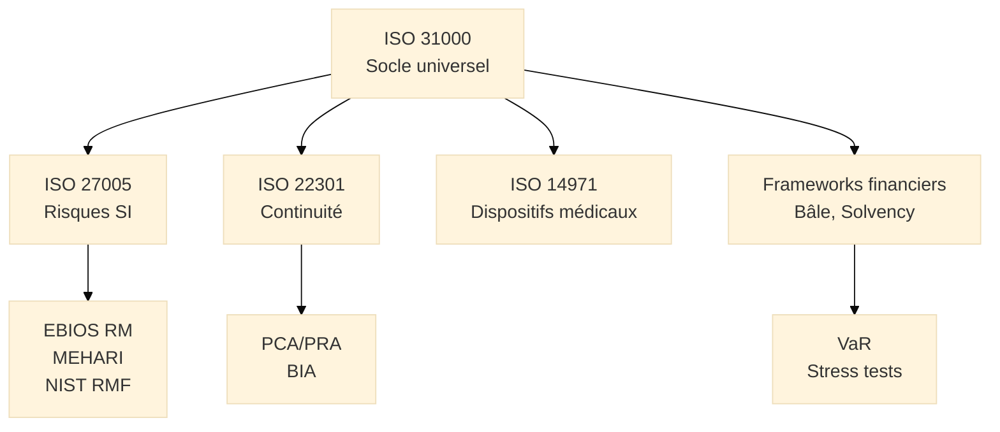
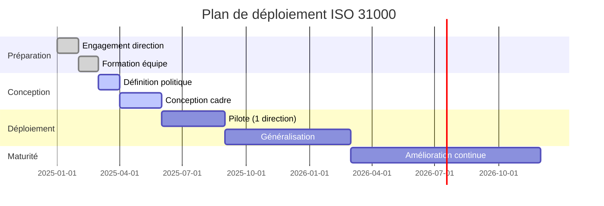

# ISO 31000 - Lignes Directrices

## Introduction au Management du Risque

!!! quote "Analogie pédagogique"
    _Imaginez un **capitaine de navire** qui doit traverser l'Atlantique. Avant de lever l'ancre, il étudie les prévisions météorologiques, identifie les zones dangereuses, vérifie l'état de son navire, forme son équipage aux procédures d'urgence, et prépare des plans alternatifs en cas de tempête. Il ne peut pas **éliminer** tous les risques (tempêtes imprévisibles, pannes mécaniques), mais il peut les **anticiper**, les **évaluer**, et **décider rationnellement** comment naviguer. **ISO 31000 fonctionne exactement ainsi** : c'est la boussole et la carte marine qui guident toute organisation dans son voyage incertain, en transformant l'incertitude en décisions éclairées._

**ISO 31000** constitue le **cadre universel** de management du risque applicable à toute organisation, quel que soit son secteur, sa taille ou sa nature. Publié en 2009 puis révisé en 2018, ce standard international fournit des **lignes directrices** (et non des exigences certifiables) pour concevoir, mettre en œuvre et améliorer continuellement un système de management du risque intégré à la gouvernance et aux processus de l'organisation.

Dans un contexte où les organisations font face à des **incertitudes croissantes** (volatilité économique, cybermenaces, changement climatique, disruptions technologiques, crises sanitaires), le management du risque ne peut plus être une activité isolée réservée aux risk managers. Il doit devenir une **compétence organisationnelle transverse**, intégrée à la prise de décision stratégique et opérationnelle.

!!! info "Pourquoi ISO 31000 est essentiel ?"
    ISO 31000 fournit le **socle universel** dont découlent toutes les approches spécialisées de gestion des risques. Maîtriser ISO 31000, c'est comprendre les principes fondamentaux qui sous-tendent **toute démarche de gestion des risques**, du SMSI (ISO 27001) à la continuité d'activité (ISO 22301), en passant par EBIOS RM ou les frameworks financiers.

---

## Pour repartir des bases

Si vous découvrez ISO 31000, trois points fondamentaux à retenir :

### 1. Ce n'est pas une norme de certification
    
L'ISO 31000 fournit des **lignes directrices**, pas des exigences. Vous ne pouvez pas être "certifié ISO 31000". C'est un **cadre méthodologique** que chaque organisation adapte à son contexte.

### 2. Une définition révolutionnaire du risque

**Définition ISO 31000 :**

> _"Effet de l'incertitude sur les objectifs"_

Cette définition implique trois notions clés :

1. **L'incertitude** :  
_**L'incertitude :** Le risque existe dans l'espace entre "impossible" et "certain". Si un événement est garanti à 100%, ce n'est plus un risque mais une **contrainte planifiable**._

2. **L'effet (positif ou négatif)** :  
    _L'**ISO 31000** reconnaît que le risque peut être une **menace** (cyberattaque, perte financière) ou une **opportunité** (innovation, nouveau marché). Cette vision bidirectionnelle distingue ISO 31000 des approches traditionnelles._

3. **L'impact sur les objectifs**
    _Un événement n'est un "risque" que s'il affecte les objectifs de l'organisation. Une panne informatique dans une PME locale n'a pas le même impact que dans une banque internationale._

### 3 - Un cadre universel et adaptable

L'ISO 31000 s'applique à **tous les types de risques** :

- **Stratégiques** -> (ex: disruption marché[^1], obsolescence)
- **Opérationnels** -> (ex: panne, erreur humaine)
- **Financiers** -> (ex: crédit, change, liquidité)
- **Conformité** -> (ex: RGPD, NIS2, sanctions)
- **Réputation** -> (ex: bad buzz, crise)
- **Technologiques** -> (ex: cyber, obsolescence)

!!! quote "**ISO 31000 et les méthodes sectorielles**"

    L'ISO 31000 ne remplace pas EBIOS RM (cyber), AMDEC[^3] (industrie), ou les frameworks spécialisés. Il fournit le **cadre conceptuel supérieur** qui garantit que toutes ces méthodes s'articulent de manière cohérente au niveau organisationnel.

---

## Historique et évolutions

### Pourquoi ISO 31000 a été créée ?

Avant 2009, le management du risque souffrait d'une **fragmentation** :

- Les financiers utilisaient VaR[^2] et modèles actuariels
- Les ingénieurs appliquaient AMDEC[^3] et arbres de défaillance
- Les risk managers utilisaient des registres sans méthodologie commune
- Les auditeurs suivaient COSO[^4] ou des frameworks nationaux

!!! quote "Besoin identifié"
    Créer un **standard international** harmonisant les approches, applicable à tous secteurs, reconnu par toutes parties prenantes.

### Les deux versions majeures

=== "ISO 31000:2009 — Première édition"

    **Innovations majeures :**
    
    - [x] Définition universelle du risque : "**Effet de l'incertitude sur les objectifs**"
    - [x] Vision positive et négative du risque (_menaces_ **ET** _opportunités_)
    - [x] Processus structuré : **Appréciation** → **Traitement** → **Surveillance**
    - [x] **11 principes fondamentaux** du management du risque
    
    > **Impact :** Adoption massive par les gouvernements (**France**, **UK**, **Australie**) et intégration dans les normes sectorielles (**ISO 27005**, **ISO 22301**).

=== "ISO 31000:2018 — Révision majeure"

    **Évolutions clés :**
    
    - [x] **Simplification** des principes : **11 principes** → **8 principes** (_fusion_ et _clarification_)
    - [x] **Renforcement du leadership :** Le management du risque est **une responsabilité stratégique de la direction**, pas une fonction technique isolée.
    - [x] **Intégration renforcée :** Le risque doit être intégré à **tous les processus** (_pas une activité parallèle_).
    - [x] **Création de valeur :** Focus sur l'amélioration des décisions et l'atteinte des objectifs (_le management du risque n'est pas une "**taxe bureaucratique**"_).
    
    > **Dynamisme et itération :** Abandon du modèle linéaire au profit d'un cycle itératif continu.

### Timeline sur l'évolution de l'ISO 31000

_La révision 2018 marque un tournant stratégique : **moins de principes, plus de focus sur le leadership et la création de valeur**._

---

## Les 8 principes du management du risque

ISO 31000:2018 repose sur **8 principes fondamentaux** qui définissent les caractéristiques d'un système efficace de management du risque.

!!! note "Les principes ne sont pas des étapes"
    Les 8 principes sont des **qualités** que doit posséder un système de management du risque. Ils ne constituent pas un processus séquentiel mais des caractéristiques transverses à cultiver.

### Vue d'ensemble

_Les 8 principes forment un **écosystème cohérent** : chacun renforce les autres pour construire une culture organisationnelle résiliente._

### Les 8 principes expliqués

!!! note "Ci-dessous les 4 premiers principes expliqués"

=== "1️⃣ Intégré"

    **Le management du risque fait partie intégrante de toutes les activités de l'organisation.**
    
    Le management du risque n'est **pas une activité isolée** réalisée par un département "risk management" déconnecté des opérations. Il doit être intégré :
    
    - À la **planification stratégique** :  
      _Prise en compte des risques dans la définition des objectifs_
    
    - Aux **processus opérationnels** :  
      _Identification des risques lors de l'exécution quotidienne_

    - À la **prise de décision** :  
      _Évaluation systématique des risques avant toute décision majeure_

    - À la **gouvernance** :  
      _Reporting risques au conseil d'administration_

=== "2️⃣ Structuré et global"

    **Une approche structurée et globale contribue à des résultats cohérents et comparables.**
    
    - **Structuré** :  
      _Méthodologie formalisée, reproductible, documentée_

    - **Global** :  
      _Couvre **tous les types de risques** (pas uniquement financiers ou opérationnels)_

    - **Cohérent** :  
      _Même approche dans toutes les entités de l'organisation_

    - **Comparable** :  
      _Permet d'agréger et de prioriser les risques_

    
    > Sans une approche structurée, il serait impossible de comparer un "**risque IT élevé**" avec un "**risque financier moyen**".

=== "3️⃣ Personnalisé"

    **Le cadre est personnalisé et proportionné aux contextes externe et interne de l'organisation.**
    
    ISO 31000 n'impose **pas une méthode unique** mais un cadre adaptable. Chaque organisation personnalise :
    
    - Le **niveau de détail** -> (_ex : PME vs multinationale_)
    - Les **outils** -> (_ex : Excel vs plateforme GRC complexe_)
    - Les **critères de criticité** -> (_ex : adaptés au secteur, à la culture_)
    - Les **rôles et responsabilités** -> (_ex : selon la structure organisationnelle_)
    
    > Une startup tech et une banque systémique appliquent toutes deux ISO 31000, mais avec des modalités radicalement différentes.

=== "4️⃣ Inclusif"

    **L'implication appropriée des parties prenantes permet de prendre en compte leurs connaissances et perceptions.**
    
    Le management du risque ne peut être efficace s'il est réalisé en **vase clos**[^5] par des experts. Il nécessite :
    
    - **Consultation** des parties prenantes :  
      _Opérationnels, direction, clients, fournisseurs_

    - **Diversité des perspectives** :  
      _Éviter les angles morts_

    - **Appropriation** :  
      _Les personnes qui gèrent les risques au quotidien doivent être impliquées_

!!! note "Ci-dessous les 4 derniers principes expliqués"

=== "5️⃣ Dynamique"

    **Les risques peuvent émerger, évoluer ou disparaître au fur et à mesure que les contextes changent.**
    
    Le management du risque n'est **pas statique** (un registre mis à jour annuellement) mais **dynamique** :
    
    - **Veille continue** :  
      _Surveillance des évolutions (réglementaire, technologique, concurrentiel)_

    - **Réactivité** :  
      _Identification rapide de nouveaux risques émergents_

    - **Révision régulière** :  
      _Réévaluation des risques existants_

    - **Anticipation** :  
      _Prospective sur les risques futurs (horizon 3-5 ans)_

    > Le risque de pandémie **avant**/**pendant**/**après** COVID-19 illustre parfaitement ce principe.

=== "6️⃣ Meilleures info. disponibles"

    **Les décisions sont fondées sur des informations historiques, actuelles et des attentes futures.**
    
    Les décisions de management du risque s'appuient sur :
    
    - **Données factuelles** :  
      _Statistiques, historiques d'incidents, audits_

    - **Jugement d'experts** :  
      _Avis de spécialistes lorsque les données manquent_

    - **Prospective**   
      _Anticipation des évolutions futures_

    - **Reconnaissance des limites** :  
      _Transparence sur l'incertitude_

    > La qualité des décisions **dépend directement** de la **qualité des informations disponibles**.

=== "7️⃣ Facteurs humains et culturels"

    **Le comportement humain et la culture influencent tous les aspects du management du risque.**
    
    Les risques ne sont pas uniquement techniques. Les **facteurs humains** jouent un rôle majeur :
    
    - **Culture de la sécurité** :  
      _Une organisation avec une culture forte commet moins d'erreurs_

    - **Biais cognitifs** :  
      _Excès de confiance, ancrage, biais de confirmation_

    - **Résistance au changement** :  
      _Les mesures peuvent être sabotées si mal acceptées_

    - **Erreur humaine** :  
      _Première cause d'incidents (phishing, configuration, procédures)_
    
    !!! danger "Culture punitive"
        **L'erreur est sanctionnée** → Les employés cachent les incidents → Détection tardive → **Impact majeur**

    !!! success "Culture positive"
        **L'erreur est une opportunité d'apprentissage** → Signalement immédiat → Détection rapide → **Impact mineur**

=== "8️⃣ Amélioration continue"

    **Le management du risque est continuellement amélioré par l'apprentissage et l'expérience.**
    
    Le système de management du risque n'est **jamais figé**. Il s'améliore via :
    
    - **Retours d'expérience** :  
      _Analyse des incidents et quasi-incidents_
    
    - **Audits internes** :  
      _Évaluation de l'efficacité du dispositif_
    
    - **Benchmarks** :  
      _Comparaison avec les meilleures pratiques_
    
    - **Évolution des méthodes** :  
      _Adoption de nouveaux outils et techniques_
    

---

## Le cadre de travail (Framework)

ISO 31000 distingue :

- **Le cadre de travail (Framework)** :  
  _Structure organisationnelle pour mettre en place le management du risque_

- **Le processus** :  
  _Activités opérationnelles d'identification, analyse, traitement des risques_

> Le **cadre de travail** répond à la question :  
> _"Comment structurer l'organisation pour que le management du risque soit efficace ?"_

### Les 6 composantes du cadre

_Le cadre ISO 31000 fonctionne en **boucle itérative** : chaque cycle d'amélioration renforce la maturité organisationnelle._

### Détail des composantes

??? abstract "1. Leadership et engagement"

    **Le management du risque ne peut être efficace sans l'engagement fort de la direction.**
    
    **Responsabilités de la direction :**
    
    - Définir l'**appétit au risque** (niveau de risque acceptable)
    - Allouer les **ressources** (budget, compétences, outils)
    - Assurer la **reddition de comptes** (responsabilité des risques majeurs)
    - Promouvoir la **culture du risque** (communication, exemplarité)
    
    **Rôle du conseil d'administration :**
    
    - Valider la politique de management du risque
    - Approuver l'appétit au risque
    - Superviser les risques majeurs (top risks)
    - S'assurer de l'adéquation des ressources
    

??? abstract "2. Intégration"

    **Le management du risque doit être intégré à tous les processus, non traité comme une activité parallèle.**
    
    **Processus clés à intégrer :**
    
    | Processus | Intégration du risque |
    |-----------|----------------------|
    | Planification stratégique | Analyse SWOT incluant risques/opportunités |
    | Gestion de projets | Registre de risques projet, go/no-go |
    | Audit interne | Audits basés sur les risques |
    | Gestion de la performance | KPI incluant indicateurs de risque (KRI) |
    | Conformité | Gestion intégrée GRC |
    
    > L'intégration transforme le management du risque d'une **fonction support** en **composante stratégique**.

??? abstract "3. Conception"

    **Concevoir un cadre de management du risque adapté au contexte de l'organisation.**
    
    **Éléments à concevoir :**
    
    **Politique de management du risque :**  
    _Document de référence définissant objectifs, principes, appétit au risque, gouvernance, processus._
    
    **Rôles et responsabilités :**

    - Direction : Définir appétit au risque, superviser risques majeurs
    - Risk Manager : Concevoir et piloter le cadre
    - Managers : Identifier et gérer les risques de leur périmètre
    - Tous collaborateurs : Identifier et signaler les risques
    
    **Outils et ressources :**

    - **Registre de risques** (base centralisée)
    - **Taxonomie des risques**[^6] (classification structurée)
    - **Échelles de criticité** (matrice probabilité × impact)
    - **Méthodes d'analyse** (quantitatives et qualitatives)

??? abstract "4. Mise en œuvre"

    **Déployer opérationnellement le cadre à tous les niveaux de l'organisation.**
    
    **Plan de déploiement type :**
    
    **Phase 1 : Lancement (3-6 mois)**

    - Communication direction
    - Formation des managers
    - Déploiement des outils
    - Identification initiale des risques
    
    **Phase 2 : Généralisation (6-12 mois)**

    - Extension à toutes les entités
    - Intégration aux processus existants
    - Premiers cycles de surveillance
    - Ajustements méthodologiques
    
    **Phase 3 : Maturité (12-24 mois)**

    - Automatisation (plateforme GRC)
    - Culture du risque ancrée
    - Amélioration continue
    - Certifications compatibles (ISO 27001, ISO 22301)

??? abstract "5. Évaluation"

    **Mesurer régulièrement l'efficacité du cadre de management du risque.**
    
    **Méthodes d'évaluation :**
    
    **Audits internes :**  
    _Fréquence annuelle, scope conformité procédures, exhaustivité registre, qualité analyses._
    
    **Indicateurs clés (KRI) :**

    - **Couverture** :  
      _% de processus avec analyse de risques_

    - **Maturité** :  
      _Score de maturité du dispositif_

    - **Efficacité** :  
      _% de risques critiques avec plan d'action_

    - **Culture** :  
      _Taux participation formations, risques remontés_

    
    **Benchmarks sectoriels :**  
    _Comparaison avec les bonnes pratiques (FERMA, IRM, CLUSIF)._

??? abstract "6. Amélioration"

    **Améliorer continuellement le cadre sur la base des évaluations et retours d'expérience.**
    
    **Sources d'amélioration :**
    
    - **REX[^7] incidents** :  
      _Analyse des causes racines, mesures correctives_
    
    - **Évolutions réglementaires** :  
      _Adaptation DORA, NIS2, AI Act_
    
    - **Innovations** :  
      _IA pour détection signaux faibles, nouveaux outils_
    
    - **Benchmarks** :  
      _Adoption standards reconnus (ISO 31000, COSO, NIST)_
    
    > Chaque incident majeur déclenche un REX[^7] structuré : **causes**, **corrections**, **mise à jour registre**, **partage leçons**.

---

## Le processus de management du risque

Le **processus** décrit les **activités opérationnelles** pour gérer les risques au quotidien.

### Vue d'ensemble du processus

_Le processus est **dynamique et itératif** : la surveillance alimente en continu l'identification de nouveaux risques ou la réévaluation des risques existants._

### Les étapes du processus

??? abstract "1 - Communication et consultation"

    **Activité transverse présente à toutes les étapes du processus.**
    
    **Objectifs :**
    
    - Recueillir des **informations** (expertise, expérience, perception)
    - Favoriser l'**appropriation** (engagement des parties prenantes)
    - Assurer la **transparence** (communication claire sur les risques)
    - Gérer les **attentes** (alignement sur objectifs et contraintes)
    
    **Parties prenantes clés :**
    
    :lucide-user-round: Direction  
    :lucide-users: Direction opérationnels  
    :lucide-users: Direction experts techniques  
    :lucide-users: Direction clients  
    :lucide-users: Direction fournisseurs  
    :lucide-users: Direction régulateurs  
    :lucide-users: Direction assureurs
    
    !!! tip "Consultation efficace"
        La diversité des perspectives évite les angles morts : un risque invisible pour la finance peut être évident pour l'IT.

??? abstract "2 - Définition du contexte"

    **Établir le contexte pour personnaliser le management du risque.**
    
    **Contexte externe :**  
    _Environnement économique, réglementaire, technologique, social, concurrentiel, géopolitique._
    
    **Contexte interne :**  
    _Gouvernance, culture, ressources, objectifs stratégiques, processus._
    
    **Appétit au risque :**  
    _Niveau de risque global acceptable pour atteindre les objectifs._
    
    **Périmètre :**

    - Géographique (France vs international)
    - Organisationnel (groupe vs filiale)
    - Temporel (court terme vs long terme)
    - Thématique (tous risques vs focus spécifique)

??? abstract "3 - Appréciation du risque"

    **Cœur du processus : identifier, analyser, évaluer les risques.**
    
    

    
    - **Identification**
    
        ---

        **Méthodes principales :**
      
        - Brainstorming (ateliers collectifs)
        - Checklist (listes standardisées)
        - SWOT (Forces, Faiblesses, Opportunités, Menaces)
        - What-if / Scénarios ("Que se passerait-il si...")
        - REX (analyse incidents passés)
      
        > Un risque bien identifié comprend : **événement** + **cause(s)** + **conséquence(s)** + **source**.
    
    

    
    

    
    - **Analyse**

        ---
    
        **Deux approches complémentaires :**
        
        **Analyse qualitative :**  
        _Échelles descriptives (**rare**/**peu probable**/**possible**/**probable**/**quasi-certain**) pour probabilité et impact._
        
        **Analyse quantitative :**  
        _Modèles mathématiques (**VaR**, **Monte Carlo**, **arbres de décision**) pour estimer probabilité et impact en valeurs numériques._
        
        **Matrice de criticité :**  
        _**Probabilité** × **Impact** = **Score de criticité** (matrice 5×5 courante)._
    
    

    
    

    
    - **Évaluation**
    
        **Comparer le niveau de risque aux critères définis pour prioriser les actions.**
    
        - Criticité faible (1-5) → Accepter
        - Criticité modérée (6-9) → Surveiller
        - Criticité significative (10-15) → Traiter
        - Criticité critique (16-25) → Traiter en priorité
        - 
    

??? abstract "4 - Traitement du risque"

    **Les 4 stratégies**

    > **Sélectionner et mettre en œuvre les options de traitement.**
    
    

    
    - **1. Réduire (Mitigation)**  
        _Diminuer la probabilité et/ou l'impact via mesures préventives, détection, correction._

    - **2. Transférer :**  
        _Partager le risque avec un tiers (assurance, externalisation, contrat)._

    - **3. Accepter :**  
        _Décision consciente de ne pas traiter (niveau acceptable, coût mitigation > impact)._
    
    - **4. Éviter :**  
        _Éliminer le risque en renonçant à l'activité (risque inacceptable, coût prohibitif)._
    
    

??? abstract "5 - Surveillance et revue"

    > **Surveiller en continu l'évolution des risques et l'efficacité des traitements.**
    
    **Activités de surveillance :**
    
    - Suivi des **KRI** (Key Risk Indicators)
    - Revue périodique du **registre de risques** (mensuel/trimestriel/annuel)
    - **Veille** risques émergents (réglementaire, technologique)
    - **Tests et exercices** (PCA/PRA, wargaming)
    
    **Fréquences types :**

    - **Mensuel** : Risques critiques, incidents
    - **Trimestriel** : Top 10 risks, évolution criticité
    - **Annuel** : Cartographie complète, appétit au risque

??? abstract "6 - Enregistrement et reporting"

    > **Documenter et communiquer sur les risques et leur gestion.**
    
    **Registre de risques :**  
    _Base centralisée documentant tous les risques identifiés, leurs caractéristiques, traitements et suivi._
    
    **Reporting :**

    - **Direction** :  
      _Synthèse top risks_

    - **Opérationnels** :  
      _Détail risques périmètre_

    - **Conseil/Régulateur** :  
      _Vision consolidée, conformité_

    > La documentation assure la **traçabilité** des décisions et facilite les **audits**.

---

## Articulation avec d'autres normes et frameworks

L'ISO 31000 constitue le **socle générique** dont découlent les approches spécialisées.

### Comparaison avec les standards majeurs

| Standard | Périmètre | Relation avec ISO 31000 | Certifiable |
|----------|-----------|------------------------|-------------|
| **ISO 27005** | Risques sécurité information | Déclinaison ISO 31000 pour le cyber | ❌ Non |
| **ISO 22301** | Continuité d'activité | Intègre principes ISO 31000 | ✅ Oui |
| **EBIOS RM** | Risques cyber (France) | Compatible ISO 31000, focus scénarios | ❌ Non |
| **COSO ERM** | Risques entreprise (USA) | Approche parallèle, convergence principes | ❌ Non |
| **NIST RMF** | Risques cyber (USA) | Compatible ISO 31000, focus fédéral | ❌ Non |

!!! info "Complémentarité des standards"
    ISO 31000 fournit le **langage commun** et la **méthodologie de base**. Les standards sectoriels (_ISO 27005_, _EBIOS RM_, _NIST_) ajoutent les **spécificités techniques** de leur domaine.

### Positionnement d'ISO 31000

_ISO 31000 constitue la **racine commune** dont découlent toutes les méthodes spécialisées de gestion des risques._

---

## Bénéfices de l'approche ISO 31000

### Pour les organisations

-   :lucide-check-circle:{ .lg .middle } **Amélioration de la prise de décision**

    ---
    Décisions basées sur une évaluation structurée des risques et opportunités.

-   :lucide-trending-up:{ .lg .middle } **Allocation optimale des ressources**

    ---
    Concentration des efforts et budgets sur les risques les plus critiques.

-   :lucide-shield-check:{ .lg .middle } **Conformité facilitée**

    ---
    Cadre structuré répondant aux exigences RGPD, NIS2, DORA, ISO 27001.

-   :lucide-refresh-cw:{ .lg .middle } **Résilience accrue**

    ---
    Anticipation et préparation aux crises plutôt que réaction en mode pompier.

-   :lucide-handshake:{ .lg .middle } **Confiance des parties prenantes**

    ---
    Démonstration d'une gestion mature des risques (investisseurs, clients, régulateurs).

### Pour les risk managers

-   :lucide-message-circle:{ .lg .middle } **Langage commun**

    ---
    Terminologie standardisée reconnue internationalement.

-   :lucide-check-square:{ .lg .middle } **Méthodologie éprouvée**

    ---
    Processus validé par des milliers d'organisations depuis 2009.

-   :lucide-award:{ .lg .middle } **Crédibilité professionnelle**

    ---
    Référence reconnue lors d'audits, certifications, échanges sectoriels.

-   :lucide-network:{ .lg .middle } **Cohérence transverse**

    ---
    Vision consolidée de tous les risques (finance, IT, opérations, conformité).

!!! quote "Valeur créée"
    ISO 31000 transforme le management du risque d'une **fonction administrative** en **levier de performance stratégique**.

---

## Mise en œuvre pratique

### Étapes clés de déploiement

_Ce diagramme de Gantt permet de **visualiser les jalons clés** et de **synchroniser les équipes** autour d'un calendrier partagé de déploiement ISO 31000._

### Écueils à éviter

!!! warning "Pièges courants"
    
    **Déconnexion de la stratégie :**  
    _Le management du risque devient une activité administrative sans lien avec les objectifs business._
    
    **Complexité excessive :**  
    _Processus trop lourd, registres illisibles, paralysie décisionnelle._
    
    **Manque d'engagement direction :**  
    _Sans sponsorship fort, le dispositif reste superficiel et inefficace._
    
    **Culture punitive :**  
    _Sanctionner les erreurs pousse à cacher les risques plutôt qu'à les signaler._
    
    **Vision statique :**  
    _Registre mis à jour annuellement, aucune réactivité face aux risques émergents._

### Facteurs clés de succès

- [x] **Leadership visible** de la direction
- [x] **Formation** de tous les niveaux (_pas uniquement risk managers_)
- [x] **Intégration** aux processus existants (_pas un dispositif parallèle_)
- [x] **Simplicité** des outils (_accessible à tous_, _pas uniquement aux experts_)
- [x] **Culture positive** du risque (_**signaler = valorisé**_, _pas sanctionné_)
- [x] **Amélioration continue** basée sur REX[^7] et benchmarks

---

## Perspectives et évolutions

### Risques émergents à intégrer

**Intelligence Artificielle :**  
_Biais algorithmiques, hallucinations, dépendance, propriété intellectuelle, deepfakes._

**Changement climatique :**  
_Risques physiques (inondations, canicules), transition (réglementation carbone, obsolescence actifs)._

**Géopolitique :**  
_Conflits, sanctions, protectionnisme, ruptures supply chain._

**Quantum computing :**  
_Obsolescence cryptographie actuelle, nouveaux modèles de menaces._

### Convergence réglementaire

!!! quote "Les réglementations européennes (NIS2, DORA, AI Act) renforcent les exigences de management du risque, qui sont elles, alignées sur ISO 31000."

- **NIS2 :**  
  _Impose analyse de risques, mesures techniques, gouvernance (compatible ISO 31000)._

- **DORA :**  
  _Exige cadre de gestion des risques TIC pour secteur financier (framework ISO 31000 applicable)._

- **AI Act :**  
  _Approche par niveaux de risques cohérente avec principes ISO 31000._

!!! info "ISO 31000 comme socle de conformité"
    Déployer l'**ISO 31000** facilite la conformité simultanée à multiple réglementations partageant les mêmes principes de gestion des risques.

## Le mot de la fin

!!! quote
    L'ISO 31000 incarne une **vérité universelle** : dans un monde incertain, la capacité à **anticiper**, **évaluer** et **décider rationnellement face aux risques** constitue un avantage compétitif majeur. Les organisations qui maîtrisent le management du risque ne subissent pas les crises, elles les **anticipent**, les **gèrent** et en sortent **renforcées**.
    
    Contrairement aux normes sectorielles (**ISO 27005** pour le cyber, **ISO 14971** pour les dispositifs médicaux), ISO 31000 fournit le **socle conceptuel universel** applicable à tous les domaines. Maîtriser ISO 31000, c'est acquérir un **langage commun**, une **méthodologie éprouvée** et une **vision holistique**[^8] du risque qui transcende les silos organisationnels.
    
    Les 8 principes d'ISO 31000 ne sont pas de simples recommandations techniques : ils définissent une **culture organisationnelle** où le risque n'est pas tabou mais **intégré naturellement** à la prise de décision, où l'erreur n'est pas sanctionnée mais **analysée pour progresser**, où l'incertitude n'est pas subie mais **transformée en opportunités**.
    
    Dans un contexte européen de plus en plus régulé (**RGPD**, **NIS2**, **DORA**, **AI Act**), l'ISO 31000 devient le **dénominateur commun** qui facilite la conformité simultanée à des exigences multiples. Déployer l'ISO 31000, c'est poser les fondations d'un système de management du risque cohérent, évolutif, auditable.
    
    > **L'incertitude est inévitable.  
    > Le management du risque selon l'ISO 31000 transforme cette incertitude en décisions éclairées.**

---

## Ressources complémentaires

### Documents officiels ISO

- **ISO 31000:2018** — Management du risque : Lignes directrices

- ~~**ISO Guide 73:2009** — Management du risque : Vocabulaire~~  
  <small>_**État actuel** : Annulée_</small>  
  <small>_**Date de publication** : 2009-11_</small>  
  <small>_**Stade** : Annulation de la Norme internationale [95.99]_</small>

- **ISO/IEC 31010:2019** — Techniques d'appréciation des risques  

### Standards associés

- **ISO 27005** : Gestion des risques liés à la sécurité de l'information
- **ISO 22301** : Systèmes de management de la continuité d'activité
- **ISO 14971** : Application du management du risque aux dispositifs médicaux

### Frameworks complémentaires

- **COSO ERM** : Enterprise Risk Management Framework (COSO, États-Unis)
- **EBIOS Risk Manager** : Méthode de gestion des risques cyber (ANSSI, France)
- **NIST RMF** : Risk Management Framework (NIST, États-Unis)

### Organismes professionnels

- **FERMA** : Federation of European Risk Management Associations
- **IRM** : Institute of Risk Management (UK)
- **AMRAE** : Association pour le Management des Risques et des Assurances de l'Entreprise (France)
- **CLUSIF** : Club de la Sécurité de l'Information Français

[^1]: La **disruption de marché** correspond à l’arrivée d’une innovation qui change brutalement les règles établies, comme le passage du vieux **forfait Millenium** (où chaque minute comptait) aux **forfaits Internet tout illimité**, qui ont complètement transformé les usages et forcé les opérateurs à réinventer leur modèle économique.
[^2]: La **VaR** (*Value at Risk*) est une mesure financière qui estime la perte maximale potentielle d’un portefeuille sur une période donnée et avec un niveau de confiance fixé, dans des conditions de marché normales.
[^3]: L’**AMDEC** (*Analyse des Modes de Défaillance, de leurs Effets et de leur Criticité*) est une méthode structurée qui consiste à identifier les défaillances possibles d’un système, analyser leurs conséquences et évaluer leur criticité afin de prioriser les actions de prévention ou de correction.
[^4]: Le **COSO** est un cadre de référence international destiné à structurer et améliorer le contrôle interne d’une organisation, en définissant les principes nécessaires pour maîtriser les risques, garantir la conformité et renforcer la gouvernance.
[^5]: Un **vase clos** désigne une situation qui fonctionne en circuit fermé, isolée de l’extérieur, où les idées, informations ou influences ne circulent plus, ce qui finit par limiter l’innovation, la remise en question et la capacité d’adaptation.
[^6]: La **taxonomie des risques** est une classification structurée qui organise et hiérarchise tous les types de risques d’une organisation afin de parler un langage commun, d’éviter les ambiguïtés et de faciliter l’identification, l’évaluation et le pilotage des risques dans un cadre cohérent.
[^7]: **REX** est un processus structuré qui consiste à analyser un incident après coup, identifier ce qui s’est réellement passé, comprendre les causes profondes, en tirer des enseignements et mettre à jour les pratiques, procédures ou outils pour éviter qu’il ne se reproduise.
[^8]: Une **vision holistique** consiste à considérer un système dans sa globalité plutôt qu’à travers ses éléments isolés, en cherchant à comprendre comment toutes les parties interagissent pour produire un fonctionnement ou un résultat d’ensemble.
