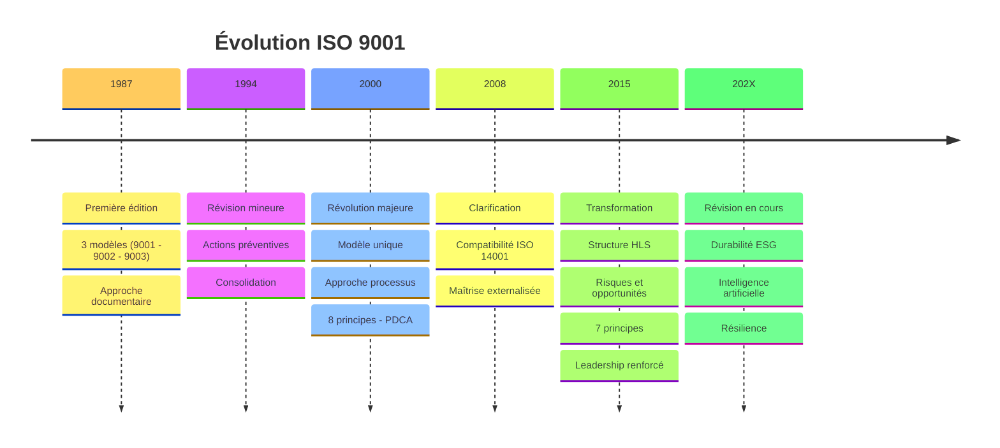
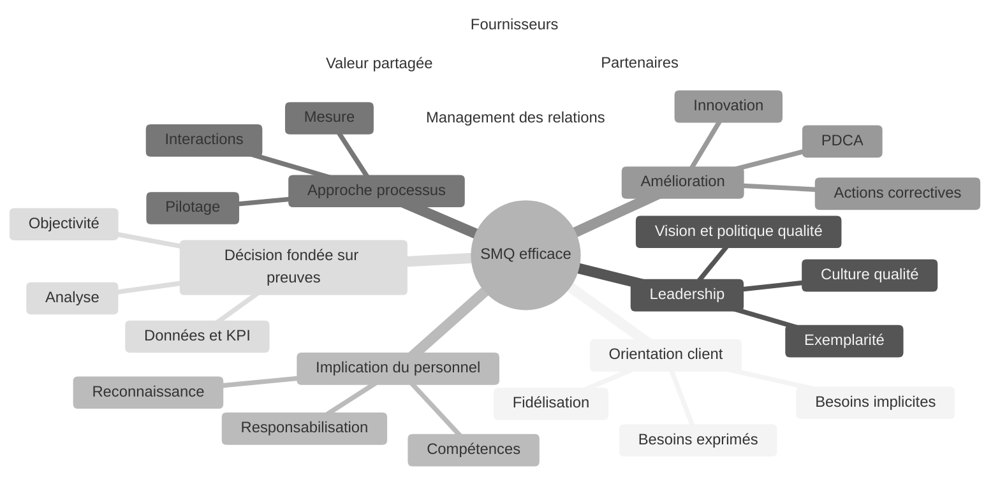
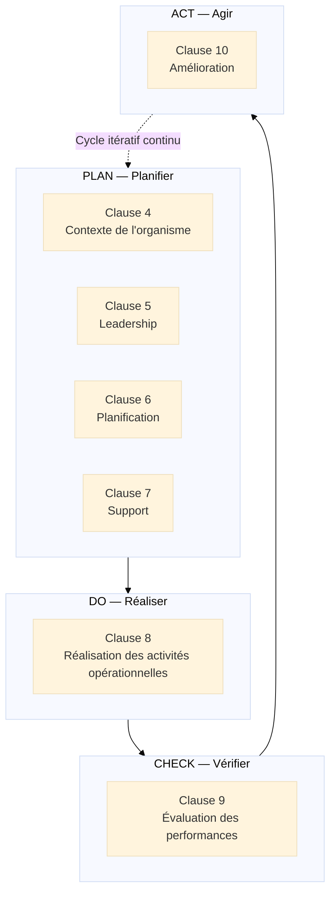
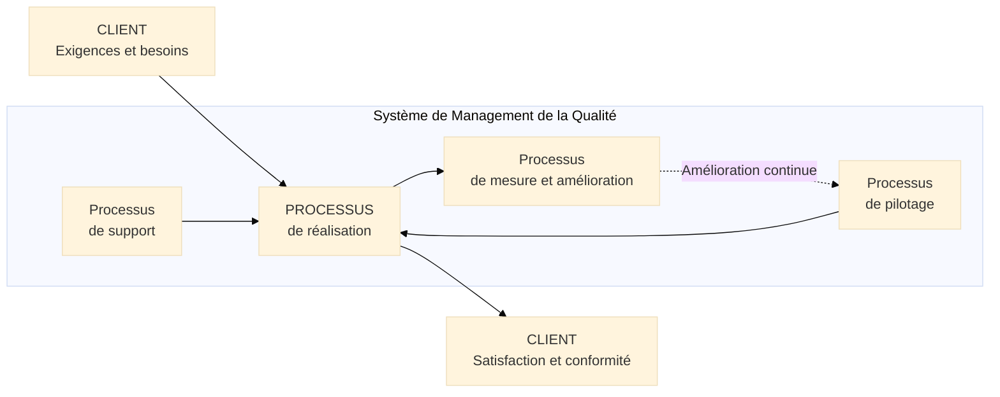
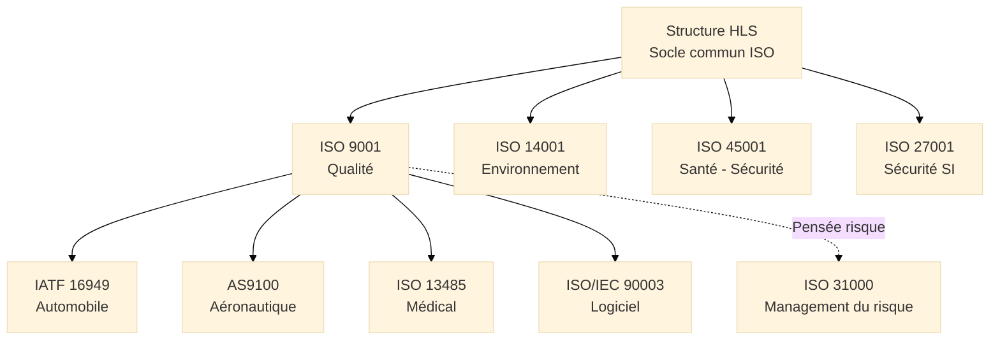
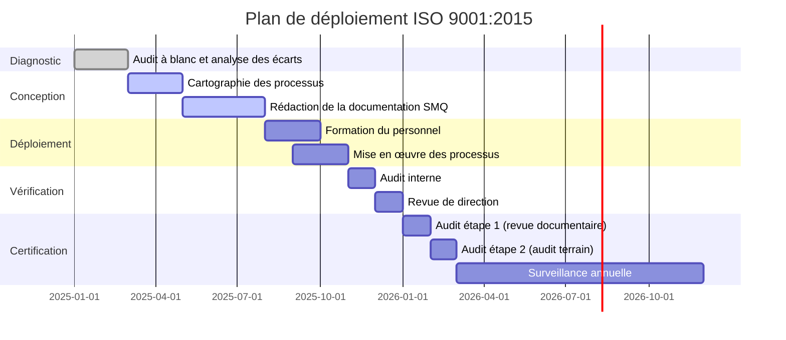

# ISO 9001 — Système de Management de la Qualité

<div
  class="omny-meta"
  data-level="🟡 Intermédiaire & 🔴 Avancé"
  data-version="1.0"
  data-time="35-40 minutes">
</div>

## Introduction au Management de la Qualité

!!! quote "Analogie pédagogique"
    _Imaginez une **compagnie aérienne internationale** qui exploite une flotte de 300 avions, avec 15 000 pilotes et 40 000 membres d'équipage répartis sur six continents. Chaque vol doit être **identique en termes de sécurité et de qualité de service**, qu'il décolle de Paris ou de Singapour, qu'il soit opéré par un Boeing 777 ou un Airbus A350. Pour y parvenir, la compagnie ne s'appuie pas sur les seules compétences individuelles de chaque pilote, mais sur des **procédures standardisées**, des **check-lists rigoureuses**, des **formations certifiantes**, des **audits réguliers** et une **amélioration continue** nourrie par l'analyse de chaque incident. **ISO 9001 fonctionne exactement ainsi** : c'est le cadre qui permet à n'importe quelle organisation de délivrer une qualité constante et démontrable, indépendamment de la personne qui exécute la tâche ou du site où elle est réalisée._

**ISO 9001** constitue le **standard international de management de la qualité** le plus adopté au monde, avec plus d'un million d'organisations certifiées dans 170 pays. Publié pour la première fois en 1987, puis refondu en profondeur en 2015, il définit les **exigences** qu'un système de management de la qualité[^1] (SMQ) doit satisfaire pour qu'une organisation puisse démontrer son aptitude à fournir des produits et services conformes aux exigences des clients et aux exigences légales et réglementaires applicables.

À la différence d'ISO 31000 (lignes directrices non certifiables), **ISO 9001 est une norme d'exigences** : elle définit ce que l'organisation **doit** faire, pas seulement ce qu'elle pourrait faire. La conformité peut être vérifiée et attestée par un organisme de certification[^2] tiers indépendant.

!!! info "Pourquoi ISO 9001 est essentiel ?"
    ISO 9001 fournit le **cadre structurant** qui transforme la qualité d'une intention subjective en un **système gérable, mesurable et améliorable**. Maîtriser ISO 9001, c'est comprendre comment construire une organisation capable de **promettre** une qualité constante et de **tenir** cette promesse, audit après audit, client après client.

<br>

---

## Pour repartir des bases

Si vous abordez ISO 9001 pour la première fois, trois points fondamentaux à intégrer avant d'aller plus loin.

### 1. Une norme certifiable

À la différence de nombreux standards ISO qui fournissent des lignes directrices (comme ISO 31000 ou ISO 27002), **ISO 9001 est une norme d'exigences** : ses clauses définissent ce que l'organisation **doit** mettre en place, pas ce qu'elle devrait envisager.

La conformité à ISO 9001 peut être :

- **Autodéclarée** : l'organisation affirme elle-même sa conformité
- **Certifiée** : un organisme de certification[^2] accrédité audite l'organisation et délivre un certificat valable 3 ans (avec deux audits de surveillance annuels intermédiaires)

> La certification est la voie reconnue sur le marché. Elle constitue une **preuve objective** de la maturité du système qualité, vérifiable par n'importe quel client ou donneur d'ordre.

### 2. Une définition exigeante de la qualité

La qualité selon ISO 9001 ne se réduit pas à l'absence de défauts. Elle englobe trois dimensions complémentaires :

1. **Conformité aux exigences** :  
   _Le produit ou service respecte les spécifications définies (techniques, légales, contractuelles)._

2. **Satisfaction client** :  
   _Le client perçoit que ses besoins exprimés et implicites sont satisfaits, voire dépassés._

3. **Amélioration continue** :  
   _Le système se perfectionne en permanence, sans attendre qu'un problème survienne._

!!! info "Définition ISO 9000:2015"
    > _"Aptitude d'un ensemble de caractéristiques intrinsèques d'un objet à satisfaire des exigences."_

    Cette définition signifie que la qualité n'est pas absolue : elle s'évalue **toujours par rapport à des exigences définies**, qui peuvent être celles d'un client, d'une réglementation, ou de l'organisation elle-même.

### 3. Un cadre universel à déclinaisons sectorielles

ISO 9001 s'applique à **toute organisation**, quelle que soit sa taille, son secteur ou son statut juridique :

- **Industriel** → (ex : constructeur automobile, agroalimentaire)
- **Services** → (ex : cabinet conseil, hôpital, banque)
- **Public** → (ex : collectivité territoriale, administration)
- **Associatif** → (ex : ONG, fondation)
- **Numérique** → (ex : éditeur logiciel, hébergeur cloud)

!!! note "ISO 9001 et les dérivés sectoriels"
    ISO 9001 constitue la **base commune** dont dérivent des standards sectoriels plus exigeants : **IATF 16949** (automobile), **AS9100** (aéronautique et défense), **ISO 13485** (dispositifs médicaux), **ISO/IEC 90003** (logiciels). Ces normes intègrent toutes les exigences d'ISO 9001 et y ajoutent des exigences spécifiques à leur secteur.

<br>

---

## Historique et évolutions

### Pourquoi ISO 9001 a été créée ?

Avant 1987, les référentiels qualité étaient **fragmentés et nationaux** :

- Les militaires américains utilisaient **MIL-Q-9858** (1959)
- L'industrie britannique appliquait **BS 5750** (1979)
- Chaque donneur d'ordre imposait ses propres audits à ses fournisseurs

!!! note "Besoin identifié"
    Créer un **standard international unique** harmonisant les exigences qualité, permettant à un fournisseur d'être audité une seule fois pour répondre aux attentes de multiples clients dans le monde entier.

### Les cinq versions majeures

=== "ISO 9001:1987 — Fondation"

    **Contexte :**  
    _Inspiré de **BS 5750**, ce premier standard définit trois niveaux de certification (9001, 9002, 9003) selon la portée du système qualité._

    **Innovations majeures :**

    - [x] Premier standard qualité international
    - [x] Focus sur la **conformité documentaire** (tout formaliser, tout tracer)
    - [x] Approche **prescriptive** (définit comment faire, pas uniquement quoi faire)

    > **Limite principale :** Surcharge documentaire massive, peu de place pour la flexibilité et l'amélioration réelle.

=== "ISO 9001:1994 — Consolidation"

    **Contexte :**  
    _Révision mineure visant à clarifier certaines exigences et renforcer les actions préventives._

    **Évolutions clés :**

    - [x] Renforcement des **actions correctives et préventives**
    - [x] Précisions sur la gestion des **non-conformités**
    - [x] Toujours trois modèles distincts (9001, 9002, 9003)

    > **Critique persistante :** L'approche reste documentaire et procédurale, sans lien fort avec les résultats réels pour le client.

=== "ISO 9001:2000 — Révolution"

    **Contexte :**  
    _Refonte profonde sous l'impulsion du **Total Quality Management** et des retours terrain accumulés depuis 1994._

    **Innovations majeures :**

    - [x] **Modèle unique** : fusion des trois versions en une seule norme
    - [x] Introduction de l'**approche processus**[^3]
    - [x] Intégration explicite du **cycle PDCA**[^4]
    - [x] Focus sur la **satisfaction client** (pas uniquement la conformité technique)
    - [x] **8 principes** de management de la qualité

    > **Impact :** Adoption massive mondiale. La certification ISO 9001 devient un **prérequis commercial** dans de nombreux secteurs.

=== "ISO 9001:2008 — Clarification"

    **Contexte :**  
    _Révision mineure sans changements structurels majeurs._

    **Évolutions clés :**

    - [x] Clarifications rédactionnelles sans modification des exigences
    - [x] Meilleure compatibilité avec **ISO 14001** (management environnemental)
    - [x] Précisions sur la maîtrise des **processus externalisés**

    > **Limite identifiée :** La norme reste silencieuse sur la gestion des risques et le contexte organisationnel, inadaptée à un environnement économique devenu volatil et incertain.

=== "ISO 9001:2015 — Transformation"

    **Contexte :**  
    _Refonte majeure intégrant les leçons des 15 années d'application mondiale et les nouvelles réalités économiques._

    **Innovations majeures :**

    - [x] **Structure HLS**[^5] : alignement avec toutes les normes ISO de management (ISO 14001, ISO 45001, ISO 27001)
    - [x] **Pensée fondée sur les risques** : intégration explicite de la gestion des risques et opportunités
    - [x] **Réduction documentaire** : liberté sur la forme, exigence sur le fond
    - [x] **8 principes → 7 principes** (fusion et clarification)
    - [x] Focus renforcé sur le **contexte de l'organisme** et les **parties intéressées**[^6]
    - [x] **Leadership** : responsabilité directe du top management (abandon du "représentant de la direction" obligatoire)

    > **Rupture majeure :** Première version à intégrer explicitement la **pensée fondée sur les risques**, rapprochant ISO 9001 d'ISO 31000 dans sa logique de gouvernance.

### Timeline de l'évolution ISO 9001


_La révision 2015 marque le passage d'une norme **documentaire et prescriptive** à un cadre **stratégique et orienté résultats**. La prochaine révision intégrera les enjeux de durabilité et d'intelligence artificielle._

<br>

---

## Les 7 principes du management de la qualité

ISO 9001:2015 repose sur **7 principes fondamentaux** définis dans la norme compagnon **ISO 9000:2015** (Vocabulaire). Ces principes constituent le fondement philosophique du management de la qualité moderne.

!!! note "Les principes ne sont pas des clauses"
    Les 7 principes ne correspondent pas directement aux clauses opérationnelles de la norme. Ils représentent les **valeurs directrices** qui sous-tendent l'ensemble des exigences. Comprendre les principes permet de comprendre **pourquoi** la norme exige ce qu'elle exige.

### Vue d'ensemble


_Les 7 principes forment un **système cohérent** : l'orientation client en est le point de départ et la finalité permanente, l'amélioration continue le mécanisme qui fait évoluer l'ensemble._

### Les 7 principes expliqués

!!! note "Ci-dessous les 4 premiers principes"

=== "1️⃣ Orientation client"

    **Le principal objectif du management de la qualité est de satisfaire aux exigences des clients et de s'efforcer d'aller au-delà de leurs attentes.**

    L'orientation client ne se limite pas à répondre aux exigences formulées dans un contrat. Elle englobe trois niveaux :

    - **Besoins exprimés** :  
      _Spécifications, délais, prix définis contractuellement ou formellement._

    - **Besoins implicites** :  
      _Ce que le client attend sans l'avoir formulé : fiabilité, disponibilité, cohérence du service._

    - **Besoins latents** :  
      _Ce que le client ne sait pas encore qu'il veut, mais dont la satisfaction créera un avantage compétitif réel._

    > Mesurer la satisfaction client n'est pas optionnel en ISO 9001:2015. C'est une **exigence explicite** de la clause 9.1.2, pas une bonne pratique recommandée.

=== "2️⃣ Leadership"

    **À tous les niveaux, les dirigeants établissent la finalité et les orientations, et créent les conditions dans lesquelles le personnel est impliqué pour atteindre les objectifs qualité.**

    - **Vision partagée** :  
      _La direction définit et communique une politique qualité[^7] claire et compréhensible par tous._

    - **Exemplarité** :  
      _Les managers adoptent concrètement les comportements qu'ils attendent de leurs équipes._

    - **Culture qualité** :  
      _Créer un environnement où chacun comprend sa contribution personnelle aux objectifs qualité._

    - **Ressources allouées** :  
      _La direction fournit les ressources humaines, financières et infrastructurelles nécessaires au bon fonctionnement du SMQ._

    !!! warning "Piège classique"
        Déléguer entièrement la qualité à un "responsable qualité" sans implication effective de la direction produit un SMQ déconnecté du business réel. ISO 9001:2015 supprime l'obligation d'un représentant de la direction dédié pour **responsabiliser directement le top management**.

=== "3️⃣ Implication du personnel"

    **Un personnel compétent, habilité et impliqué à tous les niveaux de l'organisme est essentiel pour améliorer la capacité de l'organisme à créer et fournir de la valeur.**

    - **Compétences** :  
      _Identifier, maintenir et développer les compétences nécessaires à chaque poste._

    - **Responsabilisation** :  
      _Chaque collaborateur comprend son rôle et ses responsabilités dans les processus qualité._

    - **Reconnaissance** :  
      _Les contributions à l'amélioration sont valorisées, pas uniquement les conformités constatées._

    - **Communication ouverte** :  
      _Les non-conformités et anomalies sont signalées sans crainte de sanction, ce qui permet une détection rapide._

=== "4️⃣ Approche processus"

    **Des résultats cohérents et prévisibles sont obtenus de façon plus efficace lorsque les activités sont comprises et gérées comme des processus corrélés fonctionnant comme un système cohérent.**

    L'approche processus[^3] implique de :

    - **Identifier** les processus nécessaires et leurs interactions
    - **Définir** les entrées, sorties, ressources et responsabilités de chaque processus
    - **Mesurer** les performances des processus via des indicateurs objectifs
    - **Améliorer** les processus sur la base des données collectées

    > Une organisation ISO 9001 ne gère pas des fonctions organisationnelles cloisonnées, elle gère des **flux de valeur mesurables** qui se transforment en produits et services conformes livrés au client.

!!! note "Ci-dessous les 3 derniers principes"

=== "5️⃣ Amélioration"

    **Les organismes qui réussissent ont un focus permanent sur l'amélioration.**

    L'amélioration en ISO 9001 prend trois formes distinctes :

    - **Correction** :  
      _Éliminer une non-conformité détectée (action immédiate sur le symptôme)._

    - **Action corrective** :  
      _Éliminer la cause racine d'une non-conformité pour qu'elle ne se reproduise pas._

    - **Amélioration continue** :  
      _Améliorer les processus même en l'absence de non-conformité détectée (démarche proactive, pas uniquement réactive)._

    > L'amélioration continue n'est pas un projet ponctuel avec une date de fin. C'est un **état d'esprit organisationnel permanent**, matérialisé opérationnellement par le cycle PDCA[^4].

=== "6️⃣ Prise de décision fondée sur des preuves"

    **Les décisions fondées sur l'analyse et l'évaluation de données et d'informations sont davantage susceptibles de produire les résultats escomptés.**

    - **Collecte de données** :  
      _Indicateurs de performance (KPI[^8]), résultats d'audits, retours clients, volume et nature des non-conformités._

    - **Analyse rigoureuse** :  
      _Outils qualité structurés : diagramme de Pareto, diagramme d'Ishikawa, méthode des 5 Pourquoi, AMDEC[^9]._

    - **Objectivité** :  
      _Les décisions s'appuient sur des faits mesurables et traçables, pas sur des intuitions ou des habitudes non questionnées._

    - **Traçabilité** :  
      _Les décisions sont documentées avec leur justification et les données qui les étayent, permettant l'auditabilité._

=== "7️⃣ Management des relations avec les parties intéressées"

    **Pour obtenir des performances durables, les organismes gèrent leurs relations avec les parties intéressées pertinentes.**

    Les parties intéressées[^6] pertinentes incluent notamment :

    - **Fournisseurs et prestataires externes** :  
      _La qualité des produits et services livrés dépend directement de la qualité de ce qui est acheté._

    - **Partenaires stratégiques** :  
      _Relations de co-développement, d'alliance ou de sous-traitance critique._

    - **Actionnaires et investisseurs** :  
      _Attentes de rentabilité, de pérennité et de maîtrise des risques._

    - **Collaborateurs** :  
      _Conditions de travail, développement professionnel, engagement._

    - **Société et régulateurs** :  
      _Conformité légale, responsabilité sociale et environnementale._

    > Une chaîne d'approvisionnement solide n'est pas un avantage compétitif optionnel. C'est une **condition de survie qualitative** dans un environnement de plus en plus interconnecté.

<br>

---

## La structure HLS et les clauses opérationnelles

ISO 9001:2015 adopte la **Structure HLS**[^5] (High Level Structure), commune à toutes les normes ISO de management depuis 2012. Cette structure en 10 clauses facilite l'intégration de plusieurs systèmes de management au sein d'une même organisation.

### Le cycle PDCA appliqué aux clauses


_Le cycle PDCA[^4] structure les 7 clauses opérationnelles d'ISO 9001:2015 (clauses 4 à 10). Chaque audit de certification vérifie que ce cycle fonctionne effectivement dans l'organisation, et pas uniquement sur le papier._

### Détail des clauses

??? abstract "Clause 4 — Contexte de l'organisme"

    **Comprendre l'organisation et son contexte avant de construire le SMQ.**

    **4.1 — Compréhension de l'organisme et de son contexte :**  
    _Identifier les enjeux internes et externes pertinents pour le SMQ. Outils typiques : analyse PESTEL[^10] pour l'externe, SWOT pour la combinaison interne/externe._

    **4.2 — Compréhension des besoins et attentes des parties intéressées :**  
    _Identifier les parties intéressées pertinentes et leurs exigences applicables au SMQ._

    **4.3 — Détermination du domaine d'application du SMQ :**  
    _Définir les limites et l'applicabilité du système : quels produits, services, sites géographiques, processus._

    **4.4 — SMQ et ses processus :**  
    _Identifier, décrire et piloter les processus nécessaires et leurs interactions._

    | Livrable attendu | Description |
    |------------------|-------------|
    | Cartographie des processus | Vue d'ensemble des processus et leurs interactions |
    | Registre des parties intéressées | Liste des PI pertinentes et leurs exigences |
    | Domaine d'application documenté | Périmètre certifiable, exclusions justifiées |

??? abstract "Clause 5 — Leadership"

    **La direction est directement et personnellement responsable de l'efficacité du SMQ.**

    **5.1 — Leadership et engagement :**  
    _La direction démontre son leadership et son engagement envers le SMQ par des actes concrets et vérifiables, pas uniquement des déclarations d'intention._

    **5.2 — Politique qualité :**  
    _Établir, mettre en œuvre et maintenir une politique qualité[^7] adaptée au contexte, incluant un engagement explicite d'amélioration continue et un cadre pour fixer des objectifs qualité._

    **5.3 — Rôles, responsabilités et autorités :**  
    _Attribuer, communiquer et s'assurer de la compréhension des rôles et responsabilités au sein du SMQ._

    !!! tip "Point d'audit systématique"
        Les auditeurs vérifient que la politique qualité est **connue et comprise par le personnel concerné**, et pas uniquement affichée dans le bureau du dirigeant ou publiée sur l'intranet sans être lue.

??? abstract "Clause 6 — Planification"

    **Anticiper les risques et les opportunités avant de planifier les actions qualité.**

    **6.1 — Actions face aux risques et opportunités :**  
    _Identifier les risques et opportunités susceptibles d'affecter la conformité des produits/services, la satisfaction client ou la capacité à atteindre les résultats visés._

    **6.2 — Objectifs qualité et planification :**  
    _Établir des objectifs qualité mesurables et cohérents avec la politique qualité, à tous les niveaux et fonctions pertinents._

    **6.3 — Planification des modifications :**  
    _Toute modification du SMQ doit être planifiée de manière maîtrisée, en évaluant son impact avant sa mise en œuvre._

    | Caractéristique d'un objectif qualité valide | Exemple concret |
    |-----------------------------------------------|-----------------|
    | Mesurable et quantifié | Taux de satisfaction client ≥ 92% |
    | Assigné à un responsable identifié | Directeur commercial |
    | Assorti d'une échéance claire | 31 décembre 2025 |
    | Cohérent avec la politique qualité | Aligné sur l'axe stratégique "client" |
    | Suivi par un indicateur de pilotage | Enquête trimestrielle NPS |

??? abstract "Clause 7 — Support"

    **Fournir les ressources nécessaires au fonctionnement et à l'amélioration du SMQ.**

    **7.1 — Ressources :**  
    _Personnes, infrastructures, environnement de travail, équipements de surveillance et de mesure, connaissances organisationnelles._

    **7.2 — Compétences :**  
    _Déterminer les compétences nécessaires pour chaque rôle, vérifier leur acquisition effective, conserver les preuves documentées (diplômes, attestations, habilitations)._

    **7.3 — Sensibilisation :**  
    _Tout le personnel concerné doit connaître la politique qualité, les objectifs pertinents pour son poste, sa contribution personnelle à l'efficacité du SMQ, et les conséquences du non-respect des exigences._

    **7.4 — Communication :**  
    _Définir qui communique quoi, à qui, quand et par quel canal — tant en interne qu'en externe._

    **7.5 — Informations documentées :**  
    _Créer, mettre à jour et maîtriser les documents et enregistrements requis par la norme et par l'organisation elle-même._

    !!! note "Flexibilité documentaire d'ISO 9001:2015"
        La version 2015 ne prescrit plus de procédures documentées spécifiques obligatoires (contrairement aux versions 1994 et 2000). L'organisation choisit librement la forme et le support de sa documentation. La norme exige uniquement les **informations documentées** nécessaires à l'efficacité réelle du SMQ.

??? abstract "Clause 8 — Réalisation des activités opérationnelles"

    **Maîtriser les processus opérationnels de bout en bout : de la commande client à la livraison.**

    **8.1 — Planification et maîtrise opérationnelles :**  
    _Planifier, mettre en œuvre, maîtriser et surveiller les processus nécessaires à la réalisation des produits et services._

    **8.2 — Exigences relatives aux produits et services :**  
    _Communiquer avec les clients, déterminer les exigences applicables, les revoir avant engagement._

    **8.3 — Conception et développement :**  
    _Maîtriser le processus de conception pour garantir la conformité dès la création du produit ou service. Cette clause s'applique uniquement si l'organisation conçoit elle-même._

    **8.4 — Maîtrise des processus, produits et services fournis par des prestataires externes :**  
    _Évaluer, sélectionner, surveiller et réévaluer les fournisseurs et sous-traitants selon leur impact sur la conformité finale._

    **8.5 — Production et prestation de service :**  
    _Mettre en œuvre la production dans des conditions maîtrisées : instructions de travail, équipements validés, surveillance en cours de production, traçabilité._

    **8.6 — Libération des produits et services :**  
    _Vérifier la conformité avant livraison et conserver les preuves documentées de cette vérification._

    **8.7 — Maîtrise des éléments de sortie non conformes :**  
    _Identifier et maîtriser les produits et services non conformes pour prévenir leur utilisation ou livraison non intentionnelle._

    > La clause 8 est la **plus volumineuse** de la norme. Elle couvre l'intégralité de la chaîne de valeur opérationnelle, depuis la réception d'un appel d'offres jusqu'à la livraison finale au client.

??? abstract "Clause 9 — Évaluation des performances"

    **Mesurer, analyser et évaluer régulièrement les performances du SMQ.**

    **9.1.1 — Surveillance, mesure, analyse et évaluation :**  
    _Déterminer quoi surveiller et mesurer, avec quelle méthode, à quelle fréquence, et qui est responsable de l'analyse._

    **9.1.2 — Satisfaction du client :**  
    _Surveiller la perception des clients quant à la satisfaction de leurs exigences. Méthodes : enquêtes de satisfaction, analyse des réclamations, entretiens, suivi des retours._

    **9.1.3 — Analyse et évaluation :**  
    _Analyser les données collectées pour évaluer la conformité des produits/services, les tendances et les opportunités d'amélioration._

    **9.2 — Audit interne :**  
    _Réaliser des audits internes[^11] à intervalles planifiés pour vérifier que le SMQ est conforme aux exigences et efficacement mis en œuvre._

    **9.3 — Revue de direction :**  
    _La direction revoit le SMQ à intervalles planifiés pour assurer sa pertinence, son adéquation, son efficacité et son alignement avec la stratégie de l'organisme._

    | Entrées obligatoires de la revue de direction | Exemples concrets |
    |-----------------------------------------------|-------------------|
    | Résultats des audits internes et externes | Constats d'audit, taux de conformité |
    | Retours des parties intéressées | Satisfaction client, réclamations, enquêtes NPS |
    | Performance des processus et conformité produits | KPI, taux de rebut, taux de service |
    | Non-conformités et actions correctives | Volume, ancienneté, délais de traitement |
    | Résultats de la surveillance des risques et opportunités | Évolutions du registre des risques |
    | Adéquation des ressources | Budget, compétences, infrastructure |

??? abstract "Clause 10 — Amélioration"

    **Déterminer et mettre en œuvre les améliorations nécessaires à l'efficacité du SMQ.**

    **10.1 — Généralités :**  
    _Identifier les opportunités d'amélioration et mettre en œuvre les actions nécessaires pour satisfaire les exigences et accroître la satisfaction client._

    **10.2 — Non-conformité et action corrective :**  
    _Face à une non-conformité : réagir immédiatement, analyser la cause racine, mettre en œuvre une action corrective, vérifier son efficacité._

    **10.3 — Amélioration continue :**  
    _Améliorer en permanence la pertinence, l'adéquation et l'efficacité du SMQ, sans attendre qu'une non-conformité se produise._

    **Processus de traitement des non-conformités :**

    ```mermaid
    ---
    config:
      theme: "base"
    ---
    flowchart LR
        NC["Non-conformité\ndétectée"] --> RI["Réaction\nimmédiate"]
        RI --> AC["Analyse\ndes causes racines"]
        AC --> TR["Action\ncorrective"]
        TR --> VE["Vérification\nde l'efficacité"]
        VE --> EF{"Efficace ?"}
        EF -->|Oui| DO["Documentation\net clôture"]
        EF -->|Non| AC
    ```
    _Chaque non-conformité suit ce cycle rigoureux. L'objectif n'est pas de sanctionner mais d'**éliminer définitivement la cause racine** pour prévenir toute récurrence._

<br>

---

## L'approche processus

L'**approche processus** est l'un des piliers structurels d'ISO 9001:2015. Elle consiste à gérer l'organisation non pas comme une collection de fonctions verticales cloisonnées, mais comme un **système de processus interconnectés** qui transforment des entrées en sorties de valeur pour le client.

### Modèle de processus ISO 9001


_Le SMQ est un **système de processus** : les processus de pilotage orientent et décident, les processus de support alimentent et habilitent, les processus de réalisation créent la valeur, les processus de mesure vérifient et alimentent l'amélioration._

### Les quatre familles de processus

| Famille | Rôle | Exemples |
|---------|------|----------|
| **Pilotage** | Orienter et décider | Direction stratégique, revue de direction, politique qualité, gestion des risques |
| **Réalisation** | Créer la valeur livrée au client | Production, développement, prestation de services, gestion des commandes |
| **Support** | Fournir les ressources nécessaires | Ressources humaines, achats, informatique, maintenance, finances |
| **Mesure et amélioration** | Évaluer et améliorer | Audits internes, mesures de satisfaction, indicateurs, non-conformités |

### Cartographie des processus

La **cartographie des processus** est le livrable central de l'approche processus. Elle représente visuellement l'ensemble des processus de l'organisation et leurs interactions, en distinguant les flux de valeur principaux des processus supports.

!!! tip "Bonnes pratiques de cartographie"
    - Identifier entre **5 et 15 processus** au niveau de la carte globale
    - Faire valider la carte par la **direction** et les **responsables de processus**
    - Distinguer clairement les processus de réalisation (flux central orienté client) des processus de support et de pilotage
    - Mettre à jour la cartographie à chaque modification structurelle significative de l'organisation

<br>

---

## Articulation avec d'autres normes et frameworks

ISO 9001 s'inscrit dans un **écosystème normatif cohérent** grâce à la Structure HLS[^5] commune à toutes les normes ISO de management. Cette structure constitue la clé d'intégration des systèmes.

### Comparaison avec les standards majeurs

| Standard | Périmètre | Relation avec ISO 9001 | Certifiable |
|----------|-----------|------------------------|-------------|
| **ISO 9000:2015** | Vocabulaire qualité | Norme compagnon obligatoire (définitions et principes) | Non |
| **ISO 9004:2018** | Performance durable | Extension d'ISO 9001 vers l'excellence organisationnelle | Non |
| **ISO 14001:2015** | Management environnemental | Structure HLS commune, intégrable dans un SMI | Oui |
| **ISO 45001:2018** | Santé et sécurité au travail | Structure HLS commune, intégrable dans un SMI | Oui |
| **ISO 27001:2022** | Sécurité de l'information | Structure HLS commune, intégrable dans un SMI | Oui |
| **ISO 31000:2018** | Management du risque | Complémentaire (principes de la clause 6.1) | Non |
| **IATF 16949** | Automobile | Basé sur ISO 9001 avec exigences sectorielles supplémentaires | Oui |
| **AS9100** | Aéronautique et défense | Basé sur ISO 9001 avec exigences sectorielles supplémentaires | Oui |
| **ISO 13485** | Dispositifs médicaux | Compatible ISO 9001, exigences réglementaires plus strictes | Oui |

### Positionnement d'ISO 9001 dans l'écosystème


_La Structure HLS est la **clé d'intégration** : une organisation certifiée ISO 9001 peut intégrer ISO 14001 et ISO 45001 avec un effort documentaire et organisationnel minimal, car les structures sont identiques._

!!! info "Système de Management Intégré (SMI)"
    Les organisations qui cumulent plusieurs certifications (ISO 9001 + ISO 14001 + ISO 45001, par exemple) construisent un **Système de Management Intégré (SMI)** : une seule documentation cohérente, un seul cycle d'audits combinés, une gouvernance unifiée. La Structure HLS rend cette intégration naturelle et économiquement rationnelle.

<br>

---

## Bénéfices de l'approche ISO 9001

### Pour les organisations

<div class="grid cards" markdown>

-   :lucide-check-circle:{ .lg .middle } **Amélioration de la satisfaction client**

    ---
    Processus maîtrisés qui délivrent des produits et services conformes de manière constante et prévisible, quelle que soit la personne en charge.

-   :lucide-trending-up:{ .lg .middle } **Efficacité opérationnelle**

    ---
    Réduction des non-conformités, des reprises et des rebuts par l'élimination systématique des causes racines, pas uniquement des symptômes.

-   :lucide-shield-check:{ .lg .middle } **Crédibilité commerciale**

    ---
    La certification ISO 9001 est un signal de confiance reconnu mondialement par les donneurs d'ordre, les appels d'offres publics et les marchés internationaux.

-   :lucide-refresh-cw:{ .lg .middle } **Résilience et adaptabilité**

    ---
    La pensée fondée sur les risques (clause 6.1) prépare l'organisation aux perturbations avant qu'elles surviennent, réduisant leur impact.

</div>

<div class="grid cards" markdown>

-   :lucide-handshake:{ .lg .middle } **Accès à de nouveaux marchés**

    ---
    De nombreux appels d'offres (publics et privés) exigent la certification ISO 9001 comme condition préalable à toute candidature.

-   :lucide-award:{ .lg .middle } **Culture d'amélioration continue**

    ---
    Le cycle PDCA ancre l'amélioration dans les pratiques quotidiennes de toute l'organisation, pas uniquement lors des périodes d'audit.

</div>

### Pour les responsables qualité

<div class="grid cards" markdown>

-   :lucide-message-circle:{ .lg .middle } **Langage commun**

    ---
    Terminologie standardisée reconnue dans toutes les industries et tous les pays, facilitant les échanges inter-entreprises et les audits.

-   :lucide-check-square:{ .lg .middle } **Cadre méthodologique éprouvé**

    ---
    Structure qui a fait ses preuves dans plus d'un million d'organisations certifiées depuis 1987, sur tous les continents.

-   :lucide-network:{ .lg .middle } **Levier d'influence interne**

    ---
    La certification implique directement la direction, ce qui légitime les démarches qualité auprès de toutes les fonctions de l'organisation.

-   :lucide-bar-chart-2:{ .lg .middle } **Pilotage par les données**

    ---
    Obligation de mesurer, analyser et décider sur la base de faits objectifs, pas d'opinions ou d'habitudes non remises en question.

</div>

!!! note "Valeur créée"
    ISO 9001 transforme la qualité d'une **contrainte administrative** en **levier de performance opérationnelle et commerciale**.

<br>

---

## Mise en œuvre pratique

### Étapes clés de déploiement


_Ce plan type couvre 12 à 18 mois pour une première certification. Le délai réel varie selon la maturité initiale de l'organisation, la complexité de ses processus et les ressources allouées._

### Écueils à éviter

!!! warning "Pièges courants"

    **SMQ conçu pour l'auditeur et non pour le client :**  
    _Construire un système destiné à passer l'audit plutôt qu'à améliorer réellement la qualité délivrée. Les auditeurs expérimentés détectent systématiquement cette dérive dès les premiers entretiens terrain._

    **Surcharge documentaire injustifiée :**  
    _ISO 9001:2015 a volontairement réduit les exigences documentaires. Produire des procédures exhaustives pour chaque activité crée une charge administrative sans valeur ajoutée réelle._

    **Implication insuffisante de la direction :**  
    _Un SMQ porté uniquement par le responsable qualité, sans engagement visible et actif de la direction, ne résiste pas à un audit de renouvellement sérieux._

    **Cloisonnement du SMQ vis-à-vis du réel :**  
    _Traiter le SMQ comme un système parallèle aux processus réels de l'organisation. Le SMQ doit être le **reflet fidèle** de la réalité opérationnelle, pas une couche documentaire superposée._

    **Gestion réactive et isolée des non-conformités :**  
    _Traiter les non-conformités une par une sans analyser les tendances globales. L'analyse transversale des données (clause 9.1.3) est ce qui génère des améliorations systémiques durables._

### Facteurs clés de succès

- [x] **Engagement visible** de la direction à tous les niveaux (clause 5.1)
- [x] **Cartographie des processus** co-construite avec les opérationnels concernés
- [x] **Objectifs qualité mesurables** alignés sur la stratégie réelle de l'organisme
- [x] **Programme d'audit interne** rigoureux, planifié et objectif
- [x] **Formation** de tous les niveaux hiérarchiques, pas uniquement l'équipe qualité
- [x] **Revues de direction** substantielles et décisionnelles, pas purement formelles
- [x] **Culture de signalement** des non-conformités sans crainte de sanction

<br>

---

## Perspectives et évolutions

### ISO 9001 face aux enjeux émergents

**Intelligence Artificielle :**  
_L'intégration de l'IA dans les processus de production et de service soulève des questions concrètes de traçabilité, de validation des sorties et de surveillance qui devront être intégrées dans les SMQ. L'ISO TC 176 (comité technique responsable d'ISO 9001) travaille sur des orientations spécifiques._

**Durabilité et ESG :**  
_La révision en cours explore l'intégration explicite des enjeux de développement durable dans le SMQ, en cohérence avec ISO 14001 et la pression réglementaire croissante (directive CSRD en Europe)._

**Numérisation des SMQ :**  
_Les plateformes QMS[^12] modernes automatisent la gestion documentaire, le suivi des non-conformités, la planification des audits et la mesure des indicateurs. La question n'est plus "faut-il numériser ?" mais "quel niveau de numérisation est pertinent pour la taille et le secteur de l'organisation ?"_

**Résilience des chaînes d'approvisionnement :**  
_Les crises récentes (COVID-19, tensions géopolitiques, pénuries de composants) ont révélé la fragilité des chaînes logistiques mondiales. La maîtrise des prestataires externes (clause 8.4) devient un enjeu stratégique majeur, bien au-delà de la simple conformité documentaire._

### Vers une révision ISO 9001:202X

La norme ISO 9001:2015 est actuellement en cours de revue systématique par l'ISO TC 176. Aucune date officielle de publication n'est confirmée à ce jour, mais les axes de travail identifiés incluent :

- Intégration plus explicite de la **durabilité et des enjeux ESG**
- Renforcement de la **résilience organisationnelle**
- Orientations sur l'**intelligence artificielle et la numérisation**
- Alignement avec les nouvelles réglementations européennes

!!! note "Continuité des certifications en cas de révision majeure"
    Toute révision majeure d'ISO 9001 s'accompagne d'une période de transition de **3 ans** pendant laquelle les organisations certifiées sur l'ancienne version peuvent migrer progressivement. Les certifications existantes restent valides pendant toute cette période de transition.

### Convergence réglementaire européenne

- **CSRD** :  
  _La directive européenne sur le reporting de durabilité crée une pression indirecte vers des SMQ intégrant les dimensions ESG, cohérente avec l'évolution anticipée d'ISO 9001._

- **AI Act** :  
  _La réglementation européenne sur l'IA impose des exigences de traçabilité et de gestion des risques pour les systèmes IA, naturellement intégrables dans un SMQ ISO 9001 existant._

- **NIS2** :  
  _Pour les organisations opérant dans des secteurs critiques, la conformité NIS2 s'articule naturellement avec un SMQ mature : processus documentés, audit interne, gestion des incidents, surveillance des prestataires._

<br>

---

## Conclusion

!!! quote "La qualité n'est pas un département. C'est une responsabilité partagée."
    ISO 9001:2015 incarne une conviction fondamentale : la qualité n'est pas le résultat du talent individuel de quelques experts isolés, mais le produit d'un **système cohérent, maîtrisé et continuellement amélioré**. Là où la qualité dépend d'une seule personne, elle est fragile et non reproductible. Là où elle dépend d'un système, elle est constante et auditable.

    Les 7 principes d'ISO 9001 ne sont pas des abstractions théoriques. Ce sont des **leviers opérationnels concrets** : orienter vers le client, impliquer toute la hiérarchie, responsabiliser chaque collaborateur, piloter par les données, traiter les risques avant qu'ils se matérialisent, et ne jamais considérer qu'un niveau de performance est définitivement acquis.

    La certification n'est pas une finalité en soi. C'est une **validation externe** que le système fonctionne réellement, une discipline qui prévient le relâchement inévitable, et un signal de confiance tangible pour les clients, les partenaires et les marchés. Les organisations qui tirent le meilleur d'ISO 9001 ne le font pas pour l'auditeur : elles le font parce qu'elles ont compris que la **qualité constante est un avantage compétitif durable**, pas une charge administrative.

    Contrairement à ISO 31000 (management du risque) qui fournit des lignes directrices adaptables, ISO 9001 impose des **exigences vérifiables** qui engagent toute l'organisation. Cette rigueur, bien que contraignante à l'implémentation, est précisément ce qui donne de la valeur à la certification aux yeux du marché.

    > La prochaine étape naturelle est d'explorer comment ISO 9001 s'articule avec **ISO 27001** (sécurité de l'information) et **ISO 31000** (management du risque) pour construire un Système de Management Intégré cohérent, économique et auditable dans une logique de gouvernance globale.

<br>

---

## Ressources complémentaires

### Documents officiels ISO

- **ISO 9001:2015** — Systèmes de management de la qualité : Exigences
- **ISO 9000:2015** — Systèmes de management de la qualité : Principes essentiels et vocabulaire
- **ISO 9004:2018** — Qualité d'un organisme : Lignes directrices pour obtenir des performances durables

### Standards associés

- **ISO 14001:2015** : Systèmes de management environnemental
- **ISO 45001:2018** : Systèmes de management de la santé et de la sécurité au travail
- **ISO 27001:2022** : Systèmes de management de la sécurité de l'information
- **ISO 31000:2018** : Management du risque — Lignes directrices

### Dérivés sectoriels

- **IATF 16949** : Secteur automobile (remplace ISO/TS 16949)
- **AS9100** : Secteur aéronautique, spatial et défense
- **ISO 13485** : Dispositifs médicaux
- **ISO/IEC 90003** : Logiciels et systèmes d'information

### Organismes de référence

- **AFNOR** : Association Française de Normalisation — publication et promotion des normes en France
- **COFRAC** : Comité Français d'Accréditation — accrédite les organismes certificateurs en France
- **IAF** : International Accreditation Forum — coordination mondiale des organismes d'accréditation
- **ISO TC 176** : Comité technique ISO responsable d'ISO 9001 et de la famille ISO 9000


[^1]: Le **SMQ** (*Système de Management de la Qualité*) est l'ensemble des processus, procédures, ressources et responsabilités qu'une organisation met en place pour planifier, réaliser, surveiller et améliorer la qualité de ses produits et services de manière systématique et reproductible.
[^2]: Un **organisme de certification** est une entité tierce, indépendante et accréditée (par le COFRAC en France), habilitée à auditer une organisation et à délivrer un certificat attestant de sa conformité à une norme. En France, les principaux organismes sont Bureau Veritas, AFNOR Certification, SGS, Intertek et Lloyd's Register.
[^3]: L'**approche processus** consiste à identifier, comprendre et gérer les activités d'une organisation comme des processus interconnectés formant un système cohérent, plutôt que de gérer des fonctions organisationnelles de manière cloisonnée. Elle permet de visualiser comment les activités créent de la valeur et interagissent pour produire les résultats attendus par le client.
[^4]: Le **cycle PDCA** (*Plan-Do-Check-Act*, ou *Planifier-Réaliser-Vérifier-Agir*) est un modèle itératif de gestion et d'amélioration continue. Popularisé par W. Edwards Deming dans les années 1950, il structure toute démarche d'amélioration en quatre phases successives et répétées : planifier les actions, les réaliser, vérifier les résultats obtenus, puis corriger et améliorer avant de recommencer le cycle indéfiniment.
[^5]: La **Structure HLS** (*High Level Structure*, anciennement Annexe SL) est un cadre commun imposé par l'ISO à toutes ses normes de systèmes de management depuis 2012. Elle définit une structure identique en 10 clauses, un vocabulaire commun et des exigences génériques partagées, permettant d'intégrer facilement plusieurs systèmes de management (qualité, environnement, sécurité) au sein d'un système intégré unique.
[^6]: Les **parties intéressées** (*stakeholders*) désignent toute personne ou organisation qui peut affecter, être affectée par, ou se percevoir comme affectée par les décisions ou activités d'une organisation. En ISO 9001, cela inclut notamment les clients, les fournisseurs, les collaborateurs, les actionnaires, les régulateurs et la société dans son ensemble.
[^7]: La **politique qualité** est un document formel signé par la direction qui exprime les orientations et intentions générales de l'organisation en matière de qualité. Elle doit être adaptée au contexte de l'organisation, inclure un engagement explicite d'amélioration continue, et fournir un cadre de référence pour l'établissement des objectifs qualité.
[^8]: Les **KPI** (*Key Performance Indicators*, ou Indicateurs Clés de Performance) sont des mesures quantifiables permettant d'évaluer dans quelle mesure un objectif défini est atteint. En management de la qualité, ils permettent de suivre objectivement la performance des processus et de prendre des décisions fondées sur des données réelles plutôt que sur des perceptions.
[^9]: L'**AMDEC** (*Analyse des Modes de Défaillance, de leurs Effets et de leur Criticité*) est un outil qualité structuré permettant d'identifier de manière proactive les défaillances potentielles d'un produit ou d'un processus, d'évaluer leur probabilité d'occurrence et leur impact, et de prioriser les actions préventives à mettre en place avant que la défaillance ne survienne.
[^10]: L'analyse **PESTEL** est un outil d'analyse stratégique qui examine les facteurs **P**olitiques, **É**conomiques, **S**ociaux, **T**echnologiques, **É**cologiques et **L**égaux de l'environnement externe d'une organisation, permettant d'identifier les enjeux contextuels pertinents à prendre en compte dans la conception du SMQ.
[^11]: L'**audit interne** en ISO 9001 est un processus systématique, indépendant et documenté qui vise à obtenir des preuves objectives et à les évaluer pour déterminer dans quelle mesure les critères du SMQ sont satisfaits. Il est conduit par des auditeurs internes formés, distincts des responsables des activités auditées, pour garantir l'objectivité des constats.
[^12]: Un **QMS** (*Quality Management System*) désigne ici les logiciels de gestion du système de management de la qualité. Ces plateformes centralisent la gestion documentaire, le suivi des non-conformités, la planification des audits, la mesure des indicateurs et la gestion des actions correctives, en remplacement des outils bureautiques traditionnels (tableurs, documents partagés non maîtrisés).

<br>

---

## Conclusion

!!! quote "Ce qu'il faut retenir"
    Les normes et référentiels ne sont pas des contraintes administratives, mais des cadres structurants. Ils garantissent que la cybersécurité s'aligne sur les objectifs métiers de l'organisation et offre une assurance raisonnable face aux risques.

> [Retour à l'index de la gouvernance →](../../index.md)
