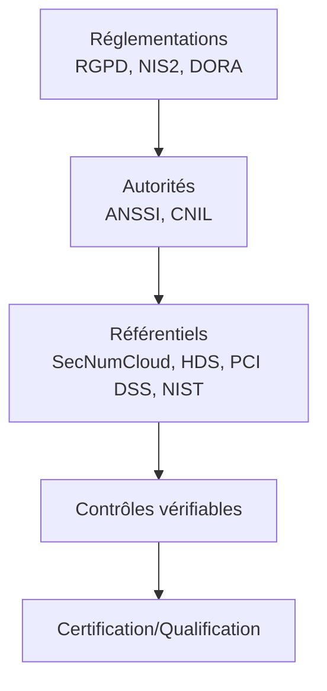

# Réfs. & Certifs

## Introduction

**Les référentiels et certifications** représentent la **couche opérationnelle** du paysage de conformité. Ils traduisent les obligations des réglementations européennes (**RGPD**, **NIS2**, **DORA**) et les recommandations des autorités françaises (**ANSSI**, **CNIL**) en **exigences vérifiables**, permettant d'auditer, certifier ou qualifier les organisations et les services.

> Ils composent **la troisième couche du schéma d'ensemble** : celle qui transforme les obligations légales en **actions concrètes et mesurables**.

!!! info "Pourquoi ces référentiels sont essentiels ?"
    - Ils **traduisent** les obligations légales en exigences techniques concrètes
    - Ils **fournissent** une base commune pour les audits de conformité
    - Ils **structurent** la mise en œuvre de mesures de sécurité cohérentes
    - Ils **permettent** de démontrer la maturité cyber aux partenaires et autorités

## Les quatre référentiels majeurs

!!! note "Chaque référentiel répond à un secteur d'activité ou type de données spécifique"
    Contrairement aux réglementations qui s'appliquent transversalement, ces référentiels sont **sectoriels**.  
    _voir la **synthèse comparative** à la fin de cette fiche ou en [cliquant ici](./#synthese-comparative)_

-   :lucide-cloud-cog:{ .lg .middle } **SecNumCloud** — _Qualification Cloud de l'ANSSI_

    ---
    Référentiel de qualification ANSSI garantissant **souveraineté**, **sécurité opérationnelle** et **conformité** pour les services Cloud hébergeant des données sensibles.

    **Secteurs** : Administration, OIV, OSE/OI (NIS2), secteur financier (DORA)

    [:lucide-book-open-check: Voir la fiche complète sur SecNumCloud](./secnumcloud/)

-   :lucide-credit-card:{ .lg .middle } **PCI DSS** — _Payment Card Industry Data Security Standard_

    ---
    Standard international protégeant les **données de paiement par carte bancaire** avec 12 exigences majeures.

    **Secteurs** : E-commerce, retail, banques, PSP (Payment Service Providers)

    [:lucide-book-open-check: Voir la fiche complète sur PCI DSS](./pci-dss/)

-   :lucide-heart-pulse:{ .lg .middle } **HDS** — _Hébergeurs de Données de Santé_

    ---
    Référentiel national encadrant les prestataires hébergeant des **données de santé** avec exigences renforcées et certification obligatoire.

    **Secteurs** : Santé (hôpitaux, cliniques, plateformes e-santé, hébergeurs Cloud)

    [:lucide-book-open-check: Voir la fiche complète sur HDS](./hds/)

-   :lucide-library-big:{ .lg .middle } **NIST** — _Cadres de contrôle_

    ---
    Frameworks pour structurer la gestion des risques et les contrôles techniques (**CSF** et **SP 800-53**).

    **Secteurs** : Transverse (toutes industries, gouvernement US, secteur financier)

    [:lucide-book-open-check: Voir la fiche complète sur NIST](./nist-csf/)

## Position dans l'écosystème de conformité

Ces référentiels transforment les obligations réglementaires en **contrôles opérationnels auditables**.

_Les référentiels opérationnels forment le pont entre les obligations légales (réglementations) et leur mise en œuvre concrète (contrôles auditables et certifications)._

## Synthèse comparative

| Référentiel | Périmètre | Obligatoire ? | Durée validité | Secteurs |
|-------------|-----------|---------------|----------------|----------|
| **SecNumCloud** | Services Cloud | Oui (données sensibles État/OIV) | 3 ans | Administration, OIV, OSE/OI |
| **HDS** | Hébergement santé | Oui (données santé) | 3 ans | Santé |
| **PCI DSS** | Données paiement | Oui (si traitement cartes) | 1 an | E-commerce, retail, banques |
| **NIST CSF/800-53** | Contrôles génériques | Recommandé | - | Transverse |

!!! tip "Comment choisir ?"
    - **Cloud sensible** → SecNumCloud
    - **Données santé** → HDS
    - **Paiements par carte** → PCI DSS
    - **Cadre de contrôles générique** → NIST CSF/800-53

> Les fiches suivantes détaillent le périmètre, les exigences, les processus de certification et les liens avec les obligations légales pour chaque référentiel.

 