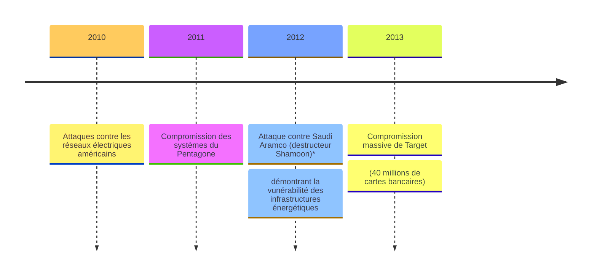
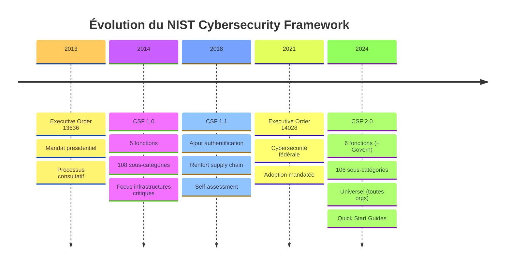
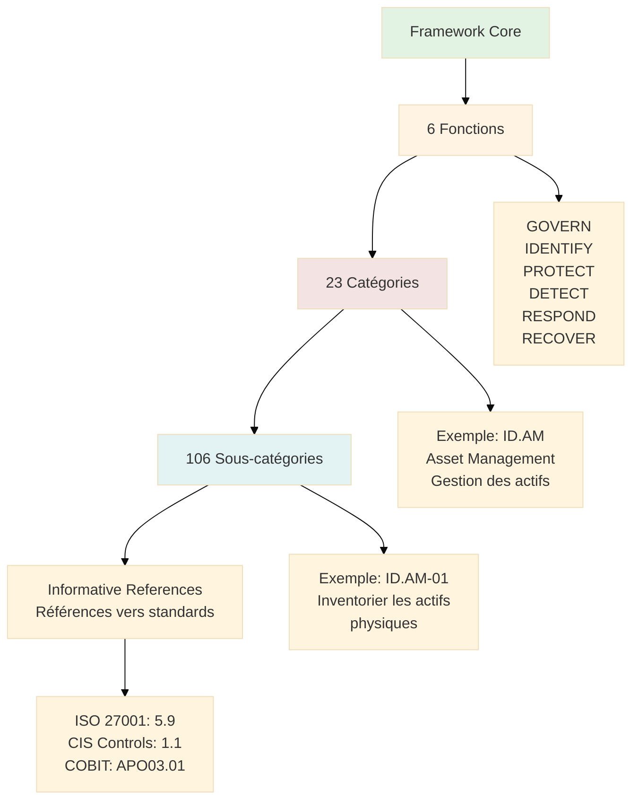
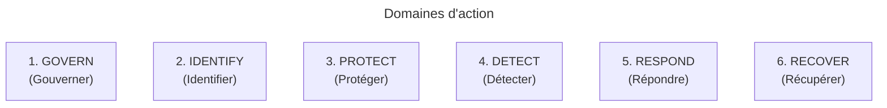
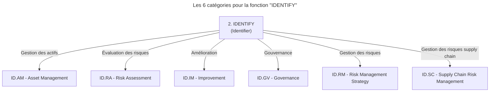
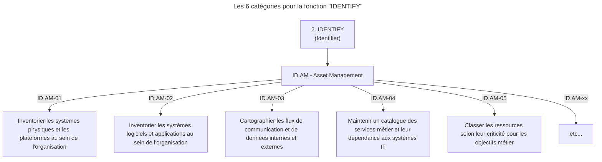
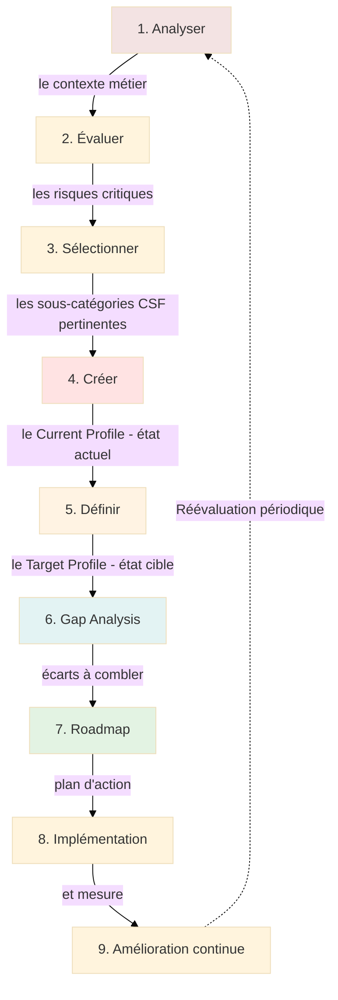
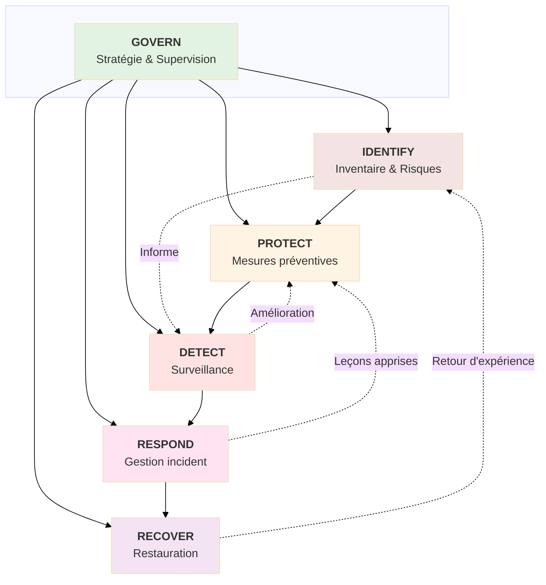
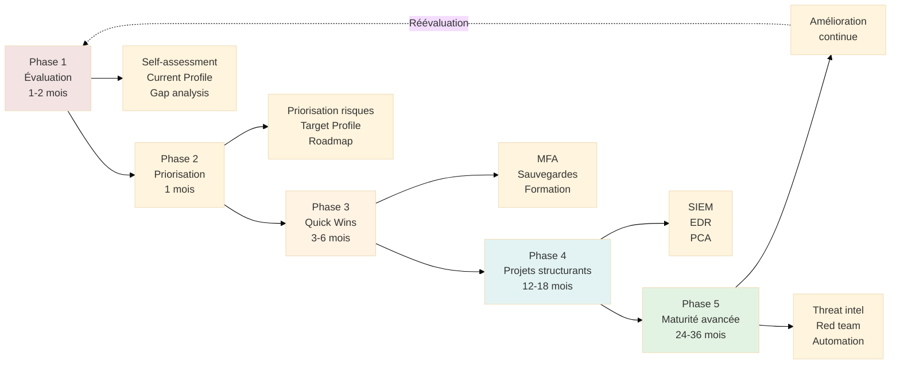

# NIST Cybersecurity Framework (CSF)
<!-- # NIST - National Institute of Standards and Technology -->

## Introduction au Référentiel de Cybersécurité

!!! quote "Analogie pédagogique"
    _Imaginez un **manuel universel de construction parasismique** développé après un tremblement de terre majeur. Ce manuel ne vous oblige pas légalement à construire selon ses normes, mais les compagnies d'assurance, les clients et les partenaires exigent que vous le suiviez. **Le NIST Cybersecurity Framework** fonctionne de la même manière : il s'agit d'un **cadre volontaire** devenu **standard de facto** pour gérer les risques de cybersécurité, utilisé bien au-delà des frontières américaines._

> Le **NIST Cybersecurity Framework (CSF)** constitue le **référentiel américain** de gestion des risques de cybersécurité, développé par le **National Institute of Standards and Technology (NIST)**, agence fédérale du Département du Commerce des États-Unis. Publié initialement en **février 2014** (_l'Executive Order 13636 du Président Obama_)[^1], le Framework a été mis à jour vers la **version 2.0** en **février 2024**, élargissant son périmètre au-delà des infrastructures critiques pour couvrir toutes les organisations, quelle que soit leur taille ou leur secteur.

Le NIST CSF représente une **approche pragmatique et volontaire** de la cybersécurité, contrastant avec les réglementations contraignantes européennes comme NIS2. Là où l'Europe impose des obligations légales sous peine de sanctions, les États-Unis privilégient un **cadre flexible** adopté volontairement par les organisations pour démontrer leur maturité cyber aux clients, investisseurs et partenaires.

!!! info "Pourquoi c'est important ?"
    Le NIST CSF est devenu le **langage commun** de la cybersécurité aux États-Unis et influence désormais les pratiques mondiales. Plus de **50% des organisations américaines** utilisent le Framework, et de nombreuses entreprises internationales l'adoptent pour harmoniser leurs pratiques. Contrairement à NIS2 qui cible des secteurs spécifiques, le CSF s'adresse à **toutes les organisations** : PME, grandes entreprises, administrations publiques, ONG. Il ne remplace pas les obligations réglementaires (HIPAA pour la santé, PCI-DSS pour le paiement, etc.) mais fournit une **structure unifiée** pour les aborder.

## Pour repartir des bases (vrais débutants)

Le **NIST** (National Institute of Standards and Technology) est une agence fédérale américaine fondée en 1901, initialement pour standardiser les poids et mesures. Aujourd'hui, elle développe des standards technologiques dans de nombreux domaines, dont la **cryptographie** et la **cybersécurité**.

**Différence fondamentale : Framework vs Règlement**

- **NIST CSF** : Cadre **volontaire**, **flexible**, **adaptable** à tout contexte organisationnel
- **NIS2** : Directive européenne **obligatoire** pour secteurs définis, transposée en **loi nationale** avec **sanctions financières**

!!! quote "Que dit réellement NIST CSF"
      Le NIST CSF ne vous dit **jamais** "vous devez faire X".  
      Il vous dit "pour gérer ce risque, voici des catégories de contrôles à considérer selon votre contexte".
      
Cette approche **risk-based** (basée sur le risque) signifie que chaque organisation définit son propre niveau de sécurité en fonction de :

- Son **appétit au risque**
- Ses **ressources disponibles**
- Son **contexte métier**
- Ses **obligations réglementaires sectorielles**

!!! tip "NIST CSF et RGPD/NIS2 sont complémentaires"
    Une organisation européenne peut **utiliser le NIST CSF** comme méthodologie de gestion des risques tout en respectant **NIS2** et le **RGPD**. Le CSF fournit la structure méthodologique, NIS2 définit les obligations légales minimales pour les infrastructures critiques, et le RGPD protège les données personnelles. Ces trois cadres se **renforcent mutuellement**.

## Contexte juridique et historique américain

### Origine : Executive Order 13636 (2013)

Le NIST CSF naît d'un **besoin critique** identifié après plusieurs cyberattaques majeures contre les infrastructures américaines :

**Timeline : Executive Order 13636**

<small>_*Saudi Aramco (destructeur Shamoon)[^2]_</small>

Face à ces menaces, le **Président Obama** signe le **12 février 2013** l'**Executive Order 13636** : "Improving Critical Infrastructure Cybersecurity" (_Améliorer la cybersécurité des infrastructures critiques_).

!!! abstract "Objectifs de l'Executive Order"

    1. Développer un **cadre volontaire** de cybersécurité basé sur les standards existants
    2. Favoriser le **partage d'informations** sur les menaces entre secteur public et privé
    3. Renforcer la **résilience** des 16 secteurs d'infrastructures critiques américaines
    4. Promouvoir une approche **flexible** et **non prescriptive**

### Développement collaboratif (2013-2014)

Le NIST organise un **processus ouvert** sans précédent :

- **3 000+ participants** issus de l'industrie, académie, administration, société civile
- **5 ateliers publics** à travers les États-Unis
- **Consultation de plus de 270 organisations** (entreprises, associations professionnelles, groupes de consommateurs)
- Révision publique de 3 versions préliminaires

**Principe fondamental adopté** : Le Framework doit être **technology-agnostic** (indépendant des technologies), **outcome-focused** (orienté résultats), **risk-based** (basé sur les risques) et **cost-effective** (économiquement viable).

### Publication et adoption

!!! info "**12 février 2014** : Publication de la **version 1.0** du NIST Cybersecurity Framework."

**Adoption rapide :**

* **2015** : 30% des organisations américaines utilisent le CSF (Gartner, 2016)
* **2016** : Le Framework est référencé dans plusieurs lois sectorielles et 70% le considèrent comme une best practice (Tenable/Dimensional Research, 2016)
* **2018** : Version 1.1 avec améliorations mineures (authentification, supply chain, self-assessment)
* **2020** : Plus de 50% des entreprises américaines déclarent utiliser le CSF (NIST surveys), avec plus de la moitié des Fortune 500 l'adoptant comme framework principal (IDC)
- **2024** : Publication de la **version 2.0** avec extension à la gouvernance cyber

### Cadre légal complémentaire

Le NIST CSF s'inscrit dans un **écosystème réglementaire** américain complexe :

| Texte légal | Périmètre | Lien avec NIST CSF |
|-------------|-----------|-------------------|
| **FISMA**[^3] (2002, révisé 2014) | Systèmes d'information fédéraux | Impose NIST SP 800-53 (contrôles détaillés) au gouvernement fédéral |
| **HIPAA**[^4] (1996) | Données de santé | Le CSF peut servir de cadre pour démontrer la conformité HIPAA |
| **GLBA**[^5] (1999) | Institutions financières | Le CSF facilite la mise en œuvre des exigences de sécurité |
| **Executive Order 14028**[^6] (2021) | Cybersécurité fédérale | Mandate l'adoption du CSF par les agences fédérales |
| **CIRCIA**[^7] (2022) | Notification incidents critiques | Crée des obligations de notification pour infrastructures critiques (proche de NIS2) |

**Différence clé avec l'Europe** : Aux États-Unis, la régulation cyber est **sectorielle** et **fragmentée** (_santé_, _finance_, _énergie ont chacun leurs règles_), tandis que NIS2 harmonise à l'échelle européenne.

## Évolution : de la version 1.0 à la version 2.0

### NIST CSF 1.0 et 1.1 (2014-2018)

**Structure initiale (v1.0) :**

Le Framework 1.0 introduit une architecture en **3 composants** :

1. **Framework Core** (Noyau) : 5 fonctions, 23 catégories, 108 sous-catégories
2. **Implementation Tiers** (Niveaux d'implémentation) : Échelle de maturité en 4 niveaux
3. **Profiles** (Profils) : Alignement entre objectifs métier et contrôles cyber

!!! warning "Limites identifiées (2014-2018)"

      - **Gouvernance sous-représentée** : Peu de guidance sur le rôle du board et de la direction
      - **Supply chain** : Couverture insuffisante des risques de chaîne d'approvisionnement
      - **Identité et authentification** : Pas assez développé
      - **Self-assessment** : Manque d'outils pour l'auto-évaluation

**Version 1.1 (avril 2018) :**

!!! success "Améliorations mineures sans changement structurel"

      - Ajout de guidance sur **l'authentification**
      - Renforcement des **pratiques supply chain**
      - Clarification sur les **outils de self-assessment**
      - Meilleure articulation avec le **NIST Privacy Framework**

### NIST CSF 2.0 (février 2024)

La version 2.0 marque une **évolution majeure** avec **6 changements structurels** :

#### 1. Ajout de la fonction GOVERN

!!! info "Innovation majeure : Création d'une **6ème fonction** dédiée à la **gouvernance de la cybersécurité**"

      Cette fonction reconnaît que la cybersécurité n'est plus un sujet purement technique mais un **enjeu de gouvernance stratégique** nécessitant l'implication du conseil d'administration et de la direction générale.

**Catégories de GOVERN :**

- **GV.OC** : Organizational Context (Contexte organisationnel)
- **GV.RM** : Risk Management Strategy (Stratégie de gestion des risques)
- **GV.RR** : Roles, Responsibilities, and Authorities (Rôles, responsabilités, autorités)
- **GV.PO** : Policy (Politiques)
- **GV.OV** : Oversight (Supervision)
- **GV.SC** : Cybersecurity Supply Chain Risk Management (Gestion des risques cyber de la supply chain)

Ce positionnement de GOVERN **avant** les 5 autres fonctions (***Identify***, ***Protect***, ***Detect***, ***Respond***, ***Recover***) reflète que la gouvernance est le **préalable** à toute stratégie cyber efficace.

#### 2. Élargissement du périmètre

!!! warning "CSF 1.x : Focus sur les **16 secteurs d'infrastructures critiques** américaines"

!!! success "CSF 2.0 : Applicable à **toutes les organisations**, quelle que soit leur taille ou secteur"

    - PME et microentreprises
    - Organisations à but non lucratif
    - Établissements d'enseignement
    - Administrations locales
    - Startups et scale-ups

      Cette universalisation répond au constat que **toutes les organisations** sont désormais dépendantes du numérique et exposées aux cybermenaces.

#### 3. Mise à jour des sous-catégories

- **CSF 1.1** : 108 sous-catégories
- **CSF 2.0** : **106 sous-catégories** (consolidation et modernisation)

Les sous-catégories ont été **retravaillées** pour :

- Éliminer les redondances
- Intégrer les menaces émergentes (ransomware, supply chain attacks)
- Clarifier le langage
- Faciliter l'automatisation et la mesure

#### 4. Introduction des Quick Start Guides

!!! info "Nouveauté 2.0 : Le NIST publie des **guides de démarrage rapide** pour différents profils d'organisations"

    - **Petites entreprises** : Guide simplifié avec 20-30 contrôles prioritaires
    - **Gouvernements locaux** : Guidance adaptée aux municipalités et collectivités
    - **Organismes à but non lucratif** : Focus sur les ressources limitées

    Ces guides répondent à **la critique que le CSF 1.x était trop complexe pour les petites structures**.

#### 5. Intégration renforcée avec d'autres frameworks NIST

**Alignement explicite** avec :

- **NIST Privacy Framework** : Gestion des risques liés à la vie privée
- **NIST SP 800-53 Rev. 5** : Catalogue de contrôles pour le secteur public
- **NIST SP 800-171** : Protection des informations non classifiées (secteur défense)
- **NIST AI Risk Management Framework** : Risques liés à l'IA (2023)

#### 6. Community Profiles

Concept de **profils communautaires** : des secteurs entiers peuvent développer des **implémentations sectorielles** du CSF (santé, énergie, finance, etc.), créant ainsi un langage commun intra-sectoriel.

### Tableau comparatif CSF 1.1 vs CSF 2.0

| Critère | CSF 1.1 (2018) | CSF 2.0 (2024) |
|---------|---------------|---------------|
| **Nombre de fonctions** | 5 (Identify, Protect, Detect, Respond, Recover) | 6 (+ **Govern**) |
| **Sous-catégories** | 108 | 106 (consolidées) |
| **Périmètre cible** | 16 secteurs d'infrastructures critiques | **Toutes organisations** (universal) |
| **Gouvernance** | Implicite, dispersée | **Fonction dédiée** (Govern) |
| **Supply chain** | 1 catégorie (ID.SC) | **Catégorie dédiée** dans Govern (GV.SC) + ID.SC maintenue |
| **Quick Start Guides** | Non | **Oui** (PME, collectivités, ONG) |
| **Alignement Privacy** | Mentions générales | **Intégration complète** avec Privacy Framework |
| **Community Profiles** | Concept informel | **Formalisation** des profils sectoriels |
| **Mesurabilité** | Guidance limitée | **Métriques et indicateurs** explicites |
| **International** | Centré USA | **Références internationales** (ISO, IEC, COBIT) |

### Diagramme d'évolution CSF

## Structure du NIST CSF 2.0

Le Framework 2.0 conserve son architecture en **3 composants principaux**, avec des améliorations significatives :

### 1. Framework Core (Noyau du Framework)

Le **Core** constitue le **cœur opérationnel** du CSF. Il organise les activités de cybersécurité selon une hiérarchie à 4 niveaux :

**Niveau 1 : Fonctions (6)**

Les **fonctions** représentent les **grands axes d'organisation** de la cybersécurité. Elles répondent à la question : "Quels sont les grands domaines d'action pour gérer les risques cyber ?"

1. **GOVERN** (Gouverner)
2. **IDENTIFY** (Identifier)
3. **PROTECT** (Protéger)
4. **DETECT** (Détecter)
5. **RESPOND** (Répondre)
6. **RECOVER** (Récupérer)

**Niveau 2 : Catégories (23)**

Les **catégories** subdivisent chaque fonction en **groupes de résultats** spécifiques.  

!!! example "Exemple, la fonction IDENTIFY contient 6 catégories"

      - **ID.AM** : Asset Management (Gestion des actifs)
      - **ID.RA** : Risk Assessment (Évaluation des risques)
      - **ID.IM** : Improvement (Amélioration)
      - **ID.GV** : Governance (Gouvernance) [déplacée vers GV.xx en 2.0]
      - **ID.RM** : Risk Management Strategy [déplacée vers GV.xx en 2.0]
      - **ID.SC** : Supply Chain Risk Management (Gestion des risques supply chain)

**Niveau 3 : Sous-catégories (106)**

Les **sous-catégories** définissent des **résultats techniques ou de gestion** spécifiques à atteindre.  

!!! example "Exemple, dans ID.AM (Asset Management)"

      - **ID.AM-01** : Inventorier les systèmes physiques et les plateformes au sein de l'organisation
      - **ID.AM-02** : Inventorier les systèmes logiciels et applications au sein de l'organisation
      - **ID.AM-03** : Cartographier les flux de communication et de données internes et externes
      - **ID.AM-04** : Maintenir un catalogue des services métier et leur dépendance aux systèmes IT
      - **ID.AM-05** : Classer les ressources selon leur criticité pour les objectifs métier
      - **etc...**

**Niveau 4 : Informative References (Références informatives)**

Pour chaque sous-catégorie, le NIST fournit des **références croisées** vers des standards et frameworks reconnus :

- **ISO/IEC 27001:2022**
- **CIS Controls v8**
- **COBIT 2019**
- **NIST SP 800-53 Rev. 5**
- **IEC 62443** (sécurité des systèmes industriels)

Ces références permettent de **mapper** le CSF vers des contrôles techniques précis.

### 2. Implementation Tiers (Niveaux d'implémentation)

Les **Tiers** représentent un **modèle de maturité** en 4 niveaux, évaluant la **sophistication** et la **formalisation** des pratiques cyber d'une organisation.

| Tier | Nom | Caractéristiques | Exemple typique |
|:------:|-----|------------------|-----------------|
| **Tier 1** | **Partial** (Partiel) | - Processus ad hoc, réactif - Pas de formalisation - Cybersécurité gérée au cas par cas - Pas de budget dédié - Aucune conscience des risques supply chain | Micro-entreprise (1-10 employés) sans processus IT formalisés |
| **Tier 2** | **Risk Informed** (Informé des risques) | - Conscience des risques mais pas de stratégie globale - Politiques en place mais application inégale - Communication informelle - Budget cyber opportuniste | PME (50-250 employés) avec un responsable IT qui gère la sécurité "en plus" |
| **Tier 3** | **Repeatable** (Reproductible) | - Politiques formalisées et approuvées - Processus documentés et répétables - Formation régulière du personnel - Budget cyber dédié - Gestion des risques supply chain en place | Grande entreprise (1000+ employés) avec RSSI et équipe sécurité dédiée |
| **Tier 4** | **Adaptive** (Adaptatif) | - Amélioration continue basée sur des indicateurs - Adaptation proactive aux menaces émergentes - Collaboration avec écosystème (partage de threat intelligence) - Gestion avancée de la supply chain - Cybersécurité intégrée dans la culture d'entreprise | Entreprise mature (banque, opérateur télécom, cloud provider) avec SOC 24/7 et threat intelligence |

**Objectif des Tiers** : Permettre à chaque organisation de :

1. **Évaluer** son niveau de maturité actuel (Tier Current)
2. **Définir** son niveau cible en fonction de son appétit au risque et de ses ressources (Tier Target)
3. **Planifier** une trajectoire de progression réaliste

!!! danger "Les Tiers ne sont PAS une certification"
    Contrairement à l'**ISO 27001** où une certification externe atteste de la conformité, **les Tiers du NIST CSF** sont un **outil d'auto-évaluation**. Il n'existe pas de "***certification NIST CSF Tier 3***".  
    
    > Les organisations s'auto-positionnent et peuvent le faire valider par un audit externe si elles le souhaitent.

### 3. Profiles (Profils)

Les **Profiles** représentent l'**alignement personnalisé** du Framework aux besoins spécifiques d'une organisation.

**Deux types de profils :**

- #### A. Current Profile (Profil actuel)

      Photographie de l'**état actuel** de la cybersécurité dans l'organisation :

      - Quelles sous-catégories du Core sont **actuellement implémentées** ?
      - À quel **niveau de maturité** (Tier) ?
      - Quels **gaps** existent par rapport aux objectifs métier ?

- #### B. Target Profile (Profil cible)

      Définition de l'**état futur souhaité** :

      - Quelles sous-catégories doivent être **implémentées** ?
      - À quel **niveau de maturité** (Tier) ?
      - Quelles sont les **priorités** en fonction des risques métier ?

**Processus de création d'un Profile :**

### Exemple - PME dans l'e-commerce

!!! example "Contexte"
      Site e-commerce, 50 employés, 10M€ CA, données clients sensibles (paiements, adresses).

??? example "Current Profile"

      **Current Profile**

      

      
      - **GOVERN** - Tier 1
      
         ---

         _❌ - Pas de gouvernance formelle_

      - **IDENTIFY** - Tier 2

         ---

         _⚠️ - Inventaire partiel des actifs_
   
      - **PROTECT** - Tier 2
      
         ---
         
         _⚠️ - Firewalls en place, mais pas de MFA_

      - **DETECT** - Tier 1
      
         ---
         
         _⚠️ - Logs serveur uniquement, pas de monitoring actif_

      - **RESPOND** - Tier 1
      
         ---
         
         _❌ - Pas de plan de réponse incident formalisé_

      - **RECOVER** - Tier 2
      
         ---
         
         _⚠️ - Sauvegardes quotidiennes, jamais testées_

      

      
??? example "Target Profile - (horizon 18 mois)"

      

      
      - **GOVERN** - Tier 1
      
         ---

         _✔️ - nommer un RSSI temps partiel, politique cyber approuvée_

      - **IDENTIFY** - Tier 2 > 3

         ---

         _✔️ - inventaire complet automatisé, analyse de risques annuelle_
   
      - **PROTECT** - Tier 2 > 3
      
         ---
         
         _✔️ - MFA généralisé, segmentation réseau, chiffrement données_

      - **DETECT** - Tier 1 > 2
      
         ---
         
         _✔️ - SIEM basique, alertes automatiques sur événements critiques_

      - **RESPOND** - Tier 1 > 2
      
         ---
         
         _✔️ - procédure de réponse incident documentée et testée_

      - **RECOVER** - Tier 2 > 3
      
         ---
         
         _✔️ - PCA testé semestriellement, RTO < 4h pour services critiques_
      
      

!!! example "Gap Analysis"
      Investissement estimé 150K€ (RSSI 0.5 ETP, SIEM, formation, audit, tests PCA)

## Les 6 fonctions du NIST CSF 2.0

!!! quote "Cette section présente une **vue synthétique** des 6 fonctions"

<small>_**F** correspond au terme "Fonction"_</small>

=== "F1 : GOVERN"
      **Définition** : Établir et superviser la **stratégie de gestion des risques** de cybersécurité de l'organisation, les attentes, et la politique.

      **Pourquoi c'est fondamental** : La cybersécurité n'est plus une question technique déléguée aux équipes IT. C'est un **risque d'entreprise** nécessitant supervision du conseil d'administration et de la direction.

      **Catégories (6) :**

      - **GV.OC** : Organizational Context - Comprendre la mission, les parties prenantes, les dépendances
      - **GV.RM** : Risk Management Strategy - Définir l'appétit au risque, les priorités
      - **GV.RR** : Roles, Responsibilities, Authorities - Clarifier qui fait quoi en cybersécurité
      - **GV.PO** : Policy - Établir les politiques de sécurité formelles
      - **GV.OV** : Oversight - Superviser l'efficacité du programme cyber
      - **GV.SC** : Supply Chain Risk Management - Gérer les risques de la chaîne d'approvisionnement numérique

      **Équivalent NIS2** : Article 20 (Responsabilité des organes de direction)

=== "F2 : IDENTIFY"
      **Définition** : Développer une **compréhension organisationnelle** pour gérer les risques de cybersécurité pesant sur les systèmes, les actifs, les données et les capacités.

      **En pratique** : "On ne peut pas protéger ce qu'on ne connaît pas."

      **Catégories (6) :**

      - **ID.AM** : Asset Management - Inventaire de tous les actifs (hardware, software, données)
      - **ID.RA** : Risk Assessment - Évaluer et prioriser les risques cyber
      - **ID.IM** : Improvement - Identifier les opportunités d'amélioration continue
      - **ID.BE** : Business Environment - Comprendre le contexte métier et les priorités
      - **ID.GV** : Governance [déplacé vers GV en 2.0]
      - **ID.SC** : Supply Chain Risk Management - Identifier les dépendances critiques

      **Équivalent NIS2** : Article 21.2.a (Politiques d'analyse des risques)

=== "F3 : PROTECT"
      **Définition** : Développer et mettre en œuvre des **mesures de protection** appropriées pour assurer la livraison de services critiques.

      **En pratique** : C'est la fonction la plus **technique** et la plus **volumineuse** du CSF.

      **Catégories (6) :**

      - **PR.AA** : Identity Management, Authentication and Access Control - Gérer les identités et les accès
      - **PR.AT** : Awareness and Training - Former le personnel
      - **PR.DS** : Data Security - Protéger les données (chiffrement, DLP)
      - **PR.IP** : Information Protection Processes and Procedures - Maintenir les processus de sécurité
      - **PR.MA** : Maintenance - Gérer la maintenance sécurisée des systèmes
      - **PR.PT** : Protective Technology - Déployer les technologies de protection (firewall, antivirus, EDR)

      **Équivalent NIS2** : Articles 21.2.d à 21.2.j (Mesures techniques et organisationnelles)

=== "F4 : DETECT"
      **Définition** : Développer et mettre en œuvre des activités appropriées pour **identifier l'occurrence d'événements** de cybersécurité.

      **En pratique** : Monitoring, alertes, analyse de logs, threat intelligence.

      **Catégories (3) :**

      - **DE.AE** : Anomalies and Events - Détecter les comportements anormaux
      - **DE.CM** : Security Continuous Monitoring - Surveiller en continu l'infrastructure
      - **DE.DP** : Detection Processes - Maintenir et tester les processus de détection

      **Équivalent NIS2** : Article 21.2.b (Gestion des incidents - volet détection)

=== "F5 : RESPOND"
      **Définition** : Développer et mettre en œuvre des activités appropriées pour **agir face à un incident** de cybersécurité détecté.

      **En pratique** : Gestion de crise, confinement, éradication, communication.

      **Catégories (5) :**

      - **RS.MA** : Management - Coordonner la réponse
      - **RS.AN** : Analysis - Analyser l'incident (forensics, cause racine)
      - **RS.MI** : Mitigation - Contenir et éradiquer la menace
      - **RS.IM** : Improvements - Améliorer les capacités de réponse
      - **RS.CO** : Communications - Communiquer avec les parties prenantes

      **Équivalent NIS2** : Article 21.2.b (Gestion des incidents - volet réponse) + Article 23 (Notification)

=== "F6 : RECOVER"
      **Définition** : Développer et mettre en œuvre des activités appropriées pour **restaurer les capacités** ou services impactés par un incident cyber.

      **En pratique** : Plan de continuité, reprise après sinistre, communication post-incident.

      **Catégories (3) :**

      - **RC.RP** : Recovery Planning - Planifier la récupération (PCA, PRA)
      - **RC.IM** : Improvements - Améliorer les capacités de récupération
      - **RC.CO** : Communications - Gérer la communication pendant la récupération

      **Équivalent NIS2** : Article 21.2.c (Continuité des activités et gestion de crise)

### Diagramme des interactions entre fonctions

!!! quote "Lecture du diagramme"

      1. **GOVERN** supervise stratégiquement les 5 autres fonctions
      2. **IDENTIFY** est le préalable à PROTECT et informe DETECT
      3. **PROTECT** met en place les barrières que DETECT surveille
      4. **DETECT** déclenche RESPOND en cas d'incident
      5. **RESPOND** active RECOVER si nécessaire
      6. Les boucles de rétroaction (pointillés) représentent l'**amélioration continue**

## Les 6 fonctions détaillées avec sous-catégories

Cette section présente **chaque fonction** du NIST CSF 2.0 avec l'ensemble de ses **catégories et sous-catégories**, accompagnées d'explications pratiques.

### Fonction 1 : GOVERN (Gouverner) - GV

!!! info "Objectif stratégique"
    Établir et superviser la stratégie, les attentes et la politique de gestion des risques de cybersécurité de l'organisation, alignées avec les objectifs métier et les obligations réglementaires.

??? tip "Outils du marché - GOVERN"
    
    **Gouvernance et conformité (GV.OC, GV.RM, GV.PO)** :
    
    - **Enterprise** : ServiceNow GRC, RSA Archer, MetricStream
    - **Mid-market** : LogicManager, Resolver, AuditBoard
    - **Compliance automation** : Vanta, Drata, Secureframe (SOC 2, ISO 27001)
    - **Open source** : Eramba (GRC), SimpleRisk
    
    **Gestion des risques (GV.RM)** :
    
    - **Analyse de risques** : RiskLens (cyber risk quantification), Risktec
    - **Cyber insurance** : Corvus, Coalition (évaluation posture cyber)
    
    **Supply chain risk (GV.SC)** :
    
    - **Questionnaires fournisseurs** : OneTrust Vendorpedia, Whistic, Prevalent
    - **Monitoring continu fournisseurs** : SecurityScorecard, BitSight, UpGuard
    - **SBOM (Software Bill of Materials)** : Anchore, Syft, CycloneDX

**Pourquoi c'est fondamental** : La gouvernance cyber ne peut plus être déléguée uniquement aux équipes techniques. Le conseil d'administration et la direction générale doivent **comprendre**, **superviser** et **assumer** la stratégie cyber comme un risque d'entreprise au même titre que les risques financiers ou opérationnels.

??? note "GV.OC : Organizational Context (Contexte organisationnel)"
    _Comprendre les circonstances entourant la mission de l'organisation._

    

    
    - **GV.OC-01**

        ---

        **Description** :  
        _La mission, les parties prenantes, et les attentes de l'organisation sont comprises et communiquées_  

        **Application Pratique** :  

        - Documenter la mission de l'organisation
        - Identifier toutes les parties prenantes (clients, régulateurs, partenaires, actionnaires)
        - Définir leurs attentes en matière de cybersécurité

    

    

    
    - **GV.OC-02**

        ---

        **Description** :  
        _Les relations avec les fournisseurs, clients, partenaires et autres entités sont comprises, documentées et gérées_  

        **Application Pratique** :  

        - Cartographier l'écosystème de dépendances
        - Identifier les fournisseurs critiques (cloud, SaaS, infrastructure)
        - Contractualiser les exigences de sécurité

    

    

    
    - **GV.OC-03**

        ---

        **Description** :  
        _Les obligations légales, réglementaires et contractuelles concernant la cybersécurité sont comprises et gérées_  

        **Application Pratique** :  

        - Inventorier toutes les obligations (RGPD, NIS2, HIPAA, PCI-DSS, contrats clients)
        - Assigner des responsables par obligation
        - Auditer la conformité régulièrement

    

    

    
    - **GV.OC-04**

        ---

        **Description** :  
        _Les menaces, vulnérabilités, vraisemblances et impacts critiques sont utilisés pour informer les priorités et activités de l'organisation_  

        **Application Pratique** :  

        - Réaliser une analyse de risques formelle (menaces sectorielles, vulnérabilités internes)
        - Prioriser les investissements cyber en fonction du risque réel
        - Intégrer la threat intelligence externe

    

    

    
    - **GV.OC-05**

        ---

        **Description** :  
        _Les résultats de l'amélioration de la cybersécurité sont revus pour informer la stratégie_  

        **Application Pratique** :  

        - Mesurer l'efficacité des investissements cyber (métriques, KRI/KPI)
        - Ajuster la stratégie en fonction des résultats
        - Reporting régulier au board

    

??? note "GV.RM : Risk Management Strategy (Stratégie de gestion des risques)"
    _Établir, communiquer et surveiller la stratégie de gestion des risques cyber de l'organisation._

    

    
    - **GV.RM-01**

        ---

        **Description** :  
        _Les priorités de gestion des risques sont établies et communiquées_  

        **Application Pratique** :  

        - Définir l'appétit au risque (risk appetite) de l'organisation
        - Hiérarchiser les actifs critiques
        - Communiquer les priorités à tous les niveaux

    

    

    
    - **GV.RM-02**

        ---

        **Description** :  
        _L'appétit au risque et la tolérance au risque sont établis, communiqués et surveillés_  

        **Application Pratique** :  

        - Formaliser l'appétit au risque (ex: "aucune interruption de service client > 4h")
        - Définir la tolérance (seuils acceptables de risque résiduel)
        - Revoir annuellement

    

    

    
    - **GV.RM-03**

        ---

        **Description** :  
        _Les décisions concernant la tolérance au risque, l'appétit au risque et les priorités sont informées par les vulnérabilités connues et anticipées_  

        **Application Pratique** :  

        - Intégrer la veille sur les vulnérabilités (CVE, bulletins éditeurs)
        - Analyser les tendances d'attaque du secteur
        - Ajuster dynamiquement les priorités

    

    

    
    - **GV.RM-04**

        ---

        **Description** :  
        _La stratégie de gestion des risques cyber est intégrée dans les stratégies d'entreprise plus larges_  

        **Application Pratique** :  

        - Aligner cyber et business (ex: lancement nouveau produit = analyse de risques cyber)
        - Intégrer le cyber dans les décisions M&A
        - Cyber comme critère de sélection fournisseurs

    

    

    
    - **GV.RM-05**

        ---

        **Description** :  
        _Les lignes d'escalade et les critères de décision pour les risques cyber sont établis_  

        **Application Pratique** :  

        - Définir les seuils d'escalade (quand alerter le RSSI, le DG, le board)
        - Créer une matrice de décision (qui décide de quoi)
        - Procédure d'escalade formalisée et testée

    

    

    
    - **GV.RM-06**

        ---

        **Description** :  
        _Une approche structurée de la gestion des risques cyber est établie et communiquée_  

        **Application Pratique** :  

        - Choisir une méthodologie (NIST RMF, EBIOS, ISO 27005)
        - Documenter le processus de gestion des risques
        - Former les équipes à la méthodologie

    

    

    
    - **GV.RM-07**

        ---

        **Description** :  
        _Les rôles et responsabilités de gestion des risques cyber sont établis, communiqués et coordonnés_  

        **Application Pratique** :  

        - Matrice RACI cybersécurité (Responsable, Approbateur, Consulté, Informé)
        - Définir le rôle du RSSI, DSI, métiers, RH, juridique
        - Comité de sécurité avec tous les stakeholders

    

??? note "GV.RR : Roles, Responsibilities, and Authorities (Rôles, responsabilités, autorités)"
    _Établir les rôles, responsabilités et autorités pour gérer et superviser la cybersécurité._

    

    
    - **GV.RR-01**

        ---

        **Description** :  
        _Les rôles, responsabilités et autorités en cybersécurité sont établis, communiqués, compris et appliqués_  

        **Application Pratique** :  

        - Fiches de postes cyber (RSSI, analyste SOC, ingénieur sécu, etc.)
        - Communication claire de qui fait quoi
        - Validation de la compréhension des rôles

    

    

    
    - **GV.RR-02**

        ---

        **Description** :  
        _Les rôles, responsabilités et autorités des personnes ayant des comptes à privilèges sont établis, communiqués, compris et appliqués_  

        **Application Pratique** :  

        - Politique des comptes à privilèges (administrateurs)
        - Principe du moindre privilège
        - Revue trimestrielle des accès privilégiés

    

    

    
    - **GV.RR-03**

        ---

        **Description** :  
        _Les personnes occupant des rôles et responsabilités en cybersécurité sont qualifiées et ont les ressources adéquates_  

        **Application Pratique** :  

        - Budget dédié cybersécurité
        - Formation continue des équipes sécu
        - Certifications professionnelles (CISSP, CEH, OSCP, etc.)

    

    

    
    - **GV.RR-04**

        ---

        **Description** :  
        _La responsabilité de la cybersécurité est intégrée dans les descriptions de poste, les évaluations de performance et autres activités RH_  

        **Application Pratique** :  

        - Objectifs cyber dans les entretiens annuels
        - Clause de confidentialité dans les contrats
        - Sensibilisation cyber obligatoire pour tous

    

??? note "GV.PO : Policy (Politiques)"
    _Établir, communiquer et faire appliquer les politiques organisationnelles._

    

    
    - **GV.PO-01**

        ---

        **Description** :  
        _La politique de cybersécurité est établie, communiquée et appliquée_  

        **Application Pratique** :  

        - Politique de sécurité des SI (PSSI) formalisée
        - Validation par la direction générale
        - Diffusion à tous les collaborateurs
        - Signature d'accusé de réception

    

    

    
    - **GV.PO-02**

        ---

        **Description** :  
        _La politique de cybersécurité est revue, mise à jour et approuvée régulièrement_  

        **Application Pratique** :  

        - Révision annuelle minimale
        - Mise à jour après incidents majeurs
        - Validation du comité de direction

    

??? note "GV.OV : Oversight (Supervision)"
    _Les résultats des activités de cybersécurité sont utilisés pour informer, améliorer et ajuster le programme de gouvernance._

    

    
    - **GV.OV-01**

        ---

        **Description** :  
        _Les responsabilités de supervision de la cybersécurité sont assignées et comprises_  

        **Application Pratique** :  

        - Le board/conseil désigne un responsable de la supervision cyber (souvent le comité d'audit)
        - RSSI rapporte directement au COMEX
        - Revue trimestrielle des risques cyber au board

    

    

    
    - **GV.OV-02**

        ---

        **Description** :  
        _La stratégie, politiques et procédures de cybersécurité sont établies, communiquées, appliquées et revues_  

        **Application Pratique** :  

        - Tableau de bord cyber pour la direction
        - Métriques de sécurité suivies (ex: taux de patching, incidents détectés, temps de réponse)
        - Audits de conformité réguliers

    

    

    
    - **GV.OV-03**

        ---

        **Description** :  
        _Les responsables de la cybersécurité (incluant le board) ont une compréhension suffisante des risques cyber et de la stratégie de l'organisation_  

        **Application Pratique** :  

        - Formation cyber obligatoire pour les dirigeants
        - Exercices de simulation de crise cyber au COMEX
        - Reporting cyber en langage métier (pas uniquement technique)

    

??? note "GV.SC : Cybersecurity Supply Chain Risk Management (Gestion des risques cyber de la supply chain)"
    _Gérer les risques cyber de la chaîne d'approvisionnement._

    

    
    - **GV.SC-01**

        ---

        **Description** :  
        _Une stratégie de gestion des risques cyber de la supply chain est établie, communiquée et appliquée_  

        **Application Pratique** :  

        - Politique de sécurité des fournisseurs
        - Due diligence cyber pour nouveaux fournisseurs critiques
        - Clauses de sécurité dans les contrats

    

    

    
    - **GV.SC-02**

        ---

        **Description** :  
        _Les fournisseurs et partenaires sont inclus dans la planification et l'exécution des activités de cybersécurité_  

        **Application Pratique** :  

        - Partage d'informations sur les menaces avec l'écosystème
        - Exercices conjoints de gestion de crise
        - Audits de sécurité chez les fournisseurs critiques

    

    

    
    - **GV.SC-03**

        ---

        **Description** :  
        _Les contrats avec les fournisseurs et partenaires incluent des exigences de cybersécurité_  

        **Application Pratique** :  

        - Template de contrat avec clauses cyber standards
        - SLA de sécurité (notification incidents, audit rights, assurance cyber)
        - Droit d'audit des fournisseurs

    

    

    
    - **GV.SC-04**

        ---

        **Description** :  
        _Les fournisseurs et partenaires sont surveillés pour détecter les risques cyber_  

        **Application Pratique** :  

        - Monitoring des actualités cyber des fournisseurs
        - Évaluation continue de la posture cyber (questionnaires, certifications)
        - Alerte automatique sur incidents chez fournisseurs

    

    

    
    - **GV.SC-05**

        ---

        **Description** :  
        _Les mécanismes de réponse et de récupération sont coordonnés avec les fournisseurs et partenaires_  

        **Application Pratique** :  

        - Plan de continuité incluant les fournisseurs
        - Scénarios de défaillance fournisseur
        - Fournisseurs de secours identifiés

    

### Fonction 2 : IDENTIFY (Identifier) - ID

!!! info "Objectif stratégique"
    Développer une compréhension organisationnelle pour gérer les risques de cybersécurité pesant sur les systèmes, actifs, données et capacités.

??? tip "Outils du marché - IDENTIFY"
    
    **Asset Management (ID.AM)** :
    
    - **CMDB/Discovery** : ServiceNow CMDB, Device42, Lansweeper
    - **Découverte réseau** : Nmap, Angry IP Scanner (gratuit), Rumble
    - **Cloud asset inventory** : AWS Config, Azure Resource Graph, Orca Security
    
    **Risk Assessment (ID.RA)** :
    
    **Scanners de vulnérabilités** :
    
    - Enterprise : Qualys VMDR, Tenable Nessus Pro, Rapid7 InsightVM
    - Mid-market : Acunetix, Intruder, Probely
    - Open source : OpenVAS, Nmap NSE scripts
    
    **Threat Intelligence (ID.RA-02)** :
    
    - Commercial : Recorded Future, Mandiant Threat Intelligence, CrowdStrike Falcon X
    - Open source : MISP, OpenCTI, AlienVault OTX
    - Feeds gratuits : abuse.ch, CIRCL, CERT-FR
    
    **Pentesting (ID.RA-08)** :
    
    - Services : Synacktiv, Vaadata, Yogosha, YesWeHack
    - Tools : Burp Suite Pro, Metasploit Pro, Cobalt Strike

??? note "ID.AM : Asset Management (Gestion des actifs)"
    _Gérer les actifs physiques, logiciels, données et personnel._

    

    
    - **ID.AM-01**

        ---

        **Description** :  
        _Les systèmes physiques et plateformes sont inventoriés au sein de l'organisation_  

        **Application Pratique** :  

        - CMDB (Configuration Management Database) à jour
        - Inventaire automatisé (agents, scans réseau)
        - Serveurs, postes de travail, équipements réseau, IoT

    

    

    
    - **ID.AM-02**

        ---

        **Description** :  
        _Les systèmes logiciels et applications sont inventoriés au sein de l'organisation_  

        **Application Pratique** :  

        - Inventaire des logiciels installés
        - Catalogue applicatif (applications métiers, SaaS)
        - Gestion des licences et versions

    

    

    
    - **ID.AM-03**

        ---

        **Description** :  
        _Les flux de communication et de données internes et externes sont cartographiés_  

        **Application Pratique** :  

        - Diagrammes d'architecture réseau
        - Cartographie des flux de données (data flow diagrams)
        - Identification des flux vers l'extérieur (cloud, partenaires)

    

    

    
    - **ID.AM-04**

        ---

        **Description** :  
        _Les services métiers et leur dépendance aux systèmes IT sont maintenus dans un catalogue_  

        **Application Pratique** :  

        - BIA (Business Impact Analysis)
        - Identification des services critiques
        - Dépendances IT de chaque service

    

    

    
    - **ID.AM-05**

        ---

        **Description** :  
        _Les ressources sont classées selon leur criticité pour les objectifs métiers_  

        **Application Pratique** :  

        - Classification des actifs (critique, important, standard)
        - Criticité basée sur confidentialité, intégrité, disponibilité
        - Priorisation des investissements sécu selon criticité

    

    

    
    - **ID.AM-07**

        ---

        **Description** :  
        _Les rôles et responsabilités des personnes et équipes sont établis_  

        **Application Pratique** :  

        - Organigramme cyber
        - RACI des processus cyber
        - Propriétaires d'actifs désignés

    

    

    
    - **ID.AM-08**

        ---

        **Description** :  
        _La technologie opérationnelle (OT) et les systèmes cyberphysiques sont inventoriés_  

        **Application Pratique** :  

        - Inventaire des systèmes industriels (SCADA, automates)
        - Équipements médicaux connectés (santé)
        - Systèmes de contrôle d'accès physique

    

??? note "ID.RA : Risk Assessment (Évaluation des risques)"
    _Comprendre les risques cyber pesant sur l'organisation._

    

    
    - **ID.RA-01**

        ---

        **Description** :  
        _Les vulnérabilités des actifs sont identifiées et documentées_  

        **Application Pratique** :  

        - Scans de vulnérabilités réguliers (Nessus, Qualys, OpenVAS)
        - Pentest annuels
        - Suivi des CVE pour les technologies utilisées

    

    

    
    - **ID.RA-02**

        ---

        **Description** :  
        _Les informations sur les cyber-menaces et vulnérabilités sont reçues de sources internes et externes_  

        **Application Pratique** :  

        - Abonnement à des feeds de threat intelligence (MISP, STIX/TAXII)
        - Participation à des ISAC sectoriels
        - Veille sécurité (blogs, bulletins CERT)

    

    

    
    - **ID.RA-03**

        ---

        **Description** :  
        _Les menaces, vulnérabilités, vraisemblances et impacts sont analysés pour déterminer les risques_  

        **Application Pratique** :  

        - Analyse de risques formelle (ISO 27005, EBIOS)
        - Matrice de risques (vraisemblance x impact)
        - Scénarios de menaces sectoriels

    

    

    
    - **ID.RA-04**

        ---

        **Description** :  
        _Les risques potentiels métier et mission sont identifiés et documentés_  

        **Application Pratique** :  

        - Analyse d'impact métier (BIA)
        - Identification des pires scénarios (ransomware, panne cloud, vol de données)
        - Quantification financière des risques

    

    

    
    - **ID.RA-05**

        ---

        **Description** :  
        _Les menaces, vulnérabilités, vraisemblances et impacts sont utilisés pour déterminer les priorités de risque_  

        **Application Pratique** :  

        - Registre des risques cyber priorisé
        - Plan de traitement des risques (accepter, réduire, transférer, éviter)
        - Roadmap sécu basée sur les risques prioritaires

    

    

    
    - **ID.RA-06**

        ---

        **Description** :  
        _Les réponses aux risques sont identifiées, priorisées et mises en œuvre_  

        **Application Pratique** :  

        - Projets de réduction du risque
        - Investissements sécu justifiés par le risque
        - Transfert de risque (cyber-assurance)

    

    

    
    - **ID.RA-07**

        ---

        **Description** :  
        _Les risques sont revus et mis à jour régulièrement_  

        **Application Pratique** :  

        - Révision trimestrielle du registre des risques
        - Réévaluation après changements majeurs (fusion, nouveau produit)
        - Réévaluation après incidents

    

    

    
    - **ID.RA-08**

        ---

        **Description** :  
        _Les processus pour recevoir, analyser et répondre aux divulgations de vulnérabilités sont établis_  

        **Application Pratique** :  

        - Programme de bug bounty ou responsible disclosure
        - Adresse email dédiée (security@)
        - Process de triage et correction des vulnérabilités signalées

    

    

    
    - **ID.RA-09**

        ---

        **Description** :  
        _Les menaces internes et externes sont identifiées et documentées_  

        **Application Pratique** :  

        - Analyse des menaces internes (employés malveillants, négligence)
        - Threat modeling des menaces externes (APT, cybercriminels, hacktivistes)
        - Scénarios d'attaque sectoriels

    

??? note "ID.IM : Improvement (Amélioration)"
    _Utiliser les informations des activités de cybersécurité pour améliorer l'organisation._

    

    
    - **ID.IM-01**

        ---

        **Description** :  
        _Les améliorations sont identifiées à partir des incidents de sécurité, audits, tests et exercices_  

        **Application Pratique** :  

        - Post-mortem systématiques après incidents
        - Suivi des actions correctives d'audits
        - Debriefs des exercices de crise

    

    

    
    - **ID.IM-02**

        ---

        **Description** :  
        _Un processus d'amélioration continue est implémenté et suivi_  

        **Application Pratique** :  

        - Cycle PDCA (Plan-Do-Check-Act) pour la cyber
        - Métriques d'amélioration suivies
        - Culture d'amélioration continue

    

??? note "ID.SC : Supply Chain Risk Management (Gestion des risques supply chain)"
    _Gérer les risques cyber posés par les fournisseurs et partenaires._

    

    
    - **ID.SC-01**

        ---

        **Description** :  
        _Les processus de la supply chain cyber sont identifiés, établis, gérés, surveillés et améliorés_  

        **Application Pratique** :  

        - Cartographie de la supply chain IT
        - Identification des fournisseurs critiques
        - Due diligence cyber pour nouveaux fournisseurs

    

    

    
    - **ID.SC-02**

        ---

        **Description** :  
        _Les fournisseurs et partenaires sont évalués en utilisant une politique de gestion des risques_  

        **Application Pratique** :  

        - Questionnaires de sécurité fournisseurs
        - Exigence de certifications (ISO 27001, SOC 2)
        - Évaluation continue des fournisseurs

    

    

    
    - **ID.SC-03**

        ---

        **Description** :  
        _Les contrats avec les fournisseurs incluent des exigences pour gérer les risques cyber_  

        **Application Pratique** :  

        - Clauses de sécurité dans les contrats
        - Droit d'audit
        - Obligation de notification d'incidents
        - Assurance cyber obligatoire

    

    

    
    - **ID.SC-04**

        ---

        **Description** :  
        _Les fournisseurs et partenaires sont surveillés régulièrement_  

        **Application Pratique** :  

        - Revue annuelle de la posture sécu des fournisseurs
        - Monitoring des incidents chez les fournisseurs
        - Audits de sécurité périodiques

    

    

    
    - **ID.SC-05**

        ---

        **Description** :  
        _Les mécanismes de réponse et de récupération sont établis et testés avec les fournisseurs_  

        **Application Pratique** :  

        - Tests de continuité incluant fournisseurs
        - Communication de crise coordonnée
        - Plans de bascule vers fournisseurs de secours

    

### Fonction 3 : PROTECT (Protéger) - PR

!!! info "Objectif stratégique"
    Développer et mettre en œuvre des mesures de protection appropriées pour assurer la livraison de services critiques.

??? tip "Outils du marché - PROTECT"
    
    **Identity & Access (PR.AA)** :
    
    **IAM (Identity and Access Management)** :
    
    - Enterprise : Okta, Ping Identity, Microsoft Entra ID (ex-Azure AD)
    - Open source : Keycloak, FreeIPA
    
    **MFA (Multi-Factor Authentication)** :
    
    - Enterprise : Duo Security, Okta Verify, Microsoft Authenticator
    - Mid-market : Authy, Google Authenticator, YubiKey
    
    **PAM (Privileged Access Management)** :
    
    - Enterprise : CyberArk, BeyondTrust, Delinea (ex-Thycotic)
    - Mid-market : Keeper, 1Password Business, Bitwarden Enterprise
    
    **EDR/Antivirus (PR.PT, DE.CM-04)** :
    
    - Enterprise : CrowdStrike Falcon, SentinelOne, Palo Alto Cortex XDR
    - Mid-market : Microsoft Defender for Endpoint, Sophos Intercept X
    - Open source : Wazuh (XDR open source)
    
    **Data Security (PR.DS)** :
    
    **DLP (Data Loss Prevention)** :
    
    - Enterprise : Forcepoint DLP, Symantec DLP, Digital Guardian
    - Cloud-native : Microsoft Purview DLP, Netskope, Zscaler
    
    **Chiffrement** :
    
    - Disques : BitLocker (Windows), FileVault (macOS), LUKS (Linux)
    - Fichiers : VeraCrypt, 7-Zip AES-256
    - Emails : Proton Mail, Tutanota, Mailfence
    
    **Backup (PR.DS-11, RC.RP)** :
    
    - Enterprise : Veeam, Rubrik, Commvault
    - Mid-market : Acronis Cyber Protect, Veritas NetBackup
    - Cloud : AWS Backup, Azure Backup, Google Cloud Backup
    - Open source : Bacula, Duplicati
    
    **SAST/DAST (PR.DS, PR.IP)** :
    
    - SAST (code) : Snyk, Checkmarx, SonarQube, Veracode
    - DAST (runtime) : OWASP ZAP, Burp Suite, Acunetix
    - Secrets scanning : GitGuardian, TruffleHog, detect-secrets

??? note "PR.AA : Identity Management, Authentication and Access Control"
    _Gérer les identités, authentifications et contrôles d'accès._

    

    
    - **PR.AA-01**

        ---

        **Description** :  
        _Les identités et accréditations sont gérées pour les appareils et utilisateurs autorisés_  

        **Application Pratique** :  

        - Active Directory / IAM centralisé
        - Provisioning / deprovisioning automatisé
        - Identités uniques par personne (pas de comptes partagés)

    

    

    
    - **PR.AA-02**

        ---

        **Description** :  
        _Les identités sont validées et l'authentification est effectuée avant d'accorder l'accès_  

        **Application Pratique** :  

        - Authentification obligatoire pour tous les systèmes
        - Single Sign-On (SSO) quand possible
        - Fédération d'identité pour partenaires

    

    

    
    - **PR.AA-03**

        ---

        **Description** :  
        _L'accès aux actifs et systèmes est limité aux utilisateurs, processus et appareils autorisés_  

        **Application Pratique** :  

        - Principe du moindre privilège
        - Contrôle d'accès basé sur les rôles (RBAC)
        - Revue trimestrielle des habilitations

    

    

    
    - **PR.AA-04**

        ---

        **Description** :  
        _Les attributs d'identité sont liés aux services, utilisateurs et appareils_  

        **Application Pratique** :  

        - Enrichissement des identités (département, rôle, localisation)
        - Context-aware access control
        - Corrélation identité-comportement

    

    

    
    - **PR.AA-05**

        ---

        **Description** :  
        _L'accès physique aux actifs est géré, surveillé et appliqué de manière proportionnée aux risques_  

        **Application Pratique** :  

        - Contrôle d'accès physique (badges, biométrie)
        - Vidéosurveillance datacenters
        - Registre des entrées/sorties

    

    

    
    - **PR.AA-06**

        ---

        **Description** :  
        _Les identités sont validées et liées par des méthodes d'authentification proportionnées aux risques_  

        **Application Pratique** :  

        - MFA obligatoire pour comptes critiques
        - Authentification forte pour accès distants
        - Biométrie pour accès très sensibles

    

??? note "PR.AT : Awareness and Training (Sensibilisation et formation)"
    _Sensibiliser et former le personnel et les partenaires aux pratiques de cybersécurité._

    

    
    - **PR.AT-01**

        ---

        **Description** :  
        _Tous les utilisateurs sont informés et formés sur leurs responsabilités et menaces en cybersécurité_  

        **Application Pratique** :  

        - Formation cyber obligatoire à l'arrivée
        - Sensibilisation annuelle pour tous
        - Campagnes thématiques (phishing, mots de passe, télétravail)

    

    

    
    - **PR.AT-02**

        ---

        **Description** :  
        _Les utilisateurs privilégiés comprennent leurs rôles et responsabilités_  

        **Application Pratique** :  

        - Formation dédiée pour administrateurs
        - Sensibilisation aux attaques ciblées (spear phishing)
        - Code de conduite pour comptes à privilèges

    

    

    
    - **PR.AT-03**

        ---

        **Description** :  
        _Les tiers (partenaires, fournisseurs) comprennent leurs rôles et responsabilités_  

        **Application Pratique** :  

        - Formation cyber pour prestataires externes
        - Charte de sécurité à signer
        - Sensibilisation spécifique selon type d'accès

    

    

    
    - **PR.AT-04**

        ---

        **Description** :  
        _Les dirigeants et équipes de management comprennent leurs rôles et responsabilités_  

        **Application Pratique** :  

        - Formation cyber pour COMEX/board
        - Exercices de crise cyber au niveau direction
        - Reporting cyber en langage métier

    

    

    
    - **PR.AT-05**

        ---

        **Description** :  
        _Le personnel physique et cybersécurité comprend leurs rôles et responsabilités_  

        **Application Pratique** :  

        - Formation technique continue pour équipes sécu
        - Certifications professionnelles encouragées
        - Participation à conférences, CTF, exercices red team

    

??? note "PR.DS : Data Security (Sécurité des données)"
    _Protéger l'information et les données._

    

    
    - **PR.DS-01**

        ---

        **Description** :  
        _Les données au repos sont protégées_  

        **Application Pratique** :  

        - Chiffrement des disques (BitLocker, LUKS)
        - Chiffrement des bases de données
        - Chiffrement du stockage cloud

    

    

    
    - **PR.DS-02**

        ---

        **Description** :  
        _Les données en transit sont protégées_  

        **Application Pratique** :  

        - TLS 1.3 pour HTTPS
        - VPN pour accès distants
        - Chiffrement des emails sensibles (S/MIME, PGP)

    

    

    
    - **PR.DS-03**

        ---

        **Description** :  
        _Les actifs sont gérés formellement durant leur suppression, transfert et disposition_  

        **Application Pratique** :  

        - Effacement sécurisé des supports (wipe, destruction physique)
        - Certificats de destruction
        - Processus de décommissionnement sécurisé

    

    

    
    - **PR.DS-05**

        ---

        **Description** :  
        _Les protections contre les fuites de données sont implémentées_  

        **Application Pratique** :  

        - DLP (Data Loss Prevention)
        - Surveillance des exfiltrations de données
        - Contrôle des périphériques USB
        - Watermarking des documents sensibles

    

    

    
    - **PR.DS-08**

        ---

        **Description** :  
        _Les mécanismes d'intégrité sont utilisés pour vérifier l'authenticité du matériel et logiciel_  

        **Application Pratique** :  

        - Signatures numériques
        - Hash MD5/SHA-256 pour vérifier l'intégrité
        - Secure boot
        - Code signing

    

    

    
    - **PR.DS-10**

        ---

        **Description** :  
        _Les données sont détruites selon la politique_  

        **Application Pratique** :  

        - Politique de rétention des données
        - Purge automatique selon rétention
        - Destruction sécurisée en fin de vie

    

    

    
    - **PR.DS-11**

        ---

        **Description** :  
        _Les sauvegardes sont gérées, protégées et testées régulièrement_  

        **Application Pratique** :  

        - Sauvegarde journalière automatisée (règle 3-2-1)
        - Chiffrement des sauvegardes
        - Test de restauration trimestriel
        - Sauvegardes hors ligne (protection ransomware)

    

??? note "PR.IP : Information Protection Processes and Procedures"
    _Maintenir et gérer les politiques, processus et procédures de protection._

    

    
    - **PR.IP-01**

        ---

        **Description** :  
        _Une baseline de configuration est créée et maintenue_  

        **Application Pratique** :  

        - Durcissement des systèmes (hardening guides CIS)
        - Golden images pour déploiements
        - Configuration as Code (Ansible, Terraform)

    

    

    
    - **PR.IP-02**

        ---

        **Description** :  
        _Une configuration de développement de système de cycle de vie est mise en œuvre pour gérer les systèmes_  

        **Application Pratique** :  

        - Environnements séparés (dev, test, staging, prod)
        - Gestion des changements formalisée
        - Tests de sécurité avant mise en production

    

    

    
    - **PR.IP-03**

        ---

        **Description** :  
        _Les processus de gestion de configuration sont en place_  

        **Application Pratique** :  

        - CMDB à jour
        - Contrôle des modifications de configuration
        - Détection des dérives de configuration

    

    

    
    - **PR.IP-04**

        ---

        **Description** :  
        _Les sauvegardes d'informations sont effectuées, maintenues et testées_  

        **Application Pratique** :  

        - Déjà couvert par PR.DS-11

    

    

    
    - **PR.IP-05**

        ---

        **Description** :  
        _La politique et réglementations concernant l'environnement physique d'exploitation sont respectées_  

        **Application Pratique** :  

        - Conformité aux normes de sécurité physique
        - Contrôles environnementaux datacenters (climat, incendie)
        - Redondance énergétique

    

    

    
    - **PR.IP-06**

        ---

        **Description** :  
        _Les données sont détruites selon la politique_  

        **Application Pratique** :  

        - Déjà couvert par PR.DS-10

    

    

    
    - **PR.IP-08**

        ---

        **Description** :  
        _L'efficacité des technologies de protection est partagée avec les parties appropriées_  

        **Application Pratique** :  

        - Reporting sur l'efficacité des contrôles
        - Partage des indicateurs de sécurité
        - Benchmarking sectoriel

    

    

    
    - **PR.IP-09**

        ---

        **Description** :  
        _Un plan de réponse (Incident Response) et un plan de récupération (Incident Recovery) sont en place et gérés_  

        **Application Pratique** :  

        - Plan de réponse aux incidents documenté
        - Plan de continuité d'activité
        - Exercices réguliers (tabletop, simulation)

    

    

    
    - **PR.IP-10**

        ---

        **Description** :  
        _Les plans de réponse et récupération sont testés_  

        **Application Pratique** :  

        - Tests annuels du PCA
        - Exercices de crise cyber
        - Simulations de ransomware

    

    

    
    - **PR.IP-11**

        ---

        **Description** :  
        _La cybersécurité est incluse dans les pratiques de gestion des ressources humaines_  

        **Application Pratique** :  

        - Vérifications avant embauche
        - Clauses de confidentialité
        - Procédure de départ (révocation accès)

    

    

    
    - **PR.IP-12**

        ---

        **Description** :  
        _Un plan de gestion des vulnérabilités est développé et implémenté_  

        **Application Pratique** :  

        - Politique de patch management
        - Priorisation des correctifs selon criticité
        - SLA de patching (critique < 48h, important < 30 jours)

    

??? note "PR.MA : Maintenance (Maintenance)"
    _Gérer la maintenance des actifs organisationnels._

    

    
    - **PR.MA-01**

        ---

        **Description** :  
        _La maintenance et réparation des actifs organisationnels est effectuée et journalisée_  

        **Application Pratique** :  

        - Planning de maintenance préventive
        - Logs de maintenance (qui, quand, quoi)
        - Maintenance effectuée par personnel autorisé uniquement

    

    

    
    - **PR.MA-02**

        ---

        **Description** :  
        _La maintenance distante des actifs organisationnels est approuvée, journalisée et effectuée de manière à empêcher les accès non autorisés_  

        **Application Pratique** :  

        - Maintenance distante via VPN uniquement
        - Journalisation complète des sessions de maintenance
        - Validation préalable de la maintenance distante

    

??? note "PR.PT : Protective Technology (Technologies de protection)"
    _Déployer les technologies et outils de protection._

    

    
    - **PR.PT-01**

        ---

        **Description** :  
        _Les logs d'audit sont déterminés, documentés, implémentés et revus selon la politique_  

        **Application Pratique** :  

        - Logging centralisé (SIEM)
        - Rétention des logs selon politique (compliance)
        - Protection de l'intégrité des logs

    

    

    
    - **PR.PT-03**

        ---

        **Description** :  
        _Le principe de moindre fonctionnalité est incorporé par la configuration des systèmes_  

        **Application Pratique** :  

        - Désactivation des services non nécessaires
        - Suppression des comptes par défaut
        - Minimisation de la surface d'attaque

    

    

    
    - **PR.PT-04**

        ---

        **Description** :  
        _Les réseaux de communication et contrôle sont protégés_  

        **Application Pratique** :  

        - Segmentation réseau (VLANs)
        - Firewall entre segments
        - Microsegmentation pour infrastructures critiques
        - Zero Trust Network Architecture

    

    

    
    - **PR.PT-05**

        ---

        **Description** :  
        _Les mécanismes sont implémentés pour assurer la résilience en cas de conditions adverses_  

        **Application Pratique** :  

        - Redondance des systèmes critiques
        - Haute disponibilité (load balancing, clustering)
        - Datacenter de secours (DR site)

    

### Fonction 4 : DETECT (Détecter) - DE

!!! info "Objectif stratégique"
    Développer et mettre en œuvre des activités appropriées pour identifier l'occurrence d'événements de cybersécurité.

??? tip "Outils du marché - DETECT"
    
    **SIEM (Security Information and Event Management) (DE.CM, DE.AE)** :
    
    - **Enterprise** : Splunk Enterprise Security, IBM QRadar, ArcSight, Exabeam
    - **Mid-market** : Elastic Security, Azure Sentinel, Sumo Logic
    - **Open source** : Wazuh, OSSIM (AlienVault), Graylog
    
    **SOAR (Security Orchestration Automation Response) (RS.MA)** :
    
    - **Enterprise** : Palo Alto XSOAR (ex-Demisto), Splunk SOAR, IBM Resilient
    - **Mid-market** : Tines, Shuffle, TheHive
    - **Open source** : TheHive + Cortex
    
    **NDR (Network Detection and Response) (DE.CM-01)** :
    
    - **Enterprise** : Darktrace, Vectra AI, ExtraHop
    - **Mid-market** : Corelight, Stamus Networks
    - **Open source** : Suricata, Zeek (ex-Bro), Snort
    
    **UEBA (User and Entity Behavior Analytics) (DE.CM-03)** :
    
    - **Enterprise** : Exabeam, Securonix, Gurucul
    - **Intégré SIEM** : Splunk UBA, Azure Sentinel UEBA

??? note "DE.AE : Anomalies and Events (Anomalies et événements)"
    _Détecter les activités anormales et les événements de sécurité._

    

    
    - **DE.AE-01**

        ---

        **Description** :  
        _Un niveau de référence (baseline) de l'activité réseau et des flux de données attendus est établi et géré_  

        **Application Pratique** :  

        - Profilage du trafic réseau normal
        - Détection des anomalies de volume
        - Machine learning pour détecter les dérives

    

    

    
    - **DE.AE-02**

        ---

        **Description** :  
        _Les événements détectés sont analysés pour comprendre les cibles et méthodes d'attaque_  

        **Application Pratique** :  

        - Analyse des alertes par analyste SOC
        - Corrélation d'événements
        - Enrichissement avec threat intelligence

    

    

    
    - **DE.AE-03**

        ---

        **Description** :  
        _Les données d'événement sont agrégées et corrélées depuis plusieurs sources et capteurs_  

        **Application Pratique** :  

        - SIEM centralisant tous les logs
        - Corrélation multi-sources (firewall, IDS, EDR, AD)
        - Use cases de détection automatisés

    

    

    
    - **DE.AE-04**

        ---

        **Description** :  
        _L'impact des événements est déterminé_  

        **Application Pratique** :  

        - Qualification de la gravité (basse, moyenne, haute, critique)
        - Évaluation de l'impact métier
        - Criticité basée sur les actifs affectés

    

    

    
    - **DE.AE-06**

        ---

        **Description** :  
        _Les informations sur les événements sont collectées et corrélées avec plusieurs sources_  

        **Application Pratique** :  

        - Déjà couvert par DE.AE-03

    

    

    
    - **DE.AE-07**

        ---

        **Description** :  
        _Les seuils de détection des menaces cyber sont établis et gérés_  

        **Application Pratique** :  

        - Tuning des règles de détection
        - Ajustement des seuils pour réduire faux positifs
        - Amélioration continue de la détection

    

    

    
    - **DE.AE-08**

        ---

        **Description** :  
        _Les comportements anormaux et les menaces connues sont détectés et rapportés_  

        **Application Pratique** :  

        - Signatures d'attaques connues (IDS/IPS)
        - Détection comportementale (UEBA)
        - Threat intelligence feeds intégrés

    

??? note "DE.CM : Security Continuous Monitoring (Surveillance continue de la sécurité)"
    _Surveiller en continu l'infrastructure pour détecter les événements de cybersécurité._

    

    
    - **DE.CM-01**

        ---

        **Description** :  
        _Le réseau est surveillé pour détecter les événements de cybersécurité potentiels_  

        **Application Pratique** :  

        - IDS/IPS réseau
        - Network Traffic Analysis (NTA)
        - Surveillance 24/7 (SOC)

    

    

    
    - **DE.CM-02**

        ---

        **Description** :  
        _L'environnement physique est surveillé pour détecter les événements de cybersécurité potentiels_  

        **Application Pratique** :  

        - Vidéosurveillance datacenters
        - Détection d'intrusion physique
        - Monitoring des accès physiques

    

    

    
    - **DE.CM-03**

        ---

        **Description** :  
        _Les activités du personnel sont surveillées pour détecter les événements de cybersécurité potentiels_  

        **Application Pratique** :  

        - Monitoring des accès privilégiés (PAM)
        - Détection des comportements anormaux utilisateurs (UEBA)
        - DLP pour surveiller exfiltration

    

    

    
    - **DE.CM-04**

        ---

        **Description** :  
        _Le code malveillant est détecté_  

        **Application Pratique** :  

        - Antivirus / EDR sur tous les postes
        - Sandbox pour analyse de fichiers suspects
        - Détection des malwares en mémoire (fileless)

    

    

    
    - **DE.CM-06**

        ---

        **Description** :  
        _L'activité des fournisseurs de services externes est surveillée pour détecter les événements de cybersécurité_  

        **Application Pratique** :  

        - Logs des connexions fournisseurs
        - Monitoring des accès VPN tiers
        - Revue des activités prestataires

    

    

    
    - **DE.CM-07**

        ---

        **Description** :  
        _Le monitoring des accès physiques non autorisés, connexions et activités est effectué_  

        **Application Pratique** :  

        - Logs des accès physiques
        - Alertes sur accès hors horaires
        - Corrélation accès physique/logique

    

    

    
    - **DE.CM-09**

        ---

        **Description** :  
        _Les vulnérabilités sont scannées et leur statut est suivi_  

        **Application Pratique** :  

        - Scans de vulnérabilités hebdomadaires/mensuels
        - Tableau de bord de suivi du patching
        - Priorisation selon criticité et exposition

    

??? note "DE.DP : Detection Processes (Processus de détection)"
    _Maintenir et tester les processus et procédures de détection._

    

    
    - **DE.DP-01**

        ---

        **Description** :  
        _Les rôles et responsabilités de la détection sont bien définis pour assurer l'imputabilité_  

        **Application Pratique** :  

        - Matrice RACI de la détection (SOC, RSSI, équipes infra)
        - Astreintes cyber définies
        - Escalation claire des alertes

    

    

    
    - **DE.DP-02**

        ---

        **Description** :  
        _Les activités de détection sont conformes à toutes les exigences applicables_  

        **Application Pratique** :  

        - Conformité aux obligations de logging (RGPD, NIS2, sectorielles)
        - Rétention des logs selon réglementation
        - Audits de conformité

    

    

    
    - **DE.DP-03**

        ---

        **Description** :  
        _Les processus de détection sont testés_  

        **Application Pratique** :  

        - Exercices de détection (red team vs blue team)
        - Simulations d'attaques (breach simulation)
        - Tests des use cases de détection

    

    

    
    - **DE.DP-04**

        ---

        **Description** :  
        _Les informations sur les événements de détection sont communiquées_  

        **Application Pratique** :  

        - Alertes envoyées aux bonnes personnes
        - Reporting hebdomadaire/mensuel des incidents
        - Partage d'IOCs avec communauté sectorielle

    

    

    
    - **DE.DP-05**

        ---

        **Description** :  
        _Les processus de détection sont améliorés continuellement_  

        **Application Pratique** :  

        - Post-mortem des incidents ratés
        - Amélioration des règles de détection
        - Intégration de nouvelles sources de détection

    

### Fonction 5 : RESPOND (Répondre) - RS

!!! info "Objectif stratégique"
    Développer et mettre en œuvre des activités appropriées pour agir face à un incident de cybersécurité détecté.

??? tip "Outils du marché - RESPOND"
    
    **Incident Response (RS.MA, RS.AN)** :
    
    **Plateformes de gestion incidents** :
    
    - Enterprise : ServiceNow Security Incident Response, IBM Resilient
    - Mid-market : TheHive, Jira Service Management
    - Open source : RTIR (Request Tracker for Incident Response)
    
    **Forensics (RS.AN-03)** :
    
    - Acquisition : FTK Imager, Arsenal Image Mounter (gratuit)
    - Analyse : EnCase, Magnet AXIOM, Autopsy (open source)
    - Mémoire : Volatility (open source), Rekall
    - Réseau : Wireshark, NetworkMiner
    
    **Threat Hunting (RS.AN)** :
    
    - Enterprise : CrowdStrike Falcon OverWatch, Carbon Black
    - Open source : HELK (Hunting ELK), Velociraptor
    
    **Communication de crise (RS.CO)** :
    
    - Plateformes : PagerDuty, Opsgenie, VictorOps (Splunk)
    - Collaboration : Slack, Microsoft Teams, Mattermost

??? note "RS.MA : Management (Gestion)"
    _Gérer les activités de réponse aux incidents._

    

    
    - **RS.MA-01**

        ---

        **Description** :  
        _Le plan de réponse aux incidents est exécuté pendant et après un événement_  

        **Application Pratique** :  

        - Activation du plan de réponse
        - Cellule de crise constituée
        - Suivi des actions du plan

    

    

    
    - **RS.MA-02**

        ---

        **Description** :  
        _Le personnel comprend ses rôles et l'ordre des opérations pendant la réponse_  

        **Application Pratique** :  

        - Fiches réflexes par rôle
        - Exercices réguliers du plan
        - Clarté de la chaîne de commandement en crise

    

    

    
    - **RS.MA-03**

        ---

        **Description** :  
        _Les informations sont partagées conformément aux plans de réponse_  

        **Application Pratique** :  

        - Communication interne (collaborateurs, direction)
        - Communication externe (clients, partenaires, régulateurs)
        - Templates de communication de crise

    

    

    
    - **RS.MA-04**

        ---

        **Description** :  
        _La coordination avec les parties prenantes internes et externes se produit conformément aux plans de réponse et de récupération_  

        **Application Pratique** :  

        - Notification CERT national
        - Coordination avec prestataires (forensics, juristes)
        - Information des parties prenantes

    

    

    
    - **RS.MA-05**

        ---

        **Description** :  
        _Les activités de réponse aux incidents sont documentées et intégrées dans les leçons apprises_  

        **Application Pratique** :  

        - Journal détaillé de l'incident (timeline)
        - Post-mortem après chaque incident
        - Actions correctives suivies

    

??? note "RS.AN : Analysis (Analyse)"
    _Analyser les incidents pour en comprendre la portée et l'impact._

    

    
    - **RS.AN-01**

        ---

        **Description** :  
        _Les notifications des systèmes de détection sont investiguées_  

        **Application Pratique** :  

        - Triage des alertes par analyste SOC
        - Qualification vrai positif / faux positif
        - Enrichissement avec contexte

    

    

    
    - **RS.AN-02**

        ---

        **Description** :  
        _L'impact de l'incident est compris_  

        **Application Pratique** :  

        - Évaluation de l'étendue de la compromission
        - Identification des systèmes et données affectés
        - Quantification de l'impact métier et financier

    

    

    
    - **RS.AN-03**

        ---

        **Description** :  
        _La forensic est effectuée_  

        **Application Pratique** :  

        - Acquisition de preuves (images disques, dumps mémoire)
        - Analyse forensic (timeline, IOCs, TTPs)
        - Préservation de la chaîne de preuve (légal)

    

    

    
    - **RS.AN-04**

        ---

        **Description** :  
        _Les incidents sont catégorisés conformément aux plans de réponse_  

        **Application Pratique** :  

        - Classification selon criticité (P1 à P4)
        - Catégorisation par type (malware, phishing, DDoS, APT)
        - Attribution de la priorité de réponse

    

    

    
    - **RS.AN-06**

        ---

        **Description** :  
        _Les actions effectuées durant l'investigation sont enregistrées_  

        **Application Pratique** :  

        - Logging complet des actions de réponse
        - Traçabilité pour audit et légal
        - Documentation des commandes exécutées

    

    

    
    - **RS.AN-07**

        ---

        **Description** :  
        _Les incidents sont rapportés conformément aux critères établis_  

        **Application Pratique** :  

        - Notification autorités (ANSSI, CNIL, régulateurs sectoriels)
        - Respect des délais (24h, 72h)
        - Notification clients si données compromises

    

??? note "RS.MI : Mitigation (Atténuation)"
    _Contenir et éradiquer l'incident._

    

    
    - **RS.MI-01**

        ---

        **Description** :  
        _Les incidents sont contenus_  

        **Application Pratique** :  

        - Isolation des systèmes compromis (déconnexion réseau)
        - Blocage des IOCs (IP, domaines, hash)
        - Révocation des comptes compromis

    

    

    
    - **RS.MI-02**

        ---

        **Description** :  
        _Les incidents sont atténués_  

        **Application Pratique** :  

        - Éradication du malware
        - Fermeture des portes dérobées
        - Application de correctifs d'urgence

    

    

    
    - **RS.MI-03**

        ---

        **Description** :  
        _Les vulnérabilités nouvellement identifiées sont atténuées ou documentées comme risques acceptés_  

        **Application Pratique** :  

        - Patching d'urgence des vulnérabilités exploitées
        - Workarounds temporaires si patch pas disponible
        - Acceptation formalisée si non patchable

    

??? note "RS.IM : Improvements (Améliorations)"
    _Améliorer les capacités de réponse._

    

    
    - **RS.IM-01**

        ---

        **Description** :  
        _Les plans de réponse incorporent les leçons apprises_  

        **Application Pratique** :  

        - Mise à jour du plan de réponse post-incident
        - Amélioration des procédures
        - Enrichissement des playbooks

    

    

    
    - **RS.IM-02**

        ---

        **Description** :  
        _Les stratégies de réponse sont mises à jour_  

        **Application Pratique** :  

        - Adaptation de la stratégie aux nouvelles menaces
        - Ajustement des priorités de réponse
        - Évolution des outils de réponse

    

??? note "RS.CO : Communications (Communications)"
    _Coordonner les activités de communication de réponse._

    

    
    - **RS.CO-01**

        ---

        **Description** :  
        _Le personnel connaît ses rôles et l'ordre des opérations pendant la réponse_  

        **Application Pratique** :  

        - Déjà couvert par RS.MA-02

    

    

    
    - **RS.CO-02**

        ---

        **Description** :  
        _Les événements sont rapportés conformément aux critères établis_  

        **Application Pratique** :  

        - Notification interne (management, juridique, communication)
        - Notification externe (autorités, clients)
        - Respect des obligations légales

    

    

    
    - **RS.CO-03**

        ---

        **Description** :  
        _Les informations sont partagées conformément aux plans de réponse_  

        **Application Pratique** :  

        - Communication transparente avec parties prenantes
        - Partage d'IOCs avec communauté
        - Collaboration avec CERT

    

    

    
    - **RS.CO-04**

        ---

        **Description** :  
        _La coordination avec les parties prenantes se produit conformément aux plans_  

        **Application Pratique** :  

        - Coordination forces de l'ordre si nécessaire
        - Collaboration avec assurance cyber
        - Engagement d'experts externes (forensics, juristes)

    

    

    
    - **RS.CO-05**

        ---

        **Description** :  
        _La réputation de l'organisation est réparée après un incident_  

        **Application Pratique** :  

        - Communication publique maîtrisée
        - Relations presse gérées
        - Mesures correctives communiquées

    

### Fonction 6 : RECOVER (Récupérer) - RC

!!! info "Objectif stratégique"
    Développer et mettre en œuvre des activités appropriées pour restaurer les capacités ou services impactés par un incident cyber.

??? tip "Outils du marché - RECOVER"
    
    **Business Continuity / Disaster Recovery (RC.RP)** :
    
    - **Enterprise** : Zerto, VMware Site Recovery Manager, Veeam DR
    - **Cloud** : AWS Disaster Recovery, Azure Site Recovery
    - **BCP platform** : Fusion Framework, Castellan, Assurance Software
    
    **Backup immutable anti-ransomware (RC.RP)** :
    
    - **Enterprise** : Rubrik (immutable backups), Cohesity
    - **Mid-market** : Veeam Backup & Replication (immutability), Acronis
    - **Cloud** : AWS S3 Object Lock, Azure Immutable Blobs
    
    **Testing & Simulation (RC.RP-03)** :
    
    - **Chaos engineering** : Gremlin, Chaos Monkey (Netflix)
    - **Tabletop exercises** : Templates CISA, SANS, NIST

??? note "RC.RP : Recovery Planning (Planification de la récupération)"
    _Planifier la récupération des services._

    

    
    - **RC.RP-01**

        ---

        **Description** :  
        _Le plan de récupération est exécuté durant et après un événement de cybersécurité_  

        **Application Pratique** :  

        - Activation du PCA/PRA cyber
        - Restauration des services selon priorité
        - Bascule sur site de secours si nécessaire

    

    

    
    - **RC.RP-02**

        ---

        **Description** :  
        _Les processus de récupération sont mis à jour_  

        **Application Pratique** :  

        - Révision du PCA post-incident
        - Amélioration des procédures de récupération
        - Documentation des nouvelles menaces

    

    

    
    - **RC.RP-03**

        ---

        **Description** :  
        _Les processus et procédures de récupération sont testés_  

        **Application Pratique** :  

        - Tests annuels du PCA
        - Exercices de restauration
        - Validation des RTO/RPO réels

    

??? note "RC.IM : Improvements (Améliorations)"
    _Améliorer les capacités de récupération._

    

    
    - **RC.IM-01**

        ---

        **Description** :  
        _Les leçons apprises sont incorporées dans la planification de récupération et les processus_  

        **Application Pratique** :  

        - Post-mortem focalisé sur la récupération
        - Amélioration des temps de récupération
        - Optimisation des processus de restauration

    

    

    
    - **RC.IM-02**

        ---

        **Description** :  
        _Les stratégies de récupération sont mises à jour_  

        **Application Pratique** :  

        - Adaptation aux nouvelles menaces (ransomware)
        - Amélioration de la résilience
        - Investissements dans la récupération (sauvegardes, redondance)

    

??? note "RC.CO : Communications (Communications)"
    _Gérer la communication pendant la récupération._

    

    
    - **RC.CO-01**

        ---

        **Description** :  
        _Les relations publiques sont gérées_  

        **Application Pratique** :  

        - Communication transparente sur l'état de récupération
        - Gestion de la réputation
        - Information des clients sur le retour à la normale

    

    

    
    - **RC.CO-02**

        ---

        **Description** :  
        _La réputation est réparée après un événement_  

        **Application Pratique** :  

        - Actions correctives communiquées publiquement
        - Renforcement de la confiance
        - Démonstration de l'amélioration de la sécurité

    

    

    
    - **RC.CO-03**

        ---

        **Description** :  
        _Les activités de récupération sont communiquées aux parties prenantes internes et externes et aux équipes exécutives et de management_  

        **Application Pratique** :  

        - Reporting de l'état de récupération au board
        - Communication aux collaborateurs
        - Information des clients et partenaires

    

## Mapping CSF 2.0 ↔ ISO 27001 ↔ NIS2

Ce tableau permet de **corréler** les trois référentiels majeurs.

### Mapping synthétique par fonction

| Fonction CSF | Catégories CSF | ISO 27001:2022 | NIS2 Article | Commentaire |
|--------------|---------------|----------------|--------------|-------------|
| **GOVERN** | GV.OC, GV.RM, GV.RR, GV.PO, GV.OV, GV.SC | 5.1 Leadership 6.1 Risques et opportunités 5.2 Politique | Art. 20 Responsabilité direction | Gouvernance cyber au plus haut niveau |
| **IDENTIFY** | ID.AM, ID.RA, ID.IM, ID.SC | 5.9 Inventaire actifs 6.1.2 Appréciation des risques 5.19-5.22 Supply chain | Art. 21.2.a Politiques d'analyse risques Art. 21.2.d Supply chain | Connaissance des actifs et risques |
| **PROTECT** | PR.AA, PR.AT, PR.DS, PR.IP, PR.MA, PR.PT | 5.15-5.17 Contrôle d'accès 6.3 Sensibilisation 8.24 Cryptographie 8.1-8.34 Contrôles techniques | Art. 21.2.e Développement sécurisé Art. 21.2.g Hygiène informatique Art. 21.2.h Cryptographie Art. 21.2.i RH et contrôle d'accès Art. 21.2.j MFA | Mesures préventives techniques et organisationnelles |
| **DETECT** | DE.AE, DE.CM, DE.DP | 8.16 Surveillance 5.24-5.27 Gestion des incidents | Art. 21.2.b Gestion incidents (détection) | Surveillance et détection d'anomalies |
| **RESPOND** | RS.MA, RS.AN, RS.MI, RS.IM, RS.CO | 5.25-5.27 Réponse aux incidents 5.28 Collecte de preuves | Art. 21.2.b Gestion incidents (réponse) Art. 23 Notification | Gestion de crise et réponse |
| **RECOVER** | RC.RP, RC.IM, RC.CO | 5.29-5.30 Continuité 8.13 Sauvegardes | Art. 21.2.c Continuité d'activité | Restauration et reprise |

### Mapping détaillé - Exemples de sous-catégories

| Sous-catégorie CSF | ISO 27001:2022 | NIS2 | Contrôle technique type |
|--------------------|----------------|------|------------------------|
| **PR.AA-06** MFA | 8.5 Authentification sécurisée | Art. 21.2.j MFA obligatoire | Authentification multifacteur (TOTP, FIDO2) |
| **PR.DS-01** Chiffrement données au repos | 8.24 Cryptographie | Art. 21.2.h Cryptographie | AES-256 disques, chiffrement bases |
| **PR.DS-11** Sauvegardes testées | 8.13 Sauvegarde | Art. 21.2.c Continuité | Sauvegarde 3-2-1, tests restauration |
| **DE.CM-04** Détection malware | 8.7 Protection anti-malware | Art. 21.2.b Gestion incidents | EDR, sandbox, antivirus |
| **ID.RA-01** Scan vulnérabilités | 8.8 Gestion vulnérabilités | Art. 21.2.f Évaluation efficacité | Nessus, Qualys, OpenVAS |
| **RS.AN-07** Notification incidents | 5.26 Réponse incidents | Art. 23 Notification < 24h/72h/1 mois | Notification CERT, ANSSI, régulateurs |

## NIST Privacy Framework

> Le **Privacy Framework** publié en janvier 2020 est le **complément** du CSF pour la gestion des risques liés à la **vie privée**.

### Structure similaire au CSF

Le Privacy Framework suit la **même architecture** :

- **5 fonctions** : Identify-P, Govern-P, Control-P, Communicate-P, Protect-P
- **Catégories et sous-catégories** spécifiques à la privacy
- **Implementation Tiers** et **Profiles**

### Articulation CSF ↔ Privacy Framework

!!! note "Principe : La cybersécurité et la privacy sont interdépendantes"

      - Une violation cyber peut entraîner une violation de privacy (vol de données personnelles)
      - Les contrôles cyber (chiffrement, contrôle d'accès) protègent aussi la privacy
      - Les organisations doivent **intégrer** les deux frameworks

!!! example "Exemple d'intégration"

      | Fonction CSF | Fonction Privacy | Intégration |
      |--------------|-----------------|-------------|
      | **PROTECT** (PR.DS-01) Chiffrement | **PROTECT-P** (P.PT-01) Mesures techniques de protection | Chiffrement protège à la fois confidentialité (cyber) et vie privée (privacy) |
      | **IDENTIFY** (ID.AM-05) Classification actifs | **IDENTIFY-P** (P.ID-01) Inventaire données personnelles | Classification doit inclure les données personnelles |
      | **RESPOND** (RS.CO-02) Notification | **COMMUNICATE-P** (P.CM-05) Notification violations | Notification incidents cyber incluant violations privacy (RGPD) |

### Mapping Privacy Framework ↔ RGPD

Le Privacy Framework facilite la **conformité RGPD** :

| Privacy Framework | RGPD | Application |
|-------------------|------|-------------|
| **Govern-P** | Art. 24-25 (Responsabilité, DPO) | Gouvernance de la protection des données |
| **Identify-P** | Art. 30 (Registre traitements) | Inventaire des traitements et données |
| **Control-P** | Art. 5-11 (Principes, droits) | Maîtrise des données (minimisation, droits personnes) |
| **Protect-P** | Art. 32 (Sécurité) | Mesures techniques de protection |
| **Communicate-P** | Art. 33-34 (Notification violations) | Notification CNIL et personnes concernées |

---

## Guide d'implémentation progressive du NIST CSF

### Approche par phases

### Checklists opérationnelles par phase

??? example "Checklist Phase 1 : Évaluation initiale (1-2 mois)"
    
    **Préparation** :
    
    - [ ] Télécharger le NIST CSF 2.0 officiel
    - [ ] Télécharger le NIST CSF Reference Tool (Excel)
    - [ ] Constituer l'équipe projet (RSSI/DSI + 2-3 métiers critiques)
    - [ ] Bloquer 3 jours d'atelier dans l'agenda
    
    **Auto-évaluation** :
    
    - [ ] Évaluer les 106 sous-catégories (Non implémentée / Partiellement / Complètement)
    - [ ] Pour chaque fonction, documenter les preuves existantes
    - [ ] Interviewer les responsables IT/Sécu/Métiers
    - [ ] Créer le Current Profile
    
    **Gap Analysis** :
    
    - [ ] Identifier les 20 gaps les plus critiques
    - [ ] Prioriser selon risque métier (matrice impact x vraisemblance)
    - [ ] Estimer le Tier actuel (probablement Tier 1 ou début Tier 2)
    - [ ] Documenter les incidents passés et near-miss
    
    **Livrable final** :
    
    - [ ] Rapport d'évaluation (Current Profile + gaps)
    - [ ] Présentation COMEX (15 slides max, langage métier)
    - [ ] Top 10 des risques cyber non couverts
    - [ ] Demande de budget pour Phase 2

??? example "Checklist Phase 2 : Priorisation et roadmap (1 mois)"
    
    **Définition du Target Profile** :
    
    - [ ] Atelier avec direction : définir l'appétit au risque
    - [ ] Sélectionner les sous-catégories à implémenter (focus services critiques)
    - [ ] Définir le Tier cible (réaliste : +1 Tier tous les 18 mois)
    - [ ] Valider les hypothèses avec retours d'expérience sectoriels
    
    **Priorisation des actions** :
    
    - [ ] Créer une matrice effort/impact pour chaque gap
    - [ ] Identifier les quick wins (rapides, forte valeur)
    - [ ] Identifier les projets structurants (longs, indispensables)
    - [ ] Séquencer selon dépendances techniques
    
    **Budgétisation** :
    
    - [ ] Estimer les coûts RH (recrutements, formations, certifications)
    - [ ] Estimer les coûts outils (SIEM, EDR, PAM, DLP, etc.)
    - [ ] Estimer les coûts prestations (audits, pentests, conseil)
    - [ ] Prévoir 20% de marge pour imprévus
    
    **Roadmap** :
    
    - [ ] Créer un Gantt 18-36 mois
    - [ ] Définir 3-4 jalons majeurs avec critères de succès
    - [ ] Assigner un sponsor exécutif par jalon
    - [ ] Planifier les points d'étape trimestriels
    
    **Livrable final** :
    
    - [ ] Target Profile documenté et validé
    - [ ] Roadmap pluriannuelle
    - [ ] Budget détaillé (CAPEX + OPEX)
    - [ ] Décision GO/NO-GO de la direction

??? example "Checklist Phase 3 : Quick Wins (3-6 mois)"
    
    **Authentification et accès (PR.AA)** :
    
    - [ ] Déployer MFA sur tous les comptes admin (semaine 1-2)
    - [ ] Généraliser MFA à tous les utilisateurs (mois 1-2)
    - [ ] Désactiver tous les comptes par défaut
    - [ ] Implémenter principe du moindre privilège (revue des droits)
    
    **Sauvegardes et récupération (PR.DS-11, RC.RP)** :
    
    - [ ] Automatiser sauvegardes journalières (règle 3-2-1)
    - [ ] Chiffrer toutes les sauvegardes
    - [ ] Tester restauration d'un système critique (mois 2)
    - [ ] Créer des sauvegardes hors ligne (protection ransomware)
    
    **Sensibilisation (PR.AT)** :
    
    - [ ] Lancer campagne phishing simulé (mois 1)
    - [ ] Formation cyber obligatoire pour tous (e-learning 1h)
    - [ ] Créer fiches réflexes sécurité (impression + affichage)
    - [ ] Newsletter cyber mensuelle
    
    **Inventaire et durcissement (ID.AM, PR.IP)** :
    
    - [ ] Déployer outil de découverte réseau (semaine 1)
    - [ ] Créer CMDB à jour des actifs critiques
    - [ ] Appliquer CIS Benchmarks sur systèmes critiques
    - [ ] Désactiver services/ports inutiles
    
    **Logging basique (DE.CM, PR.PT)** :
    
    - [ ] Centraliser logs des systèmes critiques (SIEM open source)
    - [ ] Configurer alertes sur événements critiques (10-15 use cases)
    - [ ] Définir rétention logs selon conformité
    - [ ] Tester la chaîne d'alerte (semaine 4)
    
    **Mesure de l'impact** :
    
    - [ ] Mesurer le taux de MFA (objectif 100%)
    - [ ] Tester la restauration (objectif RTO < 8h)
    - [ ] Mesurer taux de clic phishing (objectif < 5% à M6)
    - [ ] Compléter à nouveau le CSF self-assessment (objectif Tier 2 atteint)

??? example "Checklist Phase 4 : Projets structurants (12-18 mois)"
    
    **SIEM et SOC (DE.CM, DE.DP)** :
    
    - [ ] Choix SIEM (RFP si budget > 100K€) - Mois 1-2
    - [ ] Déploiement SIEM sur tous les systèmes - Mois 3-6
    - [ ] Création de 50+ use cases de détection - Mois 4-8
    - [ ] SOC internalisé ou externalisé (MSSP) ? - Mois 6
    - [ ] Tests de détection (purple team) - Mois 12
    
    **EDR et protection endpoints (PR.PT, DE.CM)** :
    
    - [ ] Choix solution EDR (PoC sur 50 postes) - Mois 1-2
    - [ ] Déploiement progressif (10% → 50% → 100%) - Mois 3-8
    - [ ] Intégration EDR ↔ SIEM - Mois 6
    - [ ] Formation équipes à la réponse EDR - Mois 8
    - [ ] Mesure taux de détection malware (objectif 99%+) - Mois 12
    
    **Plan de Continuité cyber (RC.RP, RC.CO)** :
    
    - [ ] BIA complet (criticité services, RTO/RPO) - Mois 1-3
    - [ ] Rédaction PCA cyber - Mois 4-6
    - [ ] Infrastructure de secours (cloud ou datacenter) - Mois 6-12
    - [ ] Test PCA (tabletop puis technique) - Mois 12
    - [ ] Validation RTO/RPO réels - Mois 18
    
    **IAM et PAM (PR.AA)** :
    
    - [ ] Audit complet Active Directory - Mois 1-2
    - [ ] Nettoyage AD (comptes obsolètes, groupes) - Mois 3-4
    - [ ] Déploiement SSO sur applications SaaS - Mois 4-8
    - [ ] Solution PAM pour comptes à privilèges - Mois 6-12
    - [ ] Revue trimestrielle des habilitations - Processus continu
    
    **Segmentation réseau (PR.PT-04)** :
    
    - [ ] Cartographie détaillée des flux réseau - Mois 1-3
    - [ ] Design de l'architecture segmentée - Mois 3-4
    - [ ] Déploiement VLANs et firewalls internes - Mois 5-12
    - [ ] Microsegmentation systèmes critiques - Mois 12-18
    - [ ] Tests d'isolation (lateral movement) - Mois 18
    
    **Gestion des vulnérabilités (ID.RA, PR.IP)** :
    
    - [ ] Déploiement scanner vulnérabilités - Mois 1
    - [ ] Scans hebdomadaires automatisés - Mois 2
    - [ ] Processus de patch management formalisé - Mois 3
    - [ ] SLA patching (critique < 7j, important < 30j) - Mois 4
    - [ ] Pentest externe annuel - Mois 12
    
    **Mesure de l'impact** :
    
    - [ ] MTTD (Mean Time To Detect) : objectif < 1h pour incidents critiques
    - [ ] MTTR (Mean Time To Respond) : objectif < 4h pour containment
    - [ ] Taux de patching critique : objectif > 95% sous 7 jours
    - [ ] Disponibilité services critiques : objectif 99.9%
    - [ ] Réévaluation CSF : objectif Tier 3 atteint

??? example "Checklist Phase 5 : Maturité avancée (24-36 mois)"
    
    **Threat Intelligence (ID.RA, DE.AE)** :
    
    - [ ] Abonnement feeds threat intel commerciaux - Mois 1
    - [ ] Intégration TI dans SIEM (IOCs automatiques) - Mois 2-4
    - [ ] Participation ISAC sectoriel - Mois 3
    - [ ] Plateforme TIP (Threat Intelligence Platform) - Mois 6-12
    - [ ] Partage IOCs avec communauté - Processus continu
    
    **Red Team / Purple Team (DE.DP, RS.IM)** :
    
    - [ ] Recrutement ou prestation red team - Mois 1-2
    - [ ] Premier exercice red team (2 semaines) - Mois 6
    - [ ] Post-mortem et amélioration détection - Mois 6
    - [ ] Purple team exercises trimestriels - Processus continu
    - [ ] Mesure taux de détection TTPs MITRE ATT&CK - Objectif 80%+
    
    **Automation et SOAR (RS.MA, RS.MI)** :
    
    - [ ] Choix plateforme SOAR - Mois 1-3
    - [ ] Création de 10 playbooks automatisés - Mois 4-12
    - [ ] Automatisation containment niveau 1 - Mois 12
    - [ ] Intégration SOAR ↔ SIEM ↔ EDR ↔ firewall - Mois 12-18
    - [ ] Réduction MTTR de 50% via automation - Objectif M24
    
    **Zero Trust Architecture (PR.AA, PR.PT)** :
    
    - [ ] Design architecture Zero Trust - Mois 1-6
    - [ ] Déploiement NAC (Network Access Control) - Mois 6-12
    - [ ] Authentification continue (behavioral analytics) - Mois 12-18
    - [ ] Microsegmentation généralisée - Mois 18-24
    - [ ] Policy Enforcement Points (PEP) sur tous flux - Mois 24-36
    
    **Threat Hunting (DE.CM, RS.AN)** :
    
    - [ ] Formation équipe au threat hunting - Mois 1-3
    - [ ] Définition hypothèses de chasse (sectorielles) - Mois 3
    - [ ] Campagnes de chasse mensuelles - Processus continu
    - [ ] Détection menaces dormantes (dwell time) - Objectif < 48h
    - [ ] Machine learning pour détection anomalies - Mois 12-24
    
    **Mesure de la maturité** :
    
    - [ ] Certification ISO 27001 obtenue - M24
    - [ ] Audit externe Tier 4 validé - M36
    - [ ] Benchmark sectoriel (top 10% maturité) - M36
    - [ ] Aucun incident majeur non détecté (12 derniers mois)
    - [ ] Culture cyber intégrée (formation continue, KPI individuels)

??? info "Phase 1 : Évaluation initiale (Tier 1 → Tier 2)"

      **Objectif** : Comprendre où vous en êtes.

      **Actions** :

      1. **Self-assessment CSF** : Parcourir les 106 sous-catégories et évaluer si chacune est (Non implémentée / Partiellement / Complètement)
      2. **Création du Current Profile** : Photographie de l'état actuel
      3. **Identification des gaps critiques** : Focus sur les risques les plus graves

      **Outils** :

      - **NIST CSF Reference Tool** (Excel) : Disponible sur le site NIST
      - **Questionnaires d'auto-évaluation** : Nombreux templates disponibles

      **Livrables** :

      - Current Profile documenté
      - Liste des gaps prioritaires
      - Estimation du Tier actuel (probablement Tier 1 ou début Tier 2)

??? info "Phase 2 : Priorisation et roadmap (Tier 2)"

      **Objectif** : Définir où vous voulez aller.

      **Actions** :

      1. **Définir le Target Profile** : Sélectionner les sous-catégories à implémenter
      2. **Prioriser selon les risques** : Focus sur les services critiques
      3. **Établir une roadmap sur 18-36 mois**
      4. **Budgétiser** : Ressources humaines et techniques nécessaires

      **Critères de priorisation** :

      - **Impact métier** de la défaillance
      - **Probabilité** de matérialisation du risque
      - **Coût** vs **bénéfice** des mesures
      - **Obligations réglementaires** (NIS2, sectorielles)

      **Livrables** :

      - Target Profile documenté
      - Roadmap pluriannuelle
      - Budget prévisionnel
      - Validation de la direction

??? info "Phase 3 : Quick Wins (Tier 2)"

      **Objectif** : Résultats rapides pour gagner en crédibilité.

      **Actions prioritaires (3-6 mois) :**

      | Quick Win | Difficulté | Impact | Coût |
      |-----------|------------|--------|------|
      | **MFA généralisé** | Facile | Élevé | € (licences MFA SaaS) |
      | **Sauvegardes testées** | Moyenne | Critique | € (stockage cloud) |
      | **Sensibilisation phishing** | Facile | Moyen | € (plateforme simulation) |
      | **Inventaire des actifs** | Moyenne | Élevé | € (outil de découverte réseau) |
      | **Durcissement des configurations** | Facile | Moyen | 0€ (CIS Benchmarks gratuits) |
      | **Logging centralisé basique** | Moyenne | Élevé | €€ (SIEM open source ou SaaS) |
      | **Politique de mots de passe robustes** | Facile | Moyen | 0€ (Azure AD / policy GPO) |

      **Résultat attendu** : Passage de Tier 1 à **Tier 2** solide.

??? info "Phase 4 : Projets structurants (Tier 2 → Tier 3)"

      **Objectif** : Bâtir une posture cyber mature.

      **Projets majeurs (12-18 mois) :**

      1. **SIEM et SOC** :
         - Déploiement d'un SIEM complet (Splunk, Elastic, Azure Sentinel)
         - SOC interne ou externalisé (MSSP)
         - Use cases de détection automatisés

      2. **EDR et protection endpoints** :
         - Remplacement antivirus par EDR (CrowdStrike, SentinelOne, Microsoft Defender for Endpoint)
         - Protection des postes et serveurs

      3. **Plan de Continuité d'Activité cyber** :
         - PCA formalisé et testé
         - RTO/RPO définis par service
         - Site de secours ou infrastructure cloud résiliente

      4. **Gestion des identités (IAM)** :
         - Active Directory sécurisé
         - SSO généralisé
         - Gestion des comptes à privilèges (PAM)

      5. **Segmentation réseau** :
         - VLANs par fonction (admin, utilisateurs, production, DMZ)
         - Firewalls entre segments
         - Microsegmentation pour systèmes critiques

      6. **Programme de gestion des vulnérabilités** :
         - Scans automatisés
         - Patch management rigoureux
         - Pentests annuels

      **Résultat attendu** : Passage à **Tier 3** (Repeatable).

??? info "Phase 5 : Maturité avancée (Tier 3 → Tier 4)"

      **Objectif** : Excellence et amélioration continue.

      **Initiatives avancées (24-36 mois) :**

      1. **Threat Intelligence** :
         - Abonnement feeds de threat intelligence
         - Corrélation avec détection
         - Participation à des ISAC sectoriels

      2. **Red Team / Purple Team** :
         - Exercices d'attaque simulée réguliers
         - Collaboration red team (attaque) et blue team (défense)
         - Amélioration continue de la détection

      3. **Automation et orchestration (SOAR)** :
         - Automatisation de la réponse aux incidents
         - Playbooks automatisés
         - Réduction des temps de réponse

      4. **Zero Trust Architecture** :
         - Never trust, always verify     
         - Authentification continue
         - Micro-segmentation poussée

      5. **Threat Hunting proactif** :
         - Recherche proactive de menaces non détectées
         - Analyse comportementale avancée
         - Machine learning pour la détection

      **Résultat attendu** : Approche de **Tier 4** (Adaptive).

### Indicateurs de progression

| Métrique | Tier 1 | Tier 2 | Tier 3 | Tier 4 |
|----------|--------|--------|--------|--------|
| **MFA** | 0% des comptes | Comptes admin | Tous comptes | MFA adaptatif (contexte) |
| **Détection** | Aucune | Antivirus + logs manuels | SIEM + alertes | SOC 24/7 + threat intel |
| **Réponse incidents** | Ad hoc | Procédure documentée | Plan testé annuellement | Automatisation (SOAR) |
| **Patching critique** | > 90 jours | < 30 jours | < 7 jours | < 48h |
| **Tests PCA** | Jamais | Théorique | Annuel | Trimestriel + amélioration |
| **Formation cyber** | Aucune | À l'arrivée | Annuelle obligatoire | Continue + simulations |
| **Governance** | IT uniquement | RSSI en place | Reporting COMEX | Board supervisé |

## Études de cas d'implémentation

Cette section présente des cas pratiques d'implémentation du NIST CSF dans différents contextes organisationnels.

### Cas 1 : PME e-commerce (50 personnes)

#### Contexte initial

=== "Profil de l'organisation"

    - **Activité** : Vente en ligne de matériel électronique (10M€ CA annuel)
    - **Effectif** : 50 collaborateurs (direction, marketing, logistique, support client)
    - **Infrastructure IT** :
      - Site web hébergé chez OVH (WordPress + WooCommerce)
      - ERP SaaS (Odoo)
      - 50 postes Windows 10/11
      - 3 serveurs on-premise (fichiers, Active Directory, comptabilité)
      - Aucun RSSI dédié (DSI à temps partiel)

=== "État de sécurité initial (Tier 1)"

      | Fonction | État | Problèmes identifiés |
      |----------|------|---------------------|
      | **GOVERN** | ❌ Inexistant | Aucune gouvernance cyber, pas de politique formelle |
      | **IDENTIFY** | ⚠️ Partiel | Inventaire Excel obsolète, pas d'analyse de risques |
      | **PROTECT** | ⚠️ Minimal | Antivirus uniquement, pas de MFA, mots de passe faibles |
      | **DETECT** | ❌ Inexistant | Aucun monitoring, logs non centralisés |
      | **RESPOND** | ❌ Ad hoc | Pas de plan, réaction au cas par cas |
      | **RECOVER** | ⚠️ Partiel | Sauvegardes quotidiennes jamais testées |

      **Incident déclencheur** : Tentative de ransomware bloquée par antivirus (chance), mais prise de conscience du risque.

#### Objectif et contraintes

**Objectif** : Passer de **Tier 1 à Tier 2** en **12 mois** avec un budget de **150 000€**.

**Contraintes** :
- Pas de RSSI à temps plein (coût prohibitif)
- Pas d'interruption d'activité (pic Noël novembre-décembre)
- Formation des équipes IT limitée en cybersécurité
- Certification pas obligatoire mais demandée par grands clients B2B

#### Plan d'action sur 12 mois

**Budget total : 150 000€**

| Poste | Coût | Justification |
|-------|------|---------------|
| RSSI temps partiel (0.4 ETP) | 40K€ | Pilotage projet, relation direction |
| SIEM SaaS (Elastic Cloud) | 15K€ | Détection basique, rétention 90j |
| EDR (Microsoft Defender for Business) | 8K€ | 50 licences × 13€/mois/poste |
| MFA (Duo Security) | 3K€ | 50 licences × 5€/mois/utilisateur |
| Formation cyber (KnowBe4) | 4K€ | Phishing simulé + e-learning |
| Audit externe initial | 12K€ | Gap analysis + recommandations |
| Pentest externe | 15K€ | Test intrusion après 6 mois |
| Sauvegarde cloud (Veeam Cloud) | 8K€ | Réplication off-site, immutable |
| Solution PAM (Keeper) | 3K€ | Gestion mots de passe privilégiés |
| Prestations intégration | 25K€ | Déploiement SIEM/EDR, playbooks |
| Audit de clôture (ISO 27001 gap) | 10K€ | Préparation certification future |
| Marge imprévus (15%) | 7K€ | Buffer |

**Chronologie détaillée** :

??? abstract "Mois 1-2 : Phase diagnostic et quick wins"
    
    **Semaine 1-2** : Audit initial
    
    - Audit externe : évaluation CSF 2.0 complète
    - Identification 15 gaps critiques
    - Présentation direction : validation budget et sponsorship CEO
    
    **Semaine 3-4** : Quick wins gouvernance
    
    - Nomination RSSI temps partiel (prestataire senior)
    - Création comité cybersécurité (CEO, DSI, DAF, DG)
    - Rédaction politique de sécurité (PSSI) validée par direction
    
    **Mois 2** : Quick wins techniques
    
    - Déploiement MFA sur tous les comptes (Microsoft Authenticator)
    - Changement forcé de tous mots de passe (politique 12 caractères mini)
    - Désactivation 15 comptes obsolètes
    - Installation EDR Microsoft Defender for Business sur 50 postes

??? abstract "Mois 3-4 : Détection et sensibilisation"
    
    **Mois 3** : SIEM et logging
    
    - Déploiement Elastic Cloud SIEM
    - Intégration logs : Active Directory, firewall OVH, serveurs
    - Création 10 règles de détection basiques
    - Formation DSI à Elastic (2 jours)
    
    **Mois 4** : Formation humaine
    
    - Lancement KnowBe4 : phishing simulé mensuel
    - Formation e-learning obligatoire (1h par personne)
    - Création fiches réflexes sécurité (affichage bureaux)
    - Taux de clic phishing initial : 28%

??? abstract "Mois 5-6 : Durcissement et test"
    
    **Mois 5** : Sauvegardes et continuité
    
    - Déploiement Veeam Cloud Connect
    - Sauvegardes journalières chiffrées + réplication off-site
    - Test de restauration serveur fichiers (succès : RTO 3h)
    - Rédaction PCA cyber (10 pages)
    
    **Mois 6** : Premier pentest
    
    - Pentest externe 1 semaine (société spécialisée)
    - Résultats : 3 vulnérabilités critiques, 8 importantes
    - Plan de remediation sous 30 jours
    - Retest après correction : 100% corrigé

??? abstract "Mois 7-9 : Structuration processus"
    
    **Mois 7** : Gestion des accès
    
    - Revue complète des habilitations AD
    - Suppression 25% des droits admin inutiles
    - Déploiement Keeper PAM pour comptes privilégiés
    - Politique de revue trimestrielle des accès
    
    **Mois 8** : Détection avancée
    
    - Ajout 20 règles SIEM (use cases MITRE ATT&CK)
    - Intégration EDR → SIEM (alertes centralisées)
    - Mise en place astreinte cyber (DSI + RSSI)
    - Test de la chaîne d'alerte (exercice ransomware simulé)
    
    **Mois 9** : Supply chain
    
    - Audit cyber des 5 fournisseurs critiques (OVH, Odoo, transporteur)
    - Ajout clauses sécurité dans contrats
    - Demande attestations ISO 27001 ou SOC 2

??? abstract "Mois 10-12 : Amélioration et validation"
    
    **Mois 10** : Amélioration continue
    
    - Post-mortem des 6 incidents détectés (tous mineurs)
    - Amélioration 5 règles SIEM (réduction faux positifs)
    - Taux de clic phishing : 8% (amélioration 70%)
    
    **Mois 11** : Documentation et conformité
    
    - Finalisation documentation (20 procédures cyber)
    - Registre des risques cyber (15 risques identifiés)
    - Préparation pré-audit ISO 27001
    
    **Mois 12** : Audit de clôture
    
    - Audit externe ISO 27001 gap analysis
    - Résultat : 85% de conformité ISO 27001
    - Réévaluation NIST CSF : **Tier 2 atteint**
    - Présentation bilan au conseil d'administration

#### Résultats obtenus

**Indicateurs de succès** :

| Métrique | Avant | Après | Amélioration |
|----------|-------|-------|--------------|
| **Tier CSF** | Tier 1 | Tier 2 | ✅ Objectif atteint |
| **MFA** | 0% | 100% | +100% |
| **Temps de détection** | Inconnu | < 2h | ✅ MTTD défini |
| **Sauvegardes testées** | Jamais | Trimestriel | ✅ RTO 3h validé |
| **Phishing (taux clic)** | 28% | 8% | -71% |
| **Vulnérabilités critiques** | Inconnues | 0 (pentest clean) | ✅ |
| **Conformité ISO 27001** | 0% | 85% | Pré-audit réussi |

**Retour sur investissement (ROI)** :

- **Coût évité** : Ransomware moyen PME = 250K€ (downtime + rançon + récupération)
- **Gain commercial** : 2 contrats B2B majeurs (500K€ CA) grâce à garanties cyber
- **ROI estimé** : **300% sur 2 ans** (hors valeur immatérielle réputation)

!!! info "Prochaines étapes (Tier 2 → Tier 3)"

    - Certification ISO 27001 (M18-24)
    - RSSI temps plein (M18)
    - SOC externalisé 24/7 (M24)
    - Conformité NIS2 si croissance continue

---

### Cas 2 : Hôpital 500 lits (Tier 2 → Tier 3)

#### Contexte initial

=== "Profil de l'organisation"

    - **Type** : Centre Hospitalier territorial (CHT)
    - **Capacité** : 500 lits, 1200 personnels (médecins, soignants, administratifs)
    - **Budget IT** : 3M€/an (0.5% budget global, sous la moyenne nationale 2%)
    - **Infrastructure critique** :
      - Dossier Patient Informatisé (DPI) : solution éditeur français
      - 15 équipements médicaux connectés critiques (imagerie, monitoring)
      - PACS (Picture Archiving System) pour imagerie médicale
      - 800 postes Windows, 200 terminaux mobiles (infirmières)
      - 2 datacenters on-premise (principal + secours même site)

=== "État de sécurité initial (Tier 2)"

      | Fonction | État | Commentaires |
      |----------|------|--------------|
      | **GOVERN** | ⚠️ Partiel | RSSI temps partiel, pas de reporting direction |
      | **IDENTIFY** | ✅ Bon | Inventaire à jour, BIA réalisé |
      | **PROTECT** | ⚠️ Moyen | MFA admin uniquement, pas EDR, segmentation limitée |
      | **DETECT** | ⚠️ Basique | SIEM présent mais sous-exploité, pas de SOC |
      | **RESPOND** | ⚠️ Documenté | Plan incident existant mais jamais testé |
      | **RECOVER** | ⚠️ Partiel | PCA théorique, jamais testé, pas de site distant |

**Incident déclencheur** : **Attaque ransomware février 2023** (Lockbit 3.0) :

- 120 serveurs chiffrés dont 40 critiques
- Dossiers patients inaccessibles 72h
- Report 150 interventions chirurgicales
- Coût estimé : **2.5M€** (récupération + downtime + expertise)
- Rançon demandée : 500K€ (non payée)
- Restauration : 15 jours pour retour à la normale

**Obligations réglementaires** :

- **HDS** (Hébergement Données de Santé) : obligatoire
- **NIS2** : Hôpital = entité essentielle
- **RGPD** : Données de santé = catégorie spéciale
- **Certification HAS** : Sécurité SI = critère

#### Objectif et contraintes

**Objectif** : Passer de **Tier 2 à Tier 3** en **24 mois** avec budget **1.5M€**.

**Contraintes** :

- **Disponibilité 24/7** : Pas de coupure possible, déploiements en heures creuses
- **Équipements médicaux legacy** : 40% non patchables (Windows XP embarqué)
- **Formation du personnel** : Turn-over élevé, sensibilisation complexe
- **Conformité HDS** : Certification obligatoire sous 18 mois (pression ARS)
- **Budget public** : Procédures marchés publics (allongement délais)

#### Plan d'action sur 24 mois

**Budget : 1.5M€**

| Poste | Coût | Justification |
|-------|------|---------------|
| RSSI temps plein + adjoint | 180K€ | Pilotage programme, conformité HDS/NIS2 |
| SOC externalisé 24/7 (MSSP) | 240K€ | Détection continue, astreinte |
| Upgrade SIEM (QRadar) | 150K€ | Corrélation avancée, 2000 EPS |
| EDR hospitalier (Crowdstrike) | 120K€ | 800 postes + 200 serveurs |
| Segmentation réseau (Cisco) | 200K€ | Isolation équipements médicaux |
| Sauvegarde immutable (Rubrik) | 180K€ | Protection ransomware |
| Site de secours distant (colocation) | 250K€ | PRA géographiquement séparé |
| Formation continue (2 ans) | 60K€ | 1200 personnes × 2h/an |
| Audits (HDS + ISO 27001 + pentest) | 80K€ | Certification HDS obligatoire |
| Prestations intégration/conseil | 150K€ | Accompagnement 24 mois |
| Marge imprévus (10%) | 90K€ | Buffer marchés publics |

**Chronologie détaillée** :

??? abstract "Mois 1-6 : Post-incident et gouvernance"
    
    **Mois 1-2** : Post-mortem et quick wins
    
    - Post-mortem incident ransomware (50 pages)
    - Identification 25 défaillances techniques et organisationnelles
    - Recrutement RSSI temps plein (profil santé requis)
    - Création comité cyber (Direction + médecins-chefs + DSI)
    
    **Mois 3-4** : Gouvernance et conformité
    
    - Roadmap HDS (Hébergement Données Santé) 18 mois
    - Mise à jour PSSI (validation CME - Commission Médicale d'Établissement)
    - Analyse de risques formelle (méthode EBIOS Risk Manager)
    - Registre des 50 risques cyber priorisés
    
    **Mois 5-6** : Sauvegardes anti-ransomware
    
    - Déploiement Rubrik avec sauvegardes immutables
    - Tests de restauration DPI (succès : RTO 4h validé)
    - Sauvegardes PACS imagerie (70 To) off-site
    - Procédure de restauration documentée et testée

??? abstract "Mois 7-12 : Détection et protection"
    
    **Mois 7-9** : SOC et détection avancée
    
    - Appel d'offres SOC externalisé (marché public)
    - Sélection MSSP spécialisé santé
    - Déploiement QRadar SIEM upgrade
    - Création 80 use cases de détection (MITRE ATT&CK for Healthcare)
    - Intégration threat intelligence santé (IOCs ransomware hospitaliers)
    
    **Mois 10-12** : EDR et protection endpoints
    
    - Déploiement CrowdStrike sur postes administratifs (mois 10)
    - Déploiement progressif serveurs non critiques (mois 11)
    - Déploiement serveurs critiques (DPI, PACS) en heures creuses (mois 12)
    - Formation équipes IT à la réponse EDR (3 jours)
    - Premier incident détecté et bloqué automatiquement (ransomware V2)

??? abstract "Mois 13-18 : Segmentation et continuité"
    
    **Mois 13-15** : Segmentation réseau
    
    - Design architecture segmentée (6 zones : admin, médical, IoT, invités, DMZ, backup)
    - Isolation équipements médicaux legacy (VLAN dédié, firewall strict)
    - Déploiement progressif par service hospitalier
    - Tests de cloisonnement (lateral movement impossible)
    
    **Mois 16-18** : PRA distant
    
    - Sélection datacenter colocation (>100km, zone sismique différente)
    - Réplication asynchrone données critiques (DPI, PACS)
    - Installation infrastructure minimale de secours (100 postes)
    - Test PRA complet : bascule vers site secours (dimanche 6h-18h)
    - Validation RTO 12h / RPO 4h

??? abstract "Mois 19-24 : Conformité et maturité"
    
    **Mois 19-21** : Formation et culture
    
    - Formation cyber obligatoire 1200 personnels (modules e-learning adaptés)
    - Sensibilisation spécifique médecins (risques ransomware, phishing ciblé)
    - Exercices de crise cyber (tabletop avec direction)
    - Taux de clic phishing : 22% → 6%
    
    **Mois 22-23** : Audits de certification
    
    - Audit HDS initial (organisme certificateur COFRAC)
    - 18 non-conformités mineures identifiées
    - Plan d'action correctif (30 jours)
    - Audit HDS de suivi : **Certification HDS obtenue** ✅
    
    **Mois 24** : Validation Tier 3
    
    - Audit ISO 27001 (certification prévue M30)
    - Pentest externe red team (2 semaines)
    - Réévaluation NIST CSF : **Tier 3 atteint** ✅
    - Notification ARS de conformité NIS2

#### Résultats obtenus

**Indicateurs de succès** :

| Métrique | Avant (post-incident) | Après 24 mois | Amélioration |
|----------|----------|-------|--------------|
| **Tier CSF** | Tier 2 | Tier 3 | ✅ Objectif atteint |
| **Certification HDS** | Non | Oui | ✅ Obligatoire obtenu |
| **MTTD (détection)** | 15 jours (incident) | < 15 minutes | 99.9% |
| **MTTR (containment)** | 72h | < 2h | 97% |
| **RTO DPI** | Inconnu | 12h (testé) | ✅ |
| **Sauvegardes immutables** | Non | Oui (testées) | ✅ Anti-ransomware |
| **Segmentation réseau** | Non | 6 zones isolées | ✅ |
| **SOC 24/7** | Non | Oui (MSSP) | ✅ |
| **Conformité NIS2** | 40% | 95% | Pré-audit OK |

**Impact organisationnel** :

- **0 incident majeur** depuis 24 mois (vs 1 ransomware paralysant avant)
- **Certification HAS maintenue** (critère SI validé)
- **Confiance patients restaurée** (communication transparente post-incident)
- **Benchmark ARS** : Hôpital dans le top 10% national maturité cyber

**Retour sur investissement** :

- **Coût évité** : Ransomware évité = 2.5M€ (coût incident précédent)
- **ROI** : **Seuil de rentabilité atteint** si aucun incident majeur sur 2 ans
- **Valeur immatérielle** : Confiance, réputation, conformité réglementaire

!!! info "Prochaines étapes (Tier 3 → Tier 4)"

      - Certification ISO 27001 (M30)
      - Threat hunting proactif (équipe interne)
      - Architecture Zero Trust pour accès distants
      - SOAR pour automatisation réponse

### Cas 3 : Startup SaaS B2B (Tier 1 → Tier 3)

#### Contexte initial

=== "Profil de l'organisation"

    - **Activité** : Plateforme SaaS de gestion RH (SIRH cloud)
    - **Stade** : Series A (7M€ levés), 35 employés
    - **Clients** : 150 PME européennes (5000 utilisateurs finaux)
    - **Stack technique** :
      - Frontend : React (Vercel)
      - Backend : Node.js + PostgreSQL (AWS)
      - Infrastructure : 100% cloud AWS (eu-west-1)
      - CI/CD : GitLab + Terraform
      - Équipe dev : 15 personnes

=== "État de sécurité initial (Tier 1)"

      | Fonction | État | Problèmes identifiés |
      |----------|------|---------------------|
      | **GOVERN** | ❌ Inexistant | Startup, focus product-market fit, pas de gouvernance |
      | **IDENTIFY** | ⚠️ Minimal | Architecture documentée, mais pas d'analyse de risques |
      | **PROTECT** | ⚠️ DevOps | MFA GitHub/AWS, mais code non sécurisé (SAST absent) |
      | **DETECT** | ❌ CloudWatch | Logs AWS basiques, pas de SIEM, pas de monitoring sécu |
      | **RESPOND** | ❌ Inexistant | Pas de plan, équipe dev gère les incidents |
      | **RECOVER** | ⚠️ AWS | Sauvegardes RDS automatiques, jamais testées |

**Déclencheur** : **Demande client Fortune 500** (contrat 500K€/an) exigeant **SOC 2 Type II** sous 18 mois.

**Obligations** :

- **SOC 2 Type II** : Obligatoire pour contrats US/enterprise
- **RGPD** : Données RH (paies, contrats) = sensibles
- **ISO 27001** : "Nice to have" pour expansion EMEA

#### Objectif et contraintes

**Objectif** : Passer de **Tier 1 à Tier 3** en **18 mois** + **SOC 2 Type II** certifié.

**Contraintes startup** :

- **Vélocité produit** : Ne pas ralentir les releases (1/semaine)
- **Budget limité** : 300K€ max (10% de la levée)
- **Pas de RSSI** : CTO assume temporairement
- **Recrutement cyber** : Marché tendu, profils rares
- **Culture startup** : Résistance aux processus "corporate"

#### Plan d'action sur 18 mois

**Budget : 300K€**

| Poste | Coût | Justification |
|-------|------|---------------|
| RSSI temps partiel (fractional CISO) | 60K€ | Expertise SOC 2, pas de CDI |
| SIEM SaaS (Datadog Security) | 24K€ | 18 mois, intégration cloud native |
| SAST/DAST (Snyk + OWASP ZAP) | 15K€ | Sécurité du code, CI/CD |
| Secrets management (HashiCorp Vault) | 12K€ | Rotation automatique credentials |
| Compliance platform (Vanta) | 30K€ | Automatisation SOC 2, evidence collection |
| Pentest externe (3 sessions) | 36K€ | M6, M12, M18 |
| Formation DevSecOps (équipe 15 dev) | 20K€ | OWASP Top 10, secure coding |
| Bug bounty program (YesWeHack) | 15K€ | Crowdsourced security |
| Audit SOC 2 (18 mois) | 45K€ | Audit initial + Type II |
| Infrastructure hardening (AWS) | 25K€ | GuardDuty, Security Hub, WAF |
| Marge imprévus (18K€) | 18K€ | 6% buffer |

**Chronologie accélérée (startup pace)** :

??? abstract "Mois 1-3 : Fondations et quick wins"
    
    **Semaine 1-2** : Gouvernance minimale
    
    - Recrutement fractional CISO (RSSI temps partiel senior)
    - Gap analysis SOC 2 TSC (Trust Services Criteria)
    - Identification 40 contrôles manquants
    - Roadmap SOC 2 validée par board
    
    **Mois 1** : Quick wins techniques
    
    - Déploiement HashiCorp Vault (rotation secrets automatique)
    - Suppression tous secrets en dur dans code (audit GitHub)
    - MFA obligatoire pour tous (Google Workspace + AWS)
    - Activation AWS GuardDuty + Security Hub
    
    **Mois 2-3** : Sécurité du code (DevSecOps)
    
    - Intégration Snyk dans GitLab CI/CD (SAST)
    - Scan automatique dépendances vulnérables (npm audit)
    - Blocage merge si vulnérabilité critique non corrigée
    - Formation dev OWASP Top 10 (2 jours)

??? abstract "Mois 4-9 : Détection et conformité"
    
    **Mois 4-5** : Monitoring et détection
    
    - Déploiement Datadog Security Monitoring
    - Intégration logs AWS (CloudTrail, VPC Flow, RDS)
    - Création 25 règles de détection (MITRE ATT&CK cloud)
    - Alertes Slack pour incidents critiques
    
    **Mois 6** : Premier pentest
    
    - Pentest externe (société spécialisée SaaS)
    - Résultats : 2 critiques, 5 importantes, 12 mineures
    - Sprint sécurité 2 semaines (correction 100% critiques)
    - Retest : critiques éliminées ✅
    
    **Mois 7-9** : Compliance automation
    
    - Déploiement Vanta (plateforme SOC 2)
    - Automatisation collection preuves (95% contrôles)
    - Rédaction politiques SOC 2 (12 politiques)
    - Début période d'observation SOC 2 Type II (9 mois requis)

??? abstract "Mois 10-15 : Durcissement et tests"
    
    **Mois 10-11** : Hardening infrastructure
    
    - Déploiement AWS WAF sur API
    - Chiffrement RDS at-rest + in-transit (TLS 1.3)
    - Segmentation VPC (subnets publics/privés/données)
    - Backup RDS cross-region (eu-west-3)
    
    **Mois 12** : Deuxième pentest
    
    - Pentest complet (infra + application + API)
    - Résultats : 0 critique, 2 importantes, 8 mineures
    - Amélioration 90% vs M6
    
    **Mois 13-15** : Programme bug bounty
    
    - Lancement bug bounty privé YesWeHack (50 hackers)
    - Budget 15K€ (récompenses vulnérabilités)
    - 12 vulnérabilités trouvées (toutes mineures/info)
    - Correction sous 30 jours (SLA bug bounty)

??? abstract "Mois 16-18 : Certification et validation"
    
    **Mois 16-17** : Audit SOC 2 Type II
    
    - Audit sur site (remote) par cabinet Big 4
    - Revue 9 mois d'evidence (automatisé Vanta)
    - 3 observations mineures (documentation)
    - Correction sous 2 semaines
    
    **Mois 18** : Certification et Tier 3
    
    - **SOC 2 Type II obtenu** ✅ (0 exception)
    - Pentest final (validation continue security)
    - Réévaluation NIST CSF : **Tier 3 atteint** ✅
    - Signature contrat Fortune 500 (500K€/an)

#### Résultats obtenus

**Indicateurs de succès** :

| Métrique | Avant | Après 18 mois | Amélioration |
|----------|-------|-------|--------------|
| **Tier CSF** | Tier 1 | Tier 3 | ✅ Objectif dépassé |
| **SOC 2 Type II** | Non | Oui (0 exception) | ✅ Requis client |
| **Vulnérabilités critiques** | Inconnues | 0 (pentest clean) | ✅ |
| **SAST dans CI/CD** | Non | Oui (100% commits) | ✅ Shift-left |
| **Secrets management** | Hard-coded | Vault (rotation auto) | ✅ |
| **Détection incidents** | Aucune | < 5 minutes | ✅ MTTD |
| **Bug bounty** | Non | 12 vulns trouvées | Amélioration continue |

**Impact business** :

- **Contrat Fortune 500** : 500K€/an (ROI immédiat 1.6x sur 18 mois)
- **Pipeline commercial** : +30% leads enterprise (SOC 2 = argument commercial)
- **Valorisation startup** : +20% (Series B) grâce à conformité
- **0 incident sécurité** : Aucune fuite de données clients

**Culture DevSecOps** :

- **Vélocité maintenue** : Toujours 1 release/semaine (automatisation)
- **Shift-left** : Sécurité intégrée dès développement (pas après)
- **Ownership** : Développeurs responsables sécurité code (pas "équipe sécu")

!!! info "Prochaines étapes (Tier 3 → Tier 4)"

    - ISO 27001 certification (M24) pour EMEA
    - Threat modeling automatisé (Microsoft Threat Modeling Tool)
    - Chaos engineering sécurité (Gremlin)
    - Expansion géographique (US East Coast : AWS us-east-1)

## Comparaison des 3 cas

| Critère | PME e-commerce | Hôpital | Startup SaaS |
|---------|---------------|---------|--------------|
| **Durée** | 12 mois | 24 mois | 18 mois |
| **Budget** | 150K€ | 1.5M€ | 300K€ |
| **Tier départ** | Tier 1 | Tier 2 | Tier 1 |
| **Tier arrivée** | Tier 2 | Tier 3 | Tier 3 |
| **Déclencheur** | Tentative ransomware | Ransomware réussi | Demande client SOC 2 |
| **Certification** | Pré-audit ISO 27001 | HDS + pré-audit ISO | SOC 2 Type II |
| **Contrainte principale** | Budget limité | Disponibilité 24/7 | Vélocité produit |
| **Approche** | Quick wins pragmatiques | Conformité réglementaire | DevSecOps intégré |
| **ROI** | 300% (2 ans) | Seuil rentabilité (évitement) | 160% (contrat client) |

## Les 16 secteurs d'infrastructures critiques américaines

> Le CSF a été initialement développé pour les **16 secteurs d'infrastructures critiques** définis par le **Department of Homeland Security (DHS)**.

### Liste des secteurs

| Secteur | Description | Exemples d'organisations | Spécificités cyber |
|---------|-------------|-------------------------|-------------------|
| **1. Chemical** | Industrie chimique | Usines chimiques, fabricants de produits chimiques | Systèmes de contrôle industriel (ICS/SCADA), risques physiques + cyber |
| **2. Commercial Facilities** | Installations commerciales | Centres commerciaux, stades, sites touristiques | Protection des foules, surveillance physique + cyber |
| **3. Communications** | Télécommunications | Opérateurs télécoms, fournisseurs internet | Infrastructure critique de l'internet, attaques DDoS |
| **4. Critical Manufacturing** | Fabrication critique | Industrie aéronautique, défense, automobile | Propriété intellectuelle sensible, espionnage industriel |
| **5. Dams** | Barrages | Barrages hydroélectriques, gestion de l'eau | Systèmes SCADA, risques physiques majeurs |
| **6. Defense Industrial Base** | Base industrielle de défense | Contractants du Pentagone | Clearances de sécurité, CMMC compliance, APT ciblées |
| **7. Emergency Services** | Services d'urgence | Police, pompiers, ambulances | Disponibilité critique, systèmes de dispatch |
| **8. Energy** | Énergie | Réseaux électriques, pétrole, gaz | Systèmes OT, attaques sur SCADA (ex: Colonial Pipeline) |
| **9. Financial Services** | Services financiers | Banques, bourses, assurances | PCI-DSS, fraude, ransomware, attaques sur SWIFT |
| **10. Food and Agriculture** | Alimentation et agriculture | Chaînes agroalimentaires, production | Contamination, disruption supply chain |
| **11. Government Facilities** | Installations gouvernementales | Bâtiments fédéraux, ambassades | Données sensibles, espionnage étatique |
| **12. Healthcare and Public Health** | Santé publique | Hôpitaux, laboratoires, pharma | HIPAA, ransomware ciblant hôpitaux, données patients |
| **13. Information Technology** | Technologies de l'information | Cloud providers, datacenters, ISP | Infrastructure du net, effet domino si compromis |
| **14. Nuclear Reactors, Materials, and Waste** | Nucléaire | Centrales nucléaires | Sécurité physique extrême, OT isolé, APT étatiques |
| **15. Transportation Systems** | Transports | Aéroports, ports, métros, trains | Disponibilité critique, systèmes de contrôle trafic |
| **16. Water and Wastewater Systems** | Eau et eaux usées | Stations de traitement d'eau | SCADA, risques de contamination, disponibilité |

### Community Profiles sectoriels

Plusieurs secteurs ont développé des **implémentations sectorielles** du CSF :

- **Energy Sector** : C2M2 (Cybersecurity Capability Maturity Model)
- **Financial Services** : FFIEC Cybersecurity Assessment Tool
- **Healthcare** : Healthcare Cybersecurity Framework

Ces profils **adaptent** le CSF aux spécificités sectorielles (réglementations, menaces, technologies).

## Différences culturelles et réglementaires USA vs Europe

### Philosophies divergentes

| Aspect | États-Unis (NIST CSF) | Europe (NIS2) |
|--------|----------------------|---------------|
| **Approche** | Volontaire, incitative | Obligatoire, contraignante |
| **Régulation** | Sectorielle, fragmentée | Harmonisée à l'échelle UE |
| **Sanctions** | Rares, sectorielles (ex: HIPAA) | Systématiques, harmonisées (jusqu'à 10M€ ou 2% CA) |
| **Responsabilité direction** | Implicite, via litiges civils | Explicite, pénale possible |
| **Périmètre** | 16 secteurs critiques (puis universel v2.0) | 18 secteurs, milliers d'entités |
| **Culture** | Liberté d'entreprise, self-regulation | Protection collective, intervention étatique |
| **Certification** | Pas de certification CSF officielle | ISO 27001 reconnu comme preuve de conformité NIS2 |
| **Notification incidents** | Varie selon secteur | Uniformisée (24h/72h/1 mois) |

### Convergences

Malgré les différences philosophiques, **convergence croissante** :

1. **CSF 2.0 → NIS2** : L'ajout de la fonction GOVERN et la responsabilisation des dirigeants rapprochent le CSF de l'approche européenne

2. **Executive Order 14028 (2021)** : Rend le CSF **obligatoire** pour les agences fédérales américaines, réduisant l'écart avec l'approche européenne contraignante

3. **Supply chain** : Préoccupation commune après SolarWinds, Log4Shell

4. **Alignement des standards** : NIST CSF 2.0 référence explicitement ISO 27001, facilitant les organisations transatlantiques

### Organisation pratique : être conforme aux deux

**Organisations internationales** (filiales US et EU) peuvent **mutualiser** :

1. **ISO 27001 comme socle commun** : Couvre 90% de CSF et NIS2
2. **Gouvernance unifiée** : GOVERN (CSF) = Art. 20 (NIS2)
3. **Documentation partagée** : Politiques, procédures, analyses de risques
4. **Outils communs** : SIEM, EDR, IAM fonctionnent des deux côtés de l'Atlantique

!!! warning "Spécificités à maintenir"

      - **Notification** : Processus US (sectoriels) vs processus EU (ANSSI/CERT)
      - **Privacy** : Privacy Framework (US) vs RGPD (EU)
      - **Conformité sectorielle** : HIPAA (US santé) vs HDS (FR santé)

## Le mot de la fin

!!! quote
    Le NIST Cybersecurity Framework représente une **approche pragmatique américaine** de la cybersécurité, privilégiant la **flexibilité** et l'**adoption volontaire** plutôt que la contrainte réglementaire. Cette philosophie reflète la culture entrepreneuriale américaine : donner les outils, laisser les organisations s'auto-réguler, et laisser le marché (clients, investisseurs, assureurs) imposer indirectement les standards.
    
    L'**évolution vers la version 2.0** marque une **maturation** du Framework. L'ajout de la fonction GOVERN reconnaît enfin que la cybersécurité est un **enjeu de gouvernance**, pas seulement une question technique. Cette évolution rapproche le CSF de l'approche européenne incarnée par NIS2, où la responsabilité des dirigeants est explicite.
    
    La **force du NIST CSF** réside dans son **universalité** : il ne prescrit pas de technologies spécifiques, ne dépend pas d'un secteur, et s'adapte à toutes les tailles d'organisations. Un hôpital, une banque, une startup et une administration peuvent **utiliser le même framework** en l'adaptant à leur contexte. Cette flexibilité explique son **adoption mondiale** bien au-delà des frontières américaines.
    
    L'**articulation avec ISO 27001** offre une **voie royale** pour les organisations internationales : ISO 27001 comme **certification reconnue**, NIST CSF comme **méthodologie opérationnelle**, NIS2 comme **obligation légale** européenne. Ces trois référentiels ne sont pas concurrents mais **complémentaires**.
    
    La **supply chain** devient un **axe majeur** des deux côtés de l'Atlantique. Après SolarWinds et Log4Shell, les régulateurs américains et européens ont compris qu'une organisation peut être excellente en cybersécurité mais vulnérable via ses fournisseurs. Le CSF 2.0 avec GV.SC et NIS2 avec l'article 21.2.d imposent désormais une **diligence raisonnable** sur l'écosystème numérique.
    
    Les **Implementation Tiers** constituent un **outil précieux** d'auto-évaluation et de planification. Contrairement à une certification binaire (conforme / non conforme), les Tiers permettent une **progression graduelle** : une PME peut viser Tier 2, une ETI Tier 3, un opérateur critique Tier 4. Cette approche pragmatique facilite l'**adhésion** et évite le découragement face à des objectifs inaccessibles.
    
    La **responsabilisation des dirigeants** (CSF 2.0 fonction GOVERN, NIS2 article 20) marque un **tournant historique**. Les COMEX ne peuvent plus ignorer la cybersécurité. Les administrateurs doivent **comprendre** les risques cyber, **superviser** les investissements, et **assumer** les conséquences. Cette évolution transforme structurellement la gouvernance d'entreprise.
    
    Les **16 secteurs d'infrastructures critiques** américaines vs les **18 secteurs NIS2** révèlent une **préoccupation commune** : protéger les services essentiels dont dépend la société moderne. Énergie, santé, finance, transport, eau : leur compromission peut avoir des **conséquences physiques** (black-out, contamination, paralysie économique).
    
    Le **Privacy Framework** et le **RGPD** incarnent deux approches de la protection des données personnelles : volontaire (US) vs obligatoire (EU). Mais les entreprises multinationales convergent vers le **plus strict** (RGPD), créant de facto un **standard mondial** de privacy.
    
    **Maîtriser le NIST CSF**, c'est comprendre que la cybersécurité n'est pas un **état final** mais un **processus continu**. Les menaces évoluent, les technologies changent, les réglementations se durcissent. L'amélioration continue n'est pas une option : c'est la **condition de survie** dans un monde hyperconnecté et hostile.
    
    La **convergence transatlantique** (CSF + NIS2) crée une **opportunité historique** : harmoniser les pratiques cyber à l'échelle mondiale, tout en respectant les différences culturelles et réglementaires. Les organisations qui maîtriseront **les deux référentiels** domineront le paysage cyber des prochaines décennies.

## Ressources complémentaires

!!! abstract "Documentation officielle NIST"

- **NIST Cybersecurity Framework 2.0** : [https://www.nist.gov/cyberframework](https://www.nist.gov/cyberframework)
- **NIST Privacy Framework** : [https://www.nist.gov/privacy-framework](https://www.nist.gov/privacy-framework)
- **NIST SP 800-53 Rev. 5** : Catalogue de contrôles de sécurité
- **NIST SP 800-171** : Protection des informations non classifiées (secteur défense)

!!! abstract "Outils et templates"

- **NIST CSF Reference Tool** : Outil Excel d'auto-évaluation
- **Cybersecurity Framework Profile Templates** : Profils sectoriels
- **NIST National Vulnerability Database (NVD)** : Base de données CVE

!!! abstract "Frameworks sectoriels alignés CSF"

- **C2M2** (Electricity Subsector Cybersecurity Capability Maturity Model) : Énergie
- **FFIEC CAT** (Federal Financial Institutions Examination Council Cybersecurity Assessment Tool) : Finance
- **Healthcare Cybersecurity Framework** : Santé

!!! abstract "Organismes de référence"

- **NIST** : [https://www.nist.gov](https://www.nist.gov)
- **CISA** (Cybersecurity and Infrastructure Security Agency) : [https://www.cisa.gov](https://www.cisa.gov)
- **ISAC** (Information Sharing and Analysis Centers) : Centres sectoriels de partage d'info cyber

!!! abstract "Liens avec d'autres standards"

- **Mapping CSF ↔ ISO 27001** : Document officiel NIST
- **Mapping CSF ↔ CIS Controls** : Center for Internet Security
- **Mapping CSF ↔ COBIT** : ISACA

### Formation et certification

!!! danger "Attention"
      Il n'existe **pas de certification NIST CSF officielle** délivrée par le NIST. Cependant, plusieurs organisations proposent des formations :

    - **SANS Institute** : Cours SEC450 (Blue Team Fundamentals) basé sur CSF
    - **ISC2** : CISSP couvre largement les concepts du CSF
    - **ISACA** : CISM et CRISC alignés avec CSF

[^1]: **L’Executive Order 13636**, signé par **le Président Obama** en 2013, est un décret visant à **renforcer la cybersécurité des infrastructures critiques américaines** en imposant un cadre de partenariat **public-privé** et en établissant le **NIST Cybersecurity Framework**.
[^2]: Saudi Aramco a été victime en 2012 du malware destructeur **Shamoon**, une attaque massive qui a effacé des dizaines de milliers de postes et paralysé l’entreprise pétrolière, devenant l’un des incidents industriels les plus destructeurs jamais documentés.
[^3]: **FISMA** est la loi américaine qui impose aux agences fédérales de mettre en place un programme de **gestion des risques** et de **sécurité** pour protéger leurs systèmes d’information.
[^4]: **HIPAA** est la loi américaine qui encadre la **confidentialité**, **l’intégrité** et la **sécurité** des **données de santé** en imposant des règles strictes aux organismes qui les collectent, stockent ou traitent.
[^5]: **GLBA** est la loi américaine qui oblige les **institutions financières** à protéger **les données personnelles** de leurs clients en imposant des règles de **confidentialité**, de **transparence** et de **sécurité**, notamment via le **Safeguards Rule**.
[^6]: L’**Executive Order 14028**, signé par le Président **Biden** en 2021, impose un **renforcement majeur de la cybersécurité fédérale** américaine en exigeant le **_zero-trust_***, la sécurisation de la **supply chain logicielle**, une meilleure **détection** des incidents et l’adoption systématique de bonnes pratiques comme les SBOM.
[^7]: **CIRCIA** est la loi américaine qui oblige les entreprises opérant des infrastructures critiques à **déclarer rapidement** leurs incidents de cybersécurité majeurs et **tout paiement lié à un ransomware**, afin d’améliorer la réponse nationale et le partage d’informations.
