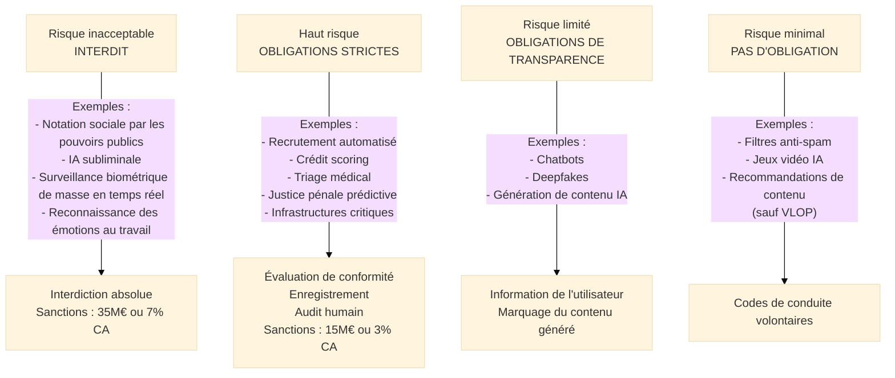
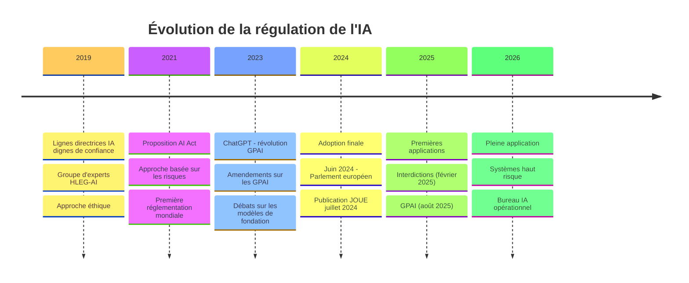
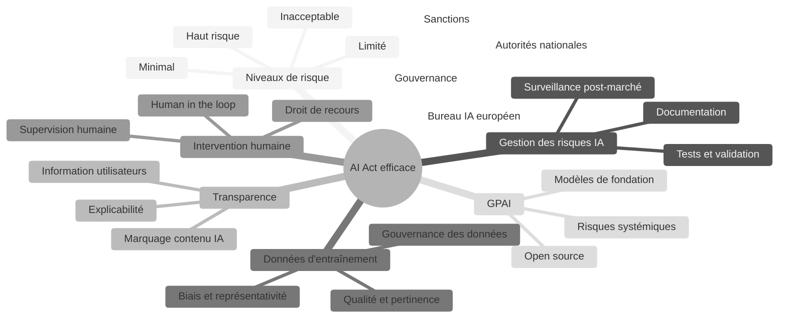

# AI Act — Règlement sur l'Intelligence Artificielle

## Introduction

!!! quote "Analogie pédagogique"
    _Imaginez un **code de la route pour les véhicules autonomes**. Pas besoin d'interdire les voitures autonomes — mais une trottinette électrique sur une piste cyclable, un taxi autonome en ville et un camion autonome sur autoroute ne représentent pas le même niveau de risque et n'appellent pas les mêmes règles. La trottinette : quelques obligations de base. Le taxi : homologation, assurance obligatoire, boîte noire. Le camion : certifications renforcées, tests exhaustifs, supervision permanente. Et certains usages sont simplement interdits : pas de véhicule autonome dans une école maternelle à l'heure de la sortie des classes. **L'AI Act fonctionne exactement ainsi** : il ne cherche pas à interdire l'IA mais à proportionner les obligations au risque réel que chaque usage représente pour les personnes._

**L'AI Act** (Règlement (UE) 2024/1689) est le **premier règlement mondial de régulation globale de l'intelligence artificielle**. Adopté en juin 2024 et publié au Journal officiel le 12 juillet 2024, il établit un cadre juridique fondé sur une **approche par niveaux de risque** applicable à l'ensemble des systèmes d'IA[^1] mis sur le marché ou mis en service dans l'Union européenne.

L'AI Act n'est pas un texte anti-IA : il vise à créer un environnement de confiance qui permette à l'IA de se développer en Europe sans compromettre les droits fondamentaux, la sécurité et les valeurs démocratiques européennes.

!!! info "Pourquoi l'AI Act est essentiel ?"
    L'AI Act est le **premier texte mondial** à réguler l'IA de manière globale et contraignante. Il crée un standard que les autres grandes puissances observent et dont certaines s'inspirent. Pour les organisations qui développent ou déploient de l'IA, il crée des **obligations de conformité** nouvelles et des risques de sanctions élevés (jusqu'à 7% du CA mondial). Pour les professionnels de la cybersécurité, il crée des intersections directes avec le SMSI : les systèmes d'IA à haut risque requièrent journalisation, gestion des risques et surveillance continue.

 

---

## Pour repartir des bases

### 1. Un règlement directement applicable

L'AI Act est un **règlement européen**, directement applicable dans les 27 États membres sans transposition nationale, selon un calendrier progressif :

| Mesure | Date d'application |
|--------|-------------------|
| Interdiction des IA à risque inacceptable | **2 février 2025** |
| Règles sur les modèles d'IA à usage général (GPAI) | **2 août 2025** |
| Règles sur les systèmes d'IA à haut risque (Annexe I) | **2 août 2026** |
| Règles sur les systèmes d'IA à haut risque (Annexe III) | **2 août 2026** |
| Règles sur les systèmes d'IA intégrés dans produits réglementés | **2 août 2027** |

### 2. L'approche par niveaux de risque

L'AI Act classe les usages de l'IA en **4 niveaux de risque** avec des obligations proportionnées :

### 3. Les acteurs concernés

L'AI Act distingue plusieurs rôles dans la chaîne de valeur de l'IA :

- **Fournisseur** (*provider*) : Développe et met sur le marché un système d'IA (obligation principale)
- **Déployeur** (*deployer*) : Utilise un système d'IA dans un contexte professionnel (obligations secondaires)
- **Importateur** : Importe un système d'IA hors UE
- **Distributeur** : Distribue un système d'IA sans le modifier

 

---

## Historique et contexte

 

---

## Les 7 concepts fondateurs

### Vue d'ensemble

### Les 7 concepts expliqués

!!! note "Ci-dessous les 4 premiers concepts"

=== "1️⃣ Classification des risques"

    **La classification d'un système d'IA détermine l'ensemble de ses obligations.**

    **Risque inacceptable (interdit) :**
    - Notation sociale citoyenne par les pouvoirs publics
    - Manipulation subliminale ou exploitant les vulnérabilités (âge, handicap)
    - Surveillance biométrique à distance en temps réel dans les espaces publics (sauf exceptions limitées)
    - Reconnaissance des émotions en milieu professionnel ou éducatif
    - Inférence d'opinions politiques, convictions religieuses depuis des données biométriques
    - IA prédictive pour des infractions pénales basée sur le profilage

    **Haut risque (obligations strictes) :**
    - Annexe I : IA dans des produits soumis à réglementation sectorielle (dispositifs médicaux, véhicules, équipements)
    - Annexe III : IA dans des domaines sensibles (biométrie, infrastructures critiques, éducation, emploi, services essentiels, justice)

=== "2️⃣ Obligations pour les systèmes à haut risque"

    **Les fournisseurs de systèmes à haut risque doivent respecter un ensemble d'exigences cumulatives.**

    | Obligation | Contenu |
    |------------|---------|
    | **Système de gestion des risques** | Processus d'identification, analyse, estimation et atténuation des risques tout au long du cycle de vie |
    | **Gouvernance des données** | Données d'entraînement pertinentes, représentatives, sans biais, documentées |
    | **Documentation technique** | Dossier technique complet permettant l'évaluation de conformité |
    | **Journalisation automatique** | Logs automatiques permettant la traçabilité (durée de conservation proportionnée) |
    | **Transparence** | Documentation pour les déployeurs permettant une utilisation conforme |
    | **Surveillance humaine** | Mécanismes permettant à des humains de superviser, intervenir, désactiver |
    | **Exactitude, robustesse, cybersécurité** | Performances consistantes, résilience aux erreurs et aux attaques adversariales[^2] |

=== "3️⃣ Transparence et information"

    **L'AI Act impose des obligations de transparence à tous les niveaux de risque.**

    **Pour les systèmes à risque limité :**
    - **Chatbots** : L'utilisateur doit être informé qu'il interagit avec une IA
    - **Deepfakes** : Les contenus générés ou manipulés par IA doivent être marqués
    - **Génération de contenu** : Marquage machine lisible obligatoire pour les images, vidéos, audios générés par IA

    **Pour les systèmes à haut risque :**
    - Notice d'utilisation claire pour les déployeurs
    - Information des personnes soumises à une décision automatisée
    - Droit à l'explication des décisions significatives

    **Intersections avec le RGPD :**  
    L'article 22 RGPD (décisions automatisées) est renforcé par l'AI Act pour les systèmes à haut risque.

=== "4️⃣ Données d'entraînement et gouvernance"

    **L'AI Act introduit des exigences sur les données utilisées pour entraîner les systèmes d'IA.**

    Pour les systèmes à haut risque :
    - Données d'entraînement **pertinentes, représentatives** et **exemptes d'erreurs**
    - Prise en compte des **biais** susceptibles d'affecter les résultats
    - **Documentation des pratiques** de gestion des données
    - Mesures pour identifier et corriger les **biais statistiques**

    !!! warning "Intersection avec le RGPD"
        L'utilisation de données personnelles pour entraîner des systèmes d'IA reste soumise au RGPD. Les fournisseurs doivent identifier une base légale valide pour chaque usage. L'AI Act ne crée pas de nouvelle base légale — il ajoute des obligations de qualité sur les données utilisées.

!!! note "Ci-dessous les 3 derniers concepts"

=== "5️⃣ Intervention humaine (Human in the loop)"

    **L'AI Act impose des mécanismes permettant une supervision et une intervention humaines.**

    Les systèmes à haut risque doivent être conçus pour permettre :
    - La **surveillance continue** par des personnes compétentes
    - La **compréhension** des capacités et limites du système
    - La **détection des anomalies** et comportements inattendus
    - L'**arrêt** du système (bouton d'arrêt d'urgence)
    - La **non-totale dépendance** : les décisions finales restent humaines dans les domaines les plus sensibles

=== "6️⃣ Modèles d'IA à usage général (GPAI)"

    **L'AI Act crée un régime spécifique pour les modèles de fondation (GPT-4, Gemini, Claude...).**

    **Obligations de base pour tous les fournisseurs de GPAI :**
    - Documentation technique et notice d'utilisation
    - Politique de respect du droit d'auteur et CSAM[^3]
    - Résumé des données d'entraînement

    **Obligations renforcées pour les GPAI à risque systémique** (puissance de calcul ≥ 10^25 FLOPs) :
    - **Évaluation des risques systémiques** (désinformation à grande échelle, cyberattaques avancées)
    - **Tests adversariaux** (red teaming)
    - **Notification** des incidents graves à la Commission
    - **Mesures de cybersécurité** adaptées
    - **Rapport de transparence** annuel

    **Modèles open source :**  
    Les fournisseurs de modèles GPAI open source sont exemptés des obligations de base (sauf si leur modèle présente un risque systémique).

=== "7️⃣ Gouvernance et sanctions"

    **L'AI Act crée une architecture de supervision dédiée.**

    - **Bureau de l'IA** (*AI Office*) : entité de la Commission européenne supervisant les GPAI et coordinant la mise en œuvre
    - **Autorités nationales compétentes** (ANC) : désignées par chaque État membre pour superviser les acteurs nationaux
    - **Comité européen de l'IA** : coordination des ANC, lignes directrices

    **Sanctions :**
    | Violation | Amende maximale |
    |-----------|----------------|
    | IA interdite (risque inacceptable) | **35M€ ou 7% CA mondial** |
    | Manquements obligations haut risque | **15M€ ou 3% CA mondial** |
    | Informations incorrectes aux autorités | **7,5M€ ou 1% CA mondial** |
    | PME et start-ups | Plafonds réduits |

 

---

## Intersections avec la cybersécurité

L'AI Act crée plusieurs points d'intersection directs avec le SMSI ISO 27001 :

| Exigence AI Act | Contrôle ISO 27002 correspondant |
|-----------------|----------------------------------|
| Journalisation automatique des systèmes IA | 8.15 Journalisation |
| Cybersécurité des systèmes à haut risque | 8.7 Protection contre les malwares, 8.8 Vulnérabilités |
| Gestion des risques IA | 6.1.2 Appréciation des risques |
| Tests adversariaux (GPAI systémiques) | Pentest (pratique, non normalisée ISO) |
| Surveillance humaine | 8.16 Activités de surveillance |
| Données d'entraînement sécurisées | 5.12 Classification, 8.11 Masquage des données |

**Lacunes** : L'AI Act crée des exigences spécifiques sans équivalent direct dans ISO 27001 : les attaques adversariales[^2] sur les modèles d'IA (empoisonnement des données, évasion de modèle) ne sont pas couvertes par les contrôles existants et nécessiteront des contrôles supplémentaires.

 

---

## Articulation avec les autres réglementations

| Réglementation | Relation avec l'AI Act |
|---------------|----------------------|
| **RGPD** | Complémentaire — décisions automatisées (art. 22 RGPD) renforcées par l'AI Act |
| **NIS2** | Complémentaire — systèmes d'IA dans les infrastructures critiques = obligations NIS2 + AI Act |
| **DORA** | Complémentaire — systèmes d'IA dans le secteur financier = DORA + AI Act |
| **DSA** | Complémentaire — systèmes de recommandation des VLOP = DSA + AI Act |
| **CRA** | Complémentaire — systèmes d'IA intégrés dans des produits = CRA + AI Act |

 

---

## Mise en conformité pratique

### Pour les fournisseurs de systèmes d'IA

1. **Classifier** chaque système d'IA par niveau de risque
2. Pour les systèmes à haut risque : **constituer le dossier technique**, implémenter la **gestion des risques**, créer le **système de journalisation**
3. **Enregistrer** les systèmes à haut risque dans la base de données EU (avant mise sur le marché)
4. **Préparer la déclaration de conformité** UE et le marquage CE (pour les produits réglementés)
5. Mettre en place la **surveillance post-marché**

### Pour les déployeurs (utilisateurs professionnels)

1. **Évaluer** si les systèmes d'IA utilisés sont à haut risque
2. **Vérifier** que les systèmes utilisés ont été correctement classifiés par le fournisseur
3. Respecter les **instructions d'utilisation** du fournisseur
4. Maintenir la **supervision humaine** requise
5. **Informer** les personnes soumises aux décisions de l'IA

 

---

## Conclusion

!!! quote "L'AI Act transforme l'IA de boîte noire en acteur responsable."
    L'AI Act incarne le pari européen : il est possible de réguler une technologie sans freiner son développement, à condition que la régulation soit proportionnée, prévisible et fondée sur le risque réel. En imposant des obligations strictes aux usages les plus risqués et en laissant libres les usages à faible risque, il crée un cadre dans lequel l'innovation peut prospérer — mais dans lequel les droits fondamentaux, la dignité humaine et la sécurité ne sont pas négociables.

    Pour les RSSI, l'AI Act introduit une nouvelle dimension du risque SI : les attaques adversariales sur les modèles d'IA, l'empoisonnement des données d'entraînement, et la fragilité des systèmes de décision automatisée face aux manipulations malveillantes. Le SMSI ISO 27001 devra s'enrichir de contrôles spécifiques à l'IA pour rester pertinent dans un environnement où l'IA est omniprésente.

    > La prochaine étape logique est d'explorer le **CRA** (Cyber Resilience Act) qui impose des exigences de cybersécurité aux produits numériques, incluant les produits intégrant de l'IA.

 

---

## Ressources complémentaires

- **Règlement AI Act** : Règlement (UE) 2024/1689 — eur-lex.europa.eu
- **Bureau de l'IA** : digital-strategy.ec.europa.eu/ai-office
- **ENISA** : Lignes directrices sur la cybersécurité des systèmes d'IA
- **OWASP ML Security Top 10** : Risques de sécurité spécifiques aux systèmes d'apprentissage automatique

[^1]: Un **système d'IA** est défini par l'AI Act comme "un système basé sur une machine qui est conçu pour fonctionner avec des niveaux d'autonomie variables et qui peut, à partir des entrées qu'il reçoit, déduire des éléments tels que des prédictions, du contenu, des recommandations ou des décisions pouvant influencer des environnements physiques ou virtuels."
[^2]: Les **attaques adversariales** (*adversarial attacks*) sont des techniques qui consistent à introduire de légères perturbations dans les données d'entrée d'un système d'IA pour le faire produire des résultats erronés ou malveillants. Exemples : modifier imperceptiblement une image pour tromper un système de reconnaissance faciale, ou empoisonner les données d'entraînement pour introduire des biais malveillants dans un modèle.
[^3]: **CSAM** (*Child Sexual Abuse Material*, ou Matériel d'Abus Sexuel sur Enfants) : Les fournisseurs de GPAI sont explicitement tenus de mettre en place des politiques pour éviter que leurs modèles génèrent ou facilitent la génération de tels contenus.

 

---

## Conclusion

!!! quote "Ce qu'il faut retenir"
    Les normes et référentiels ne sont pas des contraintes administratives, mais des cadres structurants. Ils garantissent que la cybersécurité s'aligne sur les objectifs métiers de l'organisation et offre une assurance raisonnable face aux risques.

> [Retour à l'index de la gouvernance →](../../index.md)
