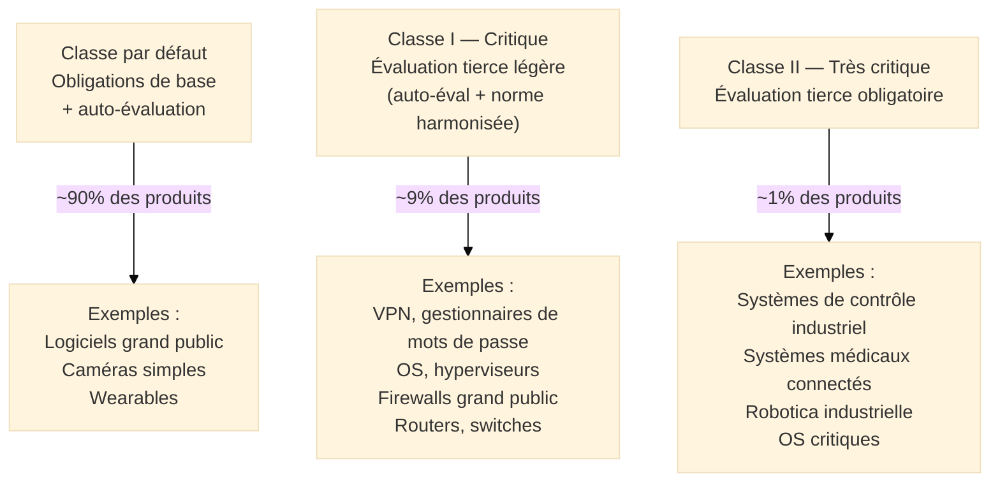

# CRA — Cyber Resilience Act

## Introduction

!!! quote "Analogie pédagogique"
    _Imaginez les **normes de sécurité des jouets** en Europe. Un fabricant de jouets ne peut pas vendre un jouet avec des peintures toxiques ou des pièces détachables dangerantes pour les enfants, même si ce jouet est moins cher à produire sans ces précautions. Le marquage CE garantit que le jouet a passé des tests de sécurité avant d'être mis sur le marché — et si un défaut est découvert après la vente, le fabricant doit le rappeler et le corriger. **Le CRA applique exactement cette logique aux produits numériques** : une caméra connectée, un router domestique, un logiciel de comptabilité, un système de contrôle industriel ne peuvent plus être mis sur le marché européen avec des vulnérabilités connues non corrigées. Le fabricant doit tester avant de vendre, corriger les failles découvertes après la vente, et informer les utilisateurs et les autorités en cas d'incident._

**Le CRA** (*Cyber Resilience Act*, Règlement (UE) 2024/2847) est le **règlement européen imposant des exigences de cybersécurité aux produits comportant des éléments numériques**. Adopté en octobre 2024 et publié au Journal officiel le 20 novembre 2024, il entre en application progressive jusqu'en 2027. C'est le premier texte européen à imposer des standards de cybersécurité **dès la conception** des produits numériques.

Le CRA s'applique à un champ d'application immense : pratiquement tout produit connecté ou logiciel vendu sur le marché européen — du smartphone à l'ampoule connectée, du logiciel de traitement de texte au système SCADA[^1] industriel.

!!! info "Pourquoi le CRA est essentiel ?"
    Des millions de produits numériques sont mis sur le marché européen chaque année avec des vulnérabilités de sécurité connues, sans mécanisme de mise à jour de sécurité, et sans obligation pour le fabricant d'informer les utilisateurs. Le CRA met fin à cette situation en créant une **responsabilité des fabricants** sur toute la durée de vie du produit — pas uniquement à la mise sur le marché.

 

---

## Pour repartir des bases

### 1. Calendrier d'application

| Obligation | Date |
|------------|------|
| Entrée en vigueur du règlement | **11 décembre 2024** |
| Obligations de notification d'incidents (ENISA) | **11 septembre 2026** |
| Application complète du règlement | **11 décembre 2027** |

### 2. Produits concernés

Le CRA s'applique aux **produits comportant des éléments numériques** (PEN[^2]) :

- **Produits matériels** avec composants numériques connectables : caméras IP, routeurs, NAS, montres connectées, appareils médicaux connectés, systèmes de contrôle industriel
- **Logiciels** vendus comme produit : systèmes d'exploitation, logiciels de bureautique, navigateurs, antivirus, VPN

**Exclusions :**
- Produits réglementés par des textes sectoriels spécifiques avec exigences équivalentes (dispositifs médicaux — MDR, véhicules — règlement automobiles, aviation — EASA)
- Services cloud (couverts par NIS2)
- Logiciels open source non commerciaux (exemption partielle)

### 3. Classification par criticité

 

---

## Les exigences essentielles du CRA

### Exigences de sécurité — Annexe I, Partie I

Les fabricants doivent s'assurer que leurs produits sont conçus, développés et produits avec un **niveau approprié de cybersécurité**. Les exigences incluent :

**Sécurité dès la conception (*security by design*) :**
- **Surface d'attaque minimale** : Désactiver par défaut toutes les fonctions non nécessaires
- **Pas de mots de passe par défaut** : Identifiants uniques ou mécanismes d'authentification robustes
- **Protection contre les accès non autorisés** : Contrôle d'accès adapté
- **Confidentialité des données** : Chiffrement des données sensibles au repos et en transit
- **Intégrité des données** : Protection contre les modifications non autorisées
- **Disponibilité** : Résistance aux attaques par déni de service

**Gestion des mises à jour de sécurité :**
- Capacité de **mise à jour à distance sécurisée**
- **Période de support définie** (au minimum 5 ans pour la plupart des produits)
- Information des utilisateurs sur la **fin du support** avec délai raisonnable
- Possibilité de **désactiver** le produit de manière sécurisée en fin de vie

**Gestion des vulnérabilités — Annexe I, Partie II :**
- **Inventaire des composants** (SBOM[^3]) permettant d'identifier les dépendances vulnérables
- **Processus de traitement des vulnérabilités** sur toute la durée de vie
- Divulgation responsable des vulnérabilités (*responsible disclosure*)
- Partage d'informations sur les vulnérabilités avec les utilisateurs et les autorités

 

---

## Obligations de notification

**Pour les incidents actifs :**
- **Alerte précoce** : Dans les **24 heures** après la découverte d'une vulnérabilité activement exploitée → à l'ENISA[^4] et à l'autorité nationale compétente
- **Notification** : Dans les **72 heures** → rapport plus détaillé
- **Rapport final** : Dans les **14 jours** → analyse complète et correctifs appliqués

**Pour les vulnérabilités non exploitées :**
- Traitement dans un délai raisonnable selon la sévérité (CVSS)
- Divulgation coordonnée selon les bonnes pratiques du secteur

 

---

## Intersections avec la cybersécurité

Le CRA crée des **obligations nouvelles pour les fabricants** qui s'ajoutent à celles du SMSI ISO 27001 dans leur processus de développement :

| Exigence CRA | Contrôle ISO 27002 correspondant | Gap |
|-------------|----------------------------------|-----|
| SBOM (inventaire composants) | 5.9 Inventaire des actifs (partiel) | SBOM non couvert explicitement |
| Politique de divulgation des vulnérabilités | — | Non couvert par ISO 27001 |
| Mise à jour sécurisée à distance | 8.8 Gestion des vulnérabilités | Partiel |
| Security by design | 8.25 Cycle de vie développement sécurisé | Couverture directe |
| Pas de mots de passe par défaut | 5.17 Informations d'authentification | Couverture directe |
| Notification ENISA (24h) | — | Non couvert par ISO 27001 |
| Durée de support (5 ans min.) | — | Non couvert par ISO 27001 |

**Lacune principale :** Le CRA impose des obligations sur la **durée de vie du produit** (maintenance, support, mises à jour) qui n'ont pas d'équivalent dans ISO 27001 centré sur le SMSI organisationnel.

 

---

## Sanctions

| Violation | Amende maximale |
|-----------|----------------|
| Non-respect des exigences essentielles | **15M€ ou 2,5% CA mondial** |
| Non-respect des obligations du fabricant | **10M€ ou 2% CA mondial** |
| Informations incorrectes aux autorités | **5M€ ou 1% CA mondial** |

 

---

## Articulation avec les autres réglementations

| Réglementation | Relation avec le CRA |
|---------------|---------------------|
| **NIS2** | Complémentaire — NIS2 s'applique aux organisations utilisant des produits numériques ; CRA s'applique aux fabricants de ces produits |
| **AI Act** | Complémentaire — Produits intégrant de l'IA = CRA + AI Act |
| **RGPD** | Complémentaire — Produits traitant des données personnelles = CRA + RGPD |
| **MDR/IVDR** | Primauté — Dispositifs médicaux réglementés : MDR prime sur CRA |
| **ISO 27001** | SMSI organisationnel du fabricant — peut être complété par les exigences CRA dans le SDLC |

 

---

## Implications pratiques

### Pour les fabricants de produits numériques

- **Revoir le processus de développement** pour intégrer la sécurité dès la conception
- **Constituer le SBOM** de chaque produit (liste des composants logiciels)
- **Définir la politique de support** (durée, conditions de mise à jour)
- **Créer un processus de gestion des vulnérabilités** post-commercialisation
- **Mettre en place le canal de notification** vers l'ENISA et l'autorité nationale
- **Former les équipes** de développement aux exigences CRA

### Pour les acheteurs/utilisateurs professionnels

- **Vérifier la conformité CRA** avant acquisition (marquage CE avec déclaration de conformité CRA)
- **Vérifier la durée de support** avant achat (produits en fin de support = risque non couvert)
- **Intégrer le SBOM** dans la gestion des vulnérabilités de l'organisation
- **Exiger des clauses contractuelles** sur les obligations CRA dans les appels d'offres

 

---

## Conclusion

!!! quote "Le CRA met fin à l'ère des produits numériques jetables et non sécurisés."
    Le CRA est une révolution pour l'industrie des produits numériques. Pendant des décennies, les fabricants ont pu mettre sur le marché des produits avec des vulnérabilités connues, sans obligation de les corriger, sans durée de support garantie, et sans mécanisme de mise à jour sécurisée. Le CRA met fin à cette situation en créant une responsabilité du fabricant qui s'étend sur toute la durée de vie commerciale du produit.

    Pour les RSSI, le CRA a deux implications majeures : d'abord, si leur organisation est fabricant de produits numériques, ils ont de nouvelles obligations de développement sécurisé et de gestion des vulnérabilités produit. Ensuite, si leur organisation est client de produits numériques, le CRA leur donne de nouveaux leviers pour exiger des fournisseurs des garanties contractuelles sur la sécurité et le support de leurs produits.

 

---

## Ressources complémentaires

- **Règlement CRA** : Règlement (UE) 2024/2847 — eur-lex.europa.eu
- **ENISA** : Lignes directrices sur les exigences CRA — enisa.europa.eu
- **NIST SBOM** : Guides sur le Software Bill of Materials — ntia.gov
- **OWASP** : Bonnes pratiques de développement sécurisé — owasp.org

[^1]: **SCADA** (*Supervisory Control and Data Acquisition*) désigne les systèmes de contrôle industriels utilisés pour surveiller et contrôler des processus industriels (centrales électriques, traitement des eaux, raffineries, transport). Ces systèmes sont particulièrement visés par le CRA car leur compromission peut avoir des conséquences physiques graves.
[^2]: **PEN** (*Products with digital Elements*, ou Produits comportant des éléments numériques) est la terminologie officielle du CRA pour désigner les produits concernés par le règlement.
[^3]: Un **SBOM** (*Software Bill of Materials*, ou Nomenclature des composants logiciels) est une liste exhaustive des composants logiciels d'un produit : bibliothèques, frameworks, outils tiers, dépendances. Il permet d'identifier rapidement si un produit est affecté par une vulnérabilité découverte dans un de ses composants.
[^4]: L'**ENISA** (*European Union Agency for Cybersecurity*, ou Agence de l'Union européenne pour la cybersécurité) est l'agence européenne chargée de contribuer à la cybersécurité en Europe. Dans le cadre du CRA, elle reçoit les notifications d'incidents et de vulnérabilités activement exploitées.