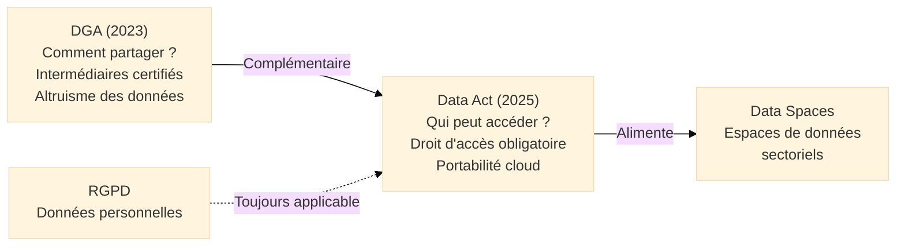

# Data Act — Règlement sur les Données

## Introduction

!!! quote "Analogie pédagogique"
    _Imaginez que vous achetez une **voiture connectée** qui mesure en permanence votre façon de conduire, l'état du moteur, votre localisation, vos habitudes de déplacement. Ces données ont une valeur considérable — pour votre assureur qui pourrait vous proposer une prime personnalisée, pour votre garagiste qui pourrait prévenir les pannes, pour les services d'urgence en cas d'accident. Mais aujourd'hui, ces données appartiennent de facto au constructeur qui les commercialise sans que vous ayez votre mot à dire. **Le Data Act change cette situation** : il vous donne le droit d'accéder à ces données, de les partager avec le prestataire de votre choix, et empêche le constructeur de s'y opposer ou de vous facturer un accès excessif. Il ne prend pas les données au constructeur — il vous donne le droit d'y accéder et de décider qui d'autre peut y accéder._

**Le Data Act** (Règlement (UE) 2023/2854) est le **règlement européen qui crée des droits d'accès aux données générées par les objets connectés et les services numériques**. Entré en application le **12 septembre 2025**, il complète le DGA (Data Governance Act) en créant non plus des structures de partage volontaire, mais des **droits d'accès aux données obligatoires** pour les utilisateurs et les tiers autorisés.

Le Data Act est la pièce manquante de la stratégie européenne des données : là où le DGA crée le cadre de confiance pour partager volontairement, le Data Act crée le droit d'accéder aux données que d'autres détiennent sur vous ou que vous avez générées.

!!! info "Pourquoi le Data Act est essentiel ?"
    La valeur économique des données générées par les objets connectés (véhicules, équipements industriels, appareils médicaux, compteurs intelligents, équipements agricoles) est estimée à des milliers de milliards d'euros en Europe. Aujourd'hui, cette valeur est quasi-intégralement captée par les fabricants. Le Data Act rééquilibre cette relation en donnant aux utilisateurs — particuliers et entreprises — un droit d'accès à leurs données.

 

---

## Pour repartir des bases

### 1. Ce que le Data Act crée

Le Data Act crée **trois grandes catégories de droits** :

**Droits d'accès aux données IoT :**
- Les utilisateurs d'objets connectés ont le droit d'accéder aux données générées par leur usage
- Ils peuvent autoriser des tiers (prestataires de services, assureurs, garagistes) à accéder à ces données
- Le fabricant ne peut pas s'y opposer et ne peut pas facturer un accès disproportionné

**Droits des PME face aux grandes entreprises :**
- Protection contre les clauses contractuelles déséquilibrées imposant des conditions d'accès aux données abusives
- Droit de négocier des conditions équitables

**Droits de portabilité et de changement de fournisseur cloud :**
- Droit de changer de fournisseur cloud sans obstacle technique ou contractuel excessif
- Droit d'exporter toutes ses données dans un format interopérable
- Suppression des frais de sortie (*egress fees*) pour les transferts de données lors d'un changement de fournisseur

### 2. Qui est concerné

| Acteur | Obligations |
|--------|-------------|
| **Fabricants de produits connectés** | Permettre l'accès aux données aux utilisateurs et aux tiers autorisés |
| **Fournisseurs de services associés** | Idem |
| **Fournisseurs de services cloud** | Portabilité des données, suppression des obstacles au changement |
| **Organismes du secteur public** | Droit d'accès aux données privées en cas d'urgence exceptionnelle |

### 3. Relations avec le DGA et le RGPD

 

---

## Les droits d'accès aux données IoT en détail

### Accès de l'utilisateur à ses propres données

Le fabricant ou fournisseur de service doit :
- **Concevoir le produit** pour que les données générées soient accessibles à l'utilisateur (par défaut, facilement, sans surcoût)
- **Fournir les informations** sur les données collectées avant l'achat du produit
- **Faciliter l'accès** en temps réel ou quasi-réel si techniquement faisable

### Partage avec des tiers autorisés

L'utilisateur peut autoriser un tiers (ex : son garagiste, son assureur, un prestataire de maintenance) à accéder aux données générées par le produit. Le fabricant doit :
- Permettre ce partage **sans s'y opposer**
- Ne pas facturer un accès **disproportionné** au tiers
- Ne pas utiliser les données partagées avec le tiers pour **ses propres fins commerciales**

### Données exclues

Le Data Act **ne s'applique pas** aux données que le fabricant génère lui-même de manière indépendante (modèles internes, données propriétaires) — il s'applique uniquement aux données générées par **l'utilisation** du produit par l'utilisateur.

 

---

## La portabilité cloud — Un droit nouveau et structurant

### Fin des obstacles au changement de fournisseur cloud

Les fournisseurs de services cloud ne peuvent plus :
- Imposer des **frais de sortie excessifs** lors d'un transfert de données vers un autre fournisseur
- Créer des **obstacles techniques ou contractuels** empêchant le changement
- Conserver des données du client **au-delà du délai nécessaire** au transfert

### Calendrier de suppression des frais de sortie

| Période | Frais de sortie autorisés |
|---------|--------------------------|
| Jusqu'à janvier 2027 | Frais réduits (réduction progressive) |
| À partir de janvier 2027 | **Transferts gratuits** vers tout autre fournisseur ou vers un environnement on-premise |

### Interopérabilité

Les fournisseurs cloud doivent :
- Garantir l'**interopérabilité** avec d'autres fournisseurs via des standards ouverts
- Fournir des **interfaces de données** permettant l'export dans des formats interopérables
- Contribuer à l'élaboration de **standards techniques** au niveau européen

 

---

## Secteur public et données privées en situation d'urgence

**Innovation du Data Act :** Les organismes du secteur public peuvent demander l'accès à des données privées en cas d'**urgence exceptionnelle** (catastrophe naturelle, épidémie, crise) lorsque ces données sont indispensables pour la gestion de la crise et ne peuvent pas être obtenues autrement.

Conditions strictes :
- Urgence **exceptionnelle** avérée
- Données **nécessaires** et non disponibles par d'autres moyens
- Utilisation limitée à la **gestion de la crise**
- **Indemnisation** équitable du détenteur des données
- **Suppression** des données dès que l'urgence est levée

 

---

## Articulation avec les autres réglementations

| Réglementation | Relation avec le Data Act |
|---------------|--------------------------|
| **DGA** | Complémentaire — DGA crée le cadre volontaire, Data Act crée les droits obligatoires |
| **RGPD** | Complémentaire — Données personnelles partagées via Data Act restent soumises au RGPD |
| **ISO 27001/27017** | ISO 27017 anticipe la portabilité cloud — Data Act la rend obligatoire |
| **NIS2** | Complémentaire — les données partagées via Data Act doivent respecter les exigences NIS2 |
| **AI Act** | Complémentaire — données IoT accessibles via Data Act peuvent alimenter systèmes d'IA |

 

---

## Sanctions

| Violation | Amende maximale |
|-----------|----------------|
| Non-respect des obligations d'accès aux données | **Jusqu'à 10M€** (selon transposition nationale) |
| Clauses contractuelles abusives | Nullité des clauses + amende |

 

---

## Conclusion

!!! quote "Le Data Act restitue aux utilisateurs la valeur des données qu'ils génèrent."
    Le Data Act achève l'architecture réglementaire européenne des données en donnant aux utilisateurs un droit d'accès effectif aux données issues de leur propre comportement. Combiné au DGA (cadre de confiance pour le partage volontaire), il crée les conditions d'une économie des données dans laquelle la valeur est plus équitablement distribuée entre ceux qui génèrent les données et ceux qui les exploitent.

    Pour les RSSI, le Data Act a deux implications majeures : d'abord, les produits et services de leur organisation qui collectent des données d'usage doivent être revus pour permettre l'accès des utilisateurs. Ensuite, les contrats cloud doivent être vérifiés pour identifier les clauses qui ne seront plus légales (frais de sortie excessifs, obstacles à la portabilité) et négocier leur révision.

 

---

## Ressources complémentaires

- **Règlement Data Act** : Règlement (UE) 2023/2854 — eur-lex.europa.eu
- **Commission européenne — Stratégie des données** : digital-strategy.ec.europa.eu
- **DGA** : Règlement (UE) 2022/868 (texte complémentaire)

 

---

## Conclusion

!!! quote "Ce qu'il faut retenir"
    Les normes et référentiels ne sont pas des contraintes administratives, mais des cadres structurants. Ils garantissent que la cybersécurité s'aligne sur les objectifs métiers de l'organisation et offre une assurance raisonnable face aux risques.

> [Retour à l'index de la gouvernance →](../../index.md)
