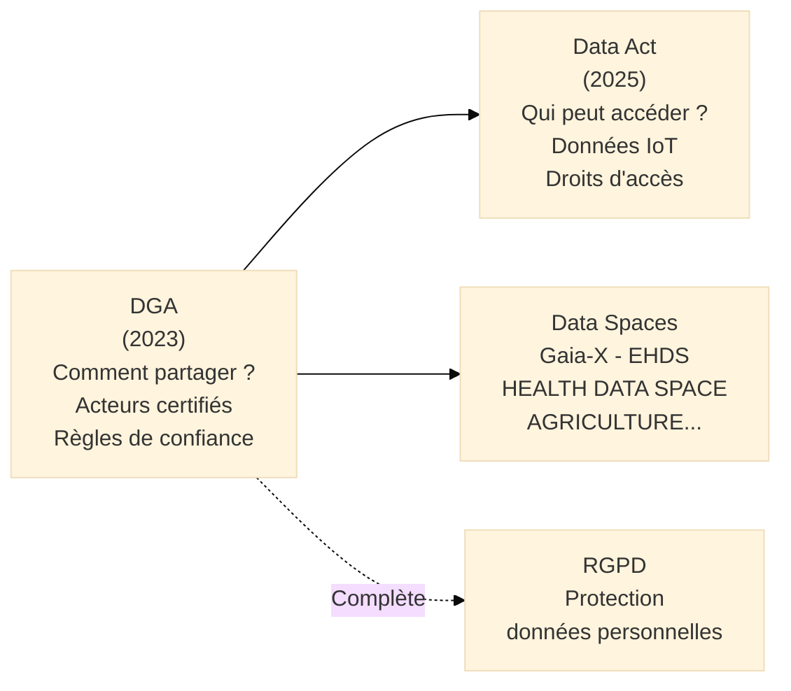

# DGA — Data Governance Act

## Introduction

!!! quote "Analogie pédagogique"
    _Imaginez un **réseau de bibliothèques universitaires** qui possèdent chacune des collections uniques — des archives médicales ici, des données climatiques là, des registres économiques ailleurs. Ces données ont une valeur énorme si elles sont croisées, mais les bibliothèques ne se font pas confiance mutuellement pour partager directement. La solution : créer un **service de prêt interbibliothèques neutre** géré par un tiers de confiance certifié, qui facilite les échanges selon des règles transparentes, sans s'approprier les données, et qui garantit aux chercheurs et aux institutions que leurs données ne seront pas détournées. **Le DGA est ce service de prêt interbibliothèques pour les données européennes** : il crée le cadre juridique, les acteurs certifiés et les règles qui permettent de partager des données entre secteurs et États membres sans que les détenteurs de données aient à faire confiance directement aux bénéficiaires._

**Le DGA** (*Data Governance Act*, Règlement (UE) 2022/868) est le **règlement européen qui crée le cadre pour le partage de données en Europe**. Entré en application le **24 septembre 2023**, il constitue la première pièce de la stratégie européenne pour les données, avant le Data Act. Il ne crée pas de droit au partage des données — il crée les **structures et acteurs qui rendent ce partage possible, de confiance et sécurisé**.

!!! info "Pourquoi le DGA est essentiel ?"
    L'Europe dispose de données d'une valeur considérable dans les secteurs public et privé — données de santé, données climatiques, données agricoles, données de mobilité. Mais ces données restent largement silotées, non partagées, et donc non valorisées. Le DGA crée les conditions du partage en établissant les règles du jeu, les acteurs certifiés et les mécanismes de confiance qui permettent à un hôpital de partager ses données avec un chercheur, ou à une ville de mettre ses données de transport à disposition d'une start-up de mobilité, sans prendre de risques réglementaires ou réputationnels.

 

---

## Pour repartir des bases

### 1. Ce que le DGA crée

Le DGA crée trois innovations majeures dans l'écosystème des données européen :

**Les intermédiaires de données** (*data intermediaries*) : acteurs neutres certifiés qui facilitent le partage entre détenteurs et utilisateurs de données sans s'approprier les données elles-mêmes. Ils doivent être enregistrés auprès d'une autorité nationale compétente.

**L'altruisme des données** (*data altruism*) : cadre volontaire permettant aux personnes et organisations de mettre leurs données à disposition pour des finalités d'intérêt général (recherche médicale, lutte contre le changement climatique). Les organisations d'altruisme des données peuvent demander une reconnaissance officielle.

**La réutilisation des données du secteur public** : cadre pour mettre à disposition les données protégées (confidentielles, données personnelles, secrets industriels) détenues par les organismes publics, sous conditions strictes.

### 2. Ce que le DGA ne fait pas

- Il **ne crée pas un droit d'accès** aux données privées (c'est le Data Act)
- Il **ne remplace pas le RGPD** — les données personnelles partagées via le DGA restent soumises au RGPD
- Il **n'impose pas** le partage de données — il le facilite

### 3. Relation avec la stratégie européenne des données

 

---

## Les 4 piliers du DGA

### Pilier 1 — Réutilisation des données protégées du secteur public

Les organismes du secteur public détiennent des données de grande valeur (données de santé anonymisées, données judiciaires, données économiques) qui ne peuvent pas être en open data car elles contiennent des informations sensibles. Le DGA crée un cadre pour les mettre à disposition sous conditions.

**Conditions de réutilisation :**
- Finalité définie et limitée (recherche, développement d'IA d'intérêt public)
- Mesures techniques garantissant la confidentialité (environnements sécurisés, accès contrôlé)
- Interdiction de réidentification
- Redevances possibles mais limitées aux coûts réels

### Pilier 2 — Intermédiaires de données

**Définition :** Acteur neutre qui fournit des services de mise en relation entre détenteurs de données et utilisateurs de données, sans accéder au contenu des données échangées.

**Exigences des intermédiaires certifiés :**
- **Neutralité** : L'intermédiaire ne peut pas utiliser les données pour son propre compte
- **Séparation** : L'activité d'intermédiation doit être séparée des autres activités commerciales
- **Enregistrement** : Auprès de l'autorité nationale compétente (CNIL en France pour les données personnelles)
- **Transparence** : Conditions d'accès publiées et non discriminatoires

**Types d'intermédiaires visés :**
- Espaces de données sectoriels (*data spaces*) : Gaia-X, European Health Data Space
- Services de portabilité des données entre plateformes
- Coopératives de données permettant aux personnes de gérer collectivement leurs données

### Pilier 3 — Altruisme des données

Cadre volontaire pour les personnes physiques et les entreprises souhaitant mettre leurs données à disposition pour des **finalités d'intérêt général** sans contrepartie commerciale.

**Exemples de finalités d'intérêt général :**
- Recherche médicale sur les maladies rares
- Amélioration des services publics
- Lutte contre le changement climatique
- Sécurité routière

**Organisations d'altruisme reconnus :**
- Entités à but non lucratif pouvant demander une reconnaissance officielle
- Inscrites dans un registre européen public
- Soumises à des obligations de transparence et de gouvernance

### Pilier 4 — Gouvernance et comité européen de l'innovation des données

Un **Comité européen de l'innovation des données** (CEID) est créé pour coordonner les autorités nationales compétentes, émettre des lignes directrices et faciliter l'interopérabilité entre data spaces.

 

---

## Articulation avec les autres réglementations

| Réglementation | Relation avec le DGA |
|---------------|---------------------|
| **RGPD** | Le DGA s'applique sans préjudice du RGPD — données personnelles partagées via DGA restent soumises au RGPD |
| **Data Act** | Complémentaire — DGA crée le cadre de confiance, Data Act crée les droits d'accès |
| **AI Act** | Les données partagées via DGA peuvent alimenter les systèmes d'IA |
| **DSA** | Non directement lié — DSA concerne les contenus, DGA les données |

 

---

## Implications pratiques

### Pour les organismes du secteur public

- Évaluer quelles données protégées peuvent être réutilisées sous conditions DGA
- Mettre en place des **procédures de traitement des demandes** de réutilisation
- Créer des **environnements d'accès sécurisé** si nécessaire

### Pour les entreprises souhaitant devenir intermédiaires

- Vérifier les conditions d'enregistrement auprès de l'autorité nationale
- Structurer l'activité d'intermédiation en entité séparée
- Définir et publier les conditions d'accès non discriminatoires

### Pour les organisations souhaitant pratiquer l'altruisme des données

- Identifier les données susceptibles d'être mises à disposition
- Évaluer les risques (réidentification, concurrence)
- Opter pour une reconnaissance officielle si les conditions sont remplies

 

---

## Conclusion

!!! quote "Le DGA est la couche de confiance qui manquait à l'économie des données européenne."
    Le DGA ne résout pas le problème de la valeur des données — d'autres textes (Data Act) s'en chargent. Il résout le problème de la **confiance** : comment partager des données avec des tiers sans prendre le risque que ces données soient détournées, revendues ou utilisées à d'autres fins ? En créant des intermédiaires certifiés neutres, en encadrant les finalités d'utilisation et en créant des mécanismes de gouvernance transparents, le DGA crée les conditions nécessaires — mais pas suffisantes — à l'émergence d'une économie des données européenne.

    > La prochaine étape est le **Data Act**, qui crée les droits d'accès aux données générées par les objets connectés et les services numériques.

 

---

## Ressources complémentaires

- **Règlement DGA** : Règlement (UE) 2022/868 — eur-lex.europa.eu
- **Commission européenne — Stratégie des données** : digital-strategy.ec.europa.eu
- **Gaia-X** : gaia-x.eu (espace de données européen)
- **CNIL** : cnil.fr (autorité nationale compétente France)

 

---

## Conclusion

!!! quote "Ce qu'il faut retenir"
    Les normes et référentiels ne sont pas des contraintes administratives, mais des cadres structurants. Ils garantissent que la cybersécurité s'aligne sur les objectifs métiers de l'organisation et offre une assurance raisonnable face aux risques.

> [Retour à l'index de la gouvernance →](../../index.md)
