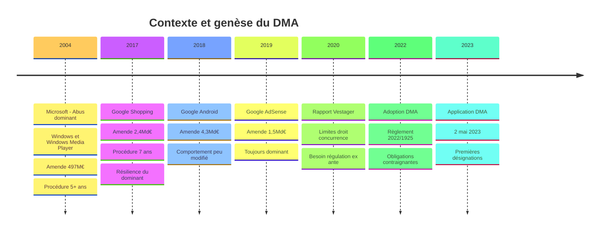
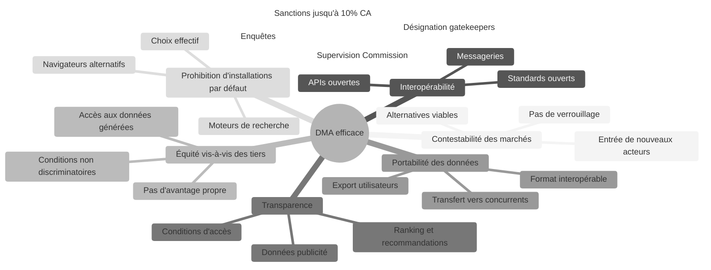

# DMA — Digital Markets Act

## Introduction

!!! quote "Analogie pédagogique"
    _Imaginez un **grand marché couvert** où un seul opérateur possède à la fois les allées, les étals, le parking, la publicité intérieure et la caisse centrale. Cet opérateur serait tentant d'avantager ses propres produits en les plaçant aux meilleures positions, de refuser l'accès aux commerçants concurrents, d'utiliser les données des transactions de ses locataires pour développer ses propres produits, ou d'imposer sa propre application de paiement. **Le DMA est le règlement du marché** qui s'impose à cet opérateur dominant : il peut toujours gérer le marché, mais il doit laisser les allées accessibles à tous dans des conditions équitables, ne pas s'avantager lui-même, et ne pas utiliser les données de ses locataires pour leur faire concurrence._

**Le DMA** (*Digital Markets Act*, Règlement (UE) 2022/1925) est le **règlement européen qui encadre le comportement des grandes plateformes numériques dominantes** — désignées "contrôleurs d'accès" ou *gatekeepers* — pour garantir que les marchés numériques restent équitables et contestables. Applicable depuis le **2 mai 2023**, il constitue la réponse de l'Union européenne à la domination structurelle de quelques acteurs technologiques sur des marchés entiers de l'économie numérique.

Le DMA est distinct du droit de la concurrence traditionnel (article 102 TFUE[^1]) : il n'intervient pas seulement après la commission d'un abus dominant — il impose ex ante des **obligations et interdictions** aux gatekeepers désignés, indépendamment de toute infraction avérée.

!!! info "Pourquoi le DMA est essentiel ?"
    Google, Apple, Meta, Amazon et Microsoft contrôlent les portes d'accès aux marchés numériques les plus importants : app stores, moteurs de recherche, messageries, plateformes publicitaires, services cloud. Les entreprises et les utilisateurs qui dépendent de ces plateformes n'ont souvent pas d'alternative réelle. Le DMA vise à rétablir une concurrence effective en imposant aux gatekeepers des règles que le droit de la concurrence classique ne permettait pas d'obtenir aussi rapidement.

 

---

## Pour repartir des bases

### 1. Ce que le DMA n'est pas

Le DMA n'est **pas** :
- Un texte de protection des données personnelles (c'est le RGPD)
- Un texte sur les contenus illicites (c'est le DSA)
- Un texte de droit de la concurrence classique (il n'exige pas de preuve d'abus dominant)
- Un texte visant toutes les entreprises numériques (seulement les gatekeepers désignés)

### 2. Qui sont les gatekeepers ?

Un gatekeeper est une entreprise qui fournit un **service de plateforme essentiel** (*core platform service* — CPS) et satisfait des critères de taille et d'impact :

**Critères de désignation (présomption) :**
- Chiffre d'affaires annuel ≥ **7,5 milliards €** dans l'EEE ou capitalisation ≥ **75 milliards €**
- ≥ **45 millions** d'utilisateurs finaux actifs mensuels dans l'UE
- ≥ **10 000** entreprises utilisatrices actives annuelles dans l'UE
- Présence dans au moins **3 États membres** de l'UE

**Services de plateforme essentiels (CPS) concernés :**
- Moteurs de recherche en ligne
- Réseaux sociaux
- Services de messagerie instantanée interpersonnelle
- Systèmes d'exploitation
- Navigateurs web
- Assistants virtuels
- Services d'informatique en nuage (cloud)
- Services publicitaires en ligne
- Plateformes de partage de vidéos
- Places de marché en ligne

**Gatekeepers désignés (2023-2024) :**

| Entreprise | Services désignés |
|------------|------------------|
| **Alphabet (Google)** | Google Search, Google Maps, Google Play, Google Shopping, Chrome, Android, YouTube, Google Ads |
| **Amazon** | Amazon Marketplace, Amazon Ads |
| **Apple** | App Store, Safari, iOS |
| **ByteDance (TikTok)** | TikTok |
| **Meta** | Facebook, Instagram, WhatsApp, Messenger, Meta Ads |
| **Microsoft** | LinkedIn, Windows PC OS, Microsoft Ads |

### 3. La logique d'intervention ex ante

Le DMA innove en instaurant un régime d'**obligations ex ante** : les gatekeepers doivent respecter les règles indépendamment de toute infraction constatée. C'est une rupture fondamentale avec le droit de la concurrence classique qui exige la preuve d'un abus avant d'intervenir — preuve qui prend des années à établir pendant lesquelles le marché est verrouillé.

 

---

## Historique et contexte

### De l'impuissance du droit de la concurrence au DMA

_Le constat était sans appel : les amendes records du droit de la concurrence (plusieurs milliards d'euros) n'ont pas structurellement modifié les comportements des GAFAM. Le DMA apporte une réponse différente : des obligations préventives plutôt que des sanctions curatives._

 

---

## Les 7 concepts fondateurs

### Vue d'ensemble

### Les 7 concepts expliqués

!!! note "Ci-dessous les 4 premiers concepts"

=== "1️⃣ Contestabilité des marchés"

    **Le DMA vise à maintenir des marchés numériques structurellement contestables — où des concurrents peuvent émerger et survivre.**

    Les gatekeepers ne peuvent pas :
    - Imposer des **conditions qui verrouillent** les utilisateurs ou les entreprises dans leur écosystème
    - Utiliser des **pratiques anti-steering** (empêcher les marchands de diriger les clients vers leurs propres canaux moins chers)
    - Appliquer des **clauses de parité prix** qui empêchent les marchands d'offrir de meilleures conditions ailleurs

    **Exemple concret :** Amazon ne peut plus interdire à ses marchands tiers de vendre moins cher sur leur propre site web qu'sur Amazon Marketplace.

=== "2️⃣ Interopérabilité"

    **Les gatekeepers doivent ouvrir leurs services pour permettre l'interopérabilité avec des solutions concurrentes.**

    Obligations d'interopérabilité :
    - **Messageries** (WhatsApp, Messenger) : permettre à des utilisateurs d'autres messageries d'envoyer des messages sans créer un compte sur la plateforme du gatekeeper
    - **Business APIs** : fournir aux entreprises tierces un accès aux fonctionnalités nécessaires à leur activité sur la plateforme
    - **Systèmes d'exploitation** : permettre aux utilisateurs d'installer des applications provenant de sources tierces (sideloading[^2])

    **Exemple concret :** Apple a dû permettre le sideloading d'applications sur iOS dans l'UE (depuis iOS 17.4, mars 2024) — une décision historique après des années de refus.

=== "3️⃣ Équité vis-à-vis des entreprises tierces"

    **Les gatekeepers ne peuvent pas s'avantager eux-mêmes par rapport aux entreprises qui utilisent leur plateforme.**

    Interdictions :
    - **Self-preferencing** : ne pas avantager ses propres services dans les classements de résultats (ex : Google ne peut pas placer Google Shopping systématiquement au-dessus des comparateurs concurrents)
    - **Utilisation des données tierces** pour concurrencer les entreprises qui les génèrent (ex : Amazon ne peut pas utiliser les données de ses marchands pour lancer des produits Amazon Basics concurrents)
    - **Conditions discriminatoires** d'accès à la plateforme selon que l'entreprise est concurrente ou non

    **Exemple concret :** Google doit afficher les résultats de comparateurs de prix concurrents (PriceRunner, Kelkoo) dans des conditions équitables, sans les reléguer en bas des résultats de recherche.

=== "4️⃣ Transparence"

    **Les gatekeepers doivent informer les entreprises utilisatrices et les autorités de leurs pratiques.**

    Obligations de transparence :
    - **Publicité** : fournir aux annonceurs et éditeurs les informations nécessaires pour vérifier l'efficacité de leurs publicités et les comparer avec des alternatives
    - **Ranking et recommandations** : expliquer les critères qui déterminent le classement des résultats et des recommandations
    - **Accès aux données** : informer les entreprises des données que la plateforme collecte sur leurs activités

!!! note "Ci-dessous les 3 derniers concepts"

=== "5️⃣ Portabilité des données"

    **Les gatekeepers doivent permettre aux utilisateurs de transférer leurs données vers d'autres services.**

    - **Portabilité en temps réel** : accès continu via API aux données générées par l'utilisation du service
    - **Format interopérable** : données exportables dans des formats permettant leur utilisation ailleurs
    - **Sans obstacle** : pas de frais excessifs, pas de délai injustifié, pas de dégradation du service pour ceux qui exportent

    **Exemple concret :** Un utilisateur de Google Photos doit pouvoir exporter facilement toutes ses photos vers un service concurrent (Amazon Photos, iCloud) sans perte de métadonnées.

=== "6️⃣ Choix effectif des utilisateurs"

    **Les gatekeepers doivent permettre aux utilisateurs de choisir effectivement des alternatives à leurs services.**

    Obligations :
    - **Écran de sélection** (*choice screen*) : lors de la configuration d'un appareil ou d'un navigateur, présenter des alternatives réelles au service du gatekeeper
    - **Pas de paramètres par défaut abusifs** : ne pas pré-configurer le système pour utiliser systématiquement les services du gatekeeper
    - **Désinstallation** : permettre aux utilisateurs de désinstaller les applications pré-installées du gatekeeper

    **Exemple concret :** Google a dû mettre en place en Europe un écran de sélection du moteur de recherche sur les appareils Android — permettant aux utilisateurs de choisir Bing, DuckDuckGo ou d'autres alternatives à la configuration initiale.

=== "7️⃣ Supervision et sanctions"

    **La Commission européenne supervise directement et exclusivement les gatekeepers désignés.**

    - La Commission est l'**autorité exclusive** pour le DMA — les autorités nationales de concurrence peuvent coopérer mais pas agir indépendamment
    - **Enquêtes de marché** pour désigner de nouveaux gatekeepers, identifier de nouveaux services, ou mettre à jour les obligations
    - **Pouvoirs d'inspection** : accès aux locaux, aux données, aux algorithmes

    **Sanctions :**
    | Violation | Amende maximale |
    |-----------|----------------|
    | Non-respect des obligations | **10% du CA mondial annuel** |
    | Violation systématique (3+ fois en 8 ans) | **20% du CA mondial annuel** |
    | Mesures provisoires urgentes | Injonctions immédiates |
    | Violations récurrentes graves | **Cession d'activités** (mesure structurelle) |

 

---

## Articulation avec les autres réglementations

| Réglementation | Relation avec le DMA |
|---------------|---------------------|
| **DSA** | Complémentaire — DSA régule les contenus et la responsabilité ; DMA régule la concurrence et l'équité entre acteurs |
| **RGPD** | Complémentaire — DMA crée des obligations de portabilité ; RGPD encadre le traitement des données transférées |
| **Data Act** | Complémentaire — Data Act crée des droits d'accès aux données IoT ; DMA crée des droits d'accès aux données de plateforme |
| **Droit de la concurrence (TFUE)** | Complémentaire — DMA ex ante + droit concurrence ex post forment un régime complet |
| **NIS2** | Non directement lié — mais les gatekeepers comme opérateurs d'infrastructures numériques essentielles peuvent être soumis à NIS2 |

 

---

## Implications pratiques

### Pour les entreprises utilisant les plateformes gatekeeper

- **Marchands Amazon** : droit de proposer des prix plus bas sur leurs propres canaux
- **Développeurs d'applications** : possibilité de distribuer hors App Store sur iOS dans l'UE
- **Annonceurs** : droit d'accéder aux données de performance de leurs campagnes
- **Comparateurs de prix** : droit à une visibilité équitable dans les résultats de recherche

### Pour les utilisateurs

- **Choix réel** du moteur de recherche, navigateur, assistant vocal lors de la configuration
- **Portabilité** facilitée des données (photos, contacts, historique) vers des services concurrents
- **Interopérabilité** : communiquer avec des utilisateurs d'autres messageries depuis WhatsApp

### Pour les gatekeepers

- Adaptation significative de leurs modèles économiques en Europe
- Risque de sanctions atteignant 10% du CA mondial
- Surveillance continue par la Commission

 

---

## Conclusion

!!! quote "Le DMA réécrit les règles de gouvernance des marchés numériques."
    Le DMA est l'ambition la plus audacieuse de l'Union européenne en matière de régulation numérique : imposer des obligations structurelles aux acteurs les plus puissants du monde numérique, non pas parce qu'ils ont commis un abus prouvé, mais parce que leur position dominante crée structurellement des risques pour la contestabilité des marchés et l'équité envers les tiers. C'est une régulation préventive, systémique, et politiquement très significative.

    Les premières années d'application montrent que les gatekeepers cherchent à se conformer tout en minimisant l'impact sur leurs modèles économiques — ce qui génère déjà des enquêtes de la Commission. La maturité du DMA se mesurera à sa capacité à maintenir une pression régulatoire constante face à des acteurs disposant de ressources juridiques considérables.

    > La prochaine étape est d'explorer le **DSA** (Digital Services Act) qui complète le DMA en régulant non pas la concurrence entre plateformes mais la responsabilité des plateformes vis-à-vis des contenus qu'elles hébergent.

 

---

## Ressources complémentaires

- **Règlement DMA** : Règlement (UE) 2022/1925 — eur-lex.europa.eu
- **Commission européenne — DMA** : digital-markets-act.ec.europa.eu
- **Décisions de désignation** : Disponibles sur le site DMA de la Commission
- **Rapports de conformité** : Publiés par les gatekeepers désignés

[^1]: L'**article 102 TFUE** (*Traité sur le Fonctionnement de l'Union Européenne*) est la disposition du droit européen primaire qui interdit les abus de position dominante. Son application requiert de prouver la position dominante, le comportement abusif et le lien de causalité — une procédure qui peut prendre 5 à 10 ans face à des acteurs disposant de ressources juridiques importantes.
[^2]: Le **sideloading** désigne l'installation d'applications sur un appareil mobile en dehors des boutiques d'applications officielles du fabricant (App Store pour Apple, Google Play pour Android). Apple l'avait historiquement interdit sur iOS pour des raisons de sécurité et de contrôle commercial, avant d'être contraint par le DMA de l'autoriser dans l'UE depuis mars 2024.