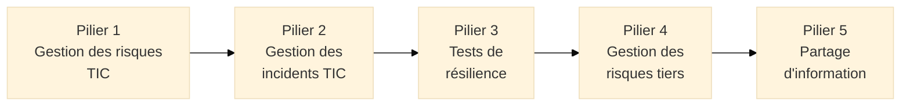
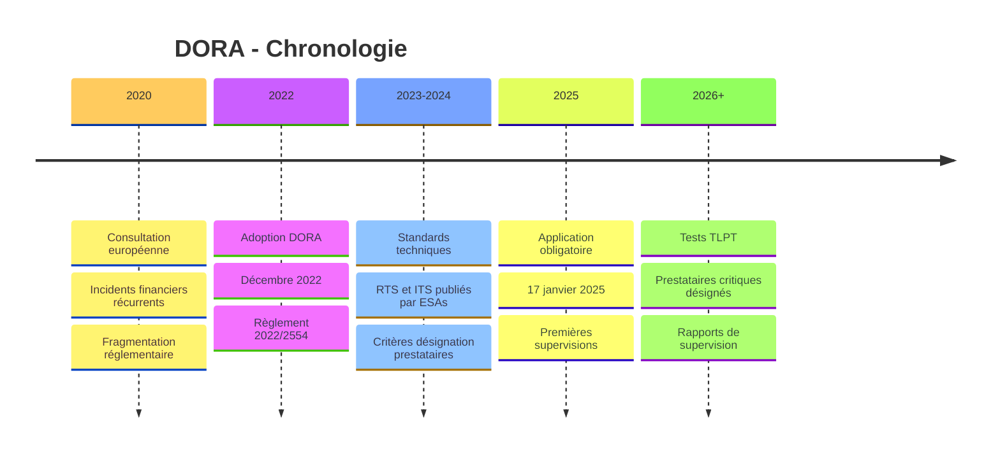
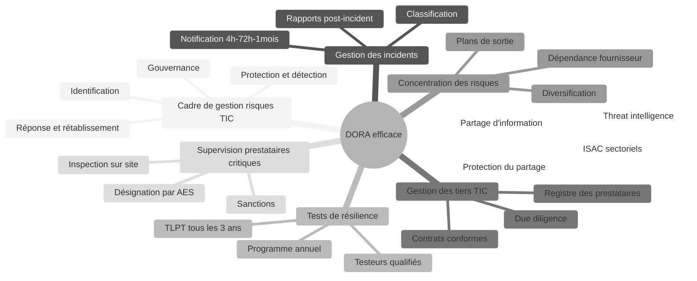
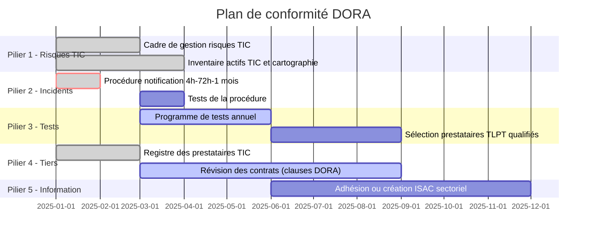

# DORA — Digital Operational Resilience Act

<div
  class="omny-meta"
  data-level="🟡 Intermédiaire & 🔴 Avancé"
  data-version="1.0"
  data-time="35-40 minutes">
</div>

## Introduction

!!! quote "Analogie pédagogique"
    _Imaginez un **réseau ferroviaire à grande vitesse**. Chaque train roule à 300 km/h, chaque gare est interconnectée, chaque signal dépend du même système central. Si ce système central tombe en panne, des milliers de passagers sont bloqués simultanément. Si un prestataire de maintenance défaille, c'est l'ensemble du réseau qui ralentit. Le réseau ne peut pas se permettre de tester ses procédures d'urgence uniquement lors de vraies pannes — il les simule régulièrement, avec des acteurs qui jouent le rôle d'attaquants, pour vérifier que les agents de gare savent quoi faire, que les aiguillages basculent correctement et que les communications de crise fonctionnent. **DORA impose cette même discipline au secteur financier numérique** : les banques, assurances, bourses et leurs prestataires technologiques doivent démontrer qu'ils résistent réellement aux pannes et aux cyberattaques — pas seulement qu'ils ont des plans sur le papier._

**DORA** (*Digital Operational Resilience Act*, Règlement (UE) 2022/2554) est le **règlement européen qui harmonise les exigences de résilience opérationnelle numérique pour le secteur financier**. En application depuis le **17 janvier 2025**, il s'applique à l'ensemble de l'écosystème financier européen et à ses prestataires TIC[^1] critiques.

DORA répond à un constat fondamental : la transformation numérique du secteur financier a créé une **dépendance systémique aux technologies de l'information** que les incidents récents — cyberattaques bancaires, pannes de prestataires cloud, défaillances d'infrastructures de paiement — ont rendue visible et dangereuse. Une défaillance technologique dans le secteur financier peut déclencher une crise systémique en quelques minutes.

!!! info "Pourquoi DORA est essentiel ?"
    DORA est le **lex specialis** du secteur financier pour la résilience numérique : là où NIS2 pose des exigences génériques de cybersécurité, DORA pose des exigences **spécifiques, plus détaillées et plus exigeantes** pour les entités financières. Une entité financière soumise à DORA n'est **pas** soumise à NIS2 pour les aspects couverts par DORA — DORA prévaut.

<br>

---

## Pour repartir des bases

### 1. Un règlement directement applicable

DORA est un **règlement européen**, directement applicable dans les 27 États membres depuis le **17 janvier 2025**, avec des standards techniques réglementaires (RTS[^2]/ITS[^3]) publiés par les Autorités Européennes de Surveillance.

### 2. Le périmètre : qui est concerné ?

DORA s'applique à une vingtaine de catégories d'entités financières :

| Catégorie | Exemples |
|-----------|----------|
| Établissements de crédit | Banques commerciales, banques d'investissement |
| Entreprises d'investissement | Courtiers, gestionnaires pour compte propre |
| Prestataires de services de paiement | Établissements de paiement, monnaie électronique |
| Compagnies d'assurance et de réassurance | Assureurs vie, non-vie, réassureurs |
| Sociétés de gestion | Gestionnaires d'actifs, OPCVM |
| Marchés réglementés | Bourses (Euronext...) |
| Contreparties centrales (CCP) | Chambres de compensation |
| Fournisseurs de services sur crypto-actifs | Exchanges crypto, custodians |
| Fournisseurs de services de financement participatif | Crowdfunding, crowdlending |

**Innovation majeure :** Les **prestataires TIC tiers critiques** (hyperscalers cloud, éditeurs de logiciels financiers, opérateurs de datacenters) sont pour la première fois soumis à une **supervision directe** par les autorités européennes.

### 3. Les 5 piliers de DORA



<br>

---

## Historique et contexte

### Incidents déclencheurs

| Année | Incident | Impact |
|-------|----------|--------|
| 2016 | Cyberattaque Bangladesh Bank (SWIFT) | 81M$ volés |
| 2017 | Panne TSB Bank (migration IT) | 1,9Md£, clients indisponibles plusieurs semaines |
| 2018 | Panne Visa Europe | Paiements impossibles plusieurs heures |
| 2020 | SolarWinds supply chain attack | Compromission de multiples institutions |
| 2021 | Panne Fastly CDN | Sites financiers majeurs inaccessibles |

Ces incidents ont révélé que le secteur financier dépendait massivement de prestataires TIC tiers sans encadrement réglementaire adapté.

### Timeline



<br>

---

## Les 7 concepts fondateurs

### Vue d'ensemble



### Les 7 concepts expliqués

!!! note "Ci-dessous les 4 premiers concepts"

=== "1️⃣ Cadre de gestion des risques TIC"

    **DORA impose un cadre de gestion des risques TIC exhaustif, documenté et approuvé par la direction.**

    Le cadre couvre l'intégralité du cycle :

    - **Stratégie** : Politique de résilience numérique approuvée par l'organe de direction
    - **Identification** : Inventaire complet des actifs TIC, cartographie des dépendances critiques
    - **Protection** : Mesures de sécurité (accès, chiffrement, DLP, segmentation réseau)
    - **Détection** : Surveillance continue des anomalies (SIEM, IDS/IPS, SOC)
    - **Réponse** : Procédures de réponse aux incidents, cellule de crise
    - **Rétablissement** : PCA/PRA avec RTO/RPO définis et testés
    - **Documentation** : Politiques formalisées, procédures opérationnelles, inventaires

    La direction (conseil d'administration, directoire) est **personnellement responsable** de l'approbation et de la supervision de ce cadre.

=== "2️⃣ Gestion et notification des incidents TIC"

    **DORA impose un processus de notification structuré en 3 temps pour les incidents majeurs.**

    ```mermaid
    ---
    config:
      theme: "base"
    ---
    flowchart LR
        DET["Détection\nincident"] --> CLASS["Classification\nmajeur ?"]
        CLASS -->|Oui| N4["Alerte précoce\n< 4 heures"]
        N4 --> N72["Notification détaillée\n< 72 heures"]
        N72 --> N30["Rapport final\n< 1 mois"]
    ```

    **Critères d'un incident majeur** :
    - Clients affectés > seuil défini par RTS
    - Indisponibilité > durée seuil
    - Perte de données > seuil
    - Impact sur la réputation, pertes financières

    Les incidents doivent également être **notifiés aux clients** affectés par les services impactés.

=== "3️⃣ Tests de résilience opérationnelle"

    **DORA impose un programme de tests réguliers incluant des tests avancés (TLPT) pour les entités critiques.**

    **Programme annuel de tests (toutes entités) :**
    - Tests de vulnérabilités (scans, audit de configuration)
    - Tests de continuité (PCA/PRA, exercices de basculement)
    - Tests de charge et de performance
    - Analyses de scénarios

    **Tests TLPT (Threat-Led Penetration Tests) — entités critiques, tous les 3 ans :**

    Les TLPT[^4] sont des tests d'intrusion avancés basés sur des scénarios d'attaque réels :
    - Réalisés par des **testeurs externes qualifiés** (liste tenue par les autorités)
    - Basés sur du **Threat Intelligence** réel sur les menaces ciblant le secteur
    - **Red team** (aveugles) ou purple team (semi-aveugles)
    - Périmètre incluant les **prestataires TIC critiques** du testeur
    - Résultats **partagés avec le superviseur**

=== "4️⃣ Gestion des risques liés aux prestataires TIC tiers"

    **DORA impose due diligence, contractualisation et surveillance continue des prestataires TIC.**

    **Due diligence avant contractualisation :**
    - Évaluation de la solidité financière et technique
    - Vérification des certifications de sécurité
    - Analyse de la concentration des risques

    **Contenu obligatoire des contrats (Article 30) :**
    - Description précise des services et SLA
    - **Localisation des données** (pays de traitement et de stockage)
    - **Droit d'audit** de l'entité financière et de l'autorité de supervision
    - **Obligation de notification** des incidents du prestataire vers l'entité
    - **Plan de continuité** du prestataire et mesures de réversibilité
    - **Clause de résiliation** pour manquement grave

    **Registre des prestataires TIC** (Article 28.9) :
    Chaque entité doit tenir un registre de tous ses prestataires TIC avec : identité, services, criticité, localisation des données, date de début et fin de contrat.

!!! note "Ci-dessous les 3 derniers concepts"

=== "5️⃣ Gestion de la concentration des risques"

    **DORA impose d'identifier et d'atténuer la dépendance excessive envers des prestataires TIC.**

    - **Identifier** les prestataires dont la défaillance serait critique
    - **Évaluer** l'impact d'une indisponibilité prolongée
    - **Diversifier** si la concentration est excessive (ne pas dépendre d'un seul hyperscaler pour tous les services critiques)
    - **Planifier la sortie** : disposer d'un plan de migration réaliste vers un prestataire alternatif

    > La concentration des risques cloud (dépendance à un seul hyperscaler) est explicitement mentionnée comme risque systémique par les autorités — les entités significatives doivent documenter leur stratégie multi-cloud ou justifier leur mono-cloud.

=== "6️⃣ Supervision directe des prestataires TIC critiques"

    **Innovation majeure de DORA : les hyperscalers cloud et prestataires TIC critiques sont supervisés directement par les AES.**

    **Désignation des prestataires TIC critiques (CTPP) :**
    Les AES (EBA, ESMA, EIOPA) désignent les prestataires dont la défaillance aurait un impact systémique (critères : nombre de clients financiers, irremplaçabilité, complexité).

    **Pouvoirs des superviseurs sur les CTPP :**
    - **Inspections sur site** (avec ou sans préavis)
    - **Demandes d'information** régulières et ad hoc
    - **Recommandations contraignantes** d'amélioration
    - **Sanctions** jusqu'à 1% du CA journalier mondial par jour de violation

    > Les premiers prestataires désignés critiques incluront vraisemblablement AWS, Microsoft Azure, Google Cloud, et quelques éditeurs de logiciels financiers majeurs.

=== "7️⃣ Partage d'information sur les cybermenaces"

    **DORA encourage — sans l'imposer — le partage de Cyber Threat Intelligence entre entités financières.**

    - Participation aux **ISAC** (Information Sharing and Analysis Centers) sectoriels financiers
    - Partage d'**indicateurs de compromission** (IOC), TTPs, informations sur les campagnes d'attaque
    - **Protection légale** : les informations partagées de bonne foi ne peuvent être utilisées contre l'entité partageuse par les superviseurs (sauf manquement délibéré)

<br>

---

## Mapping DORA ↔ ISO 27001/ISO 22301

| Pilier DORA | ISO 27001:2022 | ISO 22301:2019 | Gap principal |
|-------------|---------------|----------------|---------------|
| Cadre de gestion risques TIC | 6.1.2, 8.1, 9.1 | — | Gouvernance direction plus formelle |
| Gestion incidents | 5.24-5.27 | — | Délais notification (4h/72h/1 mois) |
| Tests de résilience | 8.8 (vulnérabilités) | 8.5 (exercices) | TLPT non couvert |
| Gestion tiers TIC | 5.19-5.22 | — | Registre DORA + clauses contractuelles spécifiques |
| Concentration risques | — | — | Non couvert par ISO |
| Supervision CTPP | — | — | Obligation externe (côté prestataire) |
| Partage threat intel | 5.7 | — | Volontaire dans ISO, encouragé dans DORA |

**Couverture ISO 27001 :** ~70% des exigences DORA sont couvertes par ISO 27001. Les 30% restants portent sur les délais de notification (plus stricts que NIS2 : **4h**), les TLPT, le registre des prestataires TIC au format DORA, et la gouvernance formelle de la direction.

<br>

---

## Articulation avec les autres réglementations

| Réglementation | Relation avec DORA |
|---------------|-------------------|
| **NIS2** | DORA prime sur NIS2 pour le secteur financier (*lex specialis*) |
| **ISO 27001** | DORA s'appuie sur ISO 27001 mais va plus loin (TLPT, registre, délais) |
| **ISO 22301** | Complémentaire pour la continuité d'activité |
| **RGPD** | Cumulatif — incidents DORA peuvent déclencher notification RGPD |
| **AI Act** | Cumulatif pour les systèmes d'IA utilisés dans le secteur financier |

<br>

---

## Mise en conformité pratique

### Plan d'action pour les entités financières



### Checklist de conformité DORA

- [ ] **Cadre de gestion des risques TIC** approuvé formellement par le conseil d'administration
- [ ] **Inventaire complet** des actifs TIC avec cartographie des dépendances
- [ ] **Procédure de notification** des incidents majeurs (4h/72h/1 mois) opérationnelle
- [ ] **Registre des prestataires TIC** complet (tous les prestataires IT)
- [ ] **Contrats révisés** avec clauses DORA obligatoires
- [ ] **Programme de tests** annuels planifié et validé
- [ ] **Plan de sortie** documenté pour les prestataires critiques
- [ ] **Analyse de concentration** des risques cloud réalisée
- [ ] **Procédures de gestion de crise** testées (exercices)
- [ ] **Formation des dirigeants** sur leurs responsabilités DORA

<br>

---

## Sanctions

| Violation | Entités financières | Prestataires TIC critiques |
|-----------|--------------------|-----------------------------|
| Violations graves (absence cadre risques TIC) | **10M€ ou 5% CA mondial** | **1% CA journalier/jour** |
| Violations moins graves | **5M€ ou 2,5% CA mondial** | — |
| Personnes physiques (dirigeants) | **1M€** | — |

<br>

---

## Conclusion

!!! quote "DORA transforme la résilience numérique de bonne pratique en obligation légale systémique."
    DORA incarne la prise de conscience que la stabilité financière européenne dépend autant de la robustesse des systèmes numériques que de la solidité des bilans bancaires. En imposant des tests de résilience réels (TLPT), en créant une supervision directe des prestataires cloud critiques, et en rendant les dirigeants personnellement responsables, DORA crée des incitations structurelles à investir réellement dans la résilience — et pas seulement à la documenter.

    La supervision directe des hyperscalers cloud est la disposition la plus révolutionnaire. Pour la première fois, AWS, Azure et Google Cloud seront inspectés par des régulateurs financiers européens, leurs pratiques de sécurité évaluées et leurs responsables convoqués. C'est une reconnaissance explicite que la résilience du secteur financier dépend de la résilience de ses prestataires — et que réguler les banques sans réguler leurs prestataires numériques est insuffisant.

    > La prochaine étape logique est d'explorer le **mapping DORA ↔ ISO 27001** et le **mapping ISO 27001 ↔ NIS2** pour identifier précisément ce qu'une organisation certifiée ISO 27001 doit compléter pour satisfaire DORA.

<br>

---

## Ressources complémentaires

### Textes officiels

- **Règlement DORA** : Règlement (UE) 2022/2554 — eur-lex.europa.eu
- **Standards techniques RTS/ITS** : Publications EBA, ESMA, EIOPA

### Autorités de supervision

- **EBA** (European Banking Authority) : eba.europa.eu
- **ESMA** (European Securities and Markets Authority) : esma.europa.eu
- **EIOPA** : eiopa.europa.eu
- **ACPR** (France, banques/assurances) : acpr.banque-france.fr
- **AMF** (France, marchés financiers) : amf-france.org

### Standards complémentaires

- **ISO/IEC 27001:2022** — SMSI
- **ISO 22301:2019** — Continuité d'activité
- **TIBER-EU** — Framework européen de base des tests TLPT


[^1]: **TIC** (*Technologies de l'Information et de la Communication*) désigne l'ensemble des technologies utilisées pour collecter, stocker, traiter et transmettre des informations numériques. Dans le contexte DORA, les risques liés aux TIC couvrent les défaillances matérielles, logicielles, réseau, ainsi que les cyberattaques.
[^2]: Les **RTS** (*Regulatory Technical Standards*, ou Normes Techniques de Réglementation) sont des textes techniques publiés par les Autorités Européennes de Surveillance (EBA, ESMA, EIOPA) qui détaillent les modalités de mise en œuvre des exigences du règlement DORA. Ils ont force contraignante une fois adoptés par la Commission européenne.
[^3]: Les **ITS** (*Implementing Technical Standards*, ou Normes Techniques d'Exécution) complètent les RTS avec des modèles, formulaires et procédures standardisés pour la mise en œuvre pratique des obligations DORA (ex : modèles de notification d'incidents, format du registre des prestataires TIC).
[^4]: Les **TLPT** (*Threat-Led Penetration Testing*) sont des tests d'intrusion avancés réalisés par des équipes de hackers éthiques qui simulent des attaques réelles basées sur des renseignements sur les menaces réelles ciblant le secteur financier. Ils diffèrent des pentests traditionnels par leur durée (plusieurs mois), leur profondeur (toute la chaîne de défense) et leur réalisme (scénarios basés sur des TTPs de groupes d'attaquants connus).

<br>

---

## Conclusion

!!! quote "Ce qu'il faut retenir"
    Les normes et référentiels ne sont pas des contraintes administratives, mais des cadres structurants. Ils garantissent que la cybersécurité s'aligne sur les objectifs métiers de l'organisation et offre une assurance raisonnable face aux risques.

> [Retour à l'index de la gouvernance →](../../index.md)
