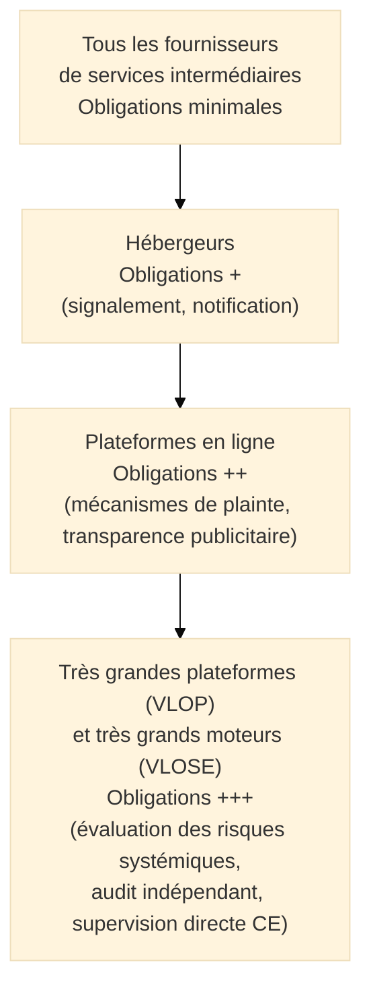
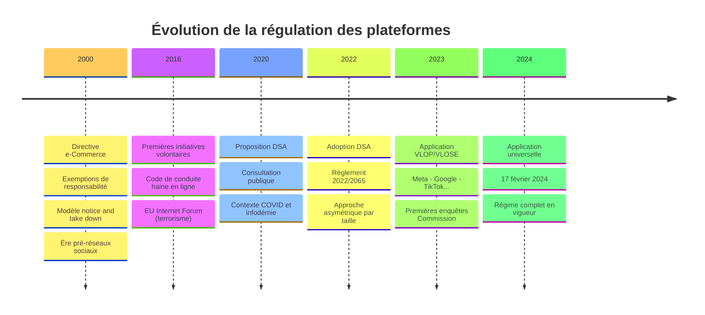
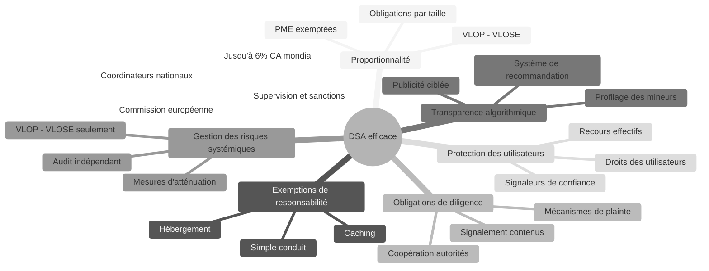

# DSA — Digital Services Act

## Introduction

!!! quote "Analogie pédagogique"
    _Imaginez un **grand centre commercial** qui accueille des milliers de marchands et des millions de visiteurs. Le gestionnaire du centre ne vend pas lui-même les produits, mais il est responsable de l'espace qu'il fournit : si un marchand vend de la contrefaçon, il doit l'expulser dès qu'on le lui signale. Si un visiteur est victime d'une arnaque, il doit exister un mécanisme de signalement. Si la disposition des rayons est conçue pour pousser les visiteurs à des achats impulsifs au détriment de leur santé financière, le gestionnaire doit en répondre. Et plus le centre commercial est grand — plus il a d'influence sur les comportements de consommation — plus ses obligations sont strictes. **Le DSA fonctionne exactement ainsi pour les plateformes numériques** : il n'interdit pas les contenus mais impose aux intermédiaires numériques des obligations proportionnées à leur taille et à leur influence sur la vie des Européens._

**Le DSA** (*Digital Services Act*, Règlement (UE) 2022/2065) est le **règlement européen encadrant les services intermédiaires en ligne**. Applicable depuis le **17 février 2024** pour toutes les entités (après une application anticipée aux très grandes plateformes depuis août 2023), il remplace la directive e-Commerce de 2000 et modernise fondamentalement les règles de responsabilité des intermédiaires numériques sur le marché intérieur européen.

Le DSA ne crée pas de responsabilité générale pour les intermédiaires sur les contenus qu'ils hébergent — il maintient les régimes d'exemption de responsabilité historiques. Mais il les conditionne à des obligations de diligence, de transparence et de réactivité face aux contenus illicites, proportionnées à la taille et à la nature de l'acteur.

!!! info "Pourquoi le DSA est essentiel ?"
    Le DSA comble un vide réglementaire de 24 ans (directive e-Commerce de 2000) dans lequel les plateformes numériques ont grandi sans obligations adaptées à leur puissance et à leurs effets sur la société. Il crée pour la première fois des **obligations asymétriques** : plus une plateforme est grande, plus ses obligations sont strictes — une logique radicalement différente du droit traditionnel qui traite tous les acteurs identiquement.

 

---

## Pour repartir des bases

### 1. Un règlement, pas une directive

Le DSA est un **règlement européen directement applicable** dans les 27 États membres sans transposition nationale. Il est entré en application progressive :

- **25 août 2023** : Application aux très grandes plateformes et moteurs de recherche (VLOP/VLOSE[^1] désignés)
- **17 février 2024** : Application à toutes les autres entités couvertes

### 2. La pyramide des obligations

Le DSA crée une **structure pyramidale** d'obligations croissantes selon la catégorie d'acteur :

_Les entités de chaque niveau supportent les obligations de tous les niveaux inférieurs et ajoutent les leurs._

### 3. Ce que le DSA ne fait pas

- Il **n'harmonise pas le droit pénal** sur les contenus illicites — ce qui est illicite reste défini par le droit national ou sectoriel
- Il **n'impose pas de surveillance générale** des contenus hébergés — les intermédiaires ne sont pas tenus de monitorer proactivement
- Il **ne remplace pas le RGPD** pour la protection des données personnelles

 

---

## Historique et contexte

### De la directive e-Commerce au DSA

 

---

## Les 7 concepts fondateurs

### Vue d'ensemble

### Les 7 concepts expliqués

!!! note "Ci-dessous les 4 premiers concepts"

=== "1️⃣ Proportionnalité et catégories d'acteurs"

    **Le DSA segmente ses obligations selon la nature et la taille des acteurs.**

    | Catégorie | Critère | Exemples | Obligations |
    |-----------|---------|----------|-------------|
    | **Simple conduit** | Transport de données | FAI, opérateurs télécom | Minimales |
    | **Caching** | Stockage temporaire | Proxies, CDN | Minimales + |
    | **Hébergeur** | Stockage à la demande | Cloud, hébergement web | Signalement + notification |
    | **Plateforme en ligne** | Diffusion publique | Marketplaces, app stores, réseaux sociaux | Mécanismes plainte + transparence |
    | **VLOP/VLOSE** | ≥ 45 millions d'utilisateurs actifs/mois en UE | Meta, Google, TikTok, Amazon | Obligations complètes + audit |

    **Exemption PME :** Les micro et petites entreprises (< 50 salariés, < 10M€ CA) sont exemptées des obligations les plus lourdes applicables aux plateformes, sauf pour les obligations de base.

=== "2️⃣ Régimes d'exemption de responsabilité"

    **Le DSA maintient les trois exemptions historiques de la directive e-Commerce.**

    Ces exemptions permettent aux intermédiaires d'éviter une responsabilité automatique pour les contenus tiers, sous conditions :

    - **Simple conduit** : Pas de responsabilité si l'intermédiaire ne modifie pas l'information et n'en est pas à l'origine
    - **Caching** : Pas de responsabilité pour le stockage temporaire automatique, si l'acteur retire promptement les informations illicites dès qu'il en a connaissance
    - **Hébergement** : Pas de responsabilité si l'hébergeur agit promptement dès qu'il a connaissance effective du caractère illicite du contenu

    !!! warning "Perte de l'exemption"
        L'exemption est **perdue** si l'hébergeur a connaissance effective du contenu illicite et ne retire pas promptement. Le DSA conditionne le maintien de l'exemption au respect des obligations de diligence (mécanismes de notification, traitement rapide).

=== "3️⃣ Obligations de diligence"

    **Le DSA crée un cadre de due diligence proportionné pour chaque catégorie d'acteur.**

    **Pour tous les hébergeurs :**
    - **Mécanisme de notification** : Permettre à tout utilisateur de signaler un contenu potentiellement illicite
    - **Traitement prompt** des notifications : Décision motivée, notification à l'auteur du signalement
    - **Communication des décisions de modération** : Notification à l'utilisateur dont le contenu est retiré, avec voies de recours

    **Pour les plateformes en ligne :**
    - **Système de plainte interne** : Traiter les contestations des décisions de modération
    - **Signaleurs de confiance**[^2] : Traiter en priorité les signalements d'entités officiellement désignées
    - **Transparence publicitaire** : Permettre à l'utilisateur de savoir pourquoi il voit une publicité
    - **Prohibition de la publicité ciblée sur les mineurs** et sur les données sensibles

=== "4️⃣ Transparence algorithmique"

    **Le DSA impose une transparence inédite sur les systèmes de recommandation et la publicité.**

    - **Systèmes de recommandation** : Les VLOP/VLOSE doivent offrir une alternative sans profilage (option "sans personnalisation")
    - **Publicité** : Accès à un référentiel public de toutes les publicités diffusées (annonceur, période, ciblage utilisé)
    - **Interdiction de la publicité ciblée** basée sur des données sensibles (santé, religion, orientation sexuelle) ou destinée aux mineurs
    - **Explication des recommandations** : L'utilisateur peut demander pourquoi tel contenu lui est recommandé

!!! note "Ci-dessous les 3 derniers concepts"

=== "5️⃣ Gestion des risques systémiques (VLOP/VLOSE)"

    **Les très grandes plateformes doivent évaluer et atténuer les risques qu'elles font peser sur la société.**

    Cette obligation — entièrement nouvelle — s'applique uniquement aux VLOP/VLOSE et constitue l'innovation majeure du DSA :

    - **Évaluation annuelle des risques systémiques** : effets négatifs sur les droits fondamentaux, le débat démocratique, la sécurité publique, la santé publique
    - **Mesures d'atténuation** : actions proportionnées pour réduire les risques identifiés
    - **Audit indépendant** : par des auditeurs accrédités (annuel)
    - **Partage de données** avec les chercheurs accrédités pour l'étude des risques systémiques

    **Exemples de risques systémiques :**
    - Amplification de la désinformation lors d'élections
    - Diffusion virale de contenus violents
    - Manipulation psychologique par des recommandations addictives
    - Exploitation des données de mineurs

=== "6️⃣ Protection des utilisateurs"

    **Le DSA crée des droits concrets pour les utilisateurs des plateformes.**

    - **Contestation des décisions de modération** : Tout utilisateur peut contester un retrait de contenu ou une suspension de compte
    - **Médiation extrajudiciaire** : Accès à des organismes de règlement alternatif des litiges certifiés
    - **Recours judiciaire** : Droit à un recours effectif devant les juridictions compétentes
    - **Transparence des conditions générales** : Rédigées en langage clair, synthèse pour les mineurs
    - **Pas de recommandations addictives par défaut** pour les mineurs : interdiction des interfaces conçues pour créer une dépendance

=== "7️⃣ Supervision et application"

    **Le DSA crée une architecture de supervision à deux niveaux.**

    - **Coordinateurs nationaux des services numériques (DSC)** : Chaque État membre désigne une autorité (ARCOM[^3] en France) compétente pour les acteurs nationaux et pour les VLOP établis sur leur territoire
    - **Commission européenne** : Supervision directe et exclusive des VLOP/VLOSE pour les obligations spécifiques à cette catégorie

    **Sanctions :**
    - Jusqu'à **6% du chiffre d'affaires annuel mondial** pour les violations du DSA
    - Jusqu'à **1% du CA** pour les informations incorrectes ou trompeuses
    - En cas de violation grave répétée des VLOP/VLOSE : **suspension temporaire** du service dans l'UE

 

---

## Articulation avec les autres réglementations

| Réglementation | Relation avec le DSA |
|---------------|---------------------|
| **RGPD** | Complémentaire — DSA encadre les usages des données pour la publicité ciblée et le profilage ; RGPD en encadre le traitement |
| **DMA** | Complémentaire — DMA régule la concurrence des gatekeepers, DSA régule les contenus et la responsabilité |
| **NIS2** | Complémentaire — NIS2 impose la cybersécurité aux plateformes classées entités importantes/essentielles |
| **AI Act** | Complémentaire — Les systèmes de recommandation des VLOP/VLOSE sont des systèmes d'IA à haut risque |
| **DORA** | Non pertinent (DORA = secteur financier) |

 

---

## Mise en conformité pratique

### Pour les plateformes en ligne (non VLOP)

- Mettre en place un **mécanisme de notification des contenus illicites**
- Créer un **système de plainte interne** contre les décisions de modération
- Constituer le **registre publicitaire** si la plateforme diffuse de la publicité
- Rédiger des **CGU claires** avec résumé compréhensible
- Établir des **procédures de traitement des signalements prioritaires** (signaleurs de confiance)

### Pour les VLOP/VLOSE

- Désigner un **point de contact** auprès des autorités
- Mener l'**évaluation annuelle des risques systémiques**
- Produire le **rapport de transparence** semestriel
- Soumettre le système de recommandation à un **audit indépendant** annuel
- Proposer une **option de recommandation sans profilage**
- Interdire toute **publicité ciblée sur les mineurs**

 

---

## Conclusion

!!! quote "Le DSA transforme les plateformes de zones de non-droit en espaces régulés."
    Le DSA incarne la conviction européenne que la taille confère une responsabilité. Une plateforme qui touche 45 millions d'Européens chaque mois n'est pas un acteur neutre — elle façonne les débats, influence les comportements et peut amplifier des phénomènes sociaux à une échelle sans précédent historique. La régulation asymétrique qu'il instaure — plus tu es grand, plus tes obligations sont strictes — rompt avec la logique traditionnelle du droit commercial et ouvre une nouvelle ère de gouvernance des espaces numériques.

    > La prochaine étape logique est d'explorer le **DMA** (Digital Markets Act) qui complète le DSA en régulant la concurrence des gatekeepers numériques, et l'**AI Act** qui encadre les systèmes d'IA utilisés par les plateformes pour leurs recommandations.

 

---

## Ressources complémentaires

- **Règlement DSA** : Règlement (UE) 2022/2065 — eur-lex.europa.eu
- **Commission européenne** : digital-strategy.ec.europa.eu
- **ARCOM** : arcom.fr (coordinateur national français)
- **Registre publicitaire** : adstransparency.google.com (exemple VLOP)

[^1]: Les **VLOP** (*Very Large Online Platforms*, ou Très Grandes Plateformes en Ligne) et **VLOSE** (*Very Large Online Search Engines*, ou Très Grands Moteurs de Recherche) sont les entités dépassant 45 millions d'utilisateurs actifs mensuels dans l'UE. Elles sont désignées par la Commission européenne et soumises aux obligations les plus strictes du DSA. Les premières désignations (2023) incluent Meta, Google, TikTok, Amazon, Apple, Booking.com et une vingtaine d'autres.
[^2]: Les **signaleurs de confiance** (*trusted flaggers*) sont des entités officiellement désignées par les coordinateurs nationaux (ARCOM en France) qui ont une expertise reconnue pour identifier les contenus illicites dans leur domaine. Leurs signalements doivent être traités en priorité par les plateformes. Exemples : associations de protection de l'enfance, organismes anti-haine en ligne, autorités de protection des consommateurs.
[^3]: L'**ARCOM** (*Autorité de Régulation de la Communication Audiovisuelle et Numérique*) est le régulateur français désigné comme coordinateur national des services numériques (DSC) au titre du DSA. Elle est issue de la fusion du CSA et de la HADOPI en 2022.