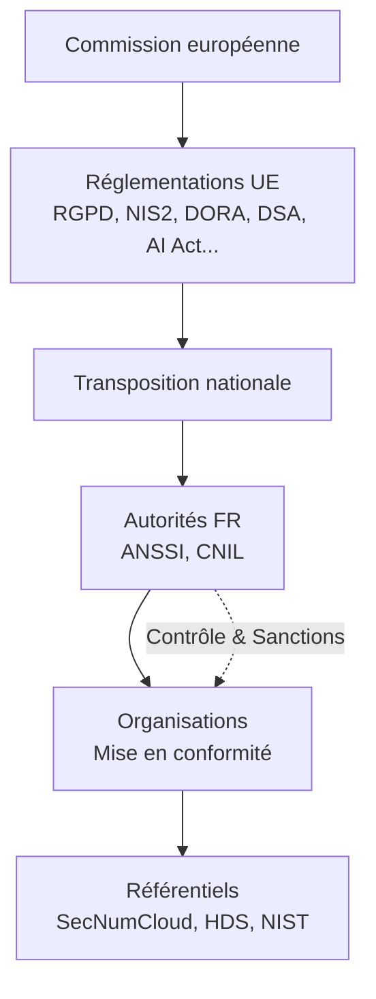

# Réglementations Euro.

## Introduction

**Les réglementations européennes** forment la **colonne vertébrale du cadre légal** en cybersécurité et en protection des données. Elles imposent des obligations **transverses applicables à tous les États membres**, structurent la gouvernance interne des organisations et conditionnent la mise en place des référentiels opérationnels.

> Elles constituent **la seconde couche** du paysage global de conformité : celle qui définit les **obligations légales contraignantes** que les autorités nationales interprètent et que les référentiels opérationnels déclinent en contrôles vérifiables.

!!! info "Pourquoi ces réglementations sont structurantes ?"
    - Elles **imposent des obligations légales** sous peine de sanctions financières lourdes
    - Elles **harmonisent** les exigences de cybersécurité à l'échelle européenne
    - Elles **conditionnent** la mise en place des référentiels opérationnels
    - Elles **structurent** la gouvernance interne des organisations (SMSI, analyse de risques)

## Les neuf textes majeurs

!!! quote "Cette section présente les neuf textes majeurs qui structurent la cybersécurité européenne"
    Les **trois réglementations fondamentales** (RGPD, NIS2, DORA) s'appliquent largement, tandis que les **six réglementations complémentaires** ciblent des secteurs ou problématiques spécifiques.

### Réglementations fondamentales

!!! note "Cette section présente les trois textes fondamentaux"

-   :lucide-lock:{ .lg .middle } **RGPD** — _Règlement Général sur la Protection des Données_

    ---
    Encadre tous les traitements de **données personnelles** au sein de l'UE avec obligations de sécurité et droits des personnes.

    **Application** : 25 mai 2018 | **Sanctions** : jusqu'à 4% du CA mondial

    [:lucide-book-open-check: Voir la fiche complète sur le RGPD](./rgpd/)

-   :lucide-network:{ .lg .middle } **NIS2** — _Network and Information Security Directive 2_

    ---
    Impose des exigences de **gouvernance**, **gestion des risques** et **continuité** pour les entités essentielles et importantes dans 18 secteurs critiques.

    **Application** : 17 octobre 2024 | **Sanctions** : jusqu'à 10M€ ou 2% du CA

    [:lucide-book-open-check: Voir la fiche complète sur NIS2](./nis2/)

-   :lucide-activity:{ .lg .middle } **DORA** — _Digital Operational Resilience Act_

    ---
    Renforce la **résilience opérationnelle numérique** du secteur financier avec supervision des prestataires TIC tiers critiques.

    **Application** : 17 janvier 2025 | **Secteur** : Financier

    [:lucide-book-open-check: Voir la fiche complète sur DORA](./dora/)

### Réglementations complémentaires

!!! note "Cette section présente les six textes complémentaires"

-   :lucide-globe:{ .lg .middle } **DSA** — _Digital Services Act_

    ---
    Régule les **plateformes numériques** pour lutter contre les contenus illicites et garantir la transparence.

    **Application** : 17 février 2024

    [:lucide-book-open-check: Voir la fiche complète sur DSA](./dsa/)

-   :lucide-store:{ .lg .middle } **DMA** — _Digital Markets Act_

    ---
    Encadre les **contrôleurs d'accès** (gatekeepers) pour garantir des marchés numériques équitables.

    **Application** : 2 mai 2023

    [:lucide-book-open-check: Voir la fiche complète sur DMA](./dma/)

-   :lucide-database:{ .lg .middle } **DGA** — _Data Governance Act_

    ---
    Favorise le **partage sécurisé des données** entre secteurs et États membres.

    **Application** : 24 septembre 2023

    [:lucide-book-open-check: Voir la fiche complète sur DGA](./dga/)

-   :lucide-share-2:{ .lg .middle } **Data Act** — _Règlement sur les données_

    ---
    Garantit l'**accès équitable aux données** générées par les objets connectés et services numériques.

    **Application** : 12 septembre 2025

    [:lucide-book-open-check: Voir la fiche complète sur Data Act](./data-act/)

-   :lucide-shield-check:{ .lg .middle } **CRA** — _Cyber Resilience Act_

    ---
    Impose des exigences de **cybersécurité pour les produits numériques** tout au long de leur cycle de vie.

    **Application** : Fin 2024 (prévisionnel)

    [:lucide-book-open-check: Voir la fiche complète sur CRA](./cra/)

-   :lucide-brain:{ .lg .middle } **AI Act** — _Règlement sur l'Intelligence Artificielle_

    ---
    Établit un cadre juridique pour l'**IA** avec approche par niveaux de risques.

    **Application** : 2 août 2026

    [:lucide-book-open-check: Voir la fiche complète sur AI Act](./ai-act/)

## Position dans l'écosystème de conformité

Les réglementations européennes définissent les obligations légales qui s'imposent à tous les États membres et conditionnent l'ensemble de l'écosystème de conformité.

_Les réglementations européennes forment la colonne vertébrale légale qui se transpose en lois nationales, s'interprète via les autorités françaises, et se décline en référentiels opérationnels pour les organisations._

## Calendrier de mise en application

| Réglementation | Application | Périmètre | Sanctions max |
|----------------|------------|-----------|---------------|
| **RGPD** | Mai 2018 | Données personnelles | **4% CA** ou 20M€ |
| **DMA** | Mai 2023 | Gatekeepers | **10% CA** |
| **DGA** | Sept. 2023 | Partage données | Variables |
| **DSA** | Fév. 2024 | Plateformes | **6% CA** |
| **NIS2** | Oct. 2024 | OSE/OI (18 secteurs) | **10M€** ou **2% CA** |
| **CRA** | Fin 2024 | Produits numériques | À définir |
| **DORA** | Jan. 2025 | Secteur financier | **2%/1% CA** ou 10M€/5M€ |
| **Data Act** | Sept. 2025 | IoT, services numériques | À définir |
| **AI Act** | Août 2026 | Systèmes IA | **7% CA** (risque inacceptable) |

!!! warning "État d'application"
    - **En vigueur** : RGPD, DMA, DGA, DSA, NIS2, DORA
    - **En préparation** : CRA, Data Act, AI Act

!!! tip "Priorisation pour les organisations"
    1. **RGPD** : Toutes organisations traitant données personnelles
    2. **NIS2** : Entités essentielles/importantes (18 secteurs)
    3. **DORA** : Secteur financier uniquement
    4. **AI Act** : Organisations développant/déployant de l'IA
    5. Autres : selon secteur d'activité spécifique

> Les fiches suivantes détaillent les obligations, le périmètre, les sanctions et les interactions de chaque réglementation avec les autres couches du cadre de conformité européen.

 