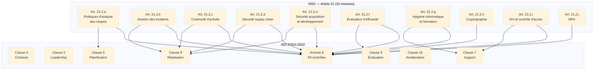
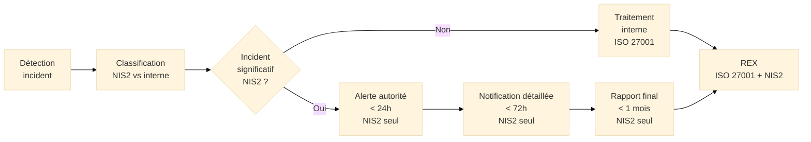
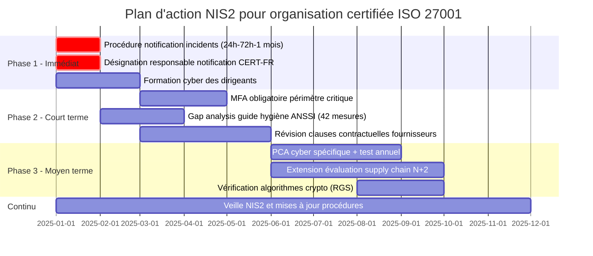

# Mapping ISO 27001/27002 ↔ NIS2

## Introduction

!!! quote "Analogie pédagogique"
    _Imaginez un **chef de chantier** qui doit construire un bâtiment répondant simultanément aux normes parasismiques locales ET à un label écologique européen. Ces deux référentiels partagent des fondations communes — la solidité de la structure, la qualité des matériaux — mais chacun ajoute des exigences spécifiques. Plutôt que de construire deux fois, le chef de chantier dresse une **table de correspondance** : chaque élément construit au titre des normes parasismiques contribue aussi au label écologique, sauf quelques exigences spécifiques à compléter. **Ce document est cette table de correspondance** pour la cybersécurité : quelles exigences NIS2 sont déjà couvertes par une certification ISO 27001 ? Quelles lacunes subsistent ? Où concentrer les efforts de mise en conformité ?_

**NIS2** (article 21) et **ISO 27001:2022** partagent le même objectif fondamental : garantir un niveau de sécurité des systèmes d'information proportionné aux risques. Mais ils ne sont pas identiques — NIS2 est une obligation légale avec ses propres délais, ses propres critères et son propre périmètre de responsabilité personnelle des dirigeants. Une organisation certifiée ISO 27001 dispose d'une longueur d'avance considérable sur NIS2 mais ne peut pas se considérer automatiquement conforme.

Ce document répond à la question que tout RSSI confronté à NIS2 se pose : **si je suis certifié ISO 27001, que me manque-t-il exactement pour satisfaire NIS2 ?**

!!! info "Comment lire ce document ?"
    Ce mapping couvre les **10 mesures de l'article 21 de NIS2** et les référence aux clauses ISO 27001:2022 et aux contrôles ISO 27002:2022 correspondants. Pour chaque mesure, l'**indice de couverture** indique dans quelle mesure ISO 27001 satisfait l'exigence NIS2, et les **lacunes identifiées** précisent ce qu'il reste à compléter.

 

---

## Vue d'ensemble de la couverture

_ISO 27001 couvre structurellement l'ensemble des 10 mesures NIS2. Mais la couverture n'est pas totale : NIS2 ajoute des exigences spécifiques sur les délais de notification, la responsabilité des dirigeants, le MFA obligatoire et la supply chain._

### Tableau de couverture synthétique

| Mesure NIS2 | Intitulé | Couverture ISO 27001 | Lacunes principales |
|-------------|----------|---------------------|---------------------|
| **Art. 21.2.a** | Politiques d'analyse des risques | **90%** | Méthode non imposée mais attendue (EBIOS RM) |
| **Art. 21.2.b** | Gestion des incidents | **75%** | Délai notification 24h non spécifié dans ISO 27001 |
| **Art. 21.2.c** | Continuité d'activité | **70%** | Tests obligatoires et PCA cyber spécifique NIS2 |
| **Art. 21.2.d** | Sécurité supply chain | **80%** | Exigences étendues sur sous-traitants de sous-traitants |
| **Art. 21.2.e** | Sécurité développement | **85%** | Gestion des vuln. plus stricte côté NIS2 |
| **Art. 21.2.f** | Évaluation d'efficacité | **90%** | Audits par tiers non obligatoires dans ISO 27001 |
| **Art. 21.2.g** | Hygiène et formation | **80%** | Hygiène ANSSI spécifique (42 mesures) |
| **Art. 21.2.h** | Cryptographie | **95%** | Recommandations ANSSI + algo quantique |
| **Art. 21.2.i** | RH et contrôle d'accès | **90%** | Peu de lacunes |
| **Art. 21.2.j** | MFA | **70%** | ISO 27001 recommande, NIS2 impose |
| **Art. 20** | Responsabilité dirigeants | **40%** | NIS2 va bien au-delà d'ISO 27001 |
| **Art. 23** | Notification d'incidents | **50%** | Délais NIS2 plus stricts (24h/72h/1 mois) |

> **Lecture :** Une organisation certifiée ISO 27001:2022 couvre en moyenne **80% des exigences opérationnelles de NIS2**. Les 20% restants portent principalement sur les délais de notification d'incidents, la responsabilité personnelle des dirigeants, l'obligation explicite de MFA et les exigences renforcées sur la supply chain.

 

---

## Mapping détaillé par mesure NIS2

### Article 21.2.a — Politiques d'analyse des risques et de sécurité des SI

**Exigence NIS2 :** Établir et mettre en œuvre des politiques couvrant l'analyse des risques et la sécurité des systèmes d'information.

| Exigence NIS2 | Clause ISO 27001:2022 | Contrôles ISO 27002:2022 |
|---------------|----------------------|--------------------------|
| Politique de sécurité formalisée | 5.2 Politique de sécurité de l'information | 5.1 Politiques de sécurité de l'information |
| Analyse de risques obligatoire | 6.1.2 Appréciation des risques | ISO 27005 (guide complémentaire) |
| Plan de traitement des risques | 6.1.3 Traitement des risques | — |
| Révision périodique | 9.3 Revue de direction | — |
| Engagement de la direction | 5.1 Leadership et engagement | — |

**Lacunes spécifiques NIS2 :**

- NIS2 fait référence implicitement à **EBIOS Risk Manager** (méthode ANSSI) dans le contexte français — ISO 27001 laisse le choix de la méthode mais les autorités nationales peuvent en exiger une spécifique
- La révision de l'analyse de risques doit être **annuelle minimum** selon NIS2 — ISO 27001 dit "à intervalles planifiés"
- NIS2 exige que la politique couvre explicitement les **scénarios de crise cyber** (ransomware, APT) — ISO 27001 est plus générique

**Couverture ISO 27001 : 90%**

### Article 21.2.b — Gestion des incidents

**Exigence NIS2 :** Mettre en place des capacités de prévention, détection et traitement des incidents de cybersécurité.

| Exigence NIS2 | Clause ISO 27001:2022 | Contrôles ISO 27002:2022 |
|---------------|----------------------|--------------------------|
| Procédures de gestion des incidents | 8.1 Réalisation opérationnelle | 5.24 Planification gestion des incidents |
| Détection des incidents | — | 8.16 Activités de surveillance |
| Classification des incidents | — | 5.25 Appréciation des événements |
| Réponse aux incidents | — | 5.26 Réponse aux incidents |
| Notification aux autorités | — | 6.8 Signalement des événements (partiel) |
| REX post-incident | 10.2 Non-conformité | 5.27 Tirer les leçons des incidents |
| Threat intelligence | — | 5.7 Renseignement sur les menaces |

**Lacunes spécifiques NIS2 :**

- **Délai de notification 24h** pour l'alerte précoce : ISO 27001 n'impose aucun délai de notification à une autorité externe
- **Rapport intermédiaire à 72h** et **rapport final à 1 mois** : entièrement spécifiques à NIS2
- **Notification aux clients affectés** : ISO 27001 ne couvre pas les obligations de communication externe lors d'incidents
- Définition formalisée d'un **incident significatif** selon les critères NIS2 (spécifiques à chaque secteur)

_Les délais de notification (24h/72h/1 mois) sont entièrement spécifiques à NIS2. ISO 27001 couvre le processus de gestion interne des incidents mais ne spécifie aucune obligation de notification externe._

**Couverture ISO 27001 : 75%**

### Article 21.2.c — Continuité des activités et gestion de crise

**Exigence NIS2 :** Garantir la continuité des opérations en cas d'incident majeur via des systèmes de secours et de reprise.

| Exigence NIS2 | Clause ISO 27001:2022 | Contrôles ISO 27002:2022 |
|---------------|----------------------|--------------------------|
| Plan de continuité d'activité cyber | 8.1 Réalisation opérationnelle | 5.29 Sécurité de l'information pendant perturbations |
| Préparation TIC à la continuité | — | 5.30 Préparation des TIC pour continuité |
| Systèmes de secours | — | 8.6 Gestion de la capacité / redondance |
| Sauvegardes régulières | — | 8.13 Sauvegarde de l'information |
| Procédures de gestion de crise | — | — |
| Tests réguliers du PCA | — | — (non imposé explicitement par ISO 27001) |

**Lacunes spécifiques NIS2 :**

- NIS2 exige des **PCA spécifiques aux incidents cyber** (distinctement des PCA généraux) — ISO 27001 couvre la continuité SI mais de manière générique
- Les **tests annuels du PCA** sont fortement attendus par NIS2 — ISO 27001 ne les impose pas explicitement
- La **gestion de crise** avec procédures de communication externe (médias, régulateurs, clients) est attendue par NIS2
- Le **RTO/RPO** doit être défini et testé — ISO 27001 ne l'impose pas formellement (ISO 22301 le fait)

**Couverture ISO 27001 : 70%**  
_Note : ISO 22301 (continuité d'activité) complète très efficacement ce gap. Voir la fiche ISO 22301 pour le mapping complet._

### Article 21.2.d — Sécurité de la chaîne d'approvisionnement

**Exigence NIS2 :** Sécuriser les relations avec les fournisseurs et prestataires ayant accès aux systèmes d'information.

| Exigence NIS2 | Clause ISO 27001:2022 | Contrôles ISO 27002:2022 |
|---------------|----------------------|--------------------------|
| Évaluation des fournisseurs | 8.1 Réalisation opérationnelle | 5.19 Sécurité dans relations fournisseurs |
| Clauses de sécurité contractuelles | — | 5.20 Traitement SI dans accords fournisseurs |
| Gestion supply chain TIC | — | 5.21 Gestion SI dans chaîne logistique TIC |
| Surveillance des fournisseurs | — | 5.22 Surveillance et gestion des changements |
| Exigences cloud | — | 5.23 Sécurité pour services cloud |
| Audit des sous-traitants | — | 5.35 Revue indépendante de la SI |

**Lacunes spécifiques NIS2 :**

- NIS2 exige d'évaluer la **sécurité des sous-traitants de sous-traitants** (chaîne étendue) — ISO 27001 ne va généralement pas à ce niveau
- **Exigences spécifiques aux fournisseurs critiques** : NIS2 anticipe des exigences sectorielles spécifiques (ex : conformité NIS2 imposée contractuellement aux fournisseurs)
- Le **registre des fournisseurs critiques** avec leur criticité est attendu par NIS2 de manière plus formalisée
- La **réversibilité** (capacité à changer de fournisseur) est une exigence NIS2 non couverte par ISO 27001

**Couverture ISO 27001 : 80%**

### Article 21.2.e — Sécurité de l'acquisition, du développement et de la maintenance

**Exigence NIS2 :** Sécuriser le cycle de vie complet des systèmes d'information, de la conception au décommissionnement.

| Exigence NIS2 | Clause ISO 27001:2022 | Contrôles ISO 27002:2022 |
|---------------|----------------------|--------------------------|
| Développement sécurisé (SDLC) | 8.1 Réalisation opérationnelle | 8.25 Cycle de vie du développement sécurisé |
| Exigences de sécurité applicatives | — | 8.26 Exigences de sécurité des applications |
| Tests de sécurité | — | 8.29 Tests de sécurité en développement |
| Développement externalisé | — | 8.30 Développement externalisé |
| Séparation des environnements | — | 8.31 Séparation des environnements |
| Gestion des changements | — | 8.32 Gestion des changements |
| Gestion des vulnérabilités | — | 8.8 Gestion des vulnérabilités techniques |
| Codage sécurisé | — | 8.28 Codage sécurisé |

**Lacunes spécifiques NIS2 :**

- NIS2 anticipe des **délais de patch** plus stricts que ce qu'ISO 27001 impose (critiques : < 72h en cas d'exploitation active)
- L'**ANSSI guide d'hygiène informatique** (42 mesures) est la référence attendue en France — plus prescriptif qu'ISO 27002
- Tests d'intrusion annuels attendus pour les entités importantes/essentielles : ISO 27001 ne les impose pas explicitement

**Couverture ISO 27001 : 85%**

### Article 21.2.f — Politiques d'évaluation de l'efficacité des mesures

**Exigence NIS2 :** Évaluer régulièrement l'efficacité des mesures de cybersécurité.

| Exigence NIS2 | Clause ISO 27001:2022 | Contrôles ISO 27002:2022 |
|---------------|----------------------|--------------------------|
| Surveillance et mesure | 9.1 Surveillance, mesure, analyse et évaluation | — |
| Audit interne | 9.2 Audit interne | — |
| Revue de direction | 9.3 Revue de direction | — |
| Tests de pénétration | — | 8.8 Gestion des vulnérabilités |
| Revue indépendante | — | 5.35 Revue indépendante de la SI |
| Amélioration continue | 10.1 et 10.2 Amélioration | — |
| Indicateurs de sécurité | 9.1 Surveillance | — |

**Lacunes spécifiques NIS2 :**

- NIS2 peut exiger des **audits par des tiers accrédités** — ISO 27001 n'impose que l'audit interne
- Le **reporting aux autorités de supervision** sur les mesures déployées est spécifique à NIS2
- Les **tests d'intrusion par des parties tierces** sont attendus pour les entités importantes (et obligatoires pour les entités essentielles sous certaines conditions)

**Couverture ISO 27001 : 90%**

### Article 21.2.g — Hygiène informatique et formations

**Exigence NIS2 :** Assurer un niveau de base d'hygiène informatique et former régulièrement le personnel.

| Exigence NIS2 | Clause ISO 27001:2022 | Contrôles ISO 27002:2022 |
|---------------|----------------------|--------------------------|
| Formation et sensibilisation | 7.2 Compétences, 7.3 Sensibilisation | 6.3 Sensibilisation, formation et compétence |
| Hygiène de base | — | 5.16 Gestion des identités |
| Mots de passe robustes | — | 5.17 Informations d'authentification |
| Antivirus/EDR | — | 8.7 Protection contre les malwares |
| Mise à jour régulières | — | 8.8 Gestion des vulnérabilités |
| Sauvegardes | — | 8.13 Sauvegarde |
| Journalisation | — | 8.15 Journalisation |

**Lacunes spécifiques NIS2 :**

- Le **guide d'hygiène informatique ANSSI** (42 mesures) est la référence attendue en France — il va plus loin qu'ISO 27002 sur certains points (ex : pas d'autocomplétion sur les formulaires sensibles, chiffrement des échanges internes)
- Les **formations obligatoires des dirigeants** (article 20 NIS2) ne sont pas couvertes par ISO 27001
- La **sensibilisation doit être prouvée** et non seulement planifiée — les attestations de complétion sont attendues

**Couverture ISO 27001 : 80%**

### Article 21.2.h — Cryptographie et chiffrement

**Exigence NIS2 :** Utiliser des solutions de chiffrement pour protéger les données sensibles.

| Exigence NIS2 | Clause ISO 27001:2022 | Contrôles ISO 27002:2022 |
|---------------|----------------------|--------------------------|
| Politique de cryptographie | — | 8.24 Utilisation de la cryptographie |
| Chiffrement au repos | — | 8.24 Utilisation de la cryptographie |
| Chiffrement en transit (TLS) | — | 8.24 Utilisation de la cryptographie |
| Gestion des clés | — | 5.17 Informations d'authentification |

**Lacunes spécifiques NIS2 :**

- Les **algorithmes recommandés par l'ANSSI** doivent être utilisés — liste spécifique (RGS[^1]) plus prescriptive qu'ISO 27002
- La **migration post-quantique**[^2] est mentionnée dans les orientations NIS2 — ISO 27002 ne la couvre pas encore
- Certains secteurs (santé, défense) ont des **exigences cryptographiques renforcées** au-delà d'ISO 27002

**Couverture ISO 27001 : 95%**

### Article 21.2.i — Sécurité des ressources humaines, contrôle d'accès et gestion des actifs

**Exigence NIS2 :** Sécuriser le cycle de vie des employés et contrôler l'accès aux systèmes et données.

| Exigence NIS2 | Clause ISO 27001:2022 | Contrôles ISO 27002:2022 |
|---------------|----------------------|--------------------------|
| Vérification avant embauche | — | 6.1 Sélection |
| Responsabilités à l'embauche | 5.3 Rôles et responsabilités | 6.2 Conditions d'emploi |
| Formation initiale sécurité | 7.3 Sensibilisation | 6.3 Sensibilisation et formation |
| Révocation des accès au départ | — | 6.5 Responsabilités après fin de contrat |
| Inventaire des actifs | — | 5.9 Inventaire des actifs |
| Classification | — | 5.12 Classification de l'information |
| Contrôle d'accès | — | 5.15 Contrôle d'accès |
| Gestion des identités | — | 5.16 Gestion des identités |
| Principe du moindre privilège | — | 8.3 Restriction de l'accès |
| Comptes à privilèges | — | 8.2 Droits d'accès privilégiés |

**Lacunes spécifiques NIS2 :**

- Peu de lacunes substantielles — ISO 27001 couvre très bien cette mesure
- NIS2 peut exiger des **habilitations de sécurité** pour les personnels critiques dans certains secteurs sensibles

**Couverture ISO 27001 : 90%**

### Article 21.2.j — Authentification multifacteur (MFA)

**Exigence NIS2 :** Déployer l'authentification multifacteur pour sécuriser l'accès aux systèmes critiques.

| Exigence NIS2 | Clause ISO 27001:2022 | Contrôles ISO 27002:2022 |
|---------------|----------------------|--------------------------|
| Authentification forte | — | 8.5 Authentification sécurisée |
| Accès à distance sécurisé | — | 6.7 Travail à distance |

**Lacunes spécifiques NIS2 :**

- **ISO 27002 recommande** le MFA — **NIS2 l'impose** pour l'accès aux systèmes critiques : la nuance recommendation/obligation est significative en audit
- NIS2 impose le MFA sur un périmètre **minimum défini** : accès administrateurs, accès distants, applications critiques — ISO 27002 laisse le choix
- Les **méthodes de MFA acceptables** selon NIS2 (et les autorités nationales) excluent généralement le SMS seul — ISO 27002 est moins prescriptif sur ce point

**Couverture ISO 27001 : 70%**

### Article 20 — Responsabilité des organes de direction

**Exigence NIS2 :** La direction doit approuver les mesures, être formée, et est personnellement responsable en cas de non-conformité.

| Exigence NIS2 | Clause ISO 27001:2022 | Contrôles ISO 27002:2022 |
|---------------|----------------------|--------------------------|
| Engagement de la direction | 5.1 Leadership et engagement | — |
| Politique approuvée par la direction | 5.2 Politique | — |
| Rôles et responsabilités | 5.3 Rôles, responsabilités et autorités | — |

**Lacunes spécifiques NIS2 :**

- La **responsabilité personnelle des dirigeants** (sanctions individuelles, interdiction d'exercer) n'a aucun équivalent dans ISO 27001
- L'**obligation de formation cyber pour les dirigeants** (article 20.2 NIS2) est absente d'ISO 27001
- NIS2 exige que la direction **certifie personnellement** la mise en œuvre des mesures — ISO 27001 exige un engagement mais pas une certification personnelle

**Couverture ISO 27001 : 40%**

### Article 23 — Notification d'incidents

**Exigence NIS2 :** Notifier les incidents significatifs à l'autorité compétente selon un calendrier strict en 3 temps.

| Exigence NIS2 | Clause ISO 27001:2022 | Contrôles ISO 27002:2022 |
|---------------|----------------------|--------------------------|
| Détection des incidents | — | 8.16 Activités de surveillance |
| Classification des incidents | — | 5.25 Appréciation des événements |
| Procédure de gestion | 8.1 Réalisation opérationnelle | 5.24 Planification gestion des incidents |

**Lacunes spécifiques NIS2 :**

- **Délai de 24h** pour l'alerte précoce : totalement absent d'ISO 27001
- **Délai de 72h** pour la notification détaillée : totalement absent d'ISO 27001
- **Délai de 1 mois** pour le rapport final : totalement absent d'ISO 27001
- **Contenu précis** des notifications (indicateurs de compromission, mesures prises) : non spécifié dans ISO 27001
- **Notification aux destinataires de services** potentiellement affectés : spécifique à NIS2

**Couverture ISO 27001 : 50%**

 

---

## Analyse des gaps par priorité

### Gaps critiques — à traiter en priorité

Ces gaps n'ont aucun équivalent dans ISO 27001 et représentent des **obligations légales NIS2 strictement nouvelles**.

-   :lucide-alert-circle:{ .lg .middle } **Délais de notification d'incidents**

    ---
    **24h / 72h / 1 mois** : aucune équivalence dans ISO 27001. Nécessite une procédure spécifique, un canal de communication avec l'ANSSI (CERT-FR), et une désignation de responsable de notification.

-   :lucide-user-check:{ .lg .middle } **Formation obligatoire des dirigeants**

    ---
    **Article 20.2 NIS2** : la direction doit suivre des formations cyber. Non couvert par ISO 27001 qui engage la direction sans exiger sa formation personnelle.

-   :lucide-shield-off:{ .lg .middle } **MFA imposé (pas seulement recommandé)**

    ---
    ISO 27002 recommande le MFA, NIS2 l'impose. La nuance est cruciale en audit NIS2 : une recommandation non appliquée est acceptable dans ISO 27001, une obligation non respectée est une non-conformité NIS2.

-   :lucide-gavel:{ .lg .middle } **Responsabilité personnelle des dirigeants**

    ---
    Amendes personnelles et interdiction d'exercer : aucun équivalent dans ISO 27001. La direction doit être informée de cette responsabilité spécifique.

### Gaps importants — à compléter

Ces gaps correspondent à des exigences couvertes partiellement par ISO 27001 mais nécessitant un renforcement.

| Gap | Effort estimé | Action recommandée |
|-----|--------------|-------------------|
| Tests PCA/PRA cyber annuels | Moyen | Planifier exercice de crise cyber annuel |
| Hygiène ANSSI (42 mesures) | Moyen | Gap analysis spécifique guide hygiène ANSSI |
| Supply chain étendue | Moyen | Étendre l'évaluation aux sous-traitants de 2e niveau |
| Algorithmes cryptographiques ANSSI (RGS) | Faible | Vérifier conformité des algorithmes utilisés |
| PCA cyber vs PCA général | Faible | Créer plan de continuité cyber spécifique |

### Gaps mineurs — à documenter

Ces gaps sont principalement de nature documentaire et ne nécessitent pas de déploiement de nouvelles mesures.

- Formalisation du **registre des incidents** avec les critères de classification NIS2
- Documentation de la **méthode d'analyse de risques** choisie (avec justification si différente d'EBIOS RM)
- Mise à jour des **clauses contractuelles fournisseurs** avec les exigences NIS2

 

---

## Plan d'action pour une organisation certifiée ISO 27001

### Phase 1 — Actions immédiates (0-3 mois)

### Checklist de conformité NIS2 pour organisation certifiée ISO 27001

**Actions à réaliser en priorité :**

- [ ] Définir la **procédure de notification** des incidents significatifs à l'ANSSI (24h/72h/1 mois)
- [ ] Désigner un **responsable de la notification** avec son suppléant et ses coordonnées CERT-FR
- [ ] Vérifier que le **MFA est obligatoire** (pas seulement recommandé) pour tous les accès critiques
- [ ] Organiser la **formation cyber de la direction générale** et en conserver la preuve
- [ ] Réaliser un **gap analysis** du guide d'hygiène informatique ANSSI vs pratiques actuelles
- [ ] Mettre à jour les **contrats fournisseurs** avec les clauses de sécurité NIS2
- [ ] Créer ou adapter le **PCA cyber** spécifique (distinct du PCA général)
- [ ] Planifier un **exercice de crise cyber annuel** avec les résultats documentés
- [ ] Vérifier la **conformité cryptographique** (RGS ANSSI) des algorithmes utilisés
- [ ] Documenter la **responsabilité personnelle des dirigeants** dans les procédures de gouvernance

 

---

## Mapping inverse : ISO 27001 → NIS2

Ce tableau permet de partir d'un constat d'audit ISO 27001 et d'identifier l'article NIS2 correspondant.

| Clause / Contrôle ISO 27001:2022 | Article NIS2 couvert | Commentaire |
|----------------------------------|---------------------|-------------|
| **5.1** Leadership et engagement | Art. 20 (partiel) | ISO 27001 engage la direction sans responsabilité personnelle |
| **5.2** Politique de sécurité | Art. 21.2.a | Couverture directe |
| **6.1.2** Appréciation des risques | Art. 21.2.a | Couverture directe |
| **6.1.3** Traitement des risques | Art. 21.2.a | Couverture directe |
| **7.2/7.3** Compétences et sensibilisation | Art. 21.2.g | Couverture directe, formation dirigeants manquante |
| **8.1** Réalisation opérationnelle | Art. 21.2.b/c/d/e | Couverture large mais délais notification manquants |
| **9.1** Surveillance et mesure | Art. 21.2.f | Couverture directe |
| **9.2** Audit interne | Art. 21.2.f | Couverture partielle (audits tiers non imposés) |
| **9.3** Revue de direction | Art. 21.2.a/f | Couverture directe |
| **10.1/10.2** Amélioration | Art. 21.2.f | Couverture directe |
| **5.7** Threat Intelligence | Art. 21.2.b | Couverture directe |
| **5.9** Inventaire actifs | Art. 21.2.i | Couverture directe |
| **5.15/5.16** Contrôle d'accès | Art. 21.2.i/j | MFA obligatoire NIS2 vs recommandé ISO |
| **5.19-5.22** Relations fournisseurs | Art. 21.2.d | Supply chain N+2 manquante |
| **5.23** Sécurité cloud | Art. 21.2.d | Couverture directe |
| **5.24-5.27** Gestion incidents | Art. 21.2.b | Délais de notification manquants |
| **5.29-5.30** Continuité | Art. 21.2.c | PCA cyber spécifique manquant |
| **8.5** Authentification sécurisée | Art. 21.2.j | Recommandation → Obligation NIS2 |
| **8.8** Vulnérabilités | Art. 21.2.e | Délais de patch plus stricts NIS2 |
| **8.13** Sauvegardes | Art. 21.2.c | Couverture directe |
| **8.15** Journalisation | Art. 21.2.g | Couverture directe |
| **8.24** Cryptographie | Art. 21.2.h | Algorithmes ANSSI à vérifier |
| **8.25-8.28** Développement sécurisé | Art. 21.2.e | Couverture directe |

 

---

## Conclusion

!!! quote "ISO 27001 est un tremplin vers NIS2, pas un ticket d'entrée."
    Une organisation certifiée ISO 27001:2022 dispose d'un avantage structurel considérable face à NIS2 : son système de management, ses politiques, ses procédures d'audit et sa culture d'amélioration continue couvrent l'essentiel des exigences opérationnelles. Mais trois zones restent entièrement hors du périmètre d'ISO 27001 et ne peuvent pas être déduites de la certification : les délais de notification d'incidents (24h/72h/1 mois), la responsabilité personnelle des dirigeants et leurs formations obligatoires, et l'obligation explicite de MFA.

    Ces trois gaps ne nécessitent pas de transformer le SMSI — ils nécessitent de l'**enrichir** avec des procédures spécifiques NIS2, de former la direction, et de vérifier que le MFA est déployé comme obligation et non comme recommandation. C'est une charge de travail significativement inférieure à celle d'une organisation partant de zéro.

    Les organisations non certifiées ISO 27001 qui veulent satisfaire NIS2 ont tout intérêt à utiliser NIS2 comme **déclencheur de certification ISO 27001** plutôt que de construire un dispositif de conformité NIS2 standalone — les synergies sont considérables et le SMSI ISO 27001 est plus robuste, plus auditable et plus durable qu'un dispositif de conformité réglementaire ponctuel.

 

---

## Ressources complémentaires

- **Guide hygiène informatique ANSSI** : 42 mesures de base — cyber.gouv.fr
- **EBIOS Risk Manager** : Méthode d'analyse de risques recommandée — cyber.gouv.fr
- **Directive NIS2** : Règlement (UE) 2022/2555 — eur-lex.europa.eu
- **ISO/IEC 27001:2022** : Exigences du SMSI
- **ISO/IEC 27002:2022** : Guide d'implémentation des contrôles
- **RGS** : Référentiel Général de Sécurité (algorithmes cryptographiques) — ANSSI

[^1]: Le **RGS** (*Référentiel Général de Sécurité*) est le cadre réglementaire français fixant les règles de sécurité applicables aux systèmes d'information des autorités administratives, notamment les algorithmes cryptographiques autorisés. Il est géré par l'ANSSI et constitue la référence française pour la conformité cryptographique dans le cadre de NIS2.
[^2]: La **migration post-quantique** désigne le processus de remplacement des algorithmes cryptographiques asymétriques actuels (RSA, ECC) par des algorithmes résistants aux ordinateurs quantiques, standardisés par le NIST en 2024 (ML-KEM, ML-DSA). NIS2 anticipe cette migration dans ses orientations sur la cryptographie, notamment pour les données à longue durée de vie.

 

---

## Conclusion

!!! quote "Ce qu'il faut retenir"
    Les normes et référentiels ne sont pas des contraintes administratives, mais des cadres structurants. Ils garantissent que la cybersécurité s'aligne sur les objectifs métiers de l'organisation et offre une assurance raisonnable face aux risques.

> [Retour à l'index de la gouvernance →](../../index.md)
