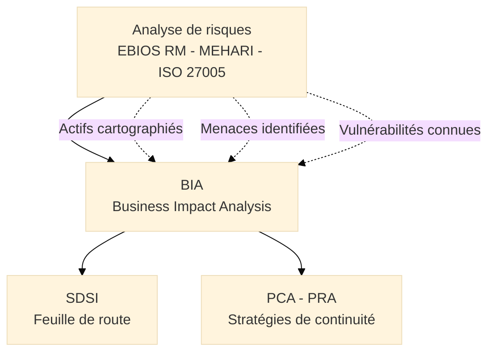
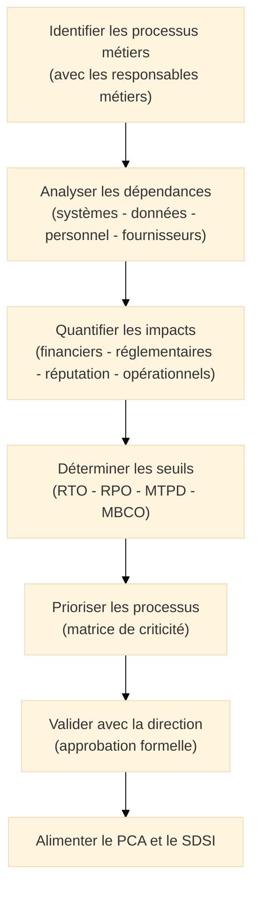
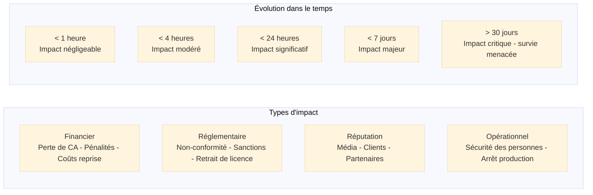
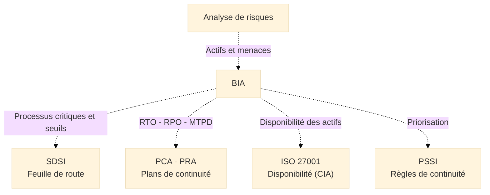
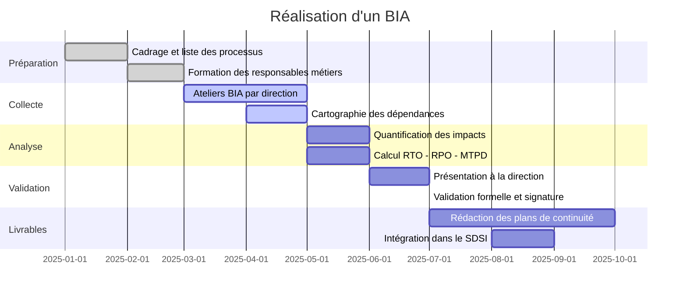

# BIA — Business Impact Analysis

## Introduction

!!! quote "Analogie pédagogique"
    _Imaginez un **chirurgien au bloc opératoire** qui doit prioriser ses interventions lors d'une catastrophe avec afflux massif de blessés. Il ne commence pas par soigner les égratignures — il trie selon la gravité et l'urgence. Un patient sans pouls passe avant celui qui a une jambe cassée. Un arrêt cardiaque nécessite une intervention en moins de 4 minutes, une fracture peut attendre 2 heures sans séquelles irréversibles. **Le BIA applique exactement ce raisonnement à l'organisation** : face à un incident majeur (ransomware, incendie, panne réseau), quels processus rétablir en priorité ? Dans quel délai ? Quelle perte de données est médicalement tolérable ? Cette hiérarchisation, établie à froid et non sous pression de crise, est ce qui distingue une organisation résiliente d'une organisation qui improvise._

**Le Business Impact Analysis (BIA)**, ou Analyse d'Impact sur l'Activité, est le processus qui évalue la **criticité des processus métier** d'une organisation et quantifie les **conséquences de leur interruption** dans le temps. Il constitue le **socle de toute stratégie de continuité d'activité** et est directement requis par la norme ISO 22301 (management de la continuité) ainsi qu'indirectement par ISO 27001 (disponibilité des actifs).

!!! info "Position du BIA dans la démarche SMSI"
    Le BIA intervient **après** l'analyse de risques — pas avant. L'analyse de risques identifie les menaces et vulnérabilités. Le BIA répond à la question suivante : si l'une de ces menaces se concrétise et interrompt un processus, **quel est l'impact business réel et à partir de quand devient-il inacceptable ?** Sans analyse de risques préalable, le BIA manque de contexte sur les scénarios à considérer. Sans BIA, les seuils de continuité sont fixés arbitrairement, déconnectés des enjeux métiers.

 

---

## Prérequis : l'analyse de risques en amont

Le BIA ne s'effectue **pas en premier**. Il nécessite que l'analyse de risques ait préalablement fourni :

- La **cartographie des actifs informationnels** (systèmes, données, applications)
- L'identification des **menaces principales** susceptibles d'interrompre les processus
- Une **première priorisation** des actifs par valeur et par exposition

_L'analyse de risques alimente le BIA. Le BIA alimente à son tour le SDSI (pour prioriser les investissements) et les plans de continuité (pour dimensionner les stratégies de reprise)._

> La distinction fondamentale : l'analyse de risques raisonne en termes de **causes** (quelle menace exploite quelle vulnérabilité ?). Le BIA raisonne en termes de **conséquences** (si ce processus s'arrête, que se passe-t-il et à partir de quand ?). Les deux perspectives sont complémentaires et nécessaires.

 

---

## Les quatre indicateurs fondamentaux

Le BIA produit quatre indicateurs pour chaque processus métier critique. Ces indicateurs dimensionnent directement les stratégies de continuité et les investissements associés.

### RTO — Recovery Time Objective

**Délai Maximum de Reprise**[^1] : durée maximale d'interruption acceptable avant que les impacts ne deviennent inacceptables pour l'organisation.

- Un RTO de **4 heures** signifie que le processus doit être rétabli dans les 4 heures suivant l'interruption
- Le RTO est déterminé par les **impacts métiers mesurés** dans le temps — pas par les capacités techniques
- Un RTO court nécessite des investissements de continuité élevés (site de repli chaud, réplication en temps réel)

### RPO — Recovery Point Objective

**Perte de Données Maximale Admissible**[^2] : quantité maximale de données qu'une organisation accepte de perdre, exprimée en durée.

- Un RPO de **1 heure** signifie que les sauvegardes doivent être effectuées au minimum toutes les heures
- Le RPO conditionne la fréquence des sauvegardes et le coût de l'infrastructure de stockage
- RPO ≠ fréquence de sauvegarde : le RPO est le **besoin**, la sauvegarde est la **solution**

### MTPD — Maximum Tolerable Period of Disruption

**Durée Maximale de Perturbation Acceptable**[^3] : au-delà de cette durée, les impacts menacent la survie même de l'organisation (insolvabilité, perte de licence, dommages irréparables à la réputation).

- Toujours supérieur au RTO — la différence représente la marge de manœuvre
- Permet de définir le périmètre des processus **vraiment critiques** vs les processus simplement importants

### MBCO — Minimum Business Continuity Objective

**Objectif Minimum de Continuité d'Activité**[^4] : niveau minimal de service que l'organisation doit maintenir pendant une interruption pour rester viable contractuellement et légalement.

- Exemple : traiter au minimum 30% du volume de commandes habituel pendant la crise
- Dimensionne les ressources minimales nécessaires en mode dégradé

| Indicateur | Question clé | Détermine |
|------------|-------------|-----------|
| **RTO** | Combien de temps peut-on s'arrêter ? | Stratégie de reprise, site de repli |
| **RPO** | Combien de données peut-on perdre ? | Fréquence des sauvegardes, réplication |
| **MTPD** | Jusqu'à quand peut-on survivre ? | Périmètre des processus vraiment critiques |
| **MBCO** | Quel niveau minimal maintenir ? | Ressources mode dégradé |

 

---

## Le processus BIA

### Vue d'ensemble

### Étape 1 — Identifier les processus métiers

Le BIA ne s'effectue **pas uniquement avec l'équipe IT**. C'est une démarche qui implique les **directions métiers** : elles seules connaissent le réel impact d'un arrêt sur leur activité.

Méthodes d'identification :

- **Ateliers avec les directions métiers** (finance, production, commercial, RH, logistique)
- **Cartographie des processus** issue du SMQ ISO 9001 si disponible
- **Entretiens individuels** avec les responsables opérationnels
- **Analyse des contrats clients** pour identifier les engagements de service (SLA)

> Un processus non identifié lors du BIA est un processus sans stratégie de continuité. Lors d'une crise réelle, il sera géré en improvisation.

### Étape 2 — Analyser les dépendances

Chaque processus métier repose sur un ensemble de ressources dont l'indisponibilité l'interrompt :

| Catégorie de dépendance | Exemples |
|------------------------|----------|
| **Systèmes IT** | ERP, CRM, messagerie, plateforme e-commerce, SGBD |
| **Données** | Base clients, catalogue produits, historiques de commandes |
| **Infrastructure** | Serveurs, réseau, alimentation électrique, climatisation |
| **Personnel** | Compétences clés, personnes en single point of failure |
| **Fournisseurs** | Sous-traitants critiques, fournisseurs de services cloud |
| **Locaux** | Site principal, accès physique, équipements |

L'analyse des dépendances révèle systématiquement des **single points of failure**[^5] non anticipés — un collaborateur qui est seul à maîtriser un processus critique, un fournisseur cloud sans alternative documentée.

### Étape 3 — Quantifier les impacts

Les impacts sont évalués sur plusieurs dimensions et dans le temps :

La quantification financière est l'argument le plus efficace auprès de la direction pour justifier les investissements de continuité :

**Exemple de quantification :**

| Processus | Impact/heure | RTO cible | Coût annuel solution continuité | ROI |
|-----------|-------------|-----------|--------------------------------|-----|
| Plateforme e-commerce | 50 000 € | 2h | 120 000 €/an | Positif dès le 3e incident |
| ERP production | 15 000 € | 4h | 60 000 €/an | Positif dès le 5e incident |
| Messagerie | 2 000 € | 48h | 8 000 €/an | Positif dès le 4e incident |

### Étape 4 — Déterminer les seuils

Les seuils (RTO, RPO, MTPD, MBCO) sont déterminés **par les métiers**, pas par l'IT. L'IT détermine ensuite **comment** les atteindre techniquement.

Le piège classique : l'IT fixe des RTO "raisonnables" techniquement (24h) sans avoir mesuré l'impact métier réel d'une interruption de 24h (qui peut s'avérer catastrophique).

### Étape 5 — Prioriser et valider

La direction valide formellement :

- La liste des processus **critiques** vs **importants** vs **secondaires**
- Les seuils RTO/RPO/MTPD acceptés pour chaque processus
- Le budget alloué aux stratégies de continuité

Cette validation est documentée et constitue un livrable auditable dans le cadre d'un SMSI ISO 27001.

 

---

## Livrables du BIA

Un BIA complet produit les documents suivants :

??? abstract "Registre des processus critiques"

    Liste priorisée des processus métiers avec leur niveau de criticité, leurs dépendances et leurs seuils de tolérance à l'interruption.

    | Processus | Criticité | RTO | RPO | MTPD | MBCO | Dépendances critiques |
    |-----------|-----------|-----|-----|------|------|-----------------------|
    | Plateforme paiement | Critique | 2h | 15 min | 48h | 100% | PSP externe, base transactions |
    | ERP production | Majeur | 4h | 1h | 7 jours | 30% | Serveurs ERP, réseau usine |
    | Messagerie | Significatif | 48h | 4h | 30 jours | 50% | Exchange, AD |
    | Intranet RH | Mineur | 7 jours | 24h | 60 jours | 0% | Serveur intranet |

??? abstract "Cartographie des dépendances"

    Représentation visuelle des liens entre processus métiers et ressources IT, humaines et fournisseurs — permettant d'identifier les single points of failure et les interdépendances critiques.

??? abstract "Rapport d'impact financier"

    Quantification des impacts dans le temps pour chaque processus critique — document clé pour obtenir le budget des stratégies de continuité auprès de la direction.

??? abstract "Rapport de validation direction"

    Document signé par la direction validant les seuils de tolérance et les priorités de continuité — preuve documentée obligatoire pour un audit ISO 22301 ou ISO 27001.

 

---

## Articulation avec les autres composantes du SMSI

- **Avec l'analyse de risques** : le BIA reçoit la cartographie des actifs et la liste des menaces. En retour, il fournit l'impact business concret de chaque risque — permettant une priorisation enrichie.
- **Avec le SDSI** : les processus critiques identifiés par le BIA et leurs seuils orientent les investissements de la feuille de route (quel système rendre hautement disponible, dans quel délai).
- **Avec la PSSI** : les règles de sauvegarde, les objectifs de disponibilité et les procédures d'urgence inscrites dans la PSSI sont directement dérivées des seuils BIA.
- **Avec ISO 27001** : le pilier Disponibilité de la triade CIA est dimensionné par les RTO/RPO du BIA.

 

---

## Mise en œuvre pratique

### Plan type de réalisation

### Écueils à éviter

!!! warning "Pièges courants"

    **Réaliser le BIA uniquement avec l'IT :**  
    _Les impacts métiers ne sont pas connus de l'IT. Un arrêt de 4 heures peut être "gérable" techniquement et catastrophique commercialement. Les responsables métiers sont les seuls interlocuteurs légitimes._

    **Fixer des RTO sans mesure d'impact :**  
    _"4 heures pour tout" n'est pas un BIA. C'est une décision arbitraire. Les seuils doivent résulter de la quantification des impacts dans le temps, validée par les métiers._

    **Oublier les dépendances fournisseurs :**  
    _Un RTO de 2h est inatteignable si le prestataire cloud qui héberge le système a un SLA de 24h. Les dépendances fournisseurs doivent être intégrées dans l'analyse._

    **Ne jamais tester les seuils :**  
    _Un RTO théorique non testé est un RTO fictif. Les exercices de continuité révèlent systématiquement des écarts entre les seuils visés et les capacités réelles._

 

---

## Conclusion

!!! quote "Le BIA est la traduction business de la sécurité."
    Le BIA est le document qui réconcilie le vocabulaire de la sécurité avec celui des directions métiers. Il transforme une liste de vulnérabilités techniques en enjeux financiers, réglementaires et réputationnels que la direction comprend et peut arbitrer. Sans BIA, le RSSI parle de "disponibilité 99,9%" — avec un BIA, il dit "une heure d'arrêt de la plateforme paiement coûte 50 000 € et génère une pénalité contractuelle de 200 000 €".

    > Le BIA alimente directement le **SDSI** qui planifie les investissements de continuité, et la **PSSI** qui en fixe les règles opérationnelles.

 

---

## Ressources complémentaires

- **ISO 22301:2019** — Systèmes de management de la continuité d'activité
- **ISO 27001:2022** — Disponibilité des actifs (triade CIA)
- **BCI Good Practice Guidelines** — Business Continuity Institute
- **ANSSI** : Guide de la continuité d'activité — cyber.gouv.fr

[^1]: Le **RTO** (*Recovery Time Objective*, ou Délai Maximum de Reprise) est la durée maximale d'interruption acceptable pour un processus donné, au-delà de laquelle les impacts deviennent inacceptables. Il est déterminé par le BIA sur la base des impacts métiers mesurés.
[^2]: Le **RPO** (*Recovery Point Objective*, ou Perte de Données Maximale Admissible) est la quantité maximale de données qu'une organisation accepte de perdre en cas d'incident, exprimée en durée. Un RPO de 1 heure implique des sauvegardes au minimum toutes les heures.
[^3]: Le **MTPD** (*Maximum Tolerable Period of Disruption*, ou Durée Maximale de Perturbation Acceptable) est la durée au-delà de laquelle les impacts d'une interruption menacent la survie de l'organisation. Il est toujours supérieur au RTO.
[^4]: Le **MBCO** (*Minimum Business Continuity Objective*, ou Objectif Minimum de Continuité d'Activité) est le niveau minimal de service que l'organisation doit maintenir pendant une interruption pour rester viable contractuellement et légalement.
[^5]: Un **single point of failure** (ou point unique de défaillance) est un composant d'un système (technique, humain ou organisationnel) dont la défaillance entraîne l'arrêt total d'un processus ou d'un service. Son identification et son élimination (par redondance ou suppléance) est l'un des principaux apports du BIA.