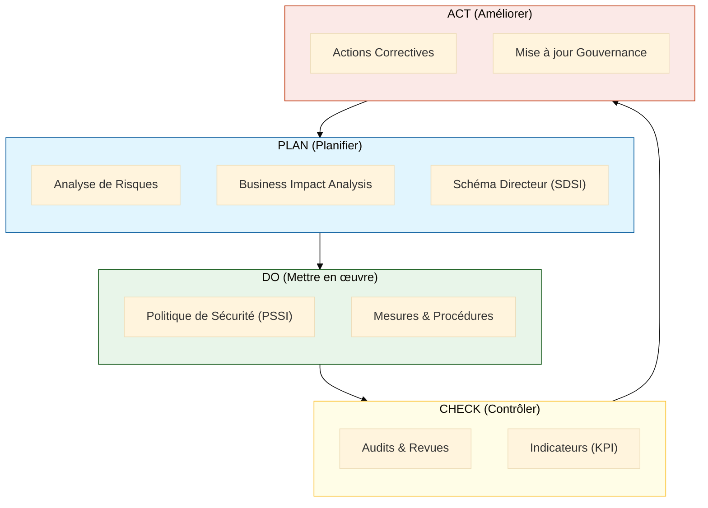

# Démarche SMSI

## Introduction

**Le Système de Management de la Sécurité de l'Information (SMSI)** constitue le **cadre organisationnel structuré** pour gérer la sécurité de l'information de manière systématique et continue. Conforme à la norme **ISO 27001**, il repose sur une approche par les risques et l'amélioration continue selon le cycle **PDCA** (Plan-Do-Check-Act).

> La démarche SMSI transforme la cybersécurité en **processus managérial maîtrisé**, démontrant aux parties prenantes (clients, partenaires, autorités) que l'organisation gère ses risques de sécurité de manière rigoureuse et auditable.

!!! info "Pourquoi mettre en place un SMSI ?"
    - **Conformité réglementaire** : Répondre aux exigences RGPD, NIS2, DORA
    - **Gestion structurée des risques** : Approche méthodique d'identification et de traitement
    - **Certification ISO 27001** : Reconnaissance internationale de la maturité cyber
    - **Gouvernance documentaire** : Cadre clair pour piloter la sécurité
    - **Amélioration continue** : Dispositif évolutif face aux menaces

## Dynamique du SMSI (PDCA)

_Le cycle PDCA garantit que la sécurité n'est pas un état figé mais un processus vivant : le **SDSI** fixe le cap (Plan), la **PSSI** impose les règles (Do), les **Audits** vérifient l'application (Check) et les **Revues** corrigent le tir (Act)._

## Les composantes du SMSI

!!! note "Cette section présente les composantes d'un SMSI"

-   :lucide-triangle-alert:{ .lg .middle } **Analyse de Risques**

    ---

    Méthodologies reconnues pour **identifier**, **évaluer** et **traiter** les risques de sécurité de l'information : **EBIOS Risk Manager**, **MEHARI**, **ISO 27005**.

    [:lucide-book-open-check: Découvrir l'analyse de risques](./risques/)

-   :lucide-activity:{ .lg .middle } **BIA** — _Business Impact Analysis_

    ---

    Analyse d'**Impact sur l'Activité** pour évaluer la criticité des processus métier et définir les objectifs de continuité (RTO, RPO).

    [:lucide-book-open-check: Voir la fiche BIA](./bia/)

-   :lucide-map:{ .lg .middle } **SDSI** — _Schéma Directeur de la Sécurité de l'Information_

    ---

    Feuille de route **stratégique** pluriannuelle alignant la sécurité de l'information sur les objectifs business et les évolutions réglementaires.

    [:lucide-book-open-check: Voir la fiche SDSI](./sdsi/)

-   :lucide-file:{ .lg .middle } **PSSI** — _Politique de Sécurité du Système d'Information_

    ---

    Document de **référence** définissant les principes, règles et responsabilités en matière de sécurité de l'information au sein de l'organisation.

    [:lucide-book-open-check: Voir la fiche PSSI](./pssi/)

## Cycle de vie du SMSI

Le SMSI suit le cycle **PDCA** d'amélioration continue :

1. **Plan** : Établir le contexte, analyser les risques, définir les objectifs
2. **Do** : Mettre en œuvre les mesures de sécurité et les processus
3. **Check** : Surveiller, mesurer, auditer l'efficacité du SMSI
4. **Act** : Améliorer continuellement sur base des constats

## Rôle dans l'écosystème GRC

La démarche SMSI constitue **le cœur opérationnel** de la gouvernance de la sécurité. Elle structure la mise en œuvre concrète des exigences réglementaires (RGPD, NIS2, DORA) et facilite l'obtention de certifications (ISO 27001) et qualifications (SecNumCloud, HDS).

> Les fiches suivantes détaillent chaque composante du SMSI avec méthodologies, livrables attendus et bonnes pratiques de mise en œuvre.

 