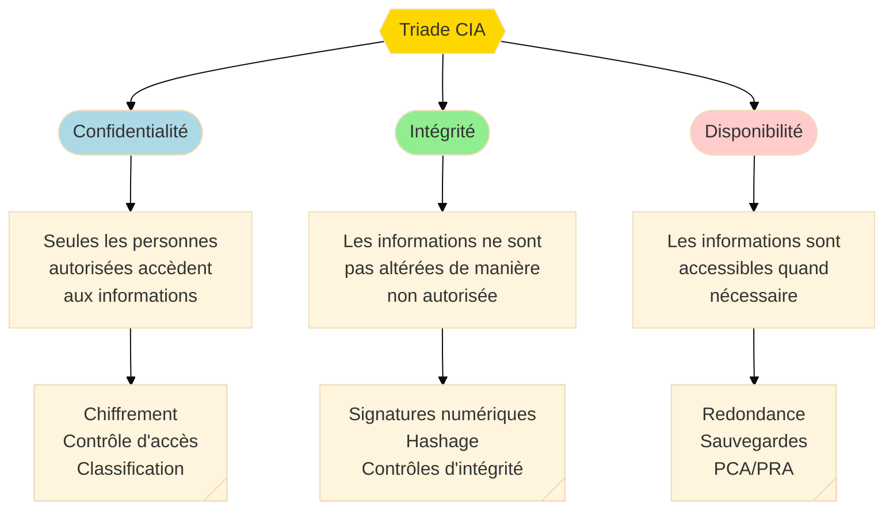
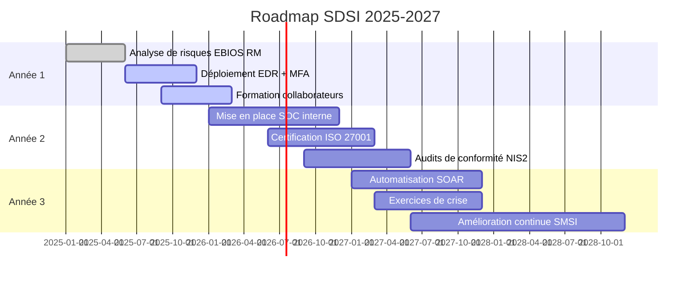
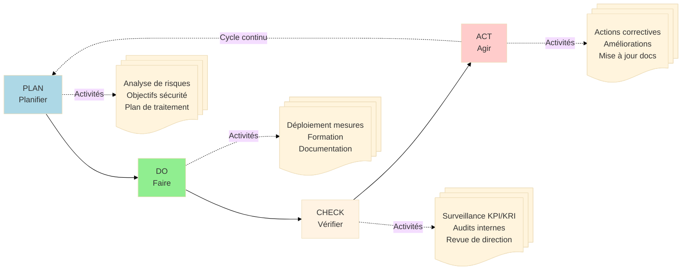
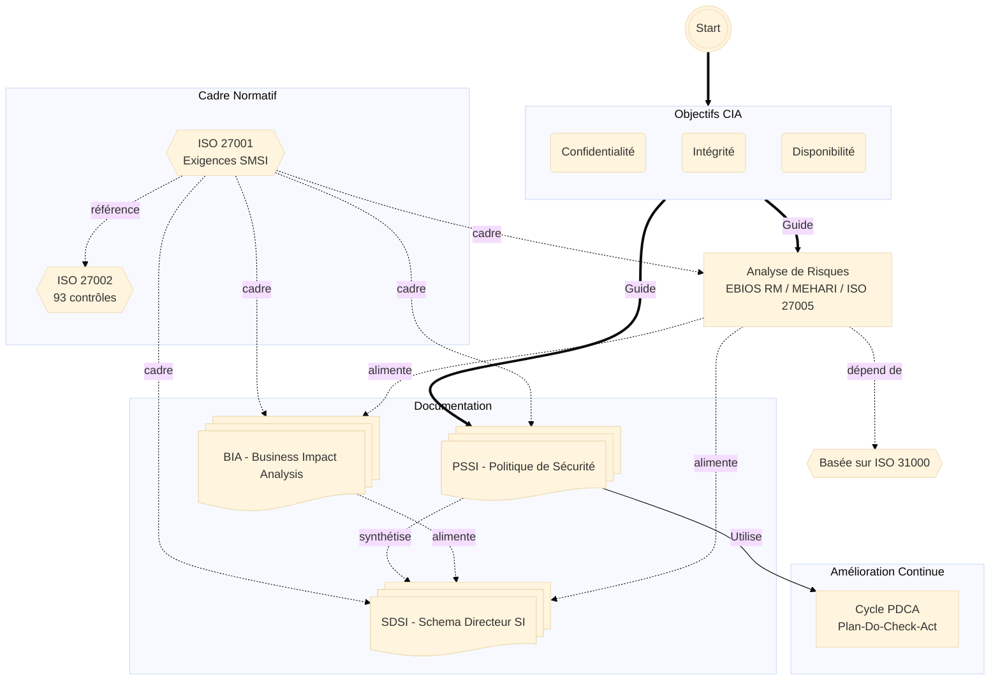
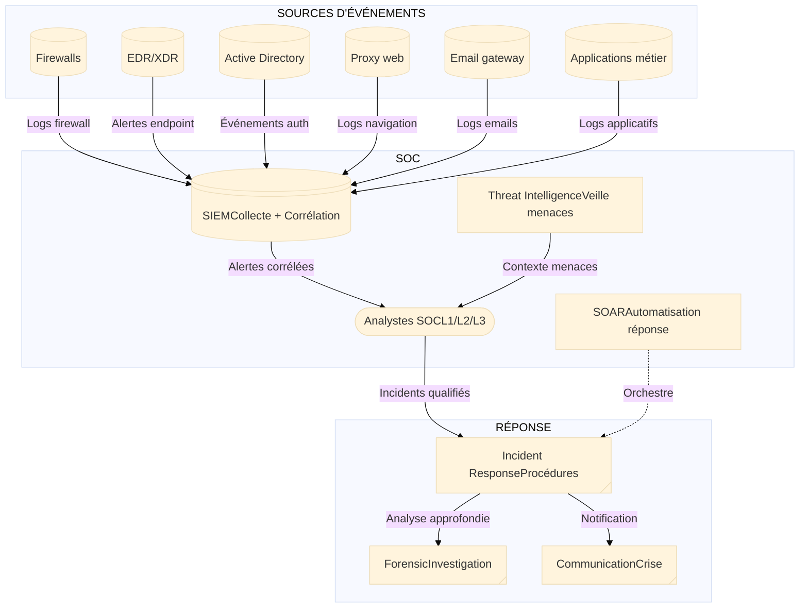
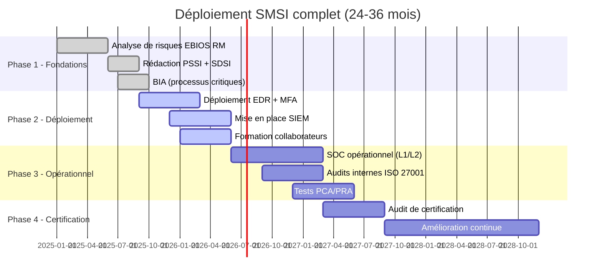

# Présentation du SMSI

## Introduction : Comprendre le SMSI

!!! quote "Analogie pédagogique"
    _Imaginez une **cathédrale médiévale** : sa construction nécessite des **fondations solides** (analyse de risques), des **plans d'architecte** (SDSI), des **règles de chantier** (PSSI), une **évaluation des points critiques** (BIA), et un **maître d'œuvre** qui coordonne l'ensemble (cycle PDCA). Le SMSI fonctionne exactement ainsi : c'est un **édifice organisationnel** structuré qui se construit pierre par pierre, selon une méthodologie rigoureuse, pour protéger durablement le patrimoine informationnel de l'organisation._

**Le Système de Management de la Sécurité de l'Information (SMSI)** constitue le **cadre organisationnel structuré** pour gérer la sécurité de l'information de manière systématique, mesurable et continue. Conforme à la norme **ISO 27001**, il transforme la cybersécurité d'une **fonction technique réactive** en **processus managérial maîtrisé**, démontrant aux parties prenantes que l'organisation gère ses risques de sécurité de manière rigoureuse, documentée et auditable.

Dans un contexte où les organisations font face à des **menaces cyber croissantes** (ransomwares, supply chain attacks, APT) et à des **obligations réglementaires renforcées** (RGPD, NIS2, DORA), le SMSI n'est plus une option mais une **nécessité stratégique**. Il permet de passer d'une approche "pompier" (réaction aux incidents) à une **gouvernance proactive** de la sécurité de l'information.

!!! info "Pourquoi un SMSI est essentiel ?"
    **Conformité réglementaire** : Répondre aux exigences RGPD, NIS2, DORA, sectorielles (HDS, SecNumCloud)
    
    **Gestion structurée des risques** :  
    _Approche méthodique d'identification, évaluation et traitement des risques_
    
    **Certification ISO 27001** :  
    _Reconnaissance internationale de la maturité cyber, avantage concurrentiel_
    
    **Gouvernance documentaire** :  
    _Cadre clair pour piloter, mesurer et améliorer la sécurité_
    
    **Résilience organisationnelle** :  
    _Capacité à maintenir l'activité face aux incidents de sécurité_
    
    **Confiance des parties prenantes** :  
    _Démonstration de la maîtrise des risques (clients, partenaires, investisseurs, autorités)_

---

## Pour repartir des bases

Si vous découvrez le SMSI, quatre points fondamentaux à retenir :

### 1. Le SMSI n'est pas un produit technique

Le SMSI n'est **pas un outil**, **pas un logiciel**, **pas un firewall**. C'est un **système de management** comparable à un système qualité (ISO 9001) ou environnemental (ISO 14001), appliqué à la sécurité de l'information.

**Ce que le SMSI inclut :**

- Une **politique de sécurité**  
  _(PSSI) définissant les principes et règles_

- Une **analyse de risques**  
  _identifiant les menaces et vulnérabilités_

- Un **plan stratégique**  
  _(SDSI) alignant la sécurité sur les objectifs business_

- Une **analyse d'impact**  
  _(BIA) évaluant la criticité des processus_

- Des **mesures de sécurité**  
  _techniques ET organisationnelles_

- Des **processus**  
  _de surveillance, d'amélioration continue (PDCA)_

- Une **documentation**  
  _traçant toutes les décisions_

### 2. Le SMSI repose sur la norme ISO 27001

**ISO 27001** est la norme internationale qui définit les **exigences** d'un SMSI certifiable. Elle impose :

- Une **approche par les risques** (analyse obligatoire)
- Le cycle **PDCA** (Plan-Do-Check-Act) d'amélioration continue
- Une **Déclaration d'Applicabilité** justifiant les 93 contrôles ISO 27002 retenus ou exclus
- Des **audits** internes et externes réguliers
- Un **engagement de la direction** formalisé

!!! note "ISO 27001 vs ISO 27002"
    **ISO 27001** : Norme **certifiable**, définit les exigences du SMSI (QUOI faire)  
    **ISO 27002** : Code de **bonnes pratiques**, catalogue de 93 mesures de sécurité (COMMENT faire)

### 3. Le SMSI nécessite une analyse de risques

**L'analyse de risques** est le **socle obligatoire** du SMSI. Elle permet d'identifier **quels actifs** protéger, **contre quelles menaces**, et **avec quelles mesures** proportionnées.

**Trois méthodologies reconnues :**

- **EBIOS Risk Manager** (ANSSI, France) : Approche exhaustive par scénarios, idéale pour OIV et secteur public
- **MEHARI** (CLUSIF, France) : Base de connaissances riche, équilibre praticité/exhaustivité
- **ISO 27005** (ISO, International) : Cadre universel aligné ISO 31000, adaptable

!!! tip "Toutes ces méthodologies dépendent d'ISO 31000"
    ISO 31000 fournit le **cadre universel** de management du risque. EBIOS RM, MEHARI et ISO 27005 sont des **déclinaisons** spécialisées pour les risques de sécurité de l'information.
    
    [:lucide-book-open-check: Voir la fiche ISO 31000](../../refs-normes/normes-iso/iso-31000/)
    
> Les 3 méthodologies sont détaillées ci-dessous dans la section :  
> **Le socle fondamental : Analyse de Risques**.

### 4. Le SMSI se construit progressivement

Un SMSI mature ne se déploie **pas en 6 mois**. C'est un **projet pluriannuel** (18 à 36 mois typiquement) qui nécessite :

- :lucide-arrow-big-right: **Phase 1** - (6-12 mois)
  
    ---
  
    Analyse de risques, conception du cadre, rédaction PSSI/SDSI

- :lucide-arrow-big-right: **Phase 2** - (6-12 mois)
  
    ---
  
    Déploiement des mesures de sécurité, formation, sensibilisation

- :lucide-arrow-big-right: **Phase 3** - (6-12 mois)
  
    ---
  
    Audits internes, amélioration continue, préparation certification

- :lucide-arrow-big-right: **Phase 4** - (continue)
  
    ---
  
    Surveillance, révision annuelle, maintien de la certification

!!! warning "Piège fréquent : vouloir tout faire trop vite"
    Beaucoup d'organisations échouent en voulant déployer un SMSI en quelques mois. Le résultat : documentation superficielle, mesures non appliquées, échec de l'audit de certification.
    
    > **Un SMSI efficace nécessite temps, ressources et engagement durable de la direction.**

---

## La boussole du SMSI : La triade CIA

La **triade CIA** (Confidentiality, Integrity, Availability) définit les **trois objectifs fondamentaux** de la sécurité de l'information.

### Les 3 piliers de la sécurité

_La triade CIA guide **toutes les décisions** de sécurité : chaque mesure doit viser à protéger la **confidentialité**, l'**intégrité** et/ou la **disponibilité** des informations._

### Détail des 3 piliers

=== "Confidentialité"

    **Garantir que seules les personnes autorisées accèdent aux informations**
    
    **Menaces** :
    - Vol de données (exfiltration par attaquant externe)
    - Fuite accidentelle (email erroné, clé USB perdue)
    - Espionnage (concurrent, État, cybercriminel)
    
    **Mesures** :
    - **Chiffrement** : Données au repos (AES-256), en transit (TLS 1.3)
    - **Contrôle d'accès** : Principe du moindre privilège, MFA obligatoire
    - **Classification** : Public, Interne, Confidentiel, Secret
    - **DLP** (Data Loss Prevention) : Détection tentatives d'exfiltration
    
    **Exemple** : Base de données clients chiffrée, accès limité aux commerciaux via MFA, logs d'accès conservés 1 an.

=== "Intégrité"

    **Garantir que les informations ne sont pas altérées de manière non autorisée**
    
    **Menaces** :
    - Modification malveillante (attaquant change des montants, supprime des logs)
    - Corruption accidentelle (bug logiciel, erreur humaine)
    - Ransomware (chiffrement des données par l'attaquant)
    
    **Mesures** :
    - **Signatures numériques** : Garantir l'origine et l'intégrité (PKI)
    - **Hashage** : Empreintes SHA-256 pour vérifier l'intégrité des fichiers
    - **Contrôles d'intégrité** : Checksums, SIEM détectant modifications anormales
    - **Sauvegardes immutables** : Write Once Read Many (WORM)
    - **Journalisation** : Logs en append-only, horodatage certifié
    
    **Exemple** : Logs SIEM signés cryptographiquement, stockés sur support WORM, impossibles à modifier rétroactivement.

=== "Disponibilité"

    **Garantir que les informations sont accessibles quand nécessaire**
    
    **Menaces** :
    - DDoS (déni de service distribué)
    - Ransomware (chiffrement des systèmes)
    - Panne matérielle (serveur, disque, réseau)
    - Catastrophe naturelle (incendie datacenter, inondation)
    
    **Mesures** :
    - **Redondance** : Serveurs en cluster, liens réseau multiples
    - **Sauvegardes** : Règle 3-2-1 (3 copies, 2 supports, 1 hors-site)
    - **PCA/PRA** : Plan de Continuité/Reprise d'Activité
    - **Protection DDoS** : Anti-DDoS, CDN (Cloudflare, Akamai)
    - **Maintenance préventive** : Remplacement matériel avant panne
    
    **Exemple** : Plateforme e-commerce hébergée sur 2 datacenters géographiquement distants, sauvegardes répliquées en temps réel, RTO 4h.

---

## Le socle fondamental : Analyse de Risques

### Pourquoi l'analyse de risques est obligatoire ?

L'analyse de risques constitue **l'exigence n°1** d'ISO 27001 (clause 6.1.2). Sans elle, **impossible** d'obtenir la certification. Elle répond à trois questions essentielles :

1. **Quels sont nos actifs critiques ?** (données, applications, infrastructures)
2. **Quelles menaces pèsent sur eux ?** (ransomware, vol de données, indisponibilité)
3. **Quelles mesures mettre en place ?** (proportionnées au niveau de risque)

!!! quote "Principe fondamental"
    L'analyse de risques permet de **justifier rationnellement** les investissements sécurité. Sans elle, la sécurité devient un **catalogue de mesures techniques** sans lien avec les enjeux business.

### Les trois méthodologies majeures

-   :lucide-shield-alert:{ .lg .middle } **EBIOS Risk Manager**

    ---
    
    **Origine** : ANSSI (France)
    
    **Approche** : 5 ateliers structurés (Socle, Sources de risque, Scénarios stratégiques, Scénarios opérationnels, Traitement)
    
    **Public** : Opérateurs d'Importance Vitale (OIV), secteur public, organisations exigeant une analyse exhaustive
    
    **Durée** : 4 à 8 mois pour une première analyse complète
    
    [:lucide-book-open-check: Voir la fiche EBIOS RM](../risques/ebios-rm/)

-   :lucide-layers:{ .lg .middle } **MEHARI**

    ---
    
    **Origine** : CLUSIF (France)
    
    **Approche** : Base de connaissances de 300+ scénarios de risque, outils d'évaluation
    
    **Public** : Entreprises privées, PME/ETI, organisations cherchant un équilibre praticité/exhaustivité
    
    **Durée** : 3 à 6 mois pour une première analyse
    
    [:lucide-book-open-check: Voir la fiche MEHARI](../risques/mehari/)

-   :lucide-globe:{ .lg .middle } **ISO 27005**

    ---
    
    **Origine** : ISO (International)
    
    **Approche** : Cadre générique aligné ISO 31000, adaptable au contexte de l'organisation
    
    **Public** : Multinationales, organisations avec contexte international, approche universelle
    
    **Durée** : Variable selon le niveau de détail choisi (2 à 6 mois)
    
    [:lucide-book-open-check: Voir la fiche ISO 27005](../risques/iso-27005/)

### Processus d'analyse de risques (générique)

Quelle que soit la méthodologie choisie, l'analyse suit ces **6 étapes fondamentales** :

??? abstract "1. Établir le contexte"

    **Définir le périmètre** de l'analyse :
    
    - Actifs dans le scope (applications, données, infrastructures)
    - Parties prenantes (internes, externes)
    - Objectifs business et contraintes réglementaires
    - Appétit au risque de l'organisation
    
    **Livrables** : Document de cadrage, cartographie des actifs, matrice d'appétit au risque

??? abstract "2. Identifier les risques"

    **Recenser les menaces et vulnérabilités** :
    
    - **Menaces** : Ransomware, phishing, DDoS, vol physique, espionnage, erreur humaine
    - **Vulnérabilités** : Failles logicielles, configurations faibles, absence de MFA, formation insuffisante
    - **Scénarios de risque** : Combinaison menace + vulnérabilité + actif
    
    **Méthodes** : Ateliers, interviews, REX incidents, veille cyber (CERT, ANSSI)
    
    **Livrables** : Registre de risques initial (100 à 300 risques identifiés typiquement)

??? abstract "3. Évaluer les risques"

    **Calculer le niveau de risque** : **Probabilité × Impact = Criticité**
    
    **Échelles courantes** :
    
    | Probabilité | Description | Fréquence estimée |
    |-------------|-------------|-------------------|
    | 1 - Rare | Circonstances exceptionnelles | < 1% par an |
    | 2 - Peu probable | Peut survenir occasionnellement | 1-10% par an |
    | 3 - Possible | Peut survenir à un moment donné | 10-50% par an |
    | 4 - Probable | Surviendra probablement | 50-90% par an |
    | 5 - Quasi-certain | Surviendra presque certainement | > 90% par an |
    
    | Impact | Financier | Réputation | Opérationnel |
    |--------|-----------|------------|--------------|
    | 1 - Négligeable | < 10k€ | Aucun | < 24h |
    | 2 - Mineur | 10-100k€ | Local | 1-7 jours |
    | 3 - Modéré | 100k-1M€ | Régional | 1-4 semaines |
    | 4 - Majeur | 1-10M€ | National | 1-3 mois |
    | 5 - Catastrophique | > 10M€ | International | > 3 mois |
    
    **Matrice de criticité** : Probabilité × Impact (matrice 5×5 courante = scores 1-25)
    
    **Livrables** : Registre de risques évalué, cartographie des risques (heatmap)

??? abstract "4. Traiter les risques"

    **Sélectionner la stratégie de traitement** pour chaque risque :
    
    **1. Réduire (Mitigation)** : Déployer des mesures de sécurité (90% des cas)
    - Exemple : Risque ransomware → EDR + sauvegardes immutables + formation anti-phishing
    
    **2. Transférer** : Assurance cyber, externalisation
    - Exemple : Risque financier majeur → Cyber-assurance couvrant jusqu'à 5M€
    
    **3. Accepter** : Risque résiduel acceptable (coût mitigation > impact)
    - Exemple : Risque de panne serveur secondaire non critique → Acceptation formalisée
    
    **4. Éviter** : Renoncer à l'activité générant le risque
    - Exemple : Stockage données sensibles dans un pays à risque → Abandon du projet
    
    **Livrables** : Plan de traitement des risques (PTR), budget sécurité justifié

??? abstract "5. Surveiller et réviser"

    **Suivi continu** de l'efficacité des mesures :
    
    - **KRI** (Key Risk Indicators) : Nombre de vulnérabilités critiques non patchées, taux de réussite phishing simulé
    - **Revue trimestrielle** : Évolution de la criticité des top 10 risks
    - **Veille** : Nouvelles menaces émergentes (CVE critiques, campagnes APT)
    - **Tests** : Pentests, audits de configuration, exercices de crise
    
    **Fréquences** : Mensuel (risques critiques), trimestriel (top risks), annuel (analyse complète)

??? abstract "6. Documenter et communiquer"

    **Traçabilité** des décisions pour les audits :
    
    - Registre de risques à jour (outil GRC ou Excel structuré)
    - Déclaration d'Applicabilité (SoA) justifiant les 93 contrôles ISO 27002
    - Rapports d'analyse pour la direction (top risks, budget, roadmap)
    - Communication aux parties prenantes (clients B2B, partenaires)

---

## Les piliers documentaires du SMSI

Une fois l'analyse de risques réalisée, elle **alimente** trois documents structurants qui forment les piliers du SMSI.

### 1. BIA — Business Impact Analysis

**Le BIA** (Analyse d'Impact sur l'Activité) évalue la **criticité des processus métier** et définit les **objectifs de continuité**.

#### Objectifs du BIA

- Identifier les **processus critiques** dont l'interruption menacerait la survie de l'organisation
- Déterminer les **seuils de tolérance** :
  - **RTO** (Recovery Time Objective) : Délai maximal acceptable d'interruption
  - **RPO** (Recovery Point Objective) : Perte de données maximale acceptable
  - **MTPD** (Maximum Tolerable Period of Disruption) : Durée maximale avant impact irréversible
- Prioriser les **investissements de continuité** (PCA/PRA)

#### Relation avec l'analyse de risques

Le BIA **complète** l'analyse de risques en se focalisant sur les **conséquences business** des incidents de sécurité :

- **Analyse de risques** : "Quelles sont les menaces ?" (vision cause)
- **BIA** : "Quel est l'impact d'une interruption ?" (vision conséquence)

**Exemple concret :**

| Processus | RTO | RPO | Impact financier | Dépendances critiques |
|-----------|-----|-----|------------------|-----------------------|
| Plateforme e-commerce | 4h | 15 min | 50k€/h | Base de données clients, gateway paiement |
| ERP production | 24h | 1h | 10k€/h | Serveurs ERP, réseau usine |
| Email collaborateurs | 48h | 4h | 2k€/h | Exchange, Active Directory |

[:lucide-book-open-check: Voir la fiche complète BIA](./bia/)

---

### 2. SDSI — Schéma Directeur de la Sécurité de l'Information

**Le SDSI** constitue la **feuille de route stratégique pluriannuelle** (3 à 5 ans) alignant la sécurité sur les objectifs business et les évolutions réglementaires.

#### Contenu du SDSI

**1. État des lieux** :
- Maturité actuelle de la sécurité (évaluation CMMI, COBIT)
- Conformité réglementaire (écarts RGPD, NIS2, DORA)
- Architecture technique (infrastructures, applications)
- Incidents passés et leçons apprises (REX)

**2. Vision cible** :
- Objectifs sécurité alignés sur la stratégie business
- Niveau de maturité visé (ex: niveau 3 CMMI d'ici 3 ans)
- Conformité réglementaire totale (RGPD, NIS2, DORA, ISO 27001)

**3. Roadmap pluriannuelle** :
- **Année 1** : Déploiement EDR, MFA généralisée, formation collaborateurs
- **Année 2** : Mise en place SOC interne, certification ISO 27001
- **Année 3** : Automatisation SOAR, exercices de crise trimestriels

**4. Budgets et ressources** :
- Investissements CAPEX (licences, matériel)
- OPEX récurrent (abonnements, prestations externes)
- Recrutements (SOC, GRC, architecte sécurité)

#### Relation avec l'analyse de risques et le BIA

- **Analyse de risques** → Identifie **les mesures prioritaires** à déployer
- **BIA** → Définit **les processus critiques** nécessitant une protection renforcée
- **SDSI** → Planifie **le déploiement dans le temps** avec budget et ressources

**Exemple de roadmap SDSI :**

_Le SDSI transforme les constats de l'analyse de risques et du BIA en **plan d'action pluriannuel** budgété et piloté._

[:lucide-book-open-check: Voir la fiche complète SDSI](./sdsi/)

---

### 3. PSSI — Politique de Sécurité du Système d'Information

**La PSSI** est le **document de référence** définissant les principes, règles et responsabilités en matière de sécurité de l'information.

#### Structure de la PSSI

**1. Principes directeurs** :
- Engagement de la direction
- Conformité aux obligations légales (RGPD, NIS2, DORA)
- Approche par les risques
- Amélioration continue (cycle PDCA)
- Sensibilisation et formation

**2. Organisation de la sécurité** :
- Rôles et responsabilités (RSSI, DPO, DSI, managers, collaborateurs)
- Comité de sécurité (composition, fréquence)
- Gestion des tiers (fournisseurs, sous-traitants)

**3. Règles de sécurité** :
- **Gestion des accès** : Authentification forte (MFA obligatoire), principe du moindre privilège
- **Protection des données** : Classification (Public, Interne, Confidentiel, Secret), chiffrement obligatoire pour données sensibles
- **Postes de travail** : Chiffrement disque, verrouillage automatique, antivirus
- **Réseau** : Segmentation, filtrage, VPN pour accès distant
- **Développement** : Secure SDLC, revue de code, tests de sécurité
- **Sauvegarde** : Règle 3-2-1, sauvegardes immutables, tests de restauration trimestriels

**4. Gestion des incidents** :
- Procédure de signalement (qui contacter, quel délai)
- Classification des incidents (P1 critique, P2 majeur, P3 mineur)
- Communication de crise (interne, externe, autorités)

**5. Sanctions** :
- Manquements aux règles de sécurité (avertissement, sanction disciplinaire)
- Traçabilité des violations

#### Relation avec le SDSI

- **SDSI** : "Où allons-nous ?" (roadmap pluriannuelle)
- **PSSI** : "Quelles sont les règles aujourd'hui ?" (document opposable)

La PSSI **synthétise** les règles découlant de l'analyse de risques et s'aligne sur la roadmap du SDSI

[:lucide-book-open-check: Voir la fiche complète PSSI](./pssi/)

---

## Le cadre normatif : ISO 27001 et ISO 27002

### ISO 27001 : Les exigences du SMSI

**ISO 27001** définit **les exigences obligatoires** pour qu'un SMSI soit certifiable. Elle structure le SMSI en **10 clauses** :

| Clause | Titre | Contenu |
|--------|-------|---------|
| **4** | Contexte de l'organisation | Périmètre du SMSI, parties prenantes, enjeux internes/externes |
| **5** | Leadership | Engagement de la direction, politique de sécurité, rôles et responsabilités |
| **6** | Planification | **Analyse de risques obligatoire**, objectifs de sécurité |
| **7** | Support | Ressources, compétences, sensibilisation, documentation |
| **8** | Fonctionnement | Mise en œuvre des mesures de sécurité, gestion des changements |
| **9** | Évaluation des performances | Surveillance, audits internes, revue de direction |
| **10** | Amélioration | Traitement des non-conformités, amélioration continue |
| **Annexe A** | Déclaration d'Applicabilité | Justification des 93 contrôles ISO 27002 retenus/exclus |

### ISO 27002 : Le catalogue de 93 contrôles

**ISO 27002** fournit un **catalogue de bonnes pratiques** organisé en **4 thèmes** et **14 domaines** :

=== "Thèmes organisationnels (37 contrôles)"

    **Domaines** :
    - Politiques de sécurité de l'information (2 contrôles)
    - Organisation de la sécurité de l'information (7 contrôles)
    - Sécurité des ressources humaines (6 contrôles)
    - Gestion des actifs (10 contrôles)
    - Contrôle d'accès (12 contrôles)

=== "Thèmes humains (8 contrôles)"

    **Domaines** :
    - Sensibilisation et formation (5 contrôles)
    - Gestion des incidents (3 contrôles)

=== "Thèmes physiques (14 contrôles)"

    **Domaines** :
    - Sécurité physique et environnementale (14 contrôles)

=== "Thèmes technologiques (34 contrôles)"

    **Domaines** :
    - Sécurité des communications (7 contrôles)
    - Acquisition, développement et maintenance des systèmes (8 contrôles)
    - Relations avec les fournisseurs (5 contrôles)
    - Gestion des incidents de sécurité de l'information (5 contrôles)
    - Aspects de la sécurité de l'information dans la gestion de la continuité d'activité (4 contrôles)
    - Conformité (5 contrôles)

!!! info "Déclaration d'Applicabilité (SoA)"
    La **Déclaration d'Applicabilité** justifie, pour chacun des 93 contrôles :
    
    - **Retenu** : Pourquoi ? (basé sur l'analyse de risques)
    - **Exclu** : Pourquoi ? (hors périmètre, non pertinent, risque accepté)
    
    **C'est le document clé de l'audit ISO 27001** : l'auditeur vérifie la cohérence entre analyse de risques, SoA et mesures déployées.

---

## Le moteur du SMSI : Le cycle PDCA

Le **cycle PDCA** (Plan-Do-Check-Act) est le **moteur d'amélioration continue** du SMSI.

###  Vue d'ensemble

_Le cycle PDCA garantit que le SMSI **évolue en permanence** pour s'adapter aux nouvelles menaces, exigences réglementaires et objectifs business._

### Détail des 4 phases

=== "PLAN — Planifier"

    **Établir le cadre du SMSI**
    
    **Activités** :
    - Réaliser l'**analyse de risques** (EBIOS RM, MEHARI, ISO 27005)
    - Définir les **objectifs de sécurité** (alignés sur les objectifs business)
    - Élaborer le **plan de traitement des risques** (PTR)
    - Rédiger la **PSSI** et le **SDSI**
    - Produire la **Déclaration d'Applicabilité** (SoA)
    
    **Livrables** :
    - Registre de risques
    - Plan de traitement des risques (PTR)
    - PSSI, SDSI, SoA
    - Budget sécurité justifié

=== "DO — Faire"

    **Mettre en œuvre les mesures de sécurité**
    
    **Activités** :
    - Déployer les **mesures techniques** (EDR, MFA, chiffrement, SIEM)
    - Déployer les **mesures organisationnelles** (procédures, rôles, comités)
    - **Former et sensibiliser** les collaborateurs (e-learning, phishing simulé)
    - **Documenter** les processus (mode opératoire, procédures)
    - Communiquer sur le SMSI (kick-off, newsletters)
    
    **Durée** : 6 à 18 mois selon l'ampleur du SMSI

=== "CHECK — Vérifier"

    **Mesurer l'efficacité du SMSI**
    
    **Activités** :
    - **Surveillance continue** : KPI (taux de disponibilité, délai de détection incidents) et KRI (vulnérabilités critiques non patchées, taux de réussite phishing)
    - **Audits internes** : Vérification de la conformité aux processus (annuel minimum)
    - **Tests techniques** : Pentests, audits de configuration, tests PCA/PRA
    - **Revue de direction** : Présentation des résultats, décisions d'amélioration (annuel ou semestriel)
    
    **Livrables** :
    - Rapports d'audit interne
    - Tableaux de bord KPI/KRI
    - Compte-rendu de revue de direction

=== "ACT — Agir"

    **Améliorer le SMSI**
    
    **Activités** :
    - Traiter les **non-conformités** identifiées lors des audits
    - Déployer les **actions correctives** (correction de failles, renforcement procédures)
    - Déployer les **actions préventives** (anticipation de nouveaux risques)
    - Mettre à jour la **documentation** (PSSI, procédures, registre de risques)
    - Réviser l'**analyse de risques** (annuellement ou après incident majeur)
    
    **Livrables** :
    - Plan d'action correctif/préventif
    - Documentation mise à jour
    - Nouvelle version du registre de risques

---

## Architecture du SMSI : Vue d'ensemble

Maintenant que tous les composants du SMSI ont été expliqués, voici une **vue d'ensemble** qui synthétise leurs interactions.

### Diagramme récapitulatif

_Le SMSI démarre avec les **objectifs de sécurité** (triade CIA : Confidentialité, Intégrité, Disponibilité), trois piliers indissociables qui orientent l'**analyse de risques**. Celle-ci, basée sur **ISO 31000**, alimente les **documents structurants** (BIA, SDSI, PSSI). Le tout est encadré par **ISO 27001/27002** et piloté via le **cycle PDCA** d'amélioration continue._

---

## Pilotage et maturité : ITIL, CMMI, COBIT

Un SMSI mature s'appuie sur des **frameworks de gouvernance IT** pour structurer les processus et évaluer la maturité.

### ITIL 4 — Gestion des services IT

**Processus ITIL pertinents pour le SMSI** :

> ITIL structure les **processus opérationnels** que le SMSI doit sécuriser :

- **Incident Management** :  
  _Gestion des incidents de sécurité (détection, classification, résolution, communication)_

- **Problem Management** :  
  _Analyse des causes racines des incidents récurrents_

- **Change Management** :  
  _Gestion sécurisée des changements (validation, tests, rollback)_

- **Configuration Management** :  
  _Inventaire des actifs IT (CMDB), gestion des configurations sécurisées_

- **Service Level Management** :  
  _SLA incluant des objectifs de sécurité (disponibilité, délai de détection)_

!!! quote "Lien avec le SMSI : ITIL structure les **processus opérationnels** que le SMSI doit sécuriser."

### CMMI — Évaluation de maturité

**CMMI** (Capability Maturity Model Integration) fournit une **échelle de maturité** en 5 niveaux :

| Niveau | Libellé | Description | Caractéristiques sécurité |
|--------|---------|-------------|---------------------------|
| **1** | Initial | Processus ad hoc, chaotiques | Pas de SMSI, réaction aux incidents en mode pompier |
| **2** | Géré | Processus répétables, gérés par projet | PSSI existe, analyse de risques basique, mesures techniques déployées |
| **3** | Défini | Processus documentés, standardisés | SMSI ISO 27001 en place, cycle PDCA, audits internes |
| **4** | Maîtrisé quantitativement | Processus mesurés (KPI/KRI) | SOC opérationnel, tableaux de bord temps réel, amélioration data-driven |
| **5** | En optimisation | Amélioration continue proactive | Threat intelligence, IA/ML pour détection, innovation sécurité |

**Objectif pour un SMSI mature** : Atteindre **niveau 3 minimum** (processus définis et documentés), viser **niveau 4** (mesure et pilotage par KPI/KRI).

### COBIT — Gouvernance et management IT

**COBIT** (Control Objectives for Information and Related Technologies) est un **framework de gouvernance IT** développé par l'ISACA.

**Structure COBIT** : 40 objectifs de gouvernance/management organisés en 5 domaines :

  - **EDM** (Evaluate, Direct, Monitor) :  
    _Gouvernance stratégique_
  - **APO** (Align, Plan, Organize) :  
    _Alignement stratégie/IT/sécurité_
  - **BAI** (Build, Acquire, Implement) :  
    _Développement sécurisé_
  - **DSS** (Deliver, Service, Support) :  
    _Opérations sécurisées_
  - **MEA** (Monitor, Evaluate, Assess) :  
    _Surveillance et conformité_

!!! quote "Lien avec le SMSI : COBIT fournit un **cadre de gouvernance** intégrant naturellement la sécurité dans la gouvernance IT globale."

---

## Le SMSI en action : SOC et réponse aux incidents

Un **SMSI mature** ne se contente pas de **documenter** la sécurité, il la **met en œuvre opérationnellement** via un **SOC** (Security Operations Center).

### Qu'est-ce qu'un SOC ?

**Le SOC** est le **centre névralgique** de la sécurité opérationnelle. Il assure la **surveillance continue**, la **détection** et la **réponse aux incidents** de sécurité 24/7.

**Missions du SOC** :

- **Surveillance** : Monitoring SIEM temps réel, corrélation d'événements
- **Détection** : Identification des signaux faibles (comportements anormaux, indicateurs de compromission)
- **Analyse** : Investigation des alertes (faux positifs vs vrais incidents)
- **Réponse** : Containment (isolation), éradication (suppression malware), recovery (restauration)
- **Amélioration** : REX incidents, tuning SIEM, threat hunting proactif

### Architecture SOC typique

_Un SOC mature collecte des événements de multiples sources, les corrèle via un SIEM, et orchestre la réponse via des analystes et des outils d'automatisation (SOAR)._

### Les 3 niveaux d'analystes SOC

| Niveau | Rôle | Responsabilités | Compétences |
|:--------:|:------:|----------------|-------------|
| **L1** | Triage | Surveiller les alertes SIEM, qualifier (vrai incident vs faux positif), escalader si nécessaire | Connaissance SIEM, procédures basiques |
| **L2** | Investigation | Analyser les incidents L1, corréler avec threat intelligence, recommander actions | Analyse logs, forensic de base, scripting |
| **L3** | Expert | Incidents complexes (APT, 0-day), threat hunting proactif, amélioration détections | Expertise technique avancée, reverse engineering |

### Lien SMSI ↔ SOC

- **SMSI** : Définit **les processus** de gestion des incidents (PSSI, procédures)
- **SOC** : **Exécute opérationnellement** ces processus 24/7

**Un SMSI sans SOC** : Documentation théorique, pas de surveillance temps réel, détection tardive des incidents

**Un SOC sans SMSI** : Opérationnel mais sans cadre de gouvernance, pas de lien avec les objectifs business, pas de cycle d'amélioration

**SMSI + SOC** : Combinaison optimale pour une sécurité **stratégique ET opérationnelle**

---

## Temporalité : Pourquoi un SMSI prend du temps

### Les 4 phases de déploiement

_Un SMSI mature nécessite **24 à 36 mois** de déploiement progressif. Vouloir tout faire en 6 mois mène à l'échec (documentation superficielle, mesures non appliquées)._

### Détail des 4 phases

**Phase 1 - Fondations (6-12 mois)** :

- Analyse de risques exhaustive (3-6 mois)
- Rédaction PSSI + SDSI (3-6 mois)
- BIA (3-4 mois)

**Phase 2 - Déploiement (6-12 mois)** :

- Déploiement technique (EDR, MFA, SIEM)
- Formation et sensibilisation collaborateurs

**Phase 3 - Opérationnel (6-12 mois)** :

- SOC opérationnel (recrutement analystes L1/L2/L3)
- Audits internes ISO 27001

**Phase 4 - Certification (6-12 mois)** :

- Audit de certification ISO 27001
- Amélioration continue

---

## Le mot de la fin

!!! quote
    Le SMSI incarne une **vérité fondamentale** : la cybersécurité ne se réduit pas à des outils techniques mais constitue un **système de management** intégrant gouvernance, processus, documentation et amélioration continue. Dans un monde où les cybermenaces évoluent exponentiellement et où les réglementations se durcissent (RGPD, NIS2, DORA), le SMSI transforme la sécurité en **levier de confiance**, de **conformité** et de **résilience organisationnelle**.
    
    Un SMSI mature repose sur **des fondations solides** : l'analyse de risques (EBIOS RM, MEHARI, ISO 27005) identifie **quoi protéger**, le BIA évalue **l'impact business**, le SDSI planifie **comment déployer**, et la PSSI définit **les règles applicables**. Le tout est piloté via le **cycle PDCA** (amélioration continue), guidé par la **triade CIA** (Confidentialité, Intégrité, Disponibilité), et mis en œuvre opérationnellement via un **SOC** assurant surveillance et réponse 24/7.
    
    La certification **ISO 27001** ne constitue pas une fin en soi mais un **jalon** validant la maturité du SMSI à un instant T. L'essentiel réside dans la **dynamique d'amélioration continue** : un SMSI vivant, qui évolue avec les menaces, les technologies et les objectifs business. Les frameworks de gouvernance IT (ITIL, CMMI, COBIT) structurent cette maturité et permettent de **mesurer** les progrès.
    
    **Déployer un SMSI prend du temps** (24 à 36 mois typiquement) car il nécessite non seulement des investissements techniques mais surtout un **changement culturel** : faire de la sécurité l'affaire de tous, intégrer le risque dans chaque décision, documenter rigoureusement les processus. Les organisations qui réussissent sont celles qui **s'engagent dans la durée**, allouent les ressources nécessaires (budget, compétences, temps), et font de la sécurité une **priorité stratégique** portée par la direction.
    
    Dans un contexte européen de plus en plus régulé, le SMSI devient le **dénominateur commun** facilitant la conformité simultanée à des exigences multiples (RGPD, NIS2, DORA, ISO 27001, SecNumCloud). Maîtriser le SMSI, c'est maîtriser la **gouvernance de la cybersécurité** dans toutes ses dimensions : stratégique, opérationnelle, documentaire et auditable.
    
    > **Un SMSI mature ne protège pas seulement les systèmes d'information : il protège la confiance, la réputation et la pérennité de l'organisation.**

---

## Ressources complémentaires

### Documents officiels ISO

- **ISO 27001:2022** — Systèmes de management de la sécurité de l'information — Exigences
- **ISO 27002:2022** — Code de bonnes pratiques pour la sécurité de l'information
- **ISO 27005:2022** — Gestion des risques liés à la sécurité de l'information

### Méthodologies d'analyse de risques

- **EBIOS Risk Manager** : [https://cyber.gouv.fr/la-methode-ebios-risk-manager](https://cyber.gouv.fr/la-methode-ebios-risk-manager)
- **MEHARI** : [https://clusif.fr/mehari/](https://clusif.fr/mehari/)
- **ISO 31000:2018** : Management du risque — Lignes directrices

### Frameworks de gouvernance IT

- **ITIL 4** : [https://www.axelos.com/certifications/itil-service-management](https://www.axelos.com/certifications/itil-service-management)
- **CMMI** : [https://cmmiinstitute.com/](https://cmmiinstitute.com/)
- **COBIT 2019** : [https://www.isaca.org/resources/cobit](https://www.isaca.org/resources/cobit)

### Réglementations européennes

- **RGPD** : Règlement (UE) 2016/679
- **Directive NIS2** : (UE) 2022/2555
- **Règlement DORA** : (UE) 2022/2554

### Organismes professionnels

- **ANSSI** : [https://cyber.gouv.fr](https://cyber.gouv.fr)
- **CLUSIF** : [https://clusif.fr](https://clusif.fr)
- **ISACA** : [https://www.isaca.org](https://www.isaca.org)
- **CEFCYS** : [https://www.cefcys.fr](https://www.cefcys.fr) (Certification RSSI)