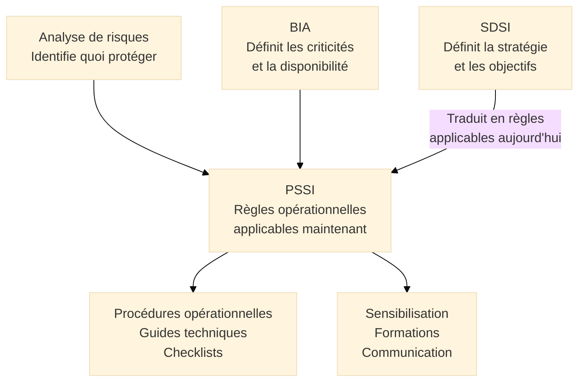
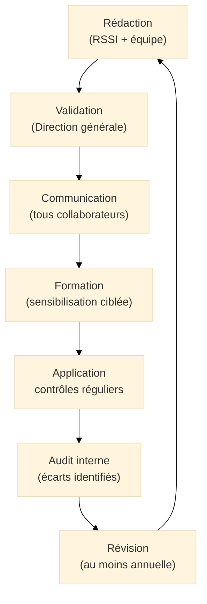

# PSSI — Politique de Sécurité du Système d'Information

## Introduction

!!! quote "Analogie pédagogique"
    _Imaginez le **règlement intérieur d'un hôpital**. Ce document ne dit pas comment l'hôpital va évoluer dans les 5 prochaines années (c'est le projet d'établissement — l'équivalent du SDSI). Il dit **ce qui s'applique aujourd'hui** : les soignants doivent se laver les mains selon le protocole défini, l'accès au bloc opératoire est réservé aux personnels habilités, les dossiers médicaux ne peuvent pas être consultés depuis des appareils personnels, tout incident doit être déclaré dans les 2 heures. Ces règles s'appliquent **dès maintenant** à **tous les collaborateurs**, sans exception, et leur non-respect entraîne des sanctions. **La PSSI est exactement ce règlement intérieur de la sécurité** : un document court, clair, opposable, qui traduit les objectifs stratégiques du SDSI en règles concrètes applicables par chaque personne qui touche au système d'information de l'organisation._

**La Politique de Sécurité du Système d'Information (PSSI)** est le **document de référence opérationnel** du SMSI. Elle définit les principes directeurs, les règles de sécurité et les responsabilités qui s'appliquent à l'ensemble de l'organisation — collaborateurs, sous-traitants, prestataires. Elle est exigée explicitement par la clause 5.2 d'ISO 27001 et constitue l'un des premiers documents demandés lors d'un audit de certification.

!!! info "Position de la PSSI dans la démarche SMSI"
    La PSSI est produite **après** l'analyse de risques et le BIA, et **en cohérence avec** le SDSI. Elle ne peut pas être rédigée avant d'avoir identifié les risques (elle ne saurait pas quoi protéger) ni avant d'avoir défini la feuille de route (elle ne pourrait pas promettre des règles que l'organisation n'a pas les moyens d'appliquer). Elle est le **reflet opérationnel du SDSI** : là où le SDSI planifie, la PSSI impose.

 

---

## La PSSI dans la chaîne du SMSI

**Ce que la PSSI reçoit :**

- De l'**analyse de risques** : les actifs à protéger et les menaces à contrer
- Du **BIA** : les exigences de disponibilité et les processus critiques
- Du **SDSI** : les objectifs stratégiques traduits en règles immédiatement applicables

**Ce que la PSSI produit :**

- Des **règles opposables** à tous les acteurs du système d'information
- Le cadre de référence des **procédures opérationnelles** détaillées
- Le support des **programmes de sensibilisation**

 

---

## PSSI vs SDSI : la distinction fondamentale

Cette distinction est critique et souvent mal comprise en pratique.

| Dimension | SDSI | PSSI |
|-----------|------|------|
| **Question centrale** | Où allons-nous ? | Quelles règles s'appliquent aujourd'hui ? |
| **Horizon temporel** | 3 à 5 ans | Immédiat (mise à jour continue) |
| **Audience principale** | Direction générale, comité de direction | Tous les collaborateurs et prestataires |
| **Ton** | Stratégique, prévisionnel | Normatif, opposable |
| **Contenu** | Roadmap, budget, objectifs de maturité | Règles, responsabilités, sanctions |
| **Fréquence de révision** | Annuelle (revue SMSI) | À chaque changement significatif + annuel |
| **Validation** | Comité de direction | Direction générale (signature obligatoire) |

!!! warning "La PSSI ne doit promettre que ce qu'elle peut tenir"
    Une PSSI qui impose des règles que l'organisation n'a pas les moyens d'appliquer est pire qu'une PSSI inexistante. Elle crée des non-conformités structurelles et érode la crédibilité du dispositif de sécurité. La PSSI doit être **cohérente avec le SDSI** : elle ne peut imposer le MFA généralisé que si le SDSI planifie son déploiement et que les outils nécessaires sont disponibles.

 

---

## Structure d'une PSSI

### Composantes obligatoires selon ISO 27001

La clause 5.2 d'ISO 27001 impose que la politique de sécurité :

- Soit **documentée**
- Soit **communiquée** au sein de l'organisation
- Soit **disponible** pour les parties intéressées
- Contienne un **engagement d'amélioration continue**
- Fournisse un **cadre pour établir les objectifs** de sécurité

### Les 6 chapitres fondamentaux

??? abstract "1. Préambule et engagement de la direction"

    **Contenu :**

    - Déclaration d'engagement de la direction générale (signée nominativement)
    - Objectifs de la PSSI et périmètre d'application
    - Référence aux textes légaux et réglementaires applicables (RGPD, NIS2, DORA)
    - Date d'entrée en vigueur et version du document

    **Pourquoi c'est critique :**  
    La signature de la direction générale (pas du RSSI) confère à la PSSI son autorité. Un auditeur ISO 27001 qui ne trouve pas cette signature soulève systématiquement un écart.

    **Exemple de formulation :**  
    _"La direction générale de [Organisation] s'engage à mettre en œuvre, maintenir et améliorer continuellement un Système de Management de la Sécurité de l'Information conforme à la norme ISO 27001:2022, à allouer les ressources nécessaires à cet objectif, et à intégrer la sécurité de l'information dans toutes les décisions stratégiques et opérationnelles."_

??? abstract "2. Organisation de la sécurité"

    **Contenu :**

    - **Rôles et responsabilités** : RSSI, DPO[^1], DSI, propriétaires d'actifs, tous collaborateurs
    - **Structure de gouvernance** : composition et fréquence du comité de sécurité
    - **Gestion des tiers** : obligations des sous-traitants, prestataires, visiteurs
    - **Séparation des tâches** : qui peut faire quoi, incompatibilités de fonctions

    **Exemple de tableau de responsabilités :**

    | Rôle | Responsabilités sécurité |
    |------|--------------------------|
    | Direction générale | Approuver la PSSI, allouer les ressources, arbitrer les risques majeurs |
    | RSSI | Concevoir, piloter et améliorer le SMSI |
    | DSI | Mettre en œuvre les mesures techniques, gérer les incidents |
    | DPO | Conformité RGPD, gestion des droits des personnes |
    | Managers | Faire respecter la PSSI dans leur équipe, déclarer les incidents |
    | Collaborateurs | Respecter les règles, déclarer les incidents et anomalies |
    | Prestataires | Respecter les règles contractualisées, signer l'accord de confidentialité |

??? abstract "3. Règles de sécurité"

    **C'est le cœur opérationnel de la PSSI.** Les règles sont classées par domaine, formulées de manière univoque (pas de "devrait" — que des "doit" et "ne doit pas").

    **Domaine : Gestion des accès et des identités**

    - L'authentification multifacteur (MFA) est **obligatoire** pour l'accès à tout système hébergeant des données à caractère personnel ou des données classifiées Confidentiel
    - Les mots de passe doivent respecter les critères définis dans la procédure [REF] : minimum 12 caractères, combinaison lettres/chiffres/caractères spéciaux
    - Tout compte utilisateur inactif depuis 90 jours est automatiquement désactivé
    - Les droits d'accès sont accordés selon le **principe du moindre privilège**[^2] et révisés tous les 6 mois

    **Domaine : Protection des données et classification**

    - Toute donnée produite ou traitée par l'organisation doit être classifiée selon le schéma : **Public / Interne / Confidentiel / Secret**
    - Les données classifiées Confidentiel et Secret doivent être chiffrées au repos et en transit
    - Le transfert de données Confidentielles vers des supports amovibles est interdit sans autorisation préalable du RSSI

    **Domaine : Postes de travail et appareils**

    - Tout poste de travail doit disposer d'un agent EDR[^3] à jour
    - Le chiffrement intégral du disque est obligatoire sur tous les postes et appareils mobiles professionnels
    - Le verrouillage automatique s'active après 5 minutes d'inactivité
    - L'installation de logiciels non référencés par la DSI est interdite

    **Domaine : Réseau et accès distants**

    - Tout accès au système d'information depuis l'extérieur s'effectue exclusivement via le VPN[^4] approuvé par la DSI
    - L'utilisation de réseaux WiFi publics pour accéder aux systèmes internes est interdite sans VPN actif
    - La connexion d'équipements personnels (BYOD) au réseau interne est soumise à validation par la DSI

    **Domaine : Sauvegardes**

    - Les données critiques identifiées dans le BIA sont sauvegardées selon la règle 3-2-1[^5]
    - Les sauvegardes sont testées en restauration complète au minimum une fois par trimestre
    - Les sauvegardes de niveau critique sont stockées sur support air-gappé[^6]

    **Domaine : Développement et applications**

    - Tout développement suit les pratiques de développement sécurisé définies dans la procédure SDLC[^7]
    - Les données de production ne sont jamais utilisées en environnement de développement ou de test sans pseudonymisation préalable
    - Tout code accédant à des données sensibles fait l'objet d'une revue de sécurité avant mise en production

??? abstract "4. Gestion des incidents de sécurité"

    **Contenu :**

    - **Définition d'un incident** : tout événement susceptible d'affecter la confidentialité, l'intégrité ou la disponibilité des actifs
    - **Canal de signalement** : adresse dédiée, numéro d'astreinte, outil ITSM
    - **Classification des incidents** : P1 (critique), P2 (majeur), P3 (significatif), P4 (mineur)
    - **Délai de signalement** : tout incident doit être déclaré dans les **2 heures** de sa détection
    - **Responsabilité** : tout collaborateur qui détecte ou soupçonne un incident doit le déclarer — l'absence de déclaration est une faute

    **Points critiques :**
    - La déclaration protège le collaborateur — pas la dissimulation
    - Les incidents RGPD (violation de données personnelles) ont un délai de notification réglementaire de 72h à l'autorité de contrôle — la déclaration interne doit permettre de respecter ce délai
    - Tout incident fait l'objet d'un REX[^8] documenté

??? abstract "5. Conformité et sanctions"

    **Contenu :**

    - **Textes de référence** : liste des lois, réglementations et normes que la PSSI contribue à respecter
    - **Audits et contrôles** : droit de contrôle de la DSI et du RSSI, fréquence des audits internes
    - **Sanctions** : les manquements à la PSSI constituent des fautes professionnelles susceptibles de sanctions disciplinaires, sans préjudice des suites pénales éventuelles

    !!! warning "Point juridique"
        La PSSI doit être compatible avec le droit du travail applicable. La mention des sanctions doit être validée par le service RH et, selon la taille de l'organisation, avoir fait l'objet d'une consultation des instances représentatives du personnel.

??? abstract "6. Gestion documentaire"

    **Contenu :**

    - Propriétaire du document (généralement le RSSI)
    - Historique des versions (numéro, date, auteur, nature des modifications)
    - Processus de révision (déclencheurs, validation, communication)
    - Liste de diffusion (qui doit avoir lu et signé)

 

---

## Cycle de vie de la PSSI

### Déclencheurs de révision

La PSSI doit être révisée au minimum **annuellement** (lors de la revue de direction SMSI) et lors de tout changement significatif :

- Nouvel incident de sécurité majeur
- Nouvelle obligation réglementaire (entrée en vigueur NIS2, DORA, etc.)
- Changement architectural majeur (migration cloud, fusion-acquisition)
- Résultat d'un audit révélant des lacunes dans les règles
- Modification du périmètre du SMSI

### Communication et appropriation

Une PSSI non lue est une PSSI inutile. Les obligations de communication :

- **Remise et signature** : tout collaborateur signe la PSSI à l'embauche et à chaque révision majeure
- **Formation** : les nouvelles règles font l'objet d'une sensibilisation ciblée (pas uniquement un e-mail)
- **Accessibilité** : la PSSI est disponible en permanence (intranet, SharePoint) dans sa version en vigueur
- **Prestataires** : les obligations PSSI applicables aux tiers sont incluses dans les contrats

 

---

## Ce que la PSSI n'est pas

La PSSI est souvent confondue avec d'autres documents. Ces confusions génèrent des PSSI soit trop volumineuses (illisibles) soit trop vagues (inapplicables).

| Ce que la PSSI N'est PAS | Ce que c'est à la place |
|--------------------------|------------------------|
| Un catalogue de 200 procédures techniques | Les procédures techniques sont des documents liés, référencés par la PSSI |
| Le SDSI | Le SDSI planifie, la PSSI réglemente |
| La Déclaration d'Applicabilité | La DdA liste les contrôles ISO 27002 — la PSSI les traduit en règles |
| Un rapport de pentest | Le rapport documente les vulnérabilités, la PSSI fixe les règles de prévention |
| Un guide de sensibilisation | La sensibilisation est un outil pour diffuser la PSSI, pas son contenu |

> **Une PSSI efficace se lit en 10 à 20 pages maximum.** Au-delà, elle ne sera pas lue. Les détails techniques appartiennent aux procédures opérationnelles qui y sont annexées ou référencées.

 

---

## Écueils à éviter

!!! warning "Pièges courants"

    **PSSI copiée d'une autre organisation :**  
    _Une PSSI générique non adaptée au contexte de l'organisation ne reflète pas les risques réels identifiés par l'analyse de risques. Elle contient des règles inapplicables et oublie des règles nécessaires._

    **PSSI rédigée uniquement par le RSSI :**  
    _La PSSI engage toute l'organisation. Sa rédaction doit impliquer la direction générale (engagement), les RH (sanctions), les métiers (règles applicables) et les représentants du personnel si applicable._

    **Règles non applicables faute d'outils :**  
    _Interdire les clés USB si aucun DLP n'est en place pour détecter les violations et aucune sensibilisation n'a été faite revient à créer une règle mort-née. La PSSI doit être cohérente avec les capacités opérationnelles réelles._

    **Absence de mise à jour :**  
    _Une PSSI v1.0 de 2021 encore en vigueur en 2025 ne couvre pas le télétravail généralisé, le cloud souverain, les nouvelles obligations NIS2 et les menaces ransomware actuelles._

 

---

## Conclusion

!!! quote "La PSSI est le contrat de confiance entre l'organisation et ses actifs informationnels."
    La PSSI matérialise l'engagement de l'organisation envers la sécurité de l'information. Elle n'est pas une formalité administrative — c'est le document sur lequel repose la responsabilité de chaque acteur en cas d'incident. En cas de violation de données, l'autorité de contrôle vérifiera que l'organisation disposait d'une politique de sécurité, qu'elle était à jour, qu'elle avait été communiquée et qu'elle était effectivement appliquée.

    La PSSI est à la fois le **reflet fidèle du SDSI** (ce qu'elle planifie en règles applicables aujourd'hui) et l'**expression concrète de l'analyse de risques** (les règles qui protègent les actifs contre les menaces identifiées). Sans ces deux fondements, elle n'est qu'un document de forme sans substance réelle.

    > La PSSI donne naissance aux **procédures opérationnelles** qui en détaillent la mise en œuvre technique, et au **programme de sensibilisation** qui en assure l'appropriation par tous les collaborateurs.

 

---

## Ressources complémentaires

- **ISO 27001:2022** — Clause 5.2 (Politique)
- **ANSSI** — Guide d'élaboration d'une PSSI (cyber.gouv.fr)
- **CNIL** — Référentiel de sécurité des données personnelles
- **ENISA** — Information Security Policy Guidelines

[^1]: Le **DPO** (*Data Protection Officer*, ou Délégué à la Protection des Données) est le responsable de la conformité au RGPD au sein de l'organisation. Sa désignation est obligatoire pour certaines catégories d'organisations (autorités publiques, organismes traitant des données sensibles à grande échelle). Il coopère avec le RSSI sur les aspects sécurité des traitements de données personnelles.
[^2]: Le **principe du moindre privilège** est un principe de sécurité fondamental qui consiste à n'accorder à chaque utilisateur, processus ou système que les droits strictement nécessaires à l'exécution de ses fonctions légitimes — ni plus. Il limite l'impact d'une compromission en réduisant la surface accessible à un attaquant qui aurait obtenu un accès.
[^3]: Un **EDR** (*Endpoint Detection and Response*) est un outil de sécurité qui surveille en permanence les endpoints (postes de travail, serveurs, appareils mobiles) pour détecter les comportements malveillants et permettre une réponse rapide aux incidents. Il va au-delà de l'antivirus traditionnel en analysant les comportements et non uniquement les signatures.
[^4]: Un **VPN** (*Virtual Private Network*, ou Réseau Privé Virtuel) crée un tunnel chiffré entre le poste de l'utilisateur et le réseau de l'organisation, garantissant la confidentialité et l'intégrité des communications même sur des réseaux publics non sécurisés.
[^5]: La **règle 3-2-1** est la règle d'or des sauvegardes : conserver **3** copies des données, sur **2** supports différents (disque, bande, cloud), dont **1** copie stockée hors site (off-site). Elle garantit la disponibilité des données même en cas de sinistre majeur sur le site principal.
[^6]: Un système **air-gappé** est un système physiquement isolé de tout réseau, public comme privé. Les sauvegardes air-gappées ne sont pas accessibles depuis le réseau et sont donc immunisées contre les attaques ransomware qui ciblent les sauvegardes connectées.
[^7]: Le **SDLC sécurisé** (*Secure Software Development Lifecycle*) est l'intégration de pratiques de sécurité à chaque étape du développement logiciel : analyse des exigences de sécurité, conception sécurisée, revue de code, tests de sécurité (SAST/DAST), déploiement et surveillance. Il vise à corriger les vulnérabilités le plus tôt possible dans le cycle — phase la moins coûteuse.
[^8]: Un **REX** (*Retour d'Expérience*) est un processus structuré d'analyse post-incident qui identifie les causes racines, documente ce qui a fonctionné et ce qui a failli, et produit des recommandations pour améliorer les processus et prévenir la récurrence.

 

---

## Conclusion

!!! quote "Ce qu'il faut retenir"
    Le SMSI (Système de Management de la Sécurité de l'Information) est le moteur de l'amélioration continue en cybersécurité. Il transforme une approche réactive en une stratégie proactive, mesurable et alignée avec la direction.

> [Retour à l'index du SMSI →](../index.md)
