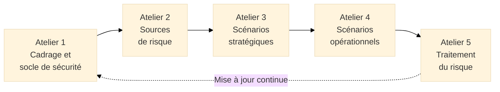

# EBIOS Risk Manager

<div
  class="omny-meta"
  data-level="🟡 Intermédiaire & 🔴 Avancé"
  data-version="1.0"
  data-time="30-35 minutes">
</div>

## Introduction

!!! quote "Analogie pédagogique"
    _Imaginez un **officier de renseignement** chargé de protéger une ambassade. Il ne commence pas par installer des barbelés partout au hasard. Il commence par répondre à des questions précises : qui pourrait vouloir attaquer cette ambassade ? Quel est leur niveau de sophistication ? Quelles sont leurs motivations — espionnage, attentat, déstabilisation politique ? Pour chacun de ces acteurs, quel chemin d'attaque emprunteraient-ils pour atteindre leur objectif ? À partir de cette analyse, il déploie des mesures ciblées : blindage des véhicules contre les voitures piégées, procédures de vérification des visiteurs contre l'infiltration humaine, chiffrement des communications contre l'interception électronique. **EBIOS Risk Manager fonctionne exactement ainsi** : avant de déployer une seule mesure de sécurité, elle demande "qui nous attaque, comment, et avec quelle capacité ?" — et dimensionne les réponses en conséquence._

**EBIOS Risk Manager (EBIOS RM)** est la méthode de gestion des risques cyber publiée et maintenue par l'**ANSSI**[^1] (*Agence Nationale de la Sécurité des Systèmes d'Information*). Publiée en 2018, elle est la méthode de référence recommandée en France pour répondre aux exigences d'ISO 27001 (clause 6.1.2) et aux obligations de NIS2 applicables aux entités essentielles et importantes.

Sa caractéristique distincte par rapport à MEHARI ou ISO 27005 est son **approche centrée sur les scenarios d'attaque réalistes** : EBIOS RM part des acteurs malveillants (sources de risque), modélise leurs chemins d'attaque, et dimensionne les mesures de sécurité en conséquence — reproduisant le raisonnement réel d'un attaquant.

!!! info "EBIOS RM et ISO 27001"
    EBIOS RM est pleinement compatible avec ISO 27001 et constitue l'une des implémentations les plus reconnues de la clause 6.1.2 (appréciation des risques). Les livrables EBIOS RM (registre de risques, scénarios, plan de traitement) alimentent directement la Déclaration d'Applicabilité (DdA) et le plan de traitement des risques exigés par la norme.

<br>

---

## Architecture de la méthode

EBIOS RM structure l'analyse en **5 ateliers collaboratifs** progressifs. Chaque atelier a des entrées définies (livrables des ateliers précédents), des activités propres et des sorties précises (livrables alimentant l'atelier suivant).


_Les 5 ateliers progressent du **contexte** (qui sommes-nous, que protégeons-nous ?) vers les **menaces** (qui nous attaque, comment ?) puis vers le **traitement** (que faisons-nous en réponse ?)._

<br>

---

## Les 5 ateliers en détail

### Atelier 1 — Cadrage et socle de sécurité

**Objectif :** Définir le périmètre de l'étude, identifier les valeurs métier à protéger et établir le socle de sécurité existant.

**Participants :** RSSI, DSI, directions métiers, éventuellement AMOA[^2]

**Activités :**

??? abstract "Définition du périmètre et des objectifs"

    - Délimiter le système étudié (SI global, application critique, processus métier)
    - Identifier les **parties prenantes** (internes et externes) et leurs attentes
    - Formaliser les **objectifs de sécurité** alignés sur les enjeux business
    - Définir le **périmètre technique** (systèmes, données, réseaux concernés)

??? abstract "Identification des valeurs métier"

    Les **valeurs métier** sont les processus, informations ou fonctions dont la compromission aurait un impact significatif sur l'organisation :

    | Valeur métier | Description | Impact si compromise |
    |--------------|-------------|---------------------|
    | Données clients | Fichier CRM, historiques d'achat | Perte de confiance, RGPD, perte de CA |
    | Plateforme de paiement | Transactions en ligne | Fraude, arrêt du commerce |
    | Données R&D | Propriété intellectuelle, brevets | Espionnage industriel, perte d'avantage concurrentiel |

??? abstract "Identification des biens supports"

    Les **biens supports** sont les composants techniques et organisationnels sur lesquels reposent les valeurs métier :

    - **Matériels** : serveurs, postes de travail, équipements réseau
    - **Logiciels** : applications, systèmes d'exploitation, bases de données
    - **Réseaux** : LAN, WAN, accès Internet, VPN
    - **Données** : bases de données, sauvegardes, archives
    - **Personnes** : équipes IT, prestataires, utilisateurs privilégiés
    - **Locaux** : datacenters, bureaux, sites de secours

??? abstract "Évaluation du socle de sécurité"

    Mesure des mesures de sécurité **déjà en place** et identification des écarts par rapport aux bonnes pratiques de référence (ISO 27002, RGS[^3], PGSSI-S[^4]) :

    - Revue des politiques et procédures existantes
    - Vérification des mesures techniques déployées
    - Identification des non-conformités et lacunes (écarts)

**Livrables :** Cartographie des valeurs métier et biens supports, état du socle de sécurité, liste des écarts

### Atelier 2 — Sources de risque

**Objectif :** Identifier les **acteurs malveillants** (sources de risque) qui pourraient cibler l'organisation et leurs objectifs.

**Participants :** RSSI, threat intelligence, expertises métier

**Activités :**

??? abstract "Identification des sources de risque"

    Une **source de risque (SR)** est un acteur ou une entité susceptible de générer un risque. EBIOS RM distingue plusieurs catégories :

    | Catégorie | Exemples | Motivation typique |
    |-----------|----------|-------------------|
    | **Cybercriminels** | Groupes ransomware, fraudeurs | Gain financier |
    | **États et services de renseignement** | APT[^5] étatiques | Espionnage, déstabilisation |
    | **Concurrents** | Intelligence économique | Avantage concurrentiel |
    | **Hacktivistes** | Groupes idéologiques | Notoriété, déstabilisation |
    | **Initiés malveillants** | Employés, prestataires | Vengeance, appât du gain |
    | **Sous-traitants compromis** | Fournisseurs logiciels | Supply chain attack involontaire |

??? abstract "Évaluation des sources de risque retenues"

    Pour chaque source de risque pertinente, EBIOS RM évalue :

    - **Motivation** : pourquoi cette source ciblerait-elle l'organisation ?
    - **Ressources** : quels moyens financiers, techniques et humains dispose-t-elle ?
    - **Activité** : cette source est-elle active dans le secteur de l'organisation ?
    - **Pertinence** : la source est-elle réaliste dans le contexte de l'étude ?

**Livrables :** Liste des sources de risque retenues avec leur profil de menace

### Atelier 3 — Scénarios stratégiques

**Objectif :** Construire des **scénarios de haut niveau** décrivant comment chaque source de risque pourrait affecter les valeurs métier — sans entrer dans les détails techniques.

**Participants :** RSSI, directions métiers, direction générale

**Activités :**

??? abstract "Construction des événements redoutés"

    Un **événement redouté (ER)** est la conséquence sur une valeur métier d'une attaque réussie :

    - _"Indisponibilité de la plateforme de paiement pendant plus de 4 heures"_
    - _"Exfiltration des données personnelles de 100 000 clients"_
    - _"Altération des données de production de l'ERP"_

    Chaque ER est évalué selon son **niveau d'impact** (Négligeable / Limité / Important / Critique) sur les dimensions financière, réglementaire, opérationnelle et réputationnelle.

??? abstract "Construction des scénarios stratégiques"

    Un **scénario stratégique** relie une source de risque à un événement redouté via un chemin d'attaque de haut niveau :

    _Source de risque_ → _Chemin d'attaque (générique)_ → _Événement redouté_

    **Exemple :**  
    _Cybercriminels (ransomware)_ → _Compromission via phishing + déplacement latéral + chiffrement_ → _Indisponibilité totale du SI pendant plus de 72h_

    La **vraisemblance** du scénario est évaluée (Très faible / Faible / Moyenne / Élevée) en fonction des capacités de la source et des défenses actuelles.

**Livrables :** Cartographie des risques stratégiques (matrice vraisemblance × impact), liste des scénarios stratégiques à approfondir

### Atelier 4 — Scénarios opérationnels

**Objectif :** Détailler techniquement les chemins d'attaque des scénarios stratégiques retenus pour identifier les biens supports vulnérables et les mesures à renforcer.

**Participants :** RSSI, experts techniques, architectes sécurité

**Activités :**

??? abstract "Décomposition des chemins d'attaque"

    Chaque scénario stratégique est décomposé en **scénarios opérationnels** détaillant le chemin d'attaque pas à pas, aligné sur les tactiques et techniques MITRE ATT&CK[^6] :

    ```
    Phishing ciblé (T1566.001)
      → Exécution de macro malveillante (T1204.002)
      → Installation d'un loader (T1547)
      → Déplacement latéral via Pass-the-Hash (T1550.002)
      → Accès au contrôleur de domaine (TA0004)
      → Déploiement du ransomware (T1486)
    ```

??? abstract "Évaluation de la vraisemblance opérationnelle"

    Pour chaque étape du chemin d'attaque, l'évaluation prend en compte :

    - Les **vulnérabilités exploitées** sur les biens supports concernés
    - Les **mesures de sécurité existantes** qui pourraient bloquer cette étape
    - Les **capacités réelles** de la source de risque à exécuter cette technique

**Livrables :** Scénarios opérationnels détaillés, carte des biens supports les plus exposés, évaluation de la vraisemblance opérationnelle de chaque scénario

### Atelier 5 — Traitement du risque

**Objectif :** Définir et planifier les **mesures de sécurité** pour traiter les risques identifiés, en cohérence avec l'appétit au risque de l'organisation.

**Participants :** RSSI, direction générale, DSI, directions métiers

**Activités :**

??? abstract "Sélection des options de traitement"

    Pour chaque scénario opérationnel, l'organisation choisit son option de traitement :

    | Option | Description | Exemple |
    |--------|-------------|---------|
    | **Réduire** | Déployer des mesures pour diminuer la vraisemblance ou l'impact | Formation anti-phishing + MFA + EDR |
    | **Transférer** | Partager le risque résiduel (assurance cyber, externalisation) | Souscription assurance ransomware |
    | **Accepter** | Assumer consciemment le risque résiduel (décision documentée) | Acceptation d'un risque faible pour un système secondaire |
    | **Refuser** | Éliminer l'activité générant le risque | Abandon d'une interconnexion trop risquée |

??? abstract "Sélection des mesures de sécurité"

    Les mesures retenues sont choisies dans le catalogue ISO 27002 (93 contrôles) et documentées dans la Déclaration d'Applicabilité (DdA). Pour chaque mesure :

    - Lien avec le(s) scénario(s) traité(s)
    - Responsable de mise en œuvre
    - Délai de déploiement
    - Coût estimé
    - Réduction de vraisemblance ou d'impact attendue

??? abstract "Évaluation du risque résiduel"

    Après sélection des mesures, le risque résiduel est évalué et soumis à validation de la direction :

    - Si le risque résiduel est **acceptable** → validation et documentation
    - Si le risque résiduel reste **inacceptable** → mesures supplémentaires ou acceptation avec justification explicite

**Livrables :** Plan de traitement des risques, Déclaration d'Applicabilité (DdA), risques résiduels validés par la direction

<br>

---

## EBIOS RM en pratique

### Durée et ressources typiques

| Taille d'organisation | Durée d'une analyse complète | Équipe minimale |
|----------------------|------------------------------|-----------------|
| PME (< 250 pers.) | 3 à 4 mois | RSSI + 1 expert + direction |
| ETI (250-5 000 pers.) | 4 à 6 mois | RSSI + 2-3 experts + représentants métiers |
| Grande organisation (> 5 000 pers.) | 6 à 12 mois | Équipe GRC dédiée + cabinets spécialisés |

### Outillage

L'ANSSI ne fournit pas d'outil officiel pour EBIOS RM mais plusieurs solutions sont disponibles :

- **Tableurs structurés** (gratuit, limité) — suffisant pour les premières analyses
- **Outils GRC** intégrant EBIOS RM : Tenacy, EGRC, eSEC Platform
- **Logiciels dédiés** : MyEbios (gratuit, ANSSI compatible)

### Fréquence de révision

| Déclencheur | Type de révision |
|-------------|-----------------|
| Changement majeur du SI (migration cloud, nouvel ERP) | Partielle (ateliers 1, 4 et 5) |
| Nouvel incident de sécurité significatif | Ciblée sur le scénario concerné |
| Nouvelle menace émergente (CVE critique, nouveau groupe APT) | Atelier 2 et mise à jour atelier 4 |
| Révision annuelle SMSI | Révision complète des scénarios |

<br>

---

## EBIOS RM vs autres méthodes

| Critère | EBIOS RM | MEHARI | ISO 27005 |
|---------|----------|--------|-----------|
| **Approche** | Scénarios d'attaque | Questionnaires + base de risques | Cadre générique |
| **Centré sur** | L'attaquant et ses chemins | Les vulnérabilités des actifs | Les risques génériques |
| **Alignement ANSSI** | Recommandé officiellement | Compatible | Compatible |
| **Complexité** | Modérée à élevée | Élevée | Variable |
| **Durée** | 3-12 mois | 3-6 mois | Variable |
| **NIS2** | Explicitement cité | Compatible | Compatible |
| **Best for** | OIV, administrations, contexte cyber offensif fort | Grandes organisations avec catalogue de risques établi | Approche internationale, multinationales |

<br>

---

## Conclusion

!!! quote "EBIOS RM pense comme un attaquant pour protéger comme un défenseur."
    La force d'EBIOS RM est de forcer l'organisation à sortir de son propre point de vue pour adopter celui de l'adversaire. En modélisant les chemins d'attaque réels plutôt qu'une liste abstraite de vulnérabilités, elle produit des mesures de sécurité ciblées sur les vecteurs les plus plausibles — pas sur les risques les plus théoriques. C'est ce qui la distingue des approches purement inventoriales.

    Reconnue par l'ANSSI, citée dans les textes NIS2 et compatible avec ISO 27001, EBIOS RM s'est imposée comme la référence française pour les organisations exigeant une analyse de risques défendable face aux régulateurs.

    > Les mesures sélectionnées lors de l'atelier 5 alimentent directement la **Déclaration d'Applicabilité** du SMSI ISO 27001, la **PSSI** (règles opérationnelles) et le **SDSI** (planification budgétaire).

<br>

---

## Ressources complémentaires

- **Guide EBIOS Risk Manager** : cyber.gouv.fr/la-methode-ebios-risk-manager
- **Exemples et cas pratiques** : cyber.gouv.fr/publications
- **ISO/IEC 27005:2022** : Gestion des risques liés à la sécurité de l'information
- **MITRE ATT&CK** : attack.mitre.org (tactiques et techniques d'attaque)


[^1]: L'**ANSSI** (*Agence Nationale de la Sécurité des Systèmes d'Information*) est l'autorité nationale en matière de cybersécurité en France. Elle publie des recommandations, des guides et des méthodes, qualifie des produits et services de sécurité, et assiste les OIV et entités essentielles dans la gestion des incidents.
[^2]: L'**AMOA** (*Assistance à Maîtrise d'Ouvrage*) désigne le prestataire ou l'équipe qui assiste le commanditaire (maîtrise d'ouvrage) dans la définition de ses besoins et le pilotage d'un projet. En sécurité, l'AMOA peut prendre en charge la conduite des ateliers EBIOS RM pour une organisation qui ne dispose pas de compétences internes suffisantes.
[^3]: Le **RGS** (*Référentiel Général de Sécurité*) est le cadre réglementaire français fixant les règles de sécurité applicables aux systèmes d'information des autorités administratives dans leurs échanges électroniques. Il est géré par l'ANSSI.
[^4]: La **PGSSI-S** (*Politique Générale de Sécurité des Systèmes d'Information de Santé*) est le référentiel de sécurité spécifique au secteur de la santé en France, piloté par le Délégué Ministériel au Numérique en Santé (DMNS). Elle s'applique aux établissements de santé et prestataires du secteur.
[^5]: Un **APT** (*Advanced Persistent Threat*, ou Menace Persistante Avancée) désigne un acteur malveillant — généralement étatique ou financé par un État — qui conduit des cyberattaques sophistiquées, ciblées et de longue durée. Exemples : APT29 (Cozy Bear, Russie), APT41 (Chine), Lazarus Group (Corée du Nord).
[^6]: **MITRE ATT&CK** est une base de connaissances des tactiques, techniques et procédures (TTP) utilisées par les groupes d'attaquants dans des conditions réelles. Maintenue par la fondation MITRE, elle est organisée en matrices (Enterprise, Mobile, ICS) et permet de modéliser précisément les chemins d'attaque dans les scénarios opérationnels EBIOS RM.