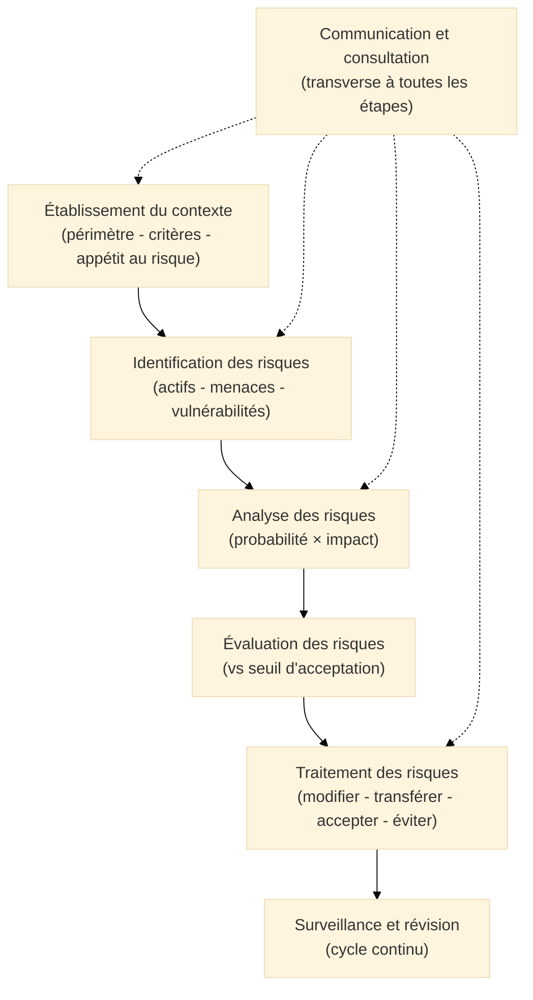
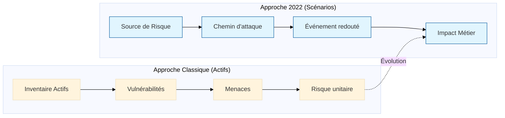
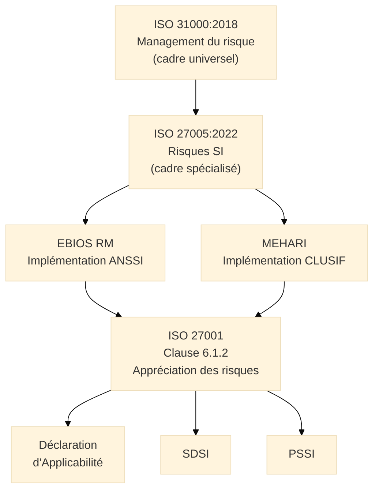

# ISO/IEC 27005 — Gestion des Risques SI

## Introduction

!!! quote "Analogie pédagogique"
    _Imaginez un **chef de cuisine** qui doit former des apprentis de cultures différentes. Plutôt que d'imposer une recette unique, il leur enseigne les **principes fondamentaux** : comment équilibrer les saveurs, comment maîtriser les cuissons, comment adapter une recette aux ingrédients disponibles. Les apprentis peuvent ensuite réaliser n'importe quelle cuisine — française, japonaise, marocaine — en appliquant ces principes. **ISO 27005 est ce cours de cuisine fondamental** : il ne prescrit pas de méthode d'analyse de risques, il enseigne les principes et le processus qui permettent à n'importe quelle organisation de construire son propre dispositif d'appréciation des risques SI, qu'elle l'implémente avec EBIOS RM, MEHARI ou toute autre méthode reconnue._

**ISO/IEC 27005:2022** est le **guide international de gestion des risques liés à la sécurité de l'information**. Il fournit le cadre processuel et conceptuel qui supporte les exigences de la clause 6.1.2 d'ISO 27001, sans imposer de méthode spécifique. C'est la norme qui **légitime méthodologiquement** EBIOS RM, MEHARI et toute autre approche rigoureuse d'appréciation des risques SI.

!!! info "Cette page est un rappel de positionnement"
    La fiche normative complète d'ISO 27005 — processus en détail, méthodes qualitatives et quantitatives, formules ALE/SLE/ARO, correspondance EBIOS RM, appétit au risque — est disponible dans la section **Normes ISO** :

    [:lucide-book-open-check: Voir la fiche complète ISO 27005](../../refs-normes/normes-iso/iso-27005/)

 

---

## Ce qu'ISO 27005 apporte au SMSI

ISO 27005 répond à une question qu'ISO 27001 pose sans y répondre : **"Comment réaliser l'appréciation des risques ?"**

| ISO 27001 (clause 6.1.2) | ISO 27005 |
|--------------------------|-----------|
| _"L'organisme doit définir et appliquer un processus d'appréciation des risques"_ | Décrit ce que ce processus doit contenir |
| _"Les résultats de l'appréciation des risques doivent être cohérents, valides et comparables"_ | Explique comment garantir cette cohérence |
| _"L'organisme doit conserver des informations documentées"_ | Précise quels livrables produire à chaque étape |

ISO 27005 n'est donc pas une alternative à EBIOS RM ou MEHARI — c'est le **cadre conceptuel** dont EBIOS RM et MEHARI sont des implémentations concrètes.

### Le processus ISO 27005 en synthèse

_Ce processus en 6 composantes est le référentiel conceptuel que toutes les méthodes d'analyse de risques SI respectent — EBIOS RM et MEHARI incluses._

 

---

## Quand choisir ISO 27005 plutôt qu'EBIOS RM ou MEHARI ?

ISO 27005 n'est pas une méthode opérationnelle en soi — c'est un cadre. La question réelle est : **quelle méthode d'implémentation choisir** pour satisfaire ISO 27005 ?

| Situation | Méthode recommandée |
|-----------|---------------------|
| Organisation française soumise à NIS2 ou OIV | **EBIOS RM** (méthode ANSSI officiellement recommandée) |
| Grande organisation avec base de risques existante | **MEHARI** (révisions périodiques efficaces) |
| Multinationale cherchant une approche non nationale | **ISO 27005** + méthode propriétaire documentée |
| Organisation avec contrainte internationale (US, Asie) | **ISO 27005** + NIST RMF ou méthode locale compatible |
| Première analyse de risques dans une PME | **EBIOS RM** simplifié ou **ISO 27005** avec approche qualitative basique |

!!! note "L'essentiel pour ISO 27001"
    L'auditeur de certification ISO 27001 ne vérifie pas quelle méthode vous utilisez. Il vérifie que votre méthode est **documentée**, **cohérente**, **reproductible** et qu'elle produit les livrables exigés (registre de risques, DdA, plan de traitement). EBIOS RM, MEHARI, ISO 27005 pur, ou toute autre méthode rigoureuse : toutes sont valides.

 

---

## Révision 2022 : les changements clés

La révision d'ISO 27005 en 2022 (vs 2011) apporte deux évolutions majeures pertinentes pour le SMSI :

**1. Approche par scénarios intégrée :**  
La version 2022 reconnaît et décrit l'approche par scénarios d'attaque comme alternative valide à l'approche classique actifs/menaces/vulnérabilités. Cette évolution rapproche ISO 27005 d'EBIOS RM et reflète la réalité des menaces cyber sophistiquées.

**2. Alignement sur ISO 31000:2018 :**  
Le cadre processuel est harmonisé avec ISO 31000 (management du risque générique), renforçant la cohérence avec la gouvernance des risques globaux de l'organisation.

> Ces deux évolutions facilitent l'intégration de l'appréciation des risques SI dans un dispositif de gestion des risques plus large (financiers, opérationnels, réputationnels) piloté au niveau de la direction générale.

 

---

## Articulation dans la démarche SMSI

_ISO 27005 est la **couche normative intermédiaire** : au-dessus des méthodes opérationnelles (EBIOS RM, MEHARI) et en dessous du standard certifiable (ISO 27001). Comprendre ISO 27005 permet de comprendre **pourquoi** EBIOS RM et MEHARI sont structurées comme elles le sont — et comment adapter ou justifier une méthode propriétaire._

 

---

## Fiche complète

Pour approfondir ISO 27005 — processus détaillé étape par étape, méthodes qualitatives et quantitatives, formules ALE/SLE/ARO, tableaux de correspondance EBIOS RM, gestion de l'appétit au risque, révision continue :

[:lucide-book-open-check: Voir la fiche normative complète ISO 27005](../../refs-normes/normes-iso/iso-27005/)

---

## Ressources complémentaires

- **ISO/IEC 27005:2022** — iso.org/standard/80585.html
- **ISO 31000:2018** — Management du risque (cadre parent)
- **EBIOS Risk Manager** — cyber.gouv.fr
- **MEHARI** — clusif.f

 

---

## Conclusion

!!! quote "Ce qu'il faut retenir"
    Le SMSI (Système de Management de la Sécurité de l'Information) est le moteur de l'amélioration continue en cybersécurité. Il transforme une approche réactive en une stratégie proactive, mesurable et alignée avec la direction.

> [Retour à l'index du SMSI →](../index.md)
