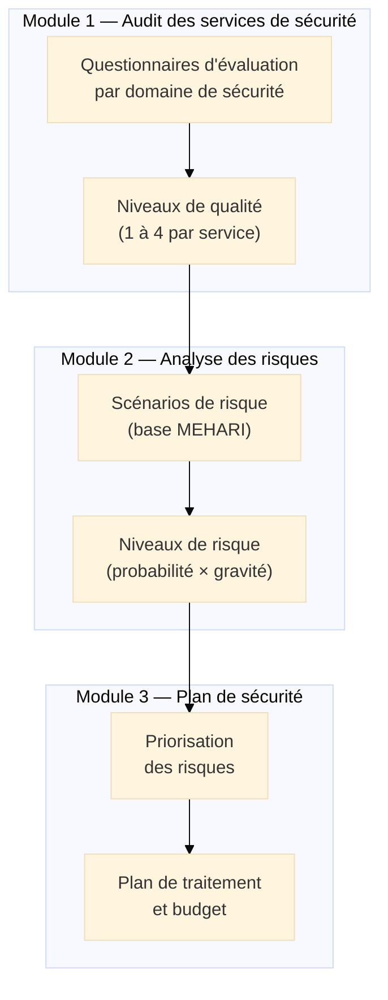
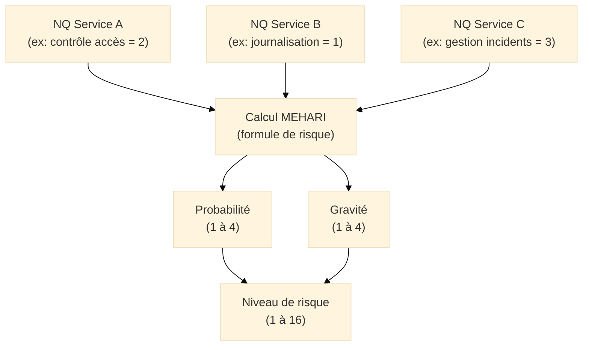

# MEHARI — Méthode Harmonisée d'Analyse de Risques

## Introduction

!!! quote "Analogie pédagogique"
    _Imaginez un **assureur automobile** qui évalue le risque d'un conducteur avant d'établir sa prime. Il ne demande pas "avez-vous déjà eu un accident ?" et s'en contente. Il applique un questionnaire structuré et exhaustif : âge, expérience, type de véhicule, kilométrage annuel, zone géographique, usage professionnel ou personnel, antécédents. Pour chaque réponse, il dispose d'une **base de données actuarielle** qui traduit le profil en probabilité d'incident et en coût moyen associé. La prime résulte de ce calcul structuré — pas d'une intuition. **MEHARI fonctionne identiquement** : elle applique un questionnaire structuré sur les services de sécurité en place (contrôles d'accès, journalisation, sauvegarde, etc.), traduit les réponses en niveaux de qualité selon sa base de connaissances, et calcule automatiquement les niveaux de risque résultants — permettant à l'organisation de comparer ses risques et de prioriser ses investissements._

**MEHARI** (*Méthode Harmonisée d'Analyse de Risques*) est la méthode de gestion des risques de sécurité de l'information développée et maintenue par le **CLUSIF**[^1] (*Club de la Sécurité de l'Information Français*). Disponible gratuitement depuis 1995 et régulièrement mise à jour, elle propose une approche structurée combinant une **base de connaissances riche** (plus de 300 scénarios de risque pré-établis) et un **processus d'évaluation par questionnaires** des services de sécurité en place.

MEHARI se distingue d'EBIOS RM par son positionnement : là où EBIOS RM part de l'attaquant pour modéliser ses chemins d'attaque, MEHARI part des **vulnérabilités organisationnelles et techniques** de l'organisation pour évaluer son exposition globale aux risques.

!!! info "MEHARI et ISO 27001"
    MEHARI est pleinement compatible avec ISO 27001 et constitue une implémentation reconnue de la clause 6.1.2. Sa base de connaissances est structurée en cohérence avec les domaines d'ISO 27002, ce qui facilite la construction de la Déclaration d'Applicabilité (DdA) à partir des résultats MEHARI.

 

---

## Architecture de la méthode

MEHARI repose sur **trois modules** complémentaires qui peuvent être utilisés ensemble ou séparément selon la maturité de l'organisation et ses besoins.

### Module 1 — Audit des services de sécurité

MEHARI évalue les **services de sécurité** en place via des questionnaires structurés. Un service de sécurité est un ensemble de mesures contribuant à réduire un type de risque.

Les services de sécurité sont organisés en **domaines** alignés sur ISO 27002 :

| Domaine | Services de sécurité évalués |
|---------|------------------------------|
| Organisation | Politique de sécurité, organisation des responsabilités, gestion des tiers |
| Ressources humaines | Sensibilisation, formation, gestion des départs |
| Actifs | Inventaire, classification, gestion des supports |
| Contrôle d'accès | Authentification, gestion des droits, accès privilégiés |
| Cryptographie | Chiffrement, gestion des clés, PKI |
| Sécurité physique | Contrôle d'accès physique, protection des équipements |
| Opérations | Gestion des vulnérabilités, journalisation, gestion des incidents |
| Communications | Sécurité réseau, chiffrement des communications |
| Développement | SDLC sécurisé, tests de sécurité |
| Continuité | PCA, PRA, sauvegardes |
| Conformité | Réglementation, audits |

Pour chaque service, le questionnaire produit un **niveau de qualité (NQ)** sur une échelle de 0 à 4 :

| NQ | Signification |
|----|--------------|
| **0** | Service absent ou inexistant |
| **1** | Service partiel ou peu efficace |
| **2** | Service en place mais perfectible |
| **3** | Service correct et largement appliqué |
| **4** | Service excellent, robuste et vérifié |

### Module 2 — Analyse des scénarios de risque

La **base de connaissances MEHARI** contient plus de 300 scénarios de risque pré-établis. Chaque scénario décrit :

- L'**actif menacé** : donnée, application, service, infrastructure
- La **menace** : accès non autorisé, altération, indisponibilité, divulgation
- La **situation de menace** : contexte dans lequel la menace peut se concrétiser
- Les **services de sécurité** qui réduisent la probabilité ou la gravité
- L'**impact** si le scénario se réalise

Le niveau de risque de chaque scénario est **calculé automatiquement** à partir des niveaux de qualité des services de sécurité associés :

### Module 3 — Plan de traitement

À partir de la liste des scénarios classés par niveau de risque, l'organisation :

1. **Priorise** les risques au-dessus du seuil d'acceptation
2. **Identifie** les services de sécurité à améliorer pour réduire ces risques
3. **Sélectionne** les mesures dans le catalogue ISO 27002
4. **Estime** l'impact de chaque mesure sur le niveau de risque (simulation)
5. **Budgète** et planifie les améliorations

L'un des avantages clés de MEHARI est la capacité de **simuler l'effet d'une mesure** avant de l'investir : en passant un NQ de 1 à 3 sur un service donné, le système recalcule automatiquement les niveaux de risque associés — permettant de comparer le ROI[^2] de différentes options de traitement.

 

---

## Le processus MEHARI en pratique

### Phase 1 — Préparation

- Définir le **périmètre** de l'analyse (SI complet, périmètre ciblé, application critique)
- Constituer l'**équipe d'évaluation** (RSSI + experts techniques + représentants métiers)
- Choisir les **domaines** à évaluer selon le périmètre
- Préparer les **questionnaires** adaptés au contexte

### Phase 2 — Collecte et évaluation

La collecte des informations pour remplir les questionnaires repose sur :

- **Entretiens** avec les responsables des domaines (DSI, RSSI, DBA, administrateurs)
- **Revue de documentation** (politiques, procédures, configurations)
- **Tests techniques** (scans de vulnérabilités, revues de configuration)
- **Observation directe** (vérification de l'application des procédures)

La durée de cette phase dépend du périmètre :

| Périmètre | Durée estimée |
|-----------|--------------|
| Domaine ciblé (ex: contrôle d'accès seul) | 2 à 4 semaines |
| Périmètre partiel (ex: infrastructure IT) | 1 à 2 mois |
| SI complet d'une ETI | 3 à 5 mois |
| SI complet d'une grande organisation | 5 à 8 mois |

### Phase 3 — Analyse et priorisation

- Calcul des niveaux de risque par scénario
- Production de la **cartographie des risques** (heatmap probabilité × gravité)
- Identification des **risques au-dessus du seuil d'acceptation**
- Analyse des **services les plus défaillants** (qui impactent le plus de scénarios)

### Phase 4 — Plan de traitement et simulation

- Simulation de l'effet des mesures envisagées (avant investissement)
- Sélection des mesures optimisant la réduction de risque par rapport au coût
- Construction du **plan de traitement priorisé** avec budget et délais
- Mise à jour de la **Déclaration d'Applicabilité** ISO 27001

 

---

## Forces et limites de MEHARI

### Forces

-   :lucide-check-circle:{ .lg .middle } **Base de connaissances exhaustive**

    ---
    Plus de 300 scénarios pré-établis couvrant l'ensemble des domaines SI. L'organisation ne repart pas de zéro — elle adapte les scénarios à son contexte.

-   :lucide-calculator:{ .lg .middle } **Simulation et ROI**

    ---
    Capacité unique de simuler l'effet d'une mesure sur les niveaux de risque avant investissement — argument puissant pour les arbitrages budgétaires.

-   :lucide-refresh-cw:{ .lg .middle } **Adapté aux revues périodiques**

    ---
    L'approche par questionnaires permet des révisions ciblées et efficaces : réévaluer uniquement les domaines impactés par un changement.

-   :lucide-award:{ .lg .middle } **Gratuit et open source**

    ---
    MEHARI est entièrement gratuit. La méthode, les questionnaires et les outils Excel/LibreOffice sont téléchargeables sur le site du CLUSIF.

### Limites

-   :lucide-alert-triangle:{ .lg .middle } **Courbe d'apprentissage élevée**

    ---
    La maîtrise de la base de connaissances et de la méthode de calcul nécessite une formation significative. Difficile à déployer sans expertise préalable.

-   :lucide-eye-off:{ .lg .middle } **Moins orientée menaces actuelles**

    ---
    Contrairement à EBIOS RM, MEHARI part des vulnérabilités — pas des attaquants. Elle peut manquer des menaces récentes non encore intégrées dans la base de connaissances.

-   :lucide-users:{ .lg .middle } **Outillage limité**

    ---
    L'outil officiel est un fichier tableur. Pour les grandes organisations, la gestion de centaines de scénarios en tableur devient difficile sans outil GRC dédié.

 

---

## MEHARI vs EBIOS RM : choisir la bonne méthode

| Critère | MEHARI | EBIOS RM |
|---------|--------|----------|
| **Approche** | Vulnérabilités → risques | Attaquants → scénarios → risques |
| **Base de connaissance** | 300+ scénarios pré-établis | Construit à partir du contexte |
| **Effort initial** | Élevé (maîtrise de la méthode) | Modéré (ateliers guidés) |
| **Adapté pour** | Grandes organisations, revues périodiques | OIV, entités NIS2, première analyse |
| **Orientation** | Exhaustivité des vulnérabilités | Réalisme des menaces |
| **Simulation** | Oui — calcul de l'effet des mesures | Non — analyse qualitative |
| **Gratuité** | Oui (CLUSIF) | Oui (ANSSI) |
| **Recommandé par** | CLUSIF | ANSSI |

> Les deux méthodes sont compatibles avec ISO 27001 et peuvent être **combinées** : EBIOS RM pour la première analyse stratégique et l'identification des scénarios prioritaires, MEHARI pour les revues annuelles et l'évaluation systématique des services de sécurité.

 

---

## Outillage disponible

| Outil | Type | Avantages |
|-------|------|-----------|
| **MEHARI Risk Manager** | Tableur Excel/Calc (CLUSIF) | Gratuit, officiel, tous périmètres |
| **Plateformes GRC** | Tenacy, eSEC, EGRC | Interface professionnelle, workflow intégré |
| **Scripts Python** | Communauté | Automatisation, intégration SI |

Le fichier tableur officiel MEHARI est téléchargeable gratuitement sur le site du CLUSIF (clusif.fr/nos-productions/mehari).

 

---

## Conclusion

!!! quote "MEHARI : la rigueur du bilan de santé appliquée à la sécurité."
    MEHARI est la méthode du praticien qui veut une image exhaustive et comparable de la sécurité de son organisation. Sa base de connaissances de 300+ scénarios évite de réinventer la roue à chaque analyse. Sa capacité de simulation en fait un outil de décision budgétaire crédible. Et sa gratuité la rend accessible à toutes les organisations.

    Elle est particulièrement adaptée aux organisations qui ont déjà conduit une première analyse de risques (avec EBIOS RM par exemple) et souhaitent mettre en place un processus de révision annuelle structuré, reproductible et comparable d'une année sur l'autre.

    > Les résultats MEHARI alimentent directement la **Déclaration d'Applicabilité** du SMSI ISO 27001 et le **plan de traitement des risques** qui sera intégré au SDSI.

 

---

## Ressources complémentaires

- **CLUSIF** : clusif.fr/nos-productions/mehari
- **Guide MEHARI** : Méthode complète téléchargeable
- **ISO/IEC 27005:2022** : Cadre normatif international compatible
- **ISO 27002:2022** : Catalogue des mesures de sécurité

[^1]: Le **CLUSIF** (*Club de la Sécurité de l'Information Français*) est une association professionnelle française qui rassemble des utilisateurs et des offreurs de produits et services de sécurité. Il publie des guides, des méthodes (dont MEHARI) et des études sectorielles sur la sécurité de l'information.
[^2]: Le **ROI** (*Return on Investment*, ou Retour sur Investissement) dans le contexte de MEHARI désigne la réduction de risque obtenue pour un investissement en mesure de sécurité donné. La simulation MEHARI permet de comparer le ROI de différentes mesures en calculant leur impact sur les niveaux de risque avant tout investissement réel.