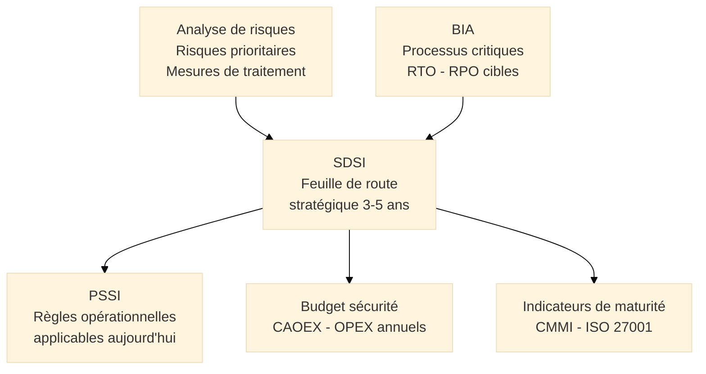
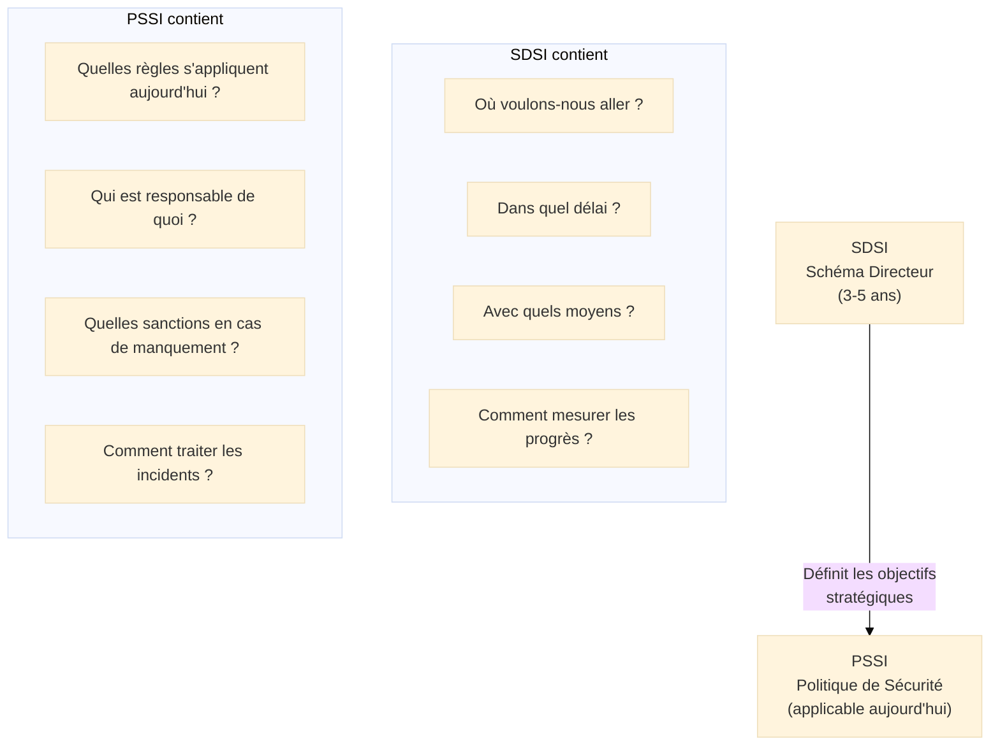
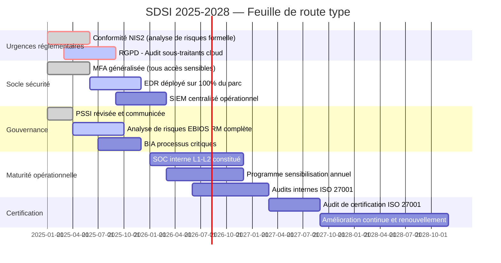

# SDSI — Schéma Directeur de la Sécurité de l'Information

## Introduction

!!! quote "Analogie pédagogique"
    _Imaginez un **architecte urbaniste** chargé de réhabiliter un quartier historique tout en le rendant compatible avec les exigences du XXIe siècle — accessibilité, efficacité énergétique, connectivité numérique, sécurité. Il ne commence pas par commander des matériaux au hasard. Il réalise d'abord un **état des lieux exhaustif** du bâti existant, identifie ce qui est solide et ce qui menace de s'effondrer, puis trace un **plan directeur pluriannuel** qui ordonne les interventions selon leur urgence et leur impact. Les habitants continuent à vivre pendant les travaux — tout ne peut pas être refait en même temps. Il distingue ce qui relève des **rénovations d'urgence** (toiture qui fuit) de ce qui relève de la **modernisation structurelle** (mise aux normes électriques). **Le SDSI fonctionne identiquement** : c'est la feuille de route pluriannuelle qui planifie comment l'organisation va passer de sa posture sécurité actuelle à la cible définie, en priorisant les chantiers selon leur criticité, en allouant les ressources dans le temps, et en rendant les progrès mesurables._

**Le Schéma Directeur de la Sécurité de l'Information (SDSI)** est le **document stratégique pluriannuel** (généralement 3 à 5 ans) qui définit la vision, les objectifs, la feuille de route et les ressources nécessaires pour atteindre le niveau de maturité sécurité visé par l'organisation. Il constitue la **courroie de transmission** entre les constats de l'analyse de risques et du BIA d'une part, et les règles opérationnelles de la PSSI d'autre part.

!!! info "Position du SDSI dans la démarche SMSI"
    Le SDSI est produit **après** l'analyse de risques et le BIA, et **avant** la PSSI dans sa version définitive. Il synthétise les priorités issues de l'analyse de risques (quoi traiter en urgence) et du BIA (quels systèmes rendre hautement disponibles), les traduit en investissements planifiés dans le temps, et fournit le cadre stratégique que la PSSI déclinera en règles opérationnelles.

 

---

## Position du SDSI dans la chaîne SMSI

**Ce que le SDSI reçoit :**

- De l'**analyse de risques** : les risques prioritaires à traiter et les mesures recommandées
- Du **BIA** : les processus critiques et les niveaux de disponibilité cibles (RTO/RPO)
- Du **contexte réglementaire** : les échéances de conformité (NIS2, DORA, RGPD, ISO 27001)

**Ce que le SDSI produit :**

- Une **feuille de route** priorisée et budgétée
- Le cadre stratégique que la **PSSI** déclinera en règles opérationnelles
- Les **objectifs de maturité** mesurables par des indicateurs (CMMI, KPI)

 

---

## Structure d'un SDSI

### 1. État des lieux (Situation actuelle)

Le SDSI commence obligatoirement par un **diagnostic honnête et documenté** de la situation sécurité existante. Sans état des lieux rigoureux, la feuille de route est construite sur des suppositions.

**Composantes de l'état des lieux :**

??? abstract "Évaluation de la maturité sécurité"

    Mesure de la maturité des pratiques sécurité selon un référentiel reconnu :

    | Domaine | Niveau actuel | Cible 3 ans |
    |---------|--------------|-------------|
    | Gouvernance et politique | CMMI 2 | CMMI 3 |
    | Gestion des identités et accès | CMMI 1 | CMMI 3 |
    | Protection des endpoints | CMMI 2 | CMMI 4 |
    | Gestion des vulnérabilités | CMMI 1 | CMMI 3 |
    | Détection et réponse | CMMI 1 | CMMI 3 |
    | Continuité d'activité | CMMI 2 | CMMI 3 |

    _Méthodes d'évaluation courantes : **CMMI**[^1], grille d'évaluation ISO 27001, **ANSSI Diagnostic SSI**, CIS Controls._

??? abstract "Cartographie de la conformité réglementaire"

    Identification des écarts entre les obligations légales en vigueur et les pratiques actuelles :

    | Réglementation | Obligation clé | Statut | Échéance |
    |---------------|---------------|--------|----------|
    | RGPD Art. 32 | Sécurité des traitements | Partiel | Immédiat |
    | NIS2 Art. 21 | Gestion des risques cyber | Non conforme | 17/10/2024 |
    | DORA Art. 5-16 | Résilience TIC | Non applicable | 17/01/2025 |
    | ISO 27001 | Certification SMSI | En projet | 2026 |

??? abstract "Inventaire de la dette sécurité technique"

    Liste des vulnérabilités et lacunes techniques identifiées lors des audits, pentests et analyse de risques, avec leur niveau de criticité et leur ancienneté.

??? abstract "Analyse des incidents passés (REX)"

    Synthèse des incidents de sécurité survenus sur les 2-3 dernières années, leurs causes racines, leur coût et les mesures correctives appliquées — ou non appliquées.

### 2. Vision et objectifs cibles

**La vision** formule l'ambition sécurité de l'organisation à l'horizon du SDSI, alignée sur la stratégie business :

> Exemple : _"D'ici 2028, l'organisation atteindra la certification ISO 27001, disposera d'un SOC interne opérationnel 24/7, et répondra à l'ensemble des exigences NIS2 applicables à son secteur."_

**Les objectifs cibles** déclinent la vision en résultats mesurables :

- Atteindre le **niveau CMMI 3** sur l'ensemble des domaines de sécurité
- Réduire le délai moyen de détection des incidents de **72h à 4h**
- Faire passer le taux de succès des campagnes de phishing simulé de **32% à moins de 5%**
- Obtenir la **certification ISO 27001** sur le périmètre production

### 3. Feuille de route pluriannuelle

La feuille de route ordonne les chantiers selon leur **urgence réglementaire**, leur **réduction de risque** et leur **faisabilité**. Elle distingue trois types d'actions :

| Type | Description | Horizon |
|------|-------------|---------|
| **Actions urgentes** | Remédiation de vulnérabilités critiques, conformité réglementaire immédiate | 0-6 mois |
| **Actions structurantes** | Déploiement de solutions majeures (SIEM, SOC, MFA généralisée) | 6-18 mois |
| **Actions d'amélioration** | Optimisation et automatisation des processus matures | 18-36 mois |

### 4. Ressources et budget

Le SDSI produit une **estimation budgétaire pluriannuelle** distinguant :

- **CAPEX**[^2] : investissements ponctuels (licences, matériel, prestations de conseil)
- **OPEX**[^3] : coûts récurrents (abonnements, personnel SOC, maintenances)
- **Ressources humaines** : recrutements, formations, externalisations

> Le budget SDSI est l'argument que le RSSI présente à la direction pour obtenir les ressources nécessaires. Un SDSI sans chiffrage n'est pas un SDSI — c'est une liste de souhaits.

 

---

## Le SDSI et la PSSI : une relation directrice

La relation entre SDSI et PSSI est fréquemment mal comprise. Elle mérite une clarification explicite.

_**Le SDSI répond à : "Où allons-nous ?"** Il planifie la trajectoire sur 3 à 5 ans. Il évolue chaque année lors de la revue annuelle du SMSI._

_**La PSSI répond à : "Quelles sont les règles applicables aujourd'hui ?"**  Elle décline en obligations concrètes et opposables les objectifs du SDSI. Elle s'applique immédiatement à tous les collaborateurs._

_**La PSSI est le reflet opérationnel du SDSI :** Quand le SDSI prévoit le déploiement du MFA généralisé en année 1, la PSSI est mise à jour pour inclure la règle "l'authentification multifacteur est obligatoire pour l'accès à tout système contenant des données sensibles". La PSSI ne contient pas de règles que le SDSI ne prévoit pas de mettre en œuvre — ce serait mentir à l'organisation sur ses capacités réelles._

 

---

## Exemple de feuille de route SDSI

 

---

## Gouvernance du SDSI

### Instances de pilotage

Un SDSI sans instance de pilotage reste un document — il ne se met jamais en œuvre. Les instances minimales nécessaires :

| Instance | Composition | Fréquence | Rôle |
|----------|-------------|-----------|------|
| **Comité Sécurité** | RSSI, DSI, DG, DPO, Direction métier | Mensuel | Suivi des chantiers, arbitrages opérationnels |
| **Revue SMSI** | Direction générale, RSSI, auditeurs | Annuel | Révision du SDSI, validation des objectifs suivants |

### Indicateurs de suivi (KPI)

Le SDSI définit les indicateurs qui permettront de mesurer si la feuille de route est tenue :

- **Taux de réalisation des chantiers** : % de jalons atteints dans les délais prévus
- **Niveau de maturité** : score CMMI ou équivalent, réévalué annuellement
- **Couverture MFA** : % de comptes sensibles avec MFA activé
- **Délai moyen de correction des vulnérabilités critiques** : en jours
- **Taux de réussite phishing simulé** : % de collaborateurs piégés

### Révision annuelle

Le SDSI n'est pas un document figé sur 3 ans. Il est révisé **chaque année** lors de la revue de direction du SMSI pour :

- Intégrer les nouvelles menaces émergentes
- Adapter la trajectoire aux nouvelles obligations réglementaires
- Corriger les écarts entre planification et réalisation
- Mettre à jour le budget en fonction des arbitrages de la direction

 

---

## Écueils à éviter

!!! warning "Pièges courants"

    **SDSI rédigé uniquement par la DSI ou la sécurité :**  
    _Un SDSI valide est validé par la direction générale. Sans son engagement, ni les ressources ni la priorité organisationnelle ne seront au rendez-vous. La direction doit s'approprier le document._

    **Feuille de route déconnectée du budget :**  
    _Un SDSI sans chiffrage est une liste de souhaits. Chaque chantier doit être associé à une estimation budgétaire réaliste — même approximative — pour permettre les arbitrages._

    **SDSI révisé uniquement lors des crises :**  
    _La révision annuelle est obligatoire. Un SDSI de 2022 encore en vigueur en 2025 sans révision est obsolète face aux nouvelles menaces (ransomware sophistiqués, NIS2, DORA)._

    **PSSI incohérente avec le SDSI :**  
    _Publier une PSSI qui impose des règles que l'organisation n'a pas les moyens de faire respecter (parce que le SDSI ne planifie pas les outils nécessaires) érode immédiatement la crédibilité du dispositif._

 

---

## Conclusion

!!! quote "Le SDSI est le contrat pluriannuel de la direction avec la sécurité."
    Un SDSI bien construit transforme la sécurité d'une dépense subie en investissement stratégique planifié. Il donne à la direction une vision claire de où l'organisation va, avec quels moyens et selon quel calendrier. Il donne au RSSI une légitimité et un cadre d'arbitrage. Il donne aux équipes une direction et des objectifs.

    Sans SDSI, la sécurité est pilotée dans l'urgence — réaction aux incidents, aux injonctions réglementaires, aux demandes clients. Avec un SDSI validé par la direction, elle est pilotée par anticipation.

    > Le SDSI alimente directement la **PSSI** qui en traduit les objectifs en règles opérationnelles applicables immédiatement, et le **BIA** qui en calibre les priorités de continuité.

 

---

## Ressources complémentaires

- **ISO 27001:2022** — Clauses 5 (Leadership) et 6 (Planification)
- **ANSSI** — Guide d'élaboration d'une politique de sécurité des systèmes d'information
- **COBIT 2019** — Objectifs de gouvernance IT (EDM, APO)
- **CMMI Institute** — Modèle de maturité des processus

[^1]: Le **CMMI** (*Capability Maturity Model Integration*) est un modèle d'évaluation de la maturité des processus organisationnels sur une échelle de 1 (initial, chaotique) à 5 (optimisation continue). Il est utilisé pour mesurer et communiquer le niveau de maturité sécurité d'une organisation de manière standardisée et comparable.
[^2]: Le **CAPEX** (*Capital Expenditure*, ou dépense d'investissement) désigne les investissements ponctuels qui créent ou améliorent des actifs durables : achat de licences logicielles, de matériel, ou recours à des prestations de conseil non récurrentes. Ils sont comptabilisés comme immobilisations et amortis sur plusieurs années.
[^3]: L'**OPEX** (*Operational Expenditure*, ou dépense opérationnelle) désigne les coûts récurrents nécessaires au fonctionnement courant : abonnements logiciels (SaaS), salaires des équipes sécurité, contrats de maintenance, formations annuelles. Ils sont comptabilisés en charges de l'exercice.

 

---

## Conclusion

!!! quote "Ce qu'il faut retenir"
    Le SMSI (Système de Management de la Sécurité de l'Information) est le moteur de l'amélioration continue en cybersécurité. Il transforme une approche réactive en une stratégie proactive, mesurable et alignée avec la direction.

> [Retour à l'index du SMSI →](../index.md)
