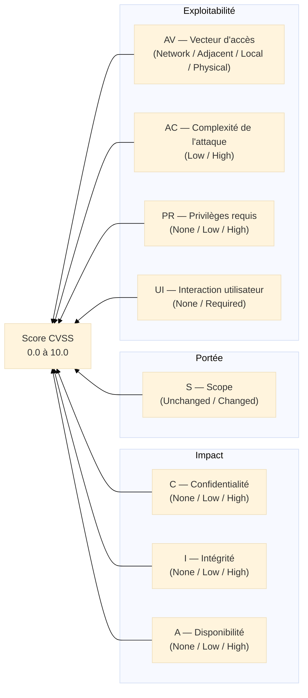

# CVE & CVSS — Identifier et Scorer les Vulnérabilités

## Introduction

<div
  class="omny-meta"
  data-level="🟢 Débutant & 🟡 Intermédiaire"
  data-version="CVSS 4.0 (2023)"
  data-time="35-45 minutes">
</div>

!!! quote "Analogie pédagogique"
    _Les services de météo utilisent l'**échelle de Beaufort** pour quantifier la force du vent et l'**échelle de Richter** pour la magnitude des séismes — des mesures standardisées comprises par tous. En cybersécurité, **CVE** est le système de **nommage universel** des vulnérabilités et **CVSS** est l'**échelle de mesure** de leur gravité. Sans ces référentiels communs, chaque éditeur nommerait et évaluerait les failles différemment — rendant toute communication sur les risques impossible._

> **CVE (Common Vulnerabilities and Exposures)** est le dictionnaire mondial des vulnérabilités de sécurité connues, maintenu par le MITRE avec le soutien du gouvernement américain. **CVSS (Common Vulnerability Scoring System)** est le système de notation standardisé permettant d'évaluer la gravité de chaque vulnérabilité sur une échelle de 0 à 10. Ensemble, ils forment le **langage universel de la gestion des vulnérabilités**.

!!! info "Pourquoi c'est important ?"
    Chaque jour, de nouvelles vulnérabilités sont publiées — en 2024, plus de **40 000 CVE** ont été attribués. Sans système de priorisation, les équipes sécurité seraient submergées. CVE et CVSS permettent d'**identifier précisément** la vulnérabilité et d'**évaluer objectivement** sa gravité pour prioriser les corrections.

## Anatomie d'un CVE

### Format d'un identifiant CVE

```
CVE-[ANNÉE]-[IDENTIFIANT]
    │         │
    │         └─ Numéro unique attribué par le MITRE ou un CNA (CVE Numbering Authority)
    └─────────── Année de découverte ou de publication
```

**Exemple :** `CVE-2021-44228` = Log4Shell (vulnérabilité critique dans Apache Log4j, découverte en 2021)

### Informations d'un CVE complet

| Champ | Description | Exemple (Log4Shell) |
|---|---|---|
| **CVE ID** | Identifiant unique | CVE-2021-44228 |
| **Description** | Description de la vulnérabilité | RCE dans Log4j via JNDI injection |
| **Score CVSS** | Gravité de 0 à 10 | 10.0 (Critique) |
| **Vecteur CVSS** | Détail technique du score | CVSS:3.1/AV:N/AC:L/PR:N/UI:N/S:C/C:H/I:H/A:H |
| **CWE** | Type de faiblesse (Common Weakness Enumeration) | CWE-917 (Injection) |
| **Références** | Bulletins de sécurité, PoC, patches | NVD, advisory Apache |
| **Date publication** | Date de publication officielle | 2021-12-10 |

### Où consulter les CVE

| Source | URL | Particularité |
|---|---|---|
| **NVD (NIST)** | [nvd.nist.gov](https://nvd.nist.gov) | Base officielle avec score CVSS complet |
| **MITRE CVE** | [cve.mitre.org](https://cve.mitre.org) | Source primaire |
| **CERT-FR** | [cert.ssi.gouv.fr](https://www.cert.ssi.gouv.fr) | Alertes ANSSI pour les vulnérabilités critiques |
| **CISA KEV** | [cisa.gov/known-exploited-vulnerabilities](https://www.cisa.gov/known-exploited-vulnerabilities-catalog) | Vulnérabilités **activement exploitées** — priorisation maximale |

## Le score CVSS

### CVSS 3.1 — Les métriques de base

Le score CVSS v3.1 (le plus utilisé) est calculé à partir de **8 métriques** :



### Échelle de sévérité CVSS

| Score | Sévérité | Couleur | Exemple |
|---|---|---|---|
| **0.0** | Aucune | — | |
| **0.1 – 3.9** | Faible | 🟢 | Fuite d'informations mineure |
| **4.0 – 6.9** | Moyenne | 🟡 | Élévation de privilèges locale |
| **7.0 – 8.9** | Élevée | 🟠 | RCE nécessitant authentification |
| **9.0 – 10.0** | Critique | 🔴 | RCE non authentifié (Log4Shell : 10.0) |

### Décoder un vecteur CVSS

**Exemple Log4Shell :** `CVSS:3.1/AV:N/AC:L/PR:N/UI:N/S:C/C:H/I:H/A:H`

| Métrique | Valeur | Signification |
|---|---|---|
| **AV:N** | Network | Exploitable à distance via réseau |
| **AC:L** | Low | Faible complexité — facile à exploiter |
| **PR:N** | None | Aucun privilège requis |
| **UI:N** | None | Aucune interaction utilisateur requise |
| **S:C** | Changed | Impact au-delà du composant vulnérable |
| **C:H** | High | Impact total sur la confidentialité |
| **I:H** | High | Impact total sur l'intégrité |
| **A:H** | High | Impact total sur la disponibilité |

_→ Score 10.0 : l'attaquant peut exécuter du code arbitraire depuis Internet sans aucun prérequis._

### CVSS 4.0 — Les nouveautés (2023)

La version 4.0 introduit :
- **Nouvelles métriques** : AT (Exigences d'automatisation), VC/VI/VA (Impact sur la victime directe), SC/SI/SA (Impact sur les systèmes en aval)
- **Nomenclature enrichie** : CVSS-B (Base), CVSS-BE (Base+Env.), CVSS-BT (Base+Threat), CVSS-BTE (complet)
- **Meilleure prise en compte des OT/IoT** : métriques spécifiques aux environnements opérationnels

## Utilisation dans la priorisation du patch management

!!! tip "CVSS seul ne suffit pas pour prioriser"
    Un CVE avec un score 9.8 sur un serveur non exposé à Internet est moins urgent qu'un CVE 7.0 activement exploité sur un serveur web public. La priorisation doit combiner :

| Critère | Poids |
|---|---|
| **Score CVSS** (gravité intrinsèque) | Base de départ |
| **Présence dans la CISA KEV** (exploitation active) | Priorité maximale — patch sous 14 jours |
| **Exposition du système** (Internet vs interne) | Multiplicateur de risque |
| **Criticité de l'actif** (serveur de prod vs poste dev) | Ajustement contextuel |
| **Disponibilité d'un exploit public** (Exploit-DB, Metasploit) | Urgence accrue |

**Tableau de décision simplifié :**

| CVSS | Dans CISA KEV | Exposition | Délai patch cible |
|---|---|---|---|
| ≥ 9.0 | Oui | Internet | **24-48h** |
| ≥ 9.0 | Non | Internet | **1 semaine** |
| 7.0-8.9 | Oui | Tout | **1 semaine** |
| 7.0-8.9 | Non | Internet | **2-4 semaines** |
| 4.0-6.9 | Non | Interne | **Cycle standard (mensuel)** |
| < 4.0 | Non | Tout | **Prochain cycle** |

## Le mot de la fin

!!! quote
    CVE et CVSS sont le **vocabulaire commun** de la cybersécurité. Un RSSI qui ne maîtrise pas ces référentiels ne peut pas communiquer efficacement avec ses équipes, ses fournisseurs ni sa direction. Mais attention : CVSS mesure la gravité intrinsèque d'une vulnérabilité — pas son risque réel dans votre contexte. Une vulnérabilité critique sur un système isolé est moins urgente qu'une vulnérabilité moyenne activement exploitée sur votre serveur de paiement.

---

## Ressources complémentaires

- **NVD (NIST)** : [https://nvd.nist.gov](https://nvd.nist.gov)
- **CISA KEV** : [https://www.cisa.gov/known-exploited-vulnerabilities-catalog](https://www.cisa.gov/known-exploited-vulnerabilities-catalog)
- **Calculateur CVSS** : [https://www.first.org/cvss/calculator/3.1](https://www.first.org/cvss/calculator/3.1)
- **CERT-FR** : [https://www.cert.ssi.gouv.fr](https://www.cert.ssi.gouv.fr)

---