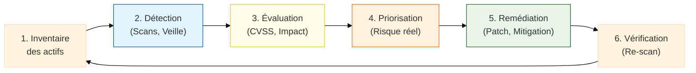

# Gestion des Vulnérabilités

!!! quote "Analogie pédagogique"
    _La gestion des vulnérabilités, c'est comme l'entretien régulier de la coque d'un navire. Si vous ne cherchez et ne colmatez pas en continu les petites brèches, l'accumulation d'eau finira par vous couler de manière inévitable._

## Introduction

**La gestion des vulnérabilités** constitue un **processus continu** de veille, d'évaluation, de priorisation et de traitement des failles de sécurité identifiées dans les systèmes d'information. Elle s'inscrit dans une démarche de conformité et de gouvernance des risques, répondant aux exigences des réglementations (NIS2, DORA) et des référentiels (ISO 27001, PCI DSS).

> Dans un contexte où de nouvelles vulnérabilités sont découvertes quotidiennement (CVE), une gestion structurée permet de **prioriser rationnellement** les correctifs selon leur criticité et l'exposition réelle de l'organisation.

!!! info "Pourquoi la gestion des vulnérabilités est cruciale ?"
    - **Réduction de la surface d'attaque** : Fermer les portes d'entrée avant exploitation
    - **Conformité réglementaire** : Exigence NIS2, DORA, PCI DSS, ISO 27001
    - **Priorisation** : Concentrer les efforts sur les vulnérabilités critiques exploitables
    - **Traçabilité** : Démontrer le suivi et le traitement aux auditeurs
    - **Résilience** : Maintenir un niveau de sécurité adapté face aux menaces évolutives

## Cycle de gestion des vulnérabilités

_Ce cycle garantit une approche proactive : on ne se contente pas de "patcher", on **évalue** la criticité réelle via le **CVSS** et l'**impact métier** pour concentrer les ressources là où le risque est maximal._

## Les quatre composantes clés

!!! note "Cette section présente les quatre piliers complémentaires de la gestion des vulnérabilités"
    Ces composantes forment un **cycle cohérent** : CVE/CVSS pour identifier et scorer, OWASP Top 10 pour les vulnérabilités applicatives, Patch Management pour corriger, et Politique de Scan pour structurer le processus.

-   :lucide-search:{ .lg .middle } **CVE & CVSS** — _Identification et scoring_

    ---

    **Common Vulnerabilities and Exposures (CVE)** : base de données internationale des vulnérabilités référencées.  
    **Common Vulnerability Scoring System (CVSS)** : système de notation standardisé de la criticité.

    [:lucide-book-open-check: Voir la fiche CVE & CVSS](./cve-cvss/)

-   :lucide-shield-x:{ .lg .middle } **OWASP Top 10** — _Vulnérabilités applicatives Web_

    ---

    Référentiel des **10 vulnérabilités applicatives Web** les plus critiques, mis à jour régulièrement par l'OWASP.

    [:lucide-book-open-check: Voir la fiche OWASP Top 10](./owasp-top10/)

-   :lucide-wrench:{ .lg .middle } **Patch Management** — _Gestion des correctifs_

    ---

    Processus structuré de **déploiement des correctifs de sécurité** : identification, test, qualification, déploiement, vérification.

    [:lucide-book-open-check: Voir la fiche Patch Management](./patch-management/)

-   :lucide-scan:{ .lg .middle } **Politique de Scan** — _Cadre organisationnel_

    ---

    Cadre réglementaire et organisationnel pour les **scans de vulnérabilités** : fréquence, périmètre, responsabilités, reporting.

    [:lucide-book-open-check: Voir la fiche Politique de Scan](./scan-policy/)

## Processus de gestion des vulnérabilités

La gestion des vulnérabilités suit un cycle continu en 6 étapes :

1. **Inventaire des actifs** : Cartographie exhaustive du SI
2. **Détection** : Scans automatisés, veille CVE, audits
3. **Évaluation** : Scoring CVSS, analyse d'exploitabilité
4. **Priorisation** : Criticité × Exposition × Impact métier
5. **Remédiation** : Patch, contournement, compensation
6. **Vérification** : Contrôle de l'efficacité du traitement

## Rôle dans l'écosystème GRC

La gestion des vulnérabilités constitue **l'interface opérationnelle** entre l'analyse de risques (identification des menaces) et la mise en œuvre des mesures correctives. Elle alimente directement les indicateurs de pilotage du SMSI et répond aux exigences d'audit des référentiels (ISO 27001, PCI DSS, NIS2).

> Les fiches suivantes détaillent chaque composante avec méthodologies, outils et bonnes pratiques de mise en œuvre.

 

---

## Conclusion

!!! quote "Ce qu'il faut retenir"
    La gestion des vulnérabilités est le baromètre quotidien de la posture de sécurité. Elle ne remplace pas l'analyse de risques stratégique — elle l'alimente en données concrètes. Un CVE critique sur un actif non inventorié, c'est un angle mort qui peut invalider la meilleure politique de sécurité du monde. L'inventaire des actifs est le préalable absolu à tout le reste.

> [Retour à l'hub GRC pour explorer les autres composantes →](../)
