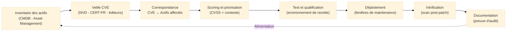
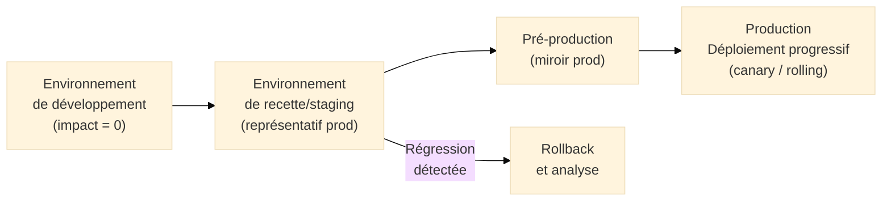

# Patch Management — Gestion des Correctifs

## Introduction

!!! quote "Analogie pédagogique"
    _Imaginez un **responsable de maintenance d'une flotte de véhicules professionnels**. Il ne répare pas les voitures uniquement quand elles tombent en panne — il applique les **révisions préventives** selon le carnet d'entretien du constructeur. Quand le constructeur publie un **rappel de sécurité** (frein défectueux, coussin gonflable défaillant), il ne se contente pas de lire la notice : il identifie quels véhicules de sa flotte sont concernés, planifie leur passage en atelier selon l'urgence (un frein défectueux passe avant un enjoliveur fissuré), teste les véhicules après intervention, et conserve la preuve documentée des révisions pour l'assureur. **Le patch management fonctionne exactement ainsi** pour les systèmes d'information : les CVE sont les rappels de sécurité, les patches sont les pièces de remplacement, et le processus structuré garantit qu'aucun véhicule vulnérable ne reste sur la route plus longtemps que nécessaire._

**Le patch management** (gestion des correctifs) est le **processus structuré d'identification, d'évaluation, de qualification, de déploiement et de vérification des mises à jour de sécurité** sur l'ensemble du système d'information. Il constitue l'une des mesures de sécurité les plus fondamentales — et l'une des plus fréquemment négligées ou mal exécutées.

La réalité opérationnelle est implacable : **la majorité des cyberattaques exploitent des vulnérabilités pour lesquelles un correctif existait**. La compromission d'Equifax (2017, 145 millions de données personnelles) s'est faite via une vulnérabilité Apache Struts[^1] pour laquelle un patch existait depuis 2 mois. WannaCry (2017) a paralysé des hôpitaux et entreprises du monde entier en exploitant EternalBlue — une vulnérabilité patchée par Microsoft 2 mois plus tôt (MS17-010).

!!! info "Pourquoi le patch management est essentiel ?"
    Le patch management est explicitement requis par **ISO 27001** (contrôle 8.8 — Gestion des vulnérabilités techniques), **NIS2** (article 21.2.e — sécurité des systèmes), **DORA** (article 9 — mesures de protection) et **PCI DSS v4** (exigence 6.3 — gestion des vulnérabilités). C'est un contrôle de sécurité fondamental que les auditeurs examinent systématiquement.

 

---

## Prérequis : l'inventaire des actifs

Un processus de patch management ne peut pas fonctionner sans un **inventaire exhaustif et à jour des actifs** — systèmes d'exploitation, applications, middlewares, firmwares, conteneurs, dépendances logicielles.

Sans inventaire : vous ne savez pas ce que vous avez. Sans le savoir, vous ne pouvez pas vérifier si un système est affecté par une CVE. Sans le vérifier, vous ne pouvez pas le patcher.

 

---

## Le processus en 7 étapes

### Étape 1 — Veille et identification des vulnérabilités

**Objectif :** Détecter les nouvelles vulnérabilités affectant les actifs du périmètre avant qu'elles ne soient exploitées.

**Sources de veille à maintenir :**

| Source | Type | Fréquence de consultation |
|--------|------|--------------------------|
| **NVD (NIST)** | Base CVE complète | Quotidienne (flux RSS) |
| **CERT-FR (ANSSI)** | Alertes France + criticités | Quotidienne |
| **CISA KEV** | Vulnérabilités activement exploitées | Quotidienne — priorité maximale |
| **Bulletins éditeurs** | Microsoft Patch Tuesday, Adobe, VMware... | Mensuelle ou à chaque publication |
| **MITRE ATT&CK** | TTPs associées aux vulnérabilités | Contextuelle |
| **Listes de diffusion sécurité** | Full Disclosure, SecurityFocus | Hebdomadaire |

**Automatisation recommandée :**
- Flux CVE automatisés vers le SIEM ou l'outil de gestion des vulnérabilités
- Alertes automatiques pour les CVE concernant les technologies référencées dans la CMDB[^2]
- Abonnements aux bulletins des éditeurs de toutes les technologies utilisées

### Étape 2 — Correspondance CVE ↔ Actifs affectés

**Objectif :** Identifier précisément quels systèmes du périmètre sont affectés par chaque CVE publiée.

Cette étape nécessite que l'inventaire soit à jour et contienne les **versions exactes** des logiciels (pas seulement "Apache" mais "Apache httpd 2.4.51"). Les outils de scan de vulnérabilités (Nessus, OpenVAS, Qualys) automatisent cette correspondance.

**Points de vigilance :**
- Les **dépendances applicatives** (bibliothèques Java, packages npm, modules Python) sont souvent absentes de l'inventaire traditionnel — le SBOM[^3] est la solution
- Les **équipements réseau** (switches, routeurs, firewalls) sont souvent oubliés
- Les **systèmes OT/SCADA** et équipements IoT nécessitent une approche spécifique (patches souvent inexistants ou non applicables sans arrêt de production)

### Étape 3 — Évaluation et priorisation

**Objectif :** Déterminer l'ordre de traitement des vulnérabilités selon leur criticité réelle dans le contexte de l'organisation.

Le score CVSS seul est insuffisant pour prioriser. La grille de priorisation doit combiner plusieurs facteurs :

| Facteur | Poids | Justification |
|---------|-------|--------------|
| **Score CVSS de base** | Élevé | Gravité intrinsèque de la vulnérabilité |
| **Présence dans CISA KEV** | Très élevé | Exploitation active confirmée = urgence maximale |
| **Exposition de l'actif** | Élevé | Serveur exposé Internet >> serveur interne isolé |
| **Criticité de l'actif** | Élevé | Serveur de production > serveur de développement |
| **Disponibilité d'un exploit public** | Élevé | PoC ou module Metasploit disponible = risque accru |
| **Données traitées** | Moyen | Actif traitant des données sensibles/personnelles |
| **Impact métier** | Moyen | Actif critique pour la continuité d'activité |

**Tableau de décision type :**

| CVSS | CISA KEV | Exposition | Délai cible |
|------|----------|------------|-------------|
| ≥ 9.0 | Oui | Toute | **24 à 48h** |
| ≥ 9.0 | Non | Internet | **< 7 jours** |
| ≥ 9.0 | Non | Interne | **< 15 jours** |
| 7.0 – 8.9 | Oui | Toute | **< 7 jours** |
| 7.0 – 8.9 | Non | Internet | **< 30 jours** |
| 7.0 – 8.9 | Non | Interne | **Cycle mensuel** |
| 4.0 – 6.9 | Non | Toute | **Cycle trimestriel** |
| < 4.0 | Non | Toute | **Prochain cycle** |

!!! warning "Zéro day et vulnérabilités sans patch disponible"
    Quand une vulnérabilité critique est publiée sans patch disponible (zero day ou délai de l'éditeur), des **mesures compensatoires** doivent être déployées : isolation réseau du système vulnérable, règles WAF spécifiques, désactivation de la fonctionnalité vulnérable, surveillance renforcée.

### Étape 4 — Test et qualification

**Objectif :** Vérifier que le patch ne provoque pas de régression ou de dysfonctionnement avant déploiement en production.

Le risque de la phase de test est réel et souvent sous-estimé : des patches peuvent casser des applications, modifier des comportements, ou créer des incompatibilités. L'environnement de test doit être suffisamment représentatif de la production.

**Architecture de déploiement progressif :**

**Durée de la phase de test :** Proportionnelle à l'urgence.
- Patch critique actif (CISA KEV) : test accéléré (quelques heures) avec acceptation d'un risque de régression limité
- Patch standard : test complet en environnement de recette (1 à 5 jours selon la complexité)

### Étape 5 — Déploiement

**Objectif :** Appliquer le patch sur les systèmes de production dans les délais fixés.

**Planification du déploiement :**

- **Fenêtres de maintenance** : créneaux définis avec les métiers pour les systèmes critiques — minimiser l'impact sur la disponibilité
- **Déploiement progressif** : commencer par un sous-ensemble (canary deployment[^4]) avant déploiement complet
- **Plan de rollback** : procédure documentée pour revenir à l'état précédent si problème détecté
- **Communication** : informer les équipes métiers et le helpdesk des interventions planifiées

**Outils de déploiement :**

| Périmètre | Outils typiques |
|-----------|----------------|
| Postes de travail Windows | WSUS, SCCM, Intune |
| Serveurs Linux | Ansible, Chef, Puppet, yum-cron |
| Serveurs Windows | WSUS, SCCM, PDQ Deploy |
| Conteneurs Docker | Rebuild des images, Trivy |
| Applications web | Pipeline CI/CD (GitLab CI, Jenkins) |
| Équipements réseau | Scripts NETCONF, gestion constructeur |

### Étape 6 — Vérification post-déploiement

**Objectif :** Confirmer que le patch a été correctement appliqué et que la vulnérabilité est effectivement corrigée.

- **Scan de vulnérabilités post-patch** : relancer un scan sur les systèmes patchés pour vérifier que la CVE n'est plus détectée
- **Vérification de la version** : contrôler que la version patchée est bien active sur le système
- **Test fonctionnel** : vérifier que les services fonctionnent normalement après application
- **Surveillance des alertes** : monitorer pendant 24-48h après le patch pour détecter d'éventuelles régressions

### Étape 7 — Documentation et reporting

**Objectif :** Produire les preuves documentées du processus pour les audits et la traçabilité.

Les audits ISO 27001, NIS2 et PCI DSS exigent des **preuves documentées** du patch management. La documentation doit couvrir :

- Liste des CVE identifiées et leur correspondance avec les actifs
- Score de priorisation appliqué et délai cible
- Date d'application effective du patch
- Résultats des scans de vérification post-patch
- Exceptions et mesures compensatoires pour les patches non appliqués

**Indicateurs de pilotage (KPI) :**

| Indicateur | Cible type |
|-----------|------------|
| Délai moyen de patch CVE critique | < 7 jours |
| Délai moyen de patch CVE haute | < 30 jours |
| Taux de couverture du patch management | > 95% des actifs |
| Nombre de CVE critiques non patchées en retard | 0 |
| Taux de succès des déploiements (sans rollback) | > 95% |

 

---

## Gestion des exceptions

Tous les patches ne peuvent pas être appliqués dans les délais cibles — contraintes de disponibilité, incompatibilités, systèmes en fin de vie. Chaque exception doit être **formellement documentée et approuvée**.

**Contenu d'une fiche d'exception :**

- Identifiant CVE et score CVSS
- Actif concerné et criticité
- Raison de l'exception (technique, contractuelle, fin de vie)
- Mesures compensatoires déployées (isolation réseau, règle WAF, surveillance renforcée)
- Date de réévaluation prévue
- Approbation du responsable sécurité (RSSI)

> Une exception sans mesure compensatoire est une **acceptation du risque** qui doit être approuvée explicitement par la direction et documentée dans le registre des risques.

 

---

## Patch management et réglementations

| Réglementation | Exigence de patch management |
|---------------|------------------------------|
| **ISO 27001:2022** | Contrôle 8.8 — Gestion des vulnérabilités techniques (obligatoire) |
| **NIS2** | Art. 21.2.e — Sécurité dans l'acquisition, le développement et la maintenance |
| **DORA** | Art. 9.4 — Gestion des vulnérabilités et des correctifs |
| **PCI DSS v4** | Exig. 6.3 — Toutes les vulnérabilités internes ou externes sont identifiées et traitées |
| **HDS** | Exigences de maintien en condition de sécurité des systèmes hébergeant des données de santé |

 

---

## Écueils à éviter

!!! warning "Pièges courants"

    **Patch management sans inventaire à jour :**  
    _Impossible de savoir quels systèmes patcher si l'inventaire est incomplet ou obsolète. L'investissement dans la CMDB est un prérequis au patch management efficace._

    **Déploiement sans test préalable :**  
    _Un patch Microsoft déployé directement en production peut casser une application métier critique. La phase de test en environnement de recette est non négociable pour les systèmes critiques._

    **Pas de mesure compensatoire pour les patches non appliqués :**  
    _Un système vulnérable sans patch et sans mesure compensatoire est une fenêtre d'attaque ouverte. Toute exception doit être accompagnée d'une mesure de réduction du risque._

    **Patch management limité aux OS Windows :**  
    _Les applications tierces (Oracle, Adobe, VMware, Cisco IOS), les bibliothèques applicatives (Log4j, OpenSSL) et les équipements réseau sont souvent oubliés — et activement exploités._

    **Absence de vérification post-déploiement :**  
    _Sans scan de vérification, aucune certitude que le patch a bien été appliqué. Certains déploiements échouent silencieusement._

 

---

## Conclusion

!!! quote "Patcher à temps, c'est fermer la porte avant que le cambrioleur n'arrive."
    Le patch management n'est pas glamour — c'est du travail opérationnel répétitif, souvent réalisé la nuit pour éviter les interruptions de service. Mais c'est l'une des mesures de sécurité dont l'efficacité est la mieux documentée : l'écrasante majorité des compromissions exploite des vulnérabilités connues pour lesquelles un patch existait.

    Un processus de patch management structuré, avec des délais cibles définis selon la criticité, une documentation probante et une vérification post-déploiement systématique, est à la fois une mesure de sécurité efficace et une démonstration de maturité qui résiste aux audits les plus exigeants.

    > La prochaine étape logique est de définir la **Politique de Scan** — le cadre organisationnel qui encadre les scans de vulnérabilités qui alimentent le processus de patch management.

 

---

## Ressources complémentaires

- **CISA KEV** : cisa.gov/known-exploited-vulnerabilities-catalog
- **NVD (NIST)** : nvd.nist.gov
- **CERT-FR** : cert.ssi.gouv.fr
- **CIS Controls** : cisecurity.org (contrôle 7 — Continuous Vulnerability Management)
- **ANSSI Guide** : Guide de gestion des correctifs de sécurité

[^1]: **Apache Struts** est un framework Java MVC open source pour le développement d'applications web. La vulnérabilité CVE-2017-5638 permettait une exécution de code à distance (RCE) via un en-tête HTTP malveillant. Elle a été utilisée dans la compromission d'Equifax en 2017 — 2 mois après la publication du patch.
[^2]: Une **CMDB** (*Configuration Management Database*, ou Base de Données de Gestion des Configurations) est le référentiel central qui stocke les informations sur tous les actifs du SI (serveurs, applications, équipements réseau, dépendances) et leurs relations. C'est la source de vérité pour le patch management et tous les autres processus ITSM.
[^3]: Un **SBOM** (*Software Bill of Materials*, ou Nomenclature des composants logiciels) est une liste exhaustive de tous les composants logiciels d'une application (bibliothèques, frameworks, dépendances tierces) avec leurs versions. Il permet d'identifier rapidement si une application est affectée par une CVE publiée sur l'un de ses composants.
[^4]: Le **canary deployment** (déploiement canari) est une technique de déploiement progressif qui consiste à déployer une nouvelle version sur un sous-ensemble limité de serveurs ou d'utilisateurs avant de l'étendre à l'ensemble de la production. Il permet de détecter les problèmes sur un périmètre limité avant impact total.

 

---

## Conclusion

!!! quote "Ce qu'il faut retenir"
    La maîtrise théorique et pratique de ces concepts est indispensable pour consolider votre posture de cybersécurité. L'évolution constante des menaces exige une veille technique régulière et une remise en question permanente des acquis.

> [Retour à l'index →](./index.md)
