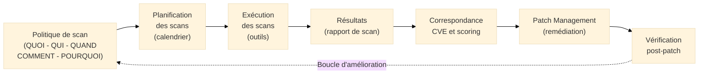

# Politique de Scan — Cadre Organisationnel

## Introduction

!!! quote "Analogie pédagogique"
    _Imaginez le **contrôle technique obligatoire** des véhicules. Ce n'est pas le mécanicien qui décide aléatoirement quand contrôler votre voiture, avec quels équipements, et quelles vérifications effectuer. Il existe un **cadre réglementaire précis** : chaque véhicule de plus de 4 ans passe son contrôle tous les 2 ans, selon une grille standardisée de 133 points de contrôle, réalisé par un centre agréé, avec un rapport documenté remis au propriétaire. Ce cadre garantit l'homogénéité, la traçabilité et la force probante des résultats. **La politique de scan fonctionne identiquement pour les systèmes d'information** : elle définit qui scanne quoi, quand, avec quels outils, selon quels critères, et comment les résultats sont exploités et documentés — transformant une activité technique ponctuelle en processus de gouvernance auditable._

**La politique de scan** est le **document organisationnel et réglementaire** qui encadre les activités de scan de vulnérabilités dans une organisation. Elle définit le cadre dans lequel les scans sont autorisés, planifiés, réalisés et exploités — garantissant que cette activité critique est cohérente, traçable et conforme aux exigences des référentiels (ISO 27001, NIS2, PCI DSS).

La politique de scan est distincte de la **procédure de scan** (comment réaliser techniquement un scan) et des **résultats de scan** (ce qui a été trouvé). Elle définit le **cadre de gouvernance** : pourquoi, qui, quoi, quand, comment et avec quelles conséquences.

!!! info "Pourquoi une politique de scan est essentielle ?"
    Sans politique formalisée, le scan de vulnérabilités est une activité ad hoc réalisée quand quelqu'un y pense, avec des périmètres incohérents, des fréquences aléatoires et des résultats non exploités. Une politique formalisée transforme cette activité en processus de sécurité auditable répondant aux exigences de NIS2 (article 21.2.f), ISO 27001 (contrôle 8.8) et PCI DSS (exigence 6.3).

 

---

## Position dans la chaîne de gestion des vulnérabilités

La politique de scan est le **point de départ** du processus de gestion des vulnérabilités. Elle conditionne la qualité de toutes les étapes suivantes — un scan mal défini produit des résultats inexploitables.

 

---

## Contenu d'une politique de scan

### 1. Objectifs et périmètre

**Objectifs de la politique :**
- Identifier les vulnérabilités avant qu'elles ne soient exploitées par des attaquants
- Alimenter le processus de patch management avec des données objectives
- Démontrer la diligence raisonnable aux auditeurs (ISO 27001, NIS2, PCI DSS)
- Mesurer l'évolution de l'exposition aux vulnérabilités dans le temps

**Périmètre — ce que la politique doit définir :**

| Catégorie d'actifs | Inclus ? | Justification si exclusion |
|-------------------|----------|---------------------------|
| Serveurs de production (exposés Internet) | OUI — prioritaire | Surface d'attaque principale |
| Serveurs internes (DMZ[^1], réseau interne) | OUI | Mouvements latéraux possibles |
| Postes de travail | OUI (échantillonnage possible) | Vecteur d'accès initial fréquent |
| Équipements réseau (switches, routeurs, firewalls) | OUI | Souvent oubliés, critiques |
| Applications web (propres et tierces) | OUI | OWASP Top 10 |
| Systèmes OT/SCADA | Conditionnel | Risque d'interruption — protocole spécifique |
| Cloud (IaaS, PaaS) | OUI | Responsabilité CSC |

**Exclusions documentées :** Tout actif hors périmètre doit être explicitement exclu avec justification. Une exclusion sans justification est un angle mort non défendable en audit.

### 2. Types de scans et fréquences

La politique doit distinguer plusieurs types de scans avec des fréquences différenciées :

| Type de scan | Objectif | Fréquence minimale | Déclencheurs ad hoc |
|-------------|----------|-------------------|---------------------|
| **Scan de vulnérabilités réseau** | Identifier les vulnérabilités sur les ports et services exposés | Mensuelle (hebdo pour les exposés Internet) | Nouveau système, changement réseau, CVE critique publiée |
| **Scan applicatif (DAST[^2])** | Tester les vulnérabilités OWASP sur les applications web | Trimestrielle | Nouvelle version applicative, après développement majeur |
| **Scan d'authentification** | Scan avec credentials pour couvrir les vulnérabilités internes | Trimestrielle | Après changement d'architecture |
| **Scan des dépendances (SCA[^3])** | Identifier les composants logiciels vulnérables (CVE dans bibliothèques) | Continue (CI/CD) + hebdomadaire | Après intégration de nouveaux composants |
| **Analyse de configuration** | Vérifier les écarts par rapport aux CIS Benchmarks | Mensuelle | Après déploiement de nouveaux systèmes |

**Fréquences selon le type d'actif :**

| Type d'actif | Scan réseau | Scan applicatif | Scan config |
|-------------|-------------|-----------------|-------------|
| Exposé Internet (serveur web, API publique) | **Hebdomadaire** | **Trimestrielle** | Mensuelle |
| Serveur interne critique (AD, BDD, ERP) | **Mensuelle** | N/A | Mensuelle |
| Serveur interne standard | Mensuelle | N/A | Trimestrielle |
| Poste de travail | Mensuelle (échantillon) | N/A | Trimestrielle |
| Équipements réseau | Mensuelle | N/A | Trimestrielle |

### 3. Outils autorisés

La politique doit spécifier les **outils de scan autorisés** et leurs conditions d'utilisation :

| Outil | Usage | Restrictions |
|-------|-------|-------------|
| **Nessus Essentials / Professional** | Scan réseau infrastructure | Profils de scan définis et validés |
| **OpenVAS / Greenbone** | Scan réseau open source | Configurations documentées |
| **Qualys VMDR** | Scan réseau + cloud | Périmètre cloud défini |
| **Burp Suite Professional** | Scan applicatif DAST | Sur environnements de test/staging prioritairement |
| **OWASP ZAP** | Scan applicatif open source | Mode passif en production, actif en staging |
| **Trivy / Snyk / Dependabot** | Scan SCA des dépendances | Intégré en CI/CD |
| **Lynis** | Audit de configuration Linux | Exécution locale sur le serveur |

**Outils non autorisés sans validation préalable :**
- Outils offensifs (Metasploit, SQLmap) sans autorisation écrite du RSSI et accord du propriétaire de l'actif
- Scans depuis l'extérieur (Internet) sans accord préalable (risque de qualification en attaque)

### 4. Responsabilités

La politique doit définir clairement **qui est responsable de quoi** :

| Rôle | Responsabilités |
|------|----------------|
| **RSSI** | Définir et maintenir la politique de scan, valider les exceptions, superviser les résultats |
| **Équipe sécurité (SOC/SecOps)** | Planifier et exécuter les scans, analyser les résultats, produire les rapports |
| **Propriétaires des actifs** | Approuver les fenêtres de scan, valider les exceptions sur leurs systèmes |
| **Équipes IT/Ops** | Fournir les inventaires à jour, appliquer les corrections, vérifier post-patch |
| **Prestataires tiers** | Réaliser les scans sur les périmètres délégués, fournir les rapports dans les délais |

### 5. Procédures de scan

**Avant le scan :**
- Vérification de l'autorisation (périmètre validé, fenêtre de maintenance si nécessaire)
- Notification aux équipes concernées (éviter les faux positifs de surveillance)
- Configuration du profil de scan (agressivité, credentials, plages d'adresses)

**Pendant le scan :**
- Supervision de l'impact sur les performances (seuils d'alerte définis)
- Procédure d'arrêt d'urgence si impact inacceptable détecté
- Journalisation de l'activité de scan

**Après le scan :**
- Analyse et qualification des résultats (faux positifs, contexte)
- Production du rapport selon le template défini
- Communication aux propriétaires des actifs dans les délais
- Alimentation du processus de patch management

### 6. Traitement des résultats

**Délais de traitement selon la criticité :**

| Criticité CVSS | CISA KEV | Délai de correction cible |
|---------------|----------|--------------------------|
| Critique (≥ 9.0) | Oui | **24 à 48h** |
| Critique (≥ 9.0) | Non + exposé Internet | **< 7 jours** |
| Élevée (7.0-8.9) | Oui | **< 7 jours** |
| Élevée (7.0-8.9) | Non | **< 30 jours** |
| Moyenne (4.0-6.9) | Non | **Cycle mensuel** |
| Faible (< 4.0) | Non | **Prochain cycle** |

**Processus de validation des faux positifs :**
- Tout résultat qualifié de faux positif doit être documenté avec justification technique
- Validation par le RSSI ou son délégué
- Conservation de la preuve pour les audits

### 7. Reporting et suivi

**Rapports à produire :**

| Rapport | Fréquence | Destinataires | Contenu |
|---------|-----------|---------------|---------|
| Rapport de scan détaillé | Après chaque scan | Équipe sécurité + IT | Résultats complets, priorisation, plan de remédiation |
| Tableau de bord vulnérabilités | Mensuel | RSSI | KPIs, tendances, top risques non traités |
| Rapport SMSI | Trimestriel | Direction | Synthèse, indicateurs, exceptions notables |
| Rapport d'audit | Annuel | Auditeurs | Preuve de conformité ISO 27001/NIS2/PCI DSS |

**Indicateurs clés de performance (KPI) :**

| KPI | Cible |
|-----|-------|
| Couverture du périmètre scanné | > 95% des actifs inventoriés |
| Délai moyen de correction CVE critique | ≤ 7 jours |
| Délai moyen de correction CVE haute | ≤ 30 jours |
| Taux de faux positifs | < 10% des résultats |
| CVE critiques non traitées en retard | 0 |

### 8. Gestion des autorisations

**Principe fondamental :** Tout scan de vulnérabilités doit être **autorisé préalablement**. Un scan non autorisé sur des systèmes tiers peut constituer une infraction pénale (accès frauduleux à un STAD[^4]).

**Cadre d'autorisation interne :**
- Les scans sur les actifs propres de l'organisation sont autorisés par la politique elle-même
- Les scans sur les systèmes hébergés chez des tiers (cloud, colocations) nécessitent une vérification des conditions contractuelles et parfois une autorisation écrite du prestataire
- Les scans depuis l'extérieur (Internet) nécessitent une autorisation spécifique du propriétaire de l'actif

**Clause contractuelle pour les prestataires :**  
La politique doit prévoir l'insertion de **clauses autorisant les scans** dans les contrats avec les prestataires d'hébergement et de services cloud, pour éviter des blocages lors des audits.

 

---

## Exigences réglementaires couvrant les scans

| Réglementation | Exigence | Référence |
|---------------|----------|-----------|
| **ISO 27001:2022** | Gestion des vulnérabilités techniques | Contrôle 8.8 |
| **NIS2** | Évaluation de l'efficacité des mesures de sécurité | Art. 21.2.f |
| **PCI DSS v4** | Scans de vulnérabilités internes trimestriels | Exig. 11.3 |
| **PCI DSS v4** | Scans externes trimestriels + après changement réseau | Exig. 11.3 |
| **DORA** | Tests de la résilience opérationnelle numérique | Art. 24-25 |
| **HDS** | Maintien en condition de sécurité | Critères HDS |

 

---

## Mise en œuvre pratique

### Checklist de création d'une politique de scan

- [ ] Définir le **périmètre** avec les propriétaires des actifs (inclusions et exclusions justifiées)
- [ ] Définir les **types de scans** et leur **fréquence** selon la criticité des actifs
- [ ] Lister les **outils autorisés** et leurs configurations validées
- [ ] Définir les **responsabilités** (RSSI, SecOps, IT, propriétaires)
- [ ] Établir les **délais de remédiation** par niveau de criticité
- [ ] Définir les **processus de reporting** (rapports, destinataires, fréquences)
- [ ] Intégrer les **clauses d'autorisation** dans les contrats tiers et cloud
- [ ] Définir la **procédure de gestion des exceptions** et faux positifs
- [ ] Faire **valider et signer** la politique par la direction
- [ ] **Communiquer** la politique aux équipes concernées
- [ ] Planifier la **révision annuelle** de la politique

### Erreurs fréquentes à éviter

!!! warning "Pièges courants"

    **Politique trop générique :**  
    _"Nous réalisons des scans réguliers" n'est pas une politique — c'est une intention. La politique doit être suffisamment précise pour être auditable : fréquences, périmètres, outils, responsables, délais._

    **Oubli des actifs cloud et des dépendances applicatives :**  
    _L'infrastructure traditionnelle est généralement bien couverte. Les compartiments S3, les fonctions Lambda, les images Docker et les bibliothèques applicatives sont souvent hors périmètre — et activement exploitées._

    **Scan sans exploitation des résultats :**  
    _Réaliser des scans sans les connecter au processus de patch management est une dépense sans valeur. La politique doit imposer que chaque rapport de scan génère un plan de remédiation assigné et suivi._

    **Pas de gestion des faux positifs :**  
    _Sans processus formel de validation des faux positifs, les équipes finissent par ignorer les résultats de scan — tuant l'utilité du processus._

 

---

## Conclusion

!!! quote "La politique de scan transforme une activité technique en processus de gouvernance."
    Une politique de scan bien construite est un document court (10 à 20 pages) mais dense, qui définit les règles du jeu pour l'ensemble de l'organisation. Elle permet aux auditeurs de comprendre en quelques pages comment l'organisation gère sa veille sur les vulnérabilités, avec quelle rigueur et quelle traçabilité. Sans elle, les scans de vulnérabilités sont des activités techniques sans statut réglementaire — ce qui les rend indéfendables en audit.

    La politique de scan est le document de gouvernance qui donne du sens et de la légitimité aux outils de scan (Nessus, Qualys, OpenVAS) et au processus de patch management qui en découle. Elle est la pièce manquante qui transforme une collection d'outils de sécurité en système de gestion des vulnérabilités cohérent et auditable.

 

---

## Ressources complémentaires

- **ISO/IEC 27001:2022** — Contrôle 8.8 (Gestion des vulnérabilités techniques)
- **ISO/IEC 27002:2022** — Guide d'implémentation du contrôle 8.8
- **ANSSI Guide** — Recommandations relatives à la gestion des correctifs
- **PCI DSS v4** — Exigences 11.2 et 11.3 (scans de vulnérabilités)
- **CIS Controls v8** — Contrôle 7 (Continuous Vulnerability Management)
- **NIST SP 800-40** — Guide to Enterprise Patch Management Planning

[^1]: La **DMZ** (*DeMilitarized Zone*, ou Zone Démilitarisée) est un sous-réseau physique ou logique qui expose les services externes d'une organisation sur Internet tout en les isolant du réseau interne. Les serveurs web, les serveurs mail et les API publiques sont typiquement placés en DMZ, protégés par des firewalls des deux côtés.
[^2]: Le **DAST** (*Dynamic Application Security Testing*, ou Test de Sécurité Dynamique des Applications) est une méthode de test de sécurité applicative qui analyse une application en cours d'exécution en simulant des attaques réelles, sans accès au code source. Il détecte des vulnérabilités comme les injections SQL, XSS, CSRF et les mauvaises configurations.
[^3]: Le **SCA** (*Software Composition Analysis*, ou Analyse de Composition Logicielle) est un processus d'identification et d'évaluation des composants open source et tiers intégrés dans une application. Il identifie les composants avec des CVE connues, des licences problématiques ou des versions obsolètes. Les outils incluent Dependabot, Snyk, OWASP Dependency-Check, Trivy.
[^4]: Un **STAD** (*Système de Traitement Automatisé de Données*) est la terminologie juridique française désignant tout système informatique. L'article 323-1 du Code pénal punit le fait "d'accéder ou de se maintenir, frauduleusement, dans tout ou partie d'un système de traitement automatisé de données" de 2 ans d'emprisonnement et 60 000€ d'amende. Tout scan de vulnérabilités sur un système sans autorisation explicite peut constituer cette infraction.

 

---

## Conclusion

!!! quote "Ce qu'il faut retenir"
    La maîtrise théorique et pratique de ces concepts est indispensable pour consolider votre posture de cybersécurité. L'évolution constante des menaces exige une veille technique régulière et une remise en question permanente des acquis.

> [Retour à l'index →](./index.md)
