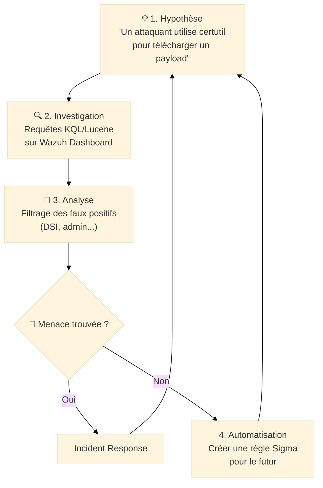

# Advanced Hunting — Chasser les Signaux Faibles

<div
  class="omny-meta"
  data-level="🔴 Expert"
  data-version="Wazuh Indexer 4.x"
  data-time="~4 heures">
</div>

## Introduction

!!! quote "Analogie pédagogique — L'Astronome et l'Exoplanète"
    Un astronome ne cherche pas une planète en regardant directement le ciel (trop sombre, trop loin). Il cherche une **infime variation de luminosité** de l'étoile parente quand la planète passe devant. C'est un **signal faible**. Le Threat Hunting avancé est identique : on ne cherche pas une alerte rouge "Ransomware détecté", on cherche une légère anomalie comportementale — un processus qui parle à une IP inhabituelle à 3h du matin, un volume de données légèrement supérieur à la moyenne. C'est l'art de voir l'invisible dans le bruit.

Le **Threat Hunting** est l'étape ultime de la détection. Là où les règles (YARA, Sigma) s'arrêtent, l'analyste prend le relais avec une approche proactive basée sur des hypothèses. Ce module vous apprend à maîtriser le langage du **Wazuh Indexer (Lucene/KQL)** pour interroger vos millions de logs avec la précision d'un scalpel.

<br>

---

## 🏗️ La Méthodologie "Hypothesis-Driven"

Un chasseur ne cherche pas au hasard. Il suit un cycle rigoureux :



---

## ⌨️ Maîtriser le Langage de Recherche

Wazuh utilise le moteur **OpenSearch**, compatible avec deux langages principaux : **Lucene** (historique) et **KQL** (Kibana Query Language - moderne et lisible).

### 1 — Requêtes Lucene (Le Standard)
Idéal pour les recherches de texte brut et les wildcard complexes.

- **Recherche exacte** : `data.win.eventdata.image: "C:\\Windows\\System32\\cmd.exe"`
- **Wildcards** : `data.win.eventdata.commandLine: *powershell*`
- **Opérateurs logiques** : `data.win.eventdata.parentImage: "winword.exe" AND NOT (data.win.eventdata.image: "splwow64.exe")`
- **Existence de champ** : `_exists_: data.win.eventdata.hashes`

### 2 — KQL (Plus intuitif)
Le langage par défaut du Dashboard Wazuh 4.x.

- **Filtrage simple** : `rule.level > 10 and agent.name: "Web-Server"`
- **Recherche imbriquée** : `data.win.eventdata.image: *schtasks.exe and data.win.eventdata.commandLine: *create*`
- **Inclusion** : `data.status: (404 or 403 or 500)`

---

## 🎯 Recettes de Chasse (Hunting Playbooks)

### 🛰️ Scénario A : Détection de Balisage (C2 Beaconing)
L'attaquant communique périodiquement avec son serveur. On cherche des flux HTTP/S répétitifs vers des domaines peu fréquents.

```kql title="KQL — Chasse au beaconing HTTP"
# On cherche des connexions sortantes non standard (port 80/443) 
# depuis des processus qui ne sont pas des navigateurs
data.win.eventdata.destinationPort: (80 or 443) 
and not data.win.eventdata.image: (*chrome.exe or *msedge.exe or *firefox.exe)
```

### 💉 Scénario B : Injection de Code (Process Hollowing)
On cherche des accès mémoire suspects vers des processus système.

```kql title="KQL — Accès suspect à LSASS ou Explorer"
# Event ID 10 de Sysmon (Process Access)
data.win.eventid: 10 
and data.win.eventdata.targetImage: (*lsass.exe or *explorer.exe)
and not data.win.eventdata.sourceImage: (*msmpeng.exe or *svchost.exe)
```

### 📦 Scénario C : LOLBins (Living off the Land)
L'attaquant utilise des outils Windows légitimes pour des actions malveillantes.

```kql title="KQL — Utilisation détournée de Certutil"
# Certutil est souvent détourné pour télécharger ou décoder des payloads
data.win.eventdata.image: *certutil.exe 
and data.win.eventdata.commandLine: (*urlcache* or *-decode*)
```

---

## 📊 Visualisation et Heatmaps

Le Threat Hunting ne se fait pas qu'en texte. Utilisez le module **MITRE ATT&CK Navigator** intégré à Wazuh pour :

1. **Identifier les trous** : Quelles techniques n'ont jamais déclenché d'alertes le mois dernier ?
2. **Prioriser** : Si 80% de vos alertes concernent la tactique "Credential Access", lancez une chasse proactive sur "Lateral Movement" pour voir si l'attaquant a déjà progressé.

!!! tip "Le secret du bon chasseur"
    Consacrez **20% de votre temps hebdomadaire** au Hunting. Si vous trouvez une menace, vous sauvez l'entreprise. Si vous ne trouvez rien, vous utilisez ces 20% pour créer de nouvelles règles Sigma afin que ce que vous avez cherché manuellement soit détecté automatiquement la prochaine fois.

---

## Conclusion

!!! quote "Ce qu'il faut retenir"
    Le Threat Hunting est une **discipline d'élite**. Elle demande une connaissance parfaite des comportements normaux de votre parc informatique pour pouvoir isoler les anomalies. Maîtriser le KQL/Lucene dans Wazuh est l'arme fatale qui vous permet de transformer une montagne de logs inutiles en une source de renseignement tactique.

> Une fois la menace identifiée par le Hunting, passez à la phase suivante : **[Incident Response & DFIR →](../ir/index.md)** pour apprendre à contenir et éradiquer l'assaillant.