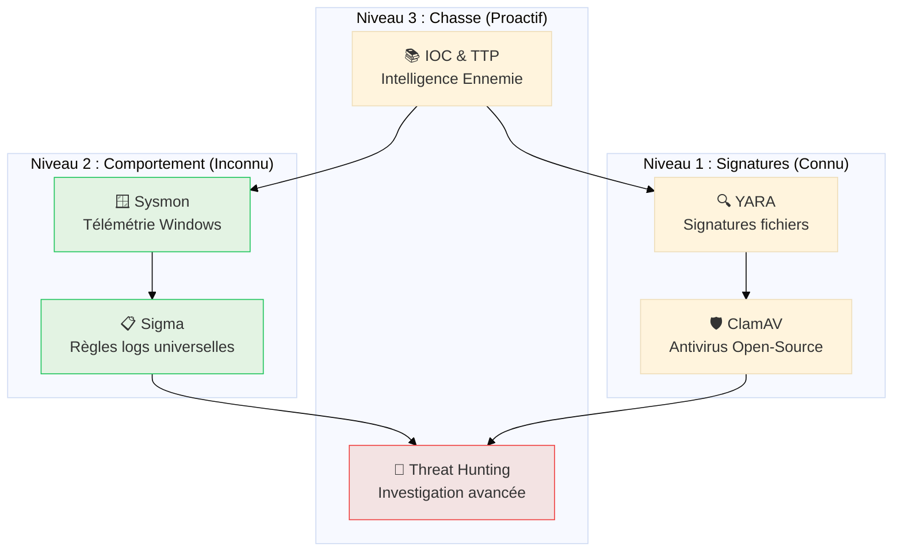

# Détection & Analyse

## Introduction

!!! quote "Analogie pédagogique — Le Détective et ses Indices"
    Un détective ne résout pas un crime en attendant que le coupable se dénonce. Il **cherche activement des indices** : une empreinte digitale, un témoignage, un reçu. Chaque indice seul est insuffisant, mais leur corrélation révèle la vérité. La **détection SOC** fonctionne exactement ainsi : les IOC sont les empreintes, les règles YARA/Sigma sont les techniques d'analyse, et le Threat Hunting est l'enquête proactive. Ce module vous donne les outils du détective cyber.

L'infrastructure SOC déployée en Phase 1 collecte des millions d'événements par jour. Cette phase vous apprend à **exploiter ces données** : créer des signatures, détecter des comportements malveillants et chasser proactivement les menaces cachées dans les logs.

 

---

## Stratégie de Détection

!!! abstract "Vision Holistique"
    La détection moderne ne repose plus sur une simple liste noire de hashs ou d'IPs. Elle s'appuie sur la **Défense en Profondeur** : si l'attaquant contourne le réseau, il est vu sur l'hôte. S'il cache son binaire, il est vu par son comportement. Ce module vous apprend à orchestrer ces couches pour ne laisser aucun angle mort.

---

## 🚀 Le Master Scénario

Pour comprendre comment ces outils collaborent, suivez une attaque réelle de bout en bout :

[:lucide-skull: **Master Scénario : Cycle de vie d'un Ransomware**](./master-scenario-ransomware.md){ .md-button .md-button--primary }

---

## Modules de formation

### 1 — IOC & TTP : le vocabulaire fondamental

Avant d'écrire la moindre règle, comprendre **ce qu'on cherche** : indicateurs de compromission, tactiques, techniques et procédures des attaquants, framework MITRE ATT&CK.

[:lucide-book-open-check: Cours IOC & TTP →](./ioc-ttp.md)

 

---

### 2 — Sysmon : télémétrie Windows haute-fidélité

Les Event Logs Windows natifs sont insuffisants pour un SOC. Sysmon les enrichit avec des événements critiques : création de processus avec hash, connexions réseau par processus, injections de code...

[:lucide-book-open-check: Cours Sysmon →](./sysmon.md)

 

---

### 3 — YARA : signatures de fichiers malveillants

YARA est le langage universel de détection de malwares par contenu de fichier. Créez des règles qui identifient les malwares connus ou les familles entières à partir de leurs chaînes et patterns caractéristiques.

[:lucide-book-open-check: Cours YARA →](./yara.md)

 

---

### 4 — Sigma : règles universelles de détection

Sigma est à la détection de logs ce que YARA est aux fichiers : un format **universel** de règles que vous écrivez une fois et convertissez vers n'importe quel SIEM (Wazuh, Splunk, Elastic, QRadar).

[:lucide-book-open-check: Cours Sigma →](./sigma.md)

 

---

### 5 — Threat Hunting : la chasse proactive

Ne pas attendre les alertes — **chercher l'attaquant** avant qu'il cause des dégâts. Méthodologie hypothèse-driven, utilisation de MITRE ATT&CK Navigator, et requêtes avancées sur vos logs Wazuh.

[:lucide-book-open-check: Cours Threat Hunting →](./hunting.md)

 

---

### 6 — ClamAV : antivirus open-source intégré

ClamAV est l'antivirus open-source de référence. Son intégration avec Wazuh permet de déclencher automatiquement un scan antivirus lors de la détection de fichiers suspects par le FIM.

[:lucide-book-open-check: Cours ClamAV →](./clamav.md)

 

---

## Conclusion

!!! quote "Ce qu'il faut retenir"
    La détection n'est pas une science exacte — c'est un **équilibre permanent** entre sensibilité (détecter tout) et précision (éviter les faux positifs). Chaque règle que vous écrivez est un pari : trop large, elle noie l'analyste sous les fausses alertes ; trop étroite, elle manque des variantes de l'attaque. L'objectif est de progresser continuellement : chaque incident résolu enrichit vos règles, chaque chasse révèle de nouveaux patterns.

> Commencez par **[IOC & TTP →](./ioc-ttp.md)** — c'est le socle conceptuel indispensable avant d'écrire la moindre règle.
