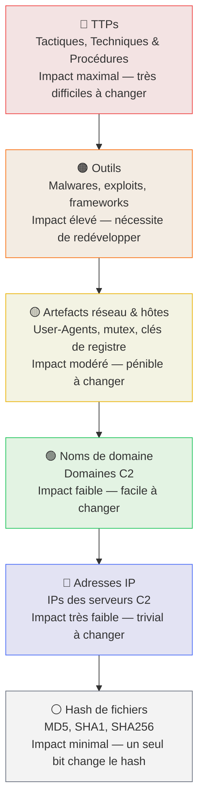

# IOC & TTP — Les Fondamentaux de la Détection

<div
  class="omny-meta"
  data-level="🟡 Intermédiaire"
  data-version="MITRE ATT&CK v15"
  data-time="~2 heures">
</div>

## Introduction

!!! quote "Analogie pédagogique — L'Empreinte Digitale vs le Mode Opératoire"
    Après un cambriolage, la police dispose de deux types d'indices : l'**empreinte digitale** (IOC — preuve directe, unique à ce criminel) et le **mode opératoire** (TTP — la façon de forcer les serrures, les heures de passage, les outils utilisés). L'empreinte identifie **qui était là**. Le mode opératoire identifie **comment le crime a été commis** — et permet de relier des crimes différents au même auteur, même si les empreintes ont été effacées. En cybersécurité : les IOC identifient une menace connue, les TTP identifient le comportement de l'attaquant même s'il change ses outils.

<br>

---

## Les IOC — Indicateurs of Compromise

Un **IOC** est une preuve technique observable qu'un système a été compromis.

### La pyramide de la douleur

La **Pyramid of Pain** (David Bianco, 2013) classe les IOC selon leur impact sur l'attaquant quand on les bloque :



_Cette pyramide enseigne une leçon fondamentale : bloquer des IPs ou des hash est facile pour l'attaquant à contourner (il change de serveur ou recompile son malware). Détecter les **TTPs** — sa façon d'agir — est autrement plus impactant car changer de méthode demande des mois de travail._

### Types d'IOC et leur durée de vie

| Type d'IOC | Exemple | Durée de vie estimée | Valeur de détection |
|---|---|---|---|
| **Hash de fichier** (SHA256) | `e3b0c...b855` | Longue (mois/années) | Faible (recompilation triviale) |
| **Adresse IP** | `185.220.101.45` | Courte (heures/jours) | Faible (VPN/proxy) |
| **Nom de domaine** | `evil-c2.xyz` | Moyenne (semaines) | Moyenne |
| **URL** | `http://evil.xyz/payload.exe` | Très courte (heures) | Faible |
| **User-Agent HTTP** | `Mozilla/5.0 (compatible; Bot/1.0)` | Moyenne | Moyenne |
| **Mutex** | `Global\CtrlPanel_Mutex_777` | Longue | Élevée |
| **Clé de registre** | `HKLM\SOFTWARE\evil\persistence` | Longue | Élevée |
| **Règle YARA** | Signature du malware | Longue | Élevée |
| **TTP MITRE** | T1059 (PowerShell exécuté) | Permanente | Maximale |

<br>

---

## Les TTP — Tactiques, Techniques & Procédures

Les **TTP** décrivent le **comportement de l'attaquant** indépendamment des outils utilisés.

- **Tactique** : l'objectif à atteindre (ex: "Persistance")
- **Technique** : la méthode utilisée (ex: "Modifier les clés Run du registre")
- **Procédure** : l'implémentation spécifique (ex: "Ajouter une entrée HKLM\...\Run pointant vers `C:\Users\evil\malware.exe`")

<br>

---

## MITRE ATT&CK — La carte de l'adversaire

**MITRE ATT&CK** est le référentiel mondial des TTP utilisées par les attaquants réels. Il recense **14 tactiques** et plus de **600 techniques** documentées avec des exemples d'implémentation réels.

```mermaid
graph LR
    A["🔍 Reconnaissance"] --> B["🎯 Resource Development"]
    B --> C["🚪 Initial Access"]
    C --> D["⚙️ Execution"]
    D --> E["🔄 Persistence"]
    E --> F["⬆️ Privilege Escalation"]
    F --> G["🛡️ Defense Evasion"]
    G --> H["🔑 Credential Access"]
    H --> I["🗺️ Discovery"]
    I --> J["↔️ Lateral Movement"]
    J --> K["📦 Collection"]
    K --> L["📡 Command & Control"]
    L --> M["📤 Exfiltration"]
    M --> N["💥 Impact"]

    style C fill:#f3e3e3,stroke:#ef4444
    style L fill:#f3e3e3,stroke:#ef4444
    style N fill:#f3e3e3,stroke:#ef4444
```



### Exemples de techniques courantes

| ID MITRE | Tactique | Technique | Exemple concret |
|---|---|---|---|
| **T1059.001** | Execution | PowerShell | `powershell -enc <base64>` |
| **T1053.005** | Persistence | Scheduled Task | Tâche planifiée cachée dans `\Microsoft\Windows\` |
| **T1110.001** | Credential Access | Brute Force | 1000 tentatives SSH en 10 minutes |
| **T1027** | Defense Evasion | Obfuscated Files | Script PowerShell encodé en Base64 |
| **T1071.001** | C&C | Web Protocols | Beacon HTTPS vers serveur C2 |
| **T1486** | Impact | Data Encrypted | Ransomware chiffrant les fichiers |

### Utiliser ATT&CK Navigator

**ATT&CK Navigator** est l'outil officiel pour visualiser et annoter la matrice ATT&CK. Accessible sur [attack.mitre.org/navigator](https://mitre-attack.github.io/attack-navigator/).

**Cas d'usage SOC :**
- **Couvrir les lacunes** : mapper vos règles Wazuh/Sigma sur la matrice pour identifier les techniques non couvertes
- **Profilage adversaire** : charger le profil d'un groupe APT pour anticiper ses techniques
- **Reporting** : générer une heatmap des techniques détectées après un incident

<br>

---

## Intégration dans Wazuh

Wazuh mappe automatiquement ses alertes sur MITRE ATT&CK via les balises `<mitre>` dans les règles :

```xml title="Règle Wazuh avec mapping MITRE ATT&CK"
<rule id="100030" level="14">
  <if_sid>61603</if_sid>
  <!-- Processus Office (Word, Excel) qui lance un interpréteur de commandes -->
  <field name="win.eventdata.parentImage" type="pcre2">(?i)(WINWORD|EXCEL)\.EXE</field>
  <field name="win.eventdata.image" type="pcre2">(?i)(cmd|powershell|wscript)\.exe</field>
  <description>Spearphishing via macro Office — processus suspect lancé</description>

  <!-- Mappage multi-techniques MITRE -->
  <mitre>
    <id>T1566.001</id>  <!-- Phishing: Spearphishing Attachment -->
    <id>T1059.001</id>  <!-- Command and Scripting: PowerShell -->
    <id>T1204.002</id>  <!-- User Execution: Malicious File -->
  </mitre>
</rule>
```

_En ajoutant ces balises, l'alerte apparaît automatiquement dans le module **MITRE ATT&CK du Dashboard Wazuh**, permettant de visualiser quelles tactiques et techniques sont actives dans votre environnement._

<br>

---

## Conclusion

!!! quote "Ce qu'il faut retenir"
    La distinction **IOC vs TTP** est fondamentale en cybersécurité défensive. Les IOC sont utiles à court terme pour bloquer une menace connue. Les TTP permettent de détecter les attaques **même quand l'attaquant change tous ses outils**. Un SOC mature base sa détection principalement sur les TTP (comportements) plutôt que sur les IOC (indicateurs ponctuels). MITRE ATT&CK est la carte qui vous permet de construire cette détection comportementale de manière systématique.

> Passez maintenant au cours **[Sysmon →](./sysmon.md)** pour apprendre à enrichir la télémétrie Windows et rendre vos règles comportementales réellement opérationnelles.
