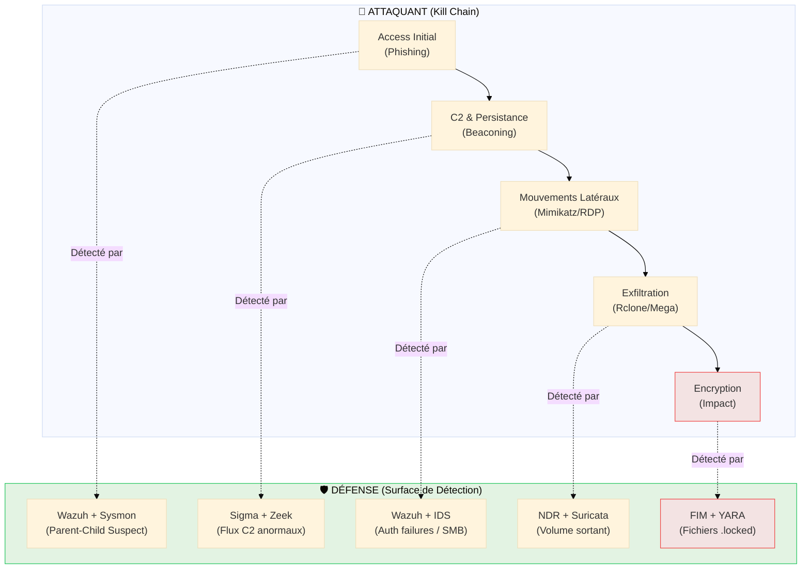

# Master Scénario — Cycle de vie d'un Ransomware

<div
  class="omny-meta"
  data-level="🔴 Expert"
  data-version="1.0"
  data-time="25-30 minutes">
</div>

## Introduction

!!! quote "Analogie pédagogique — L'Infiltration du Casse du Siècle"
    Un braquage de banque ne commence pas par l'explosion du coffre-fort. Il commence des mois avant : un employé est soudoyé pour laisser une porte ouverte (**Accès Initial**), des micros sont posés (**C2**), les gardiens sont observés pour connaître leurs rondes (**Reconnaissance Interne**), et les plans du bâtiment sont volés (**Exfiltration**). Ce n'est qu'à la toute fin, quand tout est prêt, que l'alarme sonne. Un **Ransomware** suit la même logique. Si vous n'écoutez que l'alarme du coffre (l'encryption), vous avez déjà perdu. Ce scénario vous apprend à détecter les "pas de loup" de l'attaquant avant l'explosion finale.

Pour comprendre la puissance d'un SOC, il faut arrêter de regarder les outils en silos. Ce master scénario suit le cycle de vie d'une attaque réelle (type **LockBit 3.0**) et montre comment chaque brique de détection (Wazuh, Sysmon, YARA, Sigma) se passe le relais pour stopper l'assaillant.

<br>

---

## Le Master Diagram : Chaine de Détection vs Kill Chain



---

## 🛑 Étape 1 : Accès Initial (Le Patient Zéro)

**L'Action** : Un utilisateur reçoit un mail avec un fichier `.zip`. Il l'extrait et lance un fichier `Facture.js`.
**Le Comportement** : `wscript.exe` (moteur de script Windows) est lancé par l'utilisateur et télécharge immédiatement un exécutable depuis Internet.

### Détection — Le relais Wazuh + Sysmon
Grâce à la télémétrie **Sysmon**, le SOC voit ce qu'un log Windows classique ignorerait : la hiérarchie suspecte des processus.

```xml title="Alerte Wazuh (Base Sysmon Event ID 1)"
<rule id="100050" level="12">
  <if_sid>61603</if_sid>
  <field name="win.eventdata.parentImage">\\wscript.exe</field>
  <field name="win.eventdata.image">\\powershell.exe|\\cmd.exe|\\certutil.exe</field>
  <description>Suspicious Child Process: Script engine launching shell or downloader</description>
  <mitre>
    <id>T1059.007</id> <!-- JavaScript/JScript -->
    <id>T1105</id> <!-- Ingress Tool Transfer -->
  </mitre>
</rule>
```

---

## 📡 Étape 2 : C2 & Persistance (Le Beaconing)

**L'Action** : Le malware (un agent Cobalt Strike) s'installe dans `AppData` et contacte son serveur de commande (C2) toutes les 30 secondes.
**Le Comportement** : Flux réseau périodique vers une IP inconnue avec un User-Agent suspect.

### Détection — Le relais Sigma + Zeek/Suricata
Une règle **Sigma** corrélant les connexions réseau sortantes de processus non-navigateurs (ex: un `.exe` random dans AppData) lève l'alerte.

```yaml title="Règle Sigma (Network Connection from Suspicious Location)"
title: Connection from AppData Execution
status: experimental
logsource:
    product: windows
    service: sysmon
detection:
    selection:
        EventID: 3 # Network Connection
        Image|contains: 
            - '\AppData\Local\'
            - '\AppData\Roaming\'
    condition: selection
level: high
```

---

## ↔️ Étape 3 : Mouvements Latéraux (L'Expansion)

**L'Action** : L'attaquant utilise `Mimikatz` pour dumper les mots de passe de la mémoire (LSASS) et tente de se connecter en RDP sur le serveur de fichiers.
**Le Comportement** : Accès suspect à la mémoire de `lsass.exe` et pics d'échecs d'authentification SMB/RDP.

### Détection — Le relais Wazuh + IDS
L'agent Wazuh détecte l'accès mémoire (Sysmon ID 10) tandis que l'IDS (Suricata) voit le scan de ports SMB interne.

!!! danger "Signal Critique"
    L'accès au processus LSASS est l'un des signaux les plus forts d'une tentative de vol d'identifiants. Une alerte N3 doit être levée immédiatement.

---

## 📤 Étape 4 : Exfiltration (Le Vol des Données)

**L'Action** : Avant de chiffrer, l'attaquant vole les données sensibles (double extorsion). Il utilise `Rclone` pour uploader 200 Go de données vers un stockage Cloud (Mega.nz).
**Le Comportement** : Explosion du trafic sortant vers une destination inhabituelle.

### Détection — Le relais NDR (ntopng / Zeek)
C'est ici que le **NDR** brille. Contrairement au SIEM qui cherche des logs, le NDR cherche des **anomalies de volume**. Une alerte "Data Exfiltration" est levée sur le tableau de bord car le trafic sortant de ce poste dépasse de 5000% sa moyenne habituelle.

---

## 💥 Étape 5 : Encryption (L'Impact)

**L'Action** : Le binaire du Ransomware est déployé et commence à chiffrer les fichiers.
**Le Comportement** : Modification massive et rapide de milliers de fichiers. Extension `.locked`. Suppression des Shadow Copies.

### Détection — Le relais FIM + YARA
Le module **FIM (File Integrity Monitoring)** de Wazuh détecte la modification frénétique des fichiers. Il déclenche alors un scan **YARA** à chaud sur le processus actif.

```yara title="Signature YARA (Generic Ransomware behavior)"
rule Ransomware_Generic_Pattern {
    strings:
        $s1 = "vssadmin.exe delete shadows /all /quiet" wide ascii
        $s2 = ".locked" wide ascii
        $s3 = "Your files have been encrypted" wide ascii
    condition:
        2 of them
}
```

---

## 🏁 Conclusion : La Force de la Corrélation

!!! success "Bilan de l'Investigation"
    Si vous n'aviez que l'antivirus, vous n'auriez vu que l'étape 5 (trop tard).  
    Si vous n'aviez que le pare-feu, vous n'auriez rien vu (trafic chiffré).  
    
    C'est en combinant **l'analyse de processus (Sysmon)**, **la corrélation de logs (Wazuh/Sigma)** et **l'analyse comportementale réseau (NDR)** que le SOC a pu détecter l'attaque dès l'étape 2, limitant l'impact à un seul poste de travail au lieu d'une faillite totale de l'entreprise.

> **Prochaine étape :** Apprenez à écrire ces règles vous-même en commençant par le cours **[YARA : Signatures Malwares →](./yara.md)**.

<br>

---

## Conclusion

!!! quote "Ce qu'il faut retenir"
    La détection (Detection Engineering) repose sur la création de règles précises et évolutives. Comprendre les TTPs (Tactics, Techniques, and Procedures) des attaquants est indispensable pour écrire des signatures qui génèrent peu de faux positifs.

> [Retour à l'index des opérations →](../../index.md)
