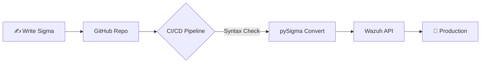

# Sigma — Règles Universelles de Détection

<div
  class="omny-meta"
  data-level="🟡 Intermédiaire"
  data-version="Sigma 2.x (pySigma)"
  data-time="~3 heures">
</div>

## Introduction

!!! quote "Analogie pédagogique — La Recette de Cuisine Universelle"
    Une recette écrite en français ne fonctionne que pour des cuisiniers francophones. Une recette en **langage universel** (avec pictogrammes et mesures standardisées) peut être suivie par n'importe quel cuisinier, avec n'importe quel équipement. **Sigma** est cette recette universelle pour la détection SOC : vous écrivez la règle **une seule fois** en YAML, et elle est automatiquement traduite vers Wazuh, Splunk, Elastic, QRadar ou n'importe quel SIEM — sans réécriture.

**Sigma** est un format de règles de détection **vendor-agnostic** (indépendant du SIEM). Développé par Florian Roth et Thomas Patzke, il permet aux équipes SOC de :

- Écrire des règles **lisibles** et **partageables** en YAML
- Les **convertir automatiquement** vers n'importe quel SIEM
- Bénéficier d'un **référentiel communautaire** de milliers de règles prêtes à l'emploi

!!! info "Sigma vs YARA"
    | | YARA | Sigma |
    |---|---|---|
    | **Cible** | Contenu de fichiers | Événements de logs |
    | **Usage** | Détection de malwares | Détection dans les SIEM |
    | **Format** | Syntaxe propriétaire | YAML standardisé |
    | **Conversion** | N/A | Multi-SIEM via pySigma |

<br>

---

## Structure d'une règle Sigma

```yaml title="Structure complète d'une règle Sigma"
# En-tête de la règle
title: Détection PowerShell Encodé
id: 7b9e2a3f-1234-5678-abcd-ef0123456789   # UUID unique
status: stable                              # test, experimental, stable
description: |
  Détecte l'exécution de PowerShell avec un argument encodé Base64,
  technique courante pour obfusquer du code malveillant.
references:
  - https://attack.mitre.org/techniques/T1059/001/
author: SOC Team OmnyDocs
date: 2025/04/23
modified: 2025/04/23
tags:
  - attack.execution
  - attack.t1059.001         # Mappage MITRE ATT&CK automatique
  - attack.defense_evasion
  - attack.t1027

# Source de logs concernée
logsource:
  category: process_creation  # Type d'événement
  product: windows            # OS cible

# Conditions de détection
detection:
  selection:
    Image|endswith:
      - '\powershell.exe'
      - '\pwsh.exe'          # PowerShell Core
    CommandLine|contains|all:
      - '-enc'               # Argument d'encodage (variations)
  selection_alt:
    CommandLine|contains:
      - '-EncodedCommand '
      - '-e '

  # Exclure les processus légitimes connus
  filter_legitimate:
    ParentImage|endswith:
      - '\VsDevCmd.bat'      # Visual Studio
      - '\MSBuild.exe'

  condition: (selection or selection_alt) and not filter_legitimate

# Métadonnées additionnelles
falsepositives:
  - Scripts PowerShell de déploiement légitimes
  - Outils DevOps utilisant l'encodage (rares)
level: high                   # informational, low, medium, high, critical
```

<br>

---

## Exemples de règles Sigma pour SOC

```yaml title="sigma-soc-rules.yml — Règles de détection courantes"
# ===========================================================================
# Règle 1 : Ajout d'un utilisateur au groupe Administrateurs
# ===========================================================================
title: Ajout Utilisateur au Groupe Administrateurs Windows
id: c3f45a21-dead-beef-cafe-123456789abc
status: stable
tags:
  - attack.persistence
  - attack.t1098

logsource:
  product: windows
  service: security   # Windows Security Event Log

detection:
  selection:
    EventID: 4732     # "A member was added to a security-enabled local group"
    TargetUserName: 'Administrators'
  condition: selection

level: high
falsepositives:
  - Actions administratives légitimes

---
# ===========================================================================
# Règle 2 : Création d'une tâche planifiée depuis la ligne de commande
# ===========================================================================
title: Création Tâche Planifiée via schtasks.exe
id: 92d1c4e7-fade-0000-1111-abcdef012345
status: stable
tags:
  - attack.persistence
  - attack.t1053.005

logsource:
  category: process_creation
  product: windows

detection:
  selection:
    Image|endswith: '\schtasks.exe'
    CommandLine|contains|all:
      - '/create'
      - '/sc'
  condition: selection

level: medium
falsepositives:
  - Déploiements automatisés (Ansible, SCCM)

---
# ===========================================================================
# Règle 3 : LSASS Memory Dump (Mimikatz / credential dumping)
# ===========================================================================
title: Accès Mémoire LSASS — Credential Dumping Potentiel
id: aabbcc11-2233-4455-6677-8899aabbccdd
status: stable
tags:
  - attack.credential_access
  - attack.t1003.001

logsource:
  category: process_access
  product: windows

detection:
  selection:
    TargetImage|endswith: '\lsass.exe'
    GrantedAccess|contains:
      - '0x1010'    # PROCESS_VM_READ | PROCESS_QUERY_INFORMATION
      - '0x1410'    # Permissions typiques Mimikatz
      - '0x143a'

  filter_legitimate:
    SourceImage|contains:
      - 'MsMpEng.exe'   # Windows Defender
      - 'csrss.exe'     # Processus système

  condition: selection and not filter_legitimate

level: critical
falsepositives:
  - Outils de débogage légitimes (WinDbg, ProcDump avec autorisation)

---
# ===========================================================================
# Règle 4 : Détection Log4Shell (CVE-2021-44228)
# ===========================================================================
title: Tentative d'exploitation Log4j via HTTP Header
id: 5f9e2a3f-1234-5678-abcd-ef0123456789
status: stable
tags:
  - attack.initial_access
  - attack.t1190
  - cve.2021.44228

logsource:
  category: webserver
  product: linux

detection:
    selection:
        # Cherche le pattern ${jndi:ldap://...} dans les logs web
        c-uri|contains: '${jndi:'
        user-agent|contains: '${jndi:'
    condition: selection

level: critical
```

<br>

---

## Expertise : Modificateurs et Logique Complexe

La puissance de Sigma réside dans ses **modificateurs** qui permettent de créer une logique de détection très fine sans écrire de regex complexes.

| Modificateur | Usage | Exemple |
|---|---|---|
| **`|contains`** | Cherche une sous-chaîne | `CommandLine|contains: 'mimikatz'` |
| **`|endswith`** | Cherche une fin de chaîne | `Image|endswith: '\cmd.exe'` |
| **`|all`** | Toutes les valeurs doivent être présentes | `CommandLine|contains|all: ['-enc', 'IEX']` |
| **`|any`** | Au moins une valeur présente | `CommandLine|contains|any: ['-e', '-enc', '-encoded']` |
| **`|base64`** | Cherche la version encodée de la string | `CommandLine|base64: 'Invoke-Expression'` |

---

## Detection-as-Code (DaC)

Dans un SOC moderne, on ne télécharge pas manuellement des fichiers XML dans Wazuh. On traite la détection comme du **code source**.

### Pipeline CI/CD de Détection
Le workflow professionnel recommandé est le suivant :

1. **Git Repo** : Les règles Sigma sont stockées dans un repo Git.
2. **Linting** : Une action GitHub/GitLab vérifie la syntaxe YAML via `sigma check`.
3. **Conversion** : `pySigma` convertit automatiquement les règles vers le format du SIEM (Wazuh XML, Elastic DSL).
4. **Testing** : Les règles sont testées contre des logs d'attaque (ex: via `Invoke-AtomicRedTeam`).
5. **Deployment** : Les règles validées sont poussées vers le SIEM via API.



!!! tip "Pourquoi le DaC ?"
    Le Detection-as-Code garantit la **traçabilité** (qui a modifié la règle ?), la **reproductibilité** (facile à redéployer) et la **qualité** (test automatique avant prod).

## Convertir des règles Sigma vers Wazuh

**pySigma** est l'outil officiel de conversion. Il génère le code natif de chaque SIEM depuis les règles YAML.

```bash title="Installation et utilisation de pySigma"
# Installer pySigma avec le backend Wazuh
pip install pySigma pySigma-backend-wazuh

# Convertir une règle Sigma vers Wazuh XML
sigma convert -t wazuh -f wazuh_xml ma_regle.yml

# Convertir vers Elastic (Elasticsearch Query DSL)
sigma convert -t elasticsearch -f dsl ma_regle.yml

# Convertir vers Splunk SPL
sigma convert -t splunk ma_regle.yml

# Convertir un répertoire entier de règles
sigma convert -t wazuh -f wazuh_xml ./sigma-rules/ -o wazuh_rules_output.xml

# Exemple de sortie pour Wazuh :
# <rule id="..." level="...">
#   <if_sid>...</if_sid>
#   <field name="win.eventdata.commandLine" type="pcre2">(?i)-enc</field>
#   ...
# </rule>
```

<br>

---

## Référentiel communautaire SigmaHQ

Le projet **SigmaHQ** maintient plus de **3 000 règles** prêtes à l'emploi, organisées par catégorie.

```bash title="Utiliser le référentiel SigmaHQ"
# Cloner le référentiel officiel
git clone https://github.com/SigmaHQ/sigma
cd sigma

# Structure du référentiel
ls rules/
# cloud/     → AWS, Azure, GCP
# linux/     → Événements Linux
# network/   → Logs réseau
# proxy/     → Proxy Web
# windows/   → Événements Windows (le plus complet)

# Convertir toutes les règles Windows vers Wazuh
sigma convert -t wazuh -f wazuh_xml rules/windows/ -o wazuh_sigma_windows.xml

# Filtrer par niveau de criticité
sigma convert -t wazuh rules/windows/ --filter "level=critical or level=high"
```

<br>

---

## Conclusion

!!! quote "Ce qu'il faut retenir"
    Sigma est le **pont entre la communauté et votre SIEM**. Les milliers de règles SigmaHQ représentent des années de travail de centaines d'experts en détection — toutes accessibles gratuitement et convertibles vers votre SIEM en quelques commandes. Un SOC qui ignore Sigma repart de zéro là où il pourrait disposer d'une base solide en quelques heures.

> Passez au cours **[Threat Hunting →](./hunting.md)** pour apprendre à chercher proactivement les attaquants qui ont contourné vos règles.

<br>