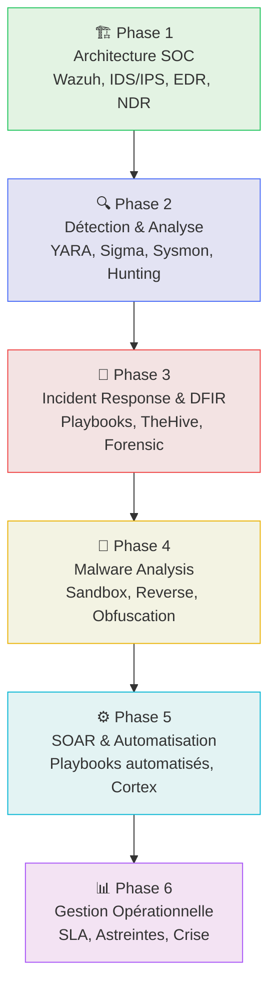

# Cyber : Opérations & SOC (Blue Team)

## Introduction

!!! quote "Analogie pédagogique — La Tour de Contrôle Aérienne"
    Dans un grand aéroport, les avions ne naviguent pas au hasard : une **tour de contrôle** surveille chaque trajectoire, détecte les anomalies et coordonne immédiatement la réponse en cas de problème. Le **SOC (Security Operations Center)** est exactement cela pour votre système d'information. Des capteurs partout (agents, sondes réseau, IDS), un cerveau central (SIEM) qui corrèle les événements, et des analystes humains qui prennent les décisions critiques. Rien ne passe sans être vu.

Un **Security Operations Center** est le dispositif opérationnel central de la cybersécurité défensive. Sa mission : **détecter les menaces avant qu'elles ne causent de dommages**, **répondre aux incidents avec méthode**, et **améliorer continuellement la posture de sécurité** de l'organisation.

Cette section vous forme à devenir un opérateur SOC complet — de l'architecture initiale jusqu'à la gestion de crise en passant par la chasse aux menaces.

 

---

## Parcours pédagogique complet

 

---

## Phase 1 — Architecture SOC

!!! info "Objectif"
    Comprendre les composants techniques d'un SOC moderne et savoir les déployer. C'est la fondation de tout le reste.

-   :lucide-layers:{ .lg .middle } **Architecture SOC**

    ---
    Les 5 briques fondamentales d'un SOC : SIEM, EDR/XDR, IDS/IPS, NDR, TIP. Comment elles s'articulent pour former une chaîne de détection cohérente.

    [:lucide-book-open-check: Accéder à l'Architecture SOC](./soc/index.md)

 

---

## Phase 2 — Détection & Analyse

!!! info "Objectif"
    Apprendre à créer des règles de détection, comprendre les IOC et TTP, et chasser proactivement les menaces cachées dans les logs.

-   :lucide-search:{ .lg .middle } **Détection & Analyse**

    ---
    IOC & TTP, Sysmon (télémétrie Windows), YARA (signatures malware), Sigma (règles universelles), Threat Hunting proactif.

    [:lucide-book-open-check: Accéder à Détection & Analyse](./detection/index.md)

 

---

## Phase 3 — Incident Response & DFIR

!!! info "Objectif"
    Gérer un incident de sécurité avec méthode : de la qualification initiale jusqu'à la remédiation et le retour d'expérience.

-   :lucide-siren:{ .lg .middle } **Incident Response & DFIR**

    ---
    Cycle NIST en 6 phases, playbooks DFIR, rôle du CSIRT, TheHive pour la gestion d'incidents, investigation forensique complète.

    [:lucide-book-open-check: Accéder à Incident Response & DFIR](./ir/index.md)

 

---

## Phase 4 — Malware Analysis

!!! info "Objectif"
    Comprendre comment fonctionne un logiciel malveillant pour mieux le détecter et construire des défenses adaptées.

-   :lucide-bug:{ .lg .middle } **Malware Analysis**

    ---
    Analyse statique et dynamique de malwares : sandbox, reverse engineering avec Ghidra, techniques d'obfuscation et d'évasion.

    [:lucide-book-open-check: Accéder à Malware Analysis](./malware/index.md)

 

---

## Phase 5 — SOAR & Automatisation

!!! info "Objectif"
    Le volume d'alertes SOC est trop important pour être traité manuellement. Automatiser la réponse est une nécessité opérationnelle.

-   :lucide-zap:{ .lg .middle } **SOAR & Automatisation**

    ---
    Concept SOAR, réduction du MTTR, playbooks automatisés de réponse aux incidents, Cortex comme moteur d'analyzers et de responders.

    [:lucide-book-open-check: Accéder à SOAR & Automatisation](./soar/index.md)

 

---

## Phase 6 — Gestion Opérationnelle

!!! info "Objectif"
    Un SOC technique sans gestion opérationnelle rigoureuse s'effondre sous le volume d'alertes. Ce module couvre le pilotage humain.

-   :lucide-bar-chart-2:{ .lg .middle } **Gestion Opérationnelle**

    ---
    Métriques clés (MTTD, MTTR), SLA/SLO, organisation des astreintes, communication de crise interne et externe.

    [:lucide-book-open-check: Accéder à Gestion Opérationnelle](./management/index.md)

 

---

## Prérequis recommandés

!!! warning "Niveau requis"
    Cette section suppose une maîtrise des fondamentaux réseau (TCP/IP, DNS, HTTP) et système (Linux, Windows). Si nécessaire, consultez d'abord la section **[Sys-Réseau →](../../sys-reseau/index.md)**.

## Conclusion

!!! quote "Ce qu'il faut retenir avant de commencer"
    Un SOC n'est pas un produit que l'on achète — c'est une **capacité opérationnelle** que l'on construit. Elle repose sur trois piliers indissociables : des **outils** correctement déployés et configurés, des **processus** clairs et testés régulièrement, et des **personnes** formées et organisées. Les meilleurs SIEM du marché ne valent rien sans analystes compétents pour interpréter leurs alertes.

> Commencez par la [Phase 1 — Architecture SOC →](./soc/index.md) pour comprendre comment les briques s'assemblent avant d'apprendre à les utiliser.

 

---

## Conclusion

!!! quote "Ce qu'il faut retenir"
    La maîtrise théorique et pratique de ces concepts est indispensable pour consolider votre posture de cybersécurité. L'évolution constante des menaces exige une veille technique régulière et une remise en question permanente des acquis.

> [Retour à l'index →](./index.md)
