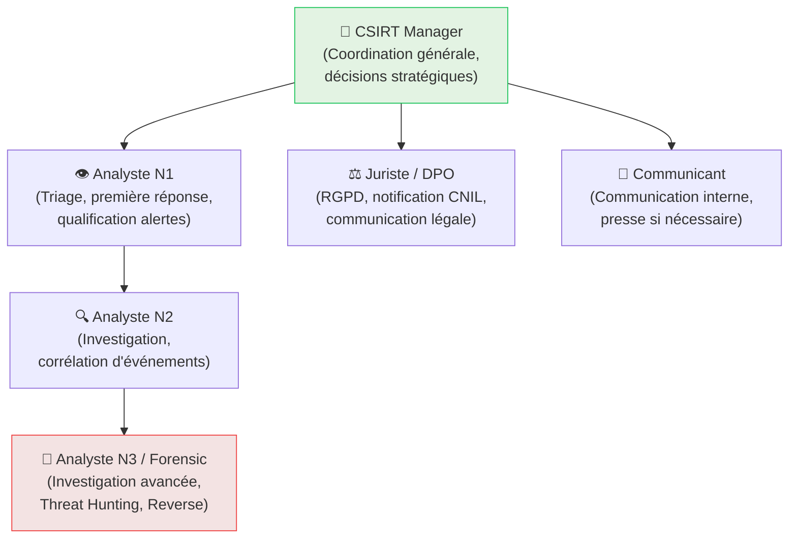
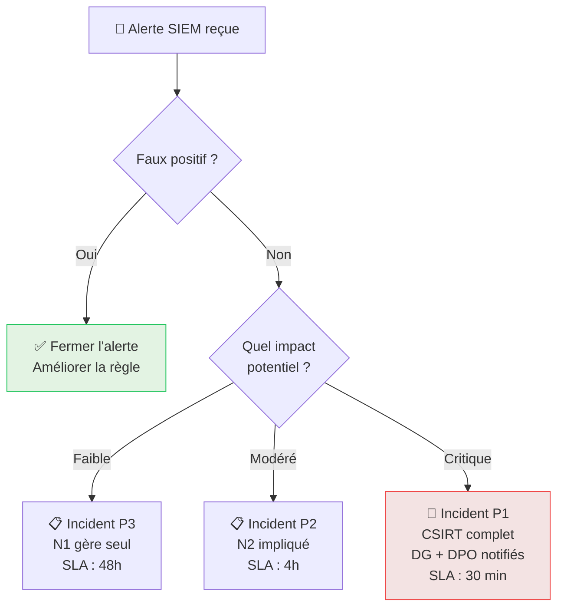

# CSIRT / CERT — Organisation de la Réponse aux Incidents

<div
  class="omny-meta"
  data-level="🟡 Intermédiaire"
  data-version="2025"
  data-time="~2 heures">
</div>

## Introduction

!!! quote "Analogie pédagogique — Le SAMU et le Centre 15"
    Quand vous appelez le 15 pour une urgence médicale, vous ne parlez pas directement à un chirurgien. Vous parlez au **Centre 15** — une équipe spécialisée qui qualifie l'urgence, envoie les bons secours, coordonne les hôpitaux et gère la communication. Le **CSIRT** est le Centre 15 de la cybersécurité : il centralise les signalements, qualifie les incidents, coordonne la réponse technique et gère la communication de crise.

Un **CSIRT (Computer Security Incident Response Team)** est l'équipe organisée chargée de gérer les incidents de sécurité. Un **CERT (Computer Emergency Response Team)** est un label similaire (souvent utilisé pour les équipes nationales ou sectorielles).

<br>

---

## Rôles au sein d'un CSIRT



| Rôle | Missions | Compétences requises |
|---|---|---|
| **Analyste N1** | Triage des alertes, escalade, premier contact | Wazuh, SIEM basique, communication |
| **Analyste N2** | Investigation, corrélation, coordination forensic | SIEM avancé, scripting, réseau |
| **Analyste N3** | Threat Hunting, reverse malware, forensic avancé | Tout + RE, exploit analysis |
| **CSIRT Manager** | Décisions, communication, SLA | Management, technique, juridique |

<br>

---

## Processus de qualification d'un incident

Chaque alerte SIEM ne justifie pas une mobilisation CSIRT complète. La **qualification** détermine le niveau de réponse.



### Matrice de criticité

| Critère | P3 — Faible | P2 — Modéré | P1 — Critique |
|---|---|---|---|
| **Systèmes impactés** | 1 poste utilisateur | Serveur non-critique | Serveur critique / DC |
| **Données exposées** | Aucune | Données internes | Données personnelles (RGPD) |
| **Services dégradés** | Aucun | Service secondaire | Production arrêtée |
| **Propagation active** | Non | Possible | Confirmée |
| **Délai confinement** | 48h | 4h | 30 min |

<br>

---

## Coordination nationale — ANSSI & CERT-FR

En France, le CERT-FR (opéré par l'ANSSI) est le point de coordination national pour les incidents majeurs.

!!! info "Quand notifier le CERT-FR ?"
    - Incident affectant un **Opérateur d'Importance Vitale (OIV)** ou **OSE** → obligation légale
    - Incident avec **impact national** ou sectoriel
    - Malware inconnu ou technique d'attaque nouvelle
    - Vous avez besoin d'assistance technique dépassant vos capacités

```bash title="Ressources officielles ANSSI / CERT-FR"
# Signalement d'incident au CERT-FR
# https://www.cert.ssi.gouv.fr/contact/

# Portail de signalement en ligne
# https://www.cybermalveillance.gouv.fr/

# Flux d'alertes CERT-FR (RSS/ATOM)
# https://www.cert.ssi.gouv.fr/feed/

# Base de vulnérabilités ANSSI
# https://www.ssi.gouv.fr/administration/publications/
```

!!! warning "Obligation légale — 72h"
    La notification à la CNIL est obligatoire dès que vous identifiez une **violation de données personnelles**. Le délai de 72h court à partir du moment où vous en avez connaissance — pas à partir de la découverte de l'incident. Impliquez le DPO dès la qualification P1.

### Le nouveau cadre NIS2 (Règlementation Européenne)

La directive **NIS2** (transposée en droit français en 2024) impose des obligations strictes de signalement aux "Entités Essentielles" (EE) et "Entités Importantes" (EI).

| Type de Notification | Délai NIS2 | Destinataire |
|---|---|---|
| **Alerte précoce** | **24 heures** | ANSSI (via portail) |
| **Notification d'incident** | **72 heures** | ANSSI (rapport détaillé) |
| **Rapport final** | **1 mois** | ANSSI (complet post-mortem) |

!!! important "Impact Opérationnel"
    Sous NIS2, le non-respect des délais de notification peut entraîner des amendes administratives allant jusqu'à **10 millions d'euros** ou 2% du chiffre d'affaires mondial. Le CSIRT n'est plus un luxe, c'est une obligation légale de conformité.

<br>

---

| **MISP France** | Partage d'IOC via instances MISP fédérées | ANSSI coordonne |

<br>

---

## Communication de Crise (Le Volet Humain)

Un incident de sécurité majeur génère de la panique. Le rôle du CSIRT Manager est de **maîtriser le narratif**.

### Les 3 principes d'or :
1. **Transparence contrôlée** : Ne mentez jamais, mais ne donnez pas de détails techniques inutiles qui pourraient aider l'attaquant ou effrayer les clients.
2. **Source unique** : Une seule personne (ou cellule) doit centraliser la parole pour éviter les contradictions.
3. **Réactivité** : Le silence radio est interprété comme de l'incompétence. Communiquez même pour dire "Nous enquêtons".

### Exemple de message interne (Crise Ransomware) :
> *"Nous rencontrons actuellement un incident technique majeur affectant l'accès à certains services. Nos équipes de cybersécurité sont mobilisées pour résoudre la situation. Par mesure de précaution, merci de ne pas éteindre vos postes et de déconnecter tout disque externe. Une nouvelle mise à jour sera partagée à [Heure]."*

<br>

---

## Conclusion

!!! quote "Ce qu'il faut retenir"
    Un CSIRT n'est pas uniquement une équipe technique — c'est une **organisation transverse** qui inclut le juridique, la communication et le management. La qualité d'une réponse à incident se mesure autant à la rapidité du confinement technique qu'à la qualité de la communication de crise et à la solidité de la documentation post-incident. Investir dans la préparation (playbooks, formations, exercices) est toujours rentable.

> Continuez avec **[TheHive →](./thehive.md)** pour découvrir l'outil qui centralise et coordonne toute l'activité CSIRT.

<br>