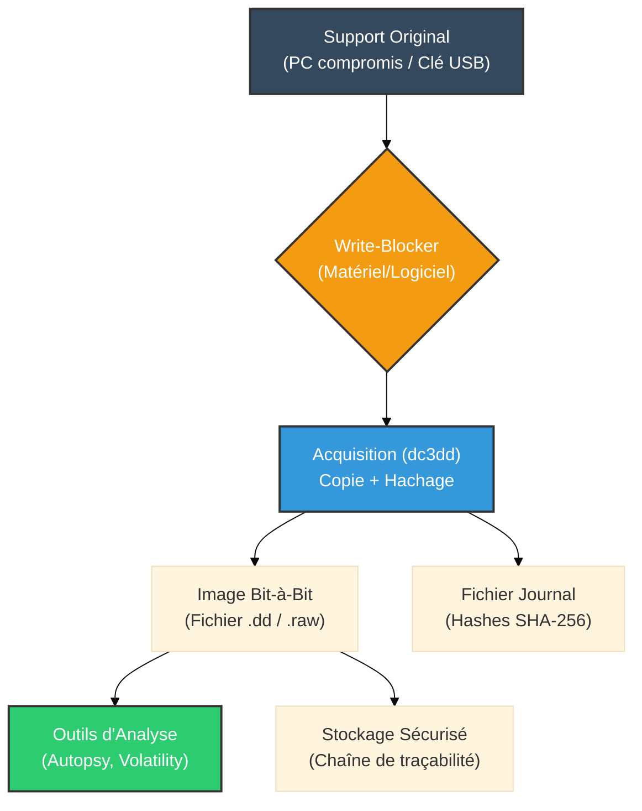

# dd & dc3dd — La Copie Parfaite

<div
  class="omny-meta"
  data-level="🟡 Intermédiaire"
  data-version="Coreutils / 7.2+"
  data-time="~45 minutes">
</div>

<div style="text-align: center; margin: 0 auto;">
    
</div>

## Introduction

!!! quote "Analogie pédagogique — Le Photocopieur Moléculaire"
    Imaginez que vous deviez examiner un livre suspecté de contenir des messages secrets. Si vous vous contentez de recopier le texte (copie de fichiers classique), vous pourriez rater de l'encre invisible, des pages arrachées ou des annotations dans les marges. **dd** et **dc3dd** agissent comme un photocopieur moléculaire : ils copient le livre atome par atome, incluant les pages blanches, la couverture, et même la poussière entre les pages. 

Dans le domaine du **Forensic** (investigation numérique), la première règle d'or est de **ne jamais analyser le support original**. On doit toujours travailler sur une copie exacte bit-à-bit (une image).
- **`dd` (Data Duplicator)** est l'outil historique Unix pour faire cela. Il copie chaque bloc de données sans se soucier du système de fichiers.
- **`dc3dd`** est une version améliorée développée par le *Department of Defense Cyber Crime Center (DC3)* américain. Il ajoute des fonctionnalités vitales pour le forensic comme le hachage à la volée (MD5, SHA-1, SHA-256) pour garantir l'intégrité de la preuve.

<br>

---

## ⚖️ Le Cadre Légal et l'Intégrité

Une image forensique n'a de valeur juridique que si vous pouvez prouver qu'elle est **strictement identique** au disque d'origine, et qu'elle n'a pas été altérée depuis sa création. C'est pourquoi le **hachage** (empreinte numérique) est obligatoire.

!!! warning "Write-Blockers"
    Avant toute acquisition matérielle, le disque cible doit être connecté via un bloqueur d'écriture (Write-Blocker) matériel ou logiciel, pour empêcher le système d'exploitation de modifier ne serait-ce qu'un seul bit (comme la mise à jour des timestamps).

<br>

---

## 🛠️ Usage Opérationnel — `dd`

L'outil natif de Linux. Très puissant, mais extrêmement dangereux si mal utilisé (souvent surnommé *Disk Destroyer*).

### 1. Acquisition d'un Disque Entier

```bash title="Création d'une image bit-à-bit avec dd"
# if : Input File (Le disque source, par ex. une clé USB)
# of : Output File (Le fichier image destination)
# bs : Block Size (Taille du bloc lu/écrit, améliore la vitesse)
# status=progress : Affiche la barre de progression
sudo dd if=/dev/sdb of=/mnt/preuves/cle_usb.dd bs=4M status=progress
```

### 2. Le Problème de `dd` en Forensic

`dd` classique copie aveuglément. Il ne calcule pas de hash automatiquement. Vous devez le faire séparément :
```bash title="Vérification manuelle de l'intégrité"
sudo sha256sum /dev/sdb > hash_source.txt
sha256sum /mnt/preuves/cle_usb.dd > hash_image.txt
diff hash_source.txt hash_image.txt
```
*Ceci double le temps de lecture du disque (une fois pour copier, une fois pour hacher).*

<br>

---

## 🛠️ Usage Opérationnel — `dc3dd`

C'est là que `dc3dd` brille : il effectue la copie ET le hachage simultanément.

### 1. L'Acquisition Forensique Standard

```bash title="Création d'une image avec hachage SHA-256 intégré"
# if= : Disque source
# of= : Image de destination
# hash= : Algorithme de hachage
# log= : Fichier journal détaillant l'opération (indispensable pour le rapport)
sudo dc3dd if=/dev/sdb of=/mnt/preuves/cle_usb.dd hash=sha256 log=/mnt/preuves/cle_usb_acquisition.log
```
*Le fichier `.log` contiendra le hachage du disque source et le hachage de l'image créée. Si les deux correspondent, la copie est certifiée conforme.*

### 2. Effacement Sécurisé (Wiping)

En forensic, les disques de destination (où l'on stocke les preuves) doivent être stérilisés avant usage pour garantir qu'aucune donnée résiduelle ne pollue l'enquête.

```bash title="Effacement d'un disque avec dc3dd (Zeroing)"
# wipe= : Écrit des zéros sur le disque ciblé
sudo dc3dd wipe=/dev/sdc
```

### 3. Découpage de l'Image (Splitting)

Pour les disques volumineux (ex: 2 To) stockés sur des supports FAT32 (limite 4 Go par fichier) ou pour faciliter le transfert réseau.

```bash title="Découper l'image en morceaux de 2 Go"
# split= : Taille de chaque segment
sudo dc3dd if=/dev/sdb of=/mnt/preuves/disque split=2G hash=sha256 log=acquisition.log
```
*Cela produira les fichiers `disque.000`, `disque.001`, etc.*

<br>

---

## 🏗️ Workflow d'Acquisition (DFIR)

Comment s'intègrent ces outils dans la chaîne de réponse à incident ?



<br>

---

## Conclusion

!!! quote "Ce qu'il faut retenir"
    `dd` est un classique pour les sysadmins, mais `dc3dd` est l'outil indispensable pour le forensic en ligne de commande. Sans une acquisition bit-à-bit parfaite et hachée, tout le travail d'analyse ultérieur est invalide d'un point de vue légal.

> Une fois l'image brute (`.dd` ou `.raw`) acquise, elle peut être importée dans des suites d'investigation comme **[Autopsy](../disk/autopsy.md)** pour y rechercher des fichiers effacés, des malwares ou reconstruire la chronologie de l'attaque. Pour l'acquisition de la mémoire RAM (volatile), on utilisera plutôt **[LiME](./lime.md)**.
