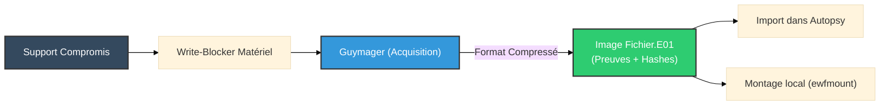

# Guymager — L'Acquisition Haute Vitesse

<div
  class="omny-meta"
  data-level="🟢 Débutant"
  data-version="0.8+"
  data-time="~30 minutes">
</div>

<div style="text-align: center; margin: 0 auto;">
    
</div>

## Introduction

!!! quote "Analogie pédagogique — Le Photocopieur Industriel"
    Si `dd` est un photocopieur manuel très précis, **Guymager** est un scanner industriel haute vitesse. Il dispose d'un écran tactile (interface graphique) pour configurer facilement les paramètres, il peut scanner plusieurs pages en même temps (multi-threading), et il range automatiquement les documents numérisés dans un classeur scellé avec un certificat d'authenticité (format E01 avec métadonnées et hash).

**Guymager** est un imageur forensique open-source pour Linux (très populaire sur Kali Linux et les distributions DFIR comme SANS SIFT). Contrairement à `dc3dd` qui fonctionne en ligne de commande, Guymager offre une interface graphique (GUI) basée sur Qt, rendant l'acquisition de preuves numériques beaucoup plus accessible tout en étant extrêmement rapide grâce à son architecture multi-thread.

<br>

---

## Les Formats d'Acquisition

Guymager se distingue par sa capacité à générer nativement des formats forensiques avancés, contrairement au simple format `.dd` (Raw).

1. **Raw (`.dd` / `.img`)** : Une copie bit-à-bit pure. Facile à monter sur n'importe quel système, mais ne contient aucune métadonnée interne (le hash doit être stocké séparément).
2. **Expert Witness Format (`.E01` / `.Ex01`)** : Le standard de l'industrie (créé pour EnCase). Ce format compresse l'image à la volée, segmente les fichiers pour le stockage, et *surtout*, **encapsule les métadonnées de l'affaire** (Nom de l'enquêteur, numéro de dossier, description du matériel) et les **hachages** (MD5/SHA-256) directement dans le fichier image.
3. **Advanced Forensic Format (`.AFF`)** : Format open-source similaire à l'E01, mais moins largement adopté.

!!! tip "Pourquoi choisir l'E01 ?"
    Le format E01 est fortement recommandé car il évite de perdre le lien entre le fichier image et ses informations contextuelles (logs, empreintes numériques), tout en réduisant considérablement la taille du fichier final grâce à la compression.

<br>

---

## 🛠️ Usage Opérationnel

Bien qu'il dispose d'une interface graphique, Guymager nécessite des droits administrateur pour accéder physiquement aux périphériques de stockage.

### 1. Lancement de l'outil

```bash title="Démarrage depuis le terminal"
# Doit être lancé avec privilèges pour lister les disques /dev/sdX
sudo guymager
```

### 2. Le Processus d'Acquisition (Workflow GUI)

L'interface de Guymager est conçue pour être "Foolproof" (à l'épreuve des erreurs).

1. **Sélection du Périphérique** : Le tableau principal affiche tous les disques détectés. Les périphériques cachés sont grisés. Faites un clic droit sur la clé USB ou le disque dur cible -> *Acquire image*.
2. **Choix du Format** : Sélectionnez `Encase image format (E01)`.
3. **Métadonnées de l'Affaire** :
   - *Case Number* : L'identifiant de l'incident (ex: INC-2026-04-A).
   - *Evidence Number* : Identifiant de la pièce à conviction (ex: USB-01).
   - *Examiner* : Votre nom.
   - Ces données seront injectées de manière inaltérable dans le fichier E01.
4. **Hachage (Verification)** : Cochez toujours "Calculate MD5" et "Calculate SHA-256". Guymager calculera le hash pendant la lecture, puis relira l'image créée pour la vérifier (double passe).
5. **Démarrage** : Cliquez sur *Start*. La ligne du disque passe au vert pendant l'acquisition, et affiche la vitesse en MB/s.

<br>

---

## 🛡️ Sécurité & Write-Blockers

!!! warning "Guymager ne bloque pas l'écriture physiquement !"
    Bien que Guymager n'écrive jamais sur le disque source, le simple fait de brancher un disque sur un système Linux monte parfois automatiquement les partitions ou altère les horodatages (accès).

Pour une acquisition parfaitement valide légalement :
1. Utilisez un **bloqueur d'écriture matériel** (ex: Tableau Forensic Bridge) entre le disque et votre ordinateur.
2. Ou utilisez une distribution Linux live configurée pour ne **jamais** monter automatiquement les disques (comme Kali Linux Forensic Mode, CAINE ou Tsurugi).

<br>

---

## 🏗️ L'Acquisition dans la Chaîne DFIR



<br>

---

## Conclusion

!!! quote "Ce qu'il faut retenir"
    Guymager est l'outil parfait pour réaliser des acquisitions forensiques conformes aux standards de l'industrie (E01) sans s'encombrer de longues lignes de commande. Sa rapidité grâce au multi-threading en fait le choix numéro un lors des interventions d'urgence sur site (Incident Response).

> L'image E01 générée par Guymager doit ensuite être analysée. Découvrez comment l'explorer avec des suites complètes comme **[Autopsy](../disk/autopsy.md)**.