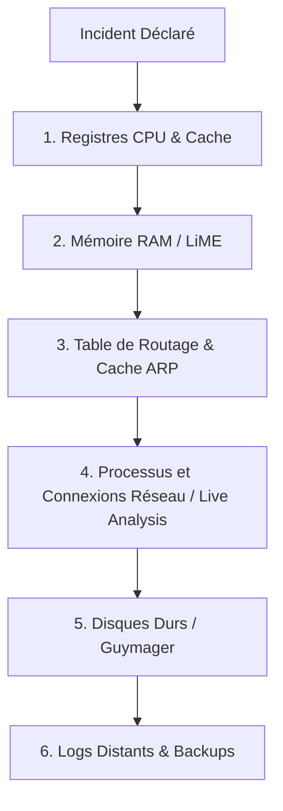

# Acquisition Forensic

    

## Introduction

!!! quote "Analogie pédagogique — Le Moule en Plâtre"
    Quand la police trouve une empreinte de pas, elle ne ramène pas le morceau de terre au laboratoire : elle en fait un moule en plâtre parfait. L'acquisition forensic, c'est la création de ce moule. Vous ne touchez jamais au disque dur de la victime, vous créez une copie bit-à-bit parfaite et mathématiquement vérifiable (via un hash).

L'acquisition est la toute première étape d'une investigation. Si elle est mal réalisée, toutes les preuves ultérieures seront considérées comme irrecevables par un tribunal.

 

---

## 🧭 Navigation du Module

| Outil / Concept | Rôle | Cas d'usage |
|---|---|---|
| **[dd & dc3dd](./dd-dc3dd.md)** | Copie brute (CLI) | Le standard Unix pour réaliser une image disque bloc par bloc. |
| **[Guymager](./guymager.md)** | Copie avancée (GUI) | L'outil graphique par excellence, générant des formats `.E01` (EnCase) avec métadonnées. |
| **[LiME](./lime.md)** | Capture RAM | Module noyau Linux (LKM) pour capturer la mémoire vive sans corrompre l'état du système. |

 

---

## 🗺️ Cartographie de l'Ordre de Volatilité

Dans quel ordre doit-on capturer les preuves ? Toujours du plus éphémère au plus persistant.

> **Commencez par la base :** Découvrez comment réaliser une copie parfaite en ligne de commande avec **[dd et dc3dd](./dd-dc3dd.md)**.

 

---

## Conclusion

!!! quote "Ce qu'il faut retenir"
    La réponse à incident (IR) demande méthode et sang-froid. La préservation des preuves, l'endiguement rapide et la remédiation structurée sont essentiels pour limiter l'impact d'une compromission et assurer une reprise d'activité sécurisée.

> [Retour à l'index des opérations →](../../index.md)
