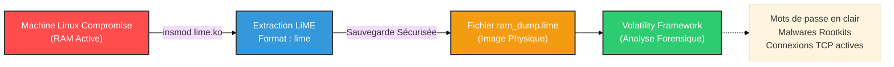

# LiME — L'Extracteur de Mémoire Vive

<div
  class="omny-meta"
  data-level="🔴 Avancé"
  data-version="1.9+"
  data-time="~45 minutes">
</div>

<div style="text-align: center; margin: 0 auto;">
    
</div>

## Introduction

!!! quote "Analogie pédagogique — La Photographie de l'Esprit"
    Si le disque dur est la bibliothèque à long terme d'un ordinateur, la RAM (Mémoire Vive) est son cerveau en pleine réflexion. Quand l'ordinateur s'éteint, tout ce à quoi il pensait disparaît à jamais. **LiME** est l'appareil photo qui permet de prendre un cliché instantané et parfait de toutes les pensées de l'ordinateur pendant qu'il est encore allumé, capturant ainsi les mots de passe non chiffrés, les malwares furtifs et les connexions réseau actives.

**LiME (Linux Memory Extractor)** est un *Loadable Kernel Module* (LKM). Contrairement aux systèmes Windows où l'on peut souvent dumper la mémoire via des outils en espace utilisateur (User-land), les protections de sécurité modernes de Linux empêchent la lecture directe de `/dev/mem`. Pour capturer la RAM de manière fiable et complète, il faut opérer au niveau du noyau (Kernel-land). C'est exactement ce que fait LiME.

Il est conçu pour être **Forensiquement propre** : il minimise son empreinte sur le système cible pour ne pas écraser les preuves qu'il tente de capturer.

<br>

---

## ⚠️ La Règle d'Or de l'Acquisition RAM

!!! danger "Ordre de Volatilité (RFC 3227)"
    Dans toute réponse à incident (IR), **la mémoire vive doit TOUJOURS être acquise en premier**.
    Toute interaction avec la machine (lancer une commande `ls`, brancher une clé USB) modifie la RAM et risque d'écraser des artefacts précieux (comme la clé de déchiffrement d'un ransomware).

<br>

---

## 🛠️ Usage Opérationnel

L'utilisation de LiME requiert des précautions. Comme il s'agit d'un module noyau, il doit être compilé **spécifiquement pour la version exacte du noyau (Kernel) de la machine cible**. 

### 1. Préparation (Sur une machine saine de même version)

Dans un scénario idéal (pour éviter de polluer la cible avec des compilateurs), on compile le module LiME sur un lab ayant *exactement* la même version de l'OS cible.

```bash title="Compilation du module LiME"
# Vérifier la version exacte du kernel de la cible (ex: 5.15.0-76-generic)
uname -r

# Sur le lab (sain), installer les headers correspondants
sudo apt install linux-headers-$(uname -r) build-essential git

# Cloner et compiler
git clone https://github.com/504ensicsLabs/LiME.git
cd LiME/src
make
# Cela produit un fichier lime.ko (Kernel Object)
```

### 2. Déploiement et Acquisition (Sur la cible compromise)

Transférez le fichier `lime.ko` compilé sur la machine compromise (idéalement via une clé USB formatée en FAT32 ou via un transfert réseau `nc`).

```bash title="Chargement du module et extraction de la RAM"
# Insérer le module noyau avec les paramètres d'acquisition
# path : Destination du dump (ex: clé USB ou TCP)
# format : lime (recommandé pour l'analyse avec Volatility)
sudo insmod lime.ko "path=/mnt/cle_usb/ram_dump.lime format=lime"
```
*Dès que la commande `insmod` est exécutée, LiME dump la RAM complète dans le fichier spécifié, puis se met en attente.*

### 3. Exfiltration de la RAM par le Réseau (Netcat)

Si brancher une clé USB n'est pas possible (serveur Cloud ou risque de contamination), LiME peut envoyer la RAM directement via le réseau.

```bash title="Acquisition RAM via TCP"
# Sur la machine de l'analyste (Réception)
nc -l -p 4444 > ram_dump.lime

# Sur la machine cible compromise (Envoi)
sudo insmod lime.ko "path=tcp:4444 format=lime"
```

### 4. Nettoyage

Une fois l'acquisition terminée, il faut retirer le module du noyau de la cible.
```bash title="Retrait du module"
sudo rmmod lime
```

<br>

---

## 🏗️ Workflow d'Investigation Mémoire



<br>

---

## Conclusion

!!! quote "Ce qu'il faut retenir"
    LiME est le pont entre l'état éphémère d'un système infecté et l'analyse statique à froid. Sans lui, les attaques modernes résidant uniquement en mémoire (Fileless Malware) ou les ransomwares supprimant leurs propres clés de chiffrement seraient indétectables sur les systèmes Linux.

> L'acquisition de la RAM n'est que la première étape. Le véritable travail d'enquête commence en analysant le fichier `.lime` obtenu avec le framework **[Volatility](../memory/volatility.md)**.