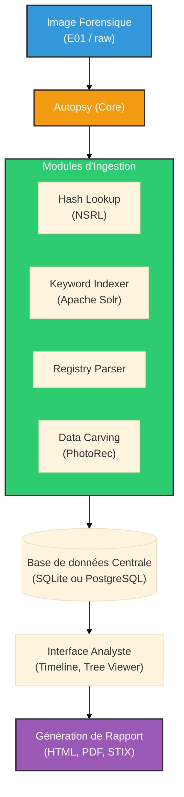

# Autopsy — La Table de Dissection Numérique

    

## Introduction

!!! quote "Analogie pédagogique — Le Laboratoire de la Police Scientifique"
    Quand la police trouve un ordinateur sur une scène de crime, elle n'allume pas cet ordinateur pour fouiller dans les dossiers, car cela détruirait les preuves (comme piétiner des empreintes digitales). À la place, ils font une copie parfaite du disque (l'image). **Autopsy** est le microscope et le laboratoire entier utilisé pour analyser cette copie. Il permet de voir les fichiers supprimés, l'historique web, les clés USB branchées, et de regrouper tous ces indices dans un tableau chronologique.

**Autopsy** est l'interface graphique (GUI) officielle de **The Sleuth Kit (TSK)**, une bibliothèque d'outils en ligne de commande développée pour analyser les systèmes de fichiers (NTFS, FAT, Ext4, APFS). 

Conçu à l'origine pour Linux, la version moderne (Autopsy 4) est une application Java lourde tournant nativement sous Windows, capable d'ingérer des Téraoctets de données, de paralléliser les traitements (Ingest Modules) et de collaborer en réseau.

 

---

## 🛠️ Concepts Fondamentaux : Les Modules d'Ingestion

La puissance d'Autopsy réside dans son pipeline modulaire. Lorsqu'on ajoute une source de données (une image E01 ou `.dd`), on active des **Ingest Modules** qui travaillent en arrière-plan pour extraire l'intelligence :

- **Recent Activity** : Extrait l'historique web (Chrome, Firefox), le registre Windows (fichiers récents, clés USB branchées).
- **Hash Lookup** : Compare chaque fichier du disque à des bases de données connues (comme la NSRL du NIST). Cela permet d'ignorer automatiquement les milliers de fichiers système inoffensifs (Known Good) et d'alerter sur des malwares connus (Known Bad).
- **Keyword Search** : Indexe tout le texte du disque (même l'espace non alloué) pour rechercher des mots-clés spécifiques (noms de suspects, emails, numéros de carte de crédit).
- **Email Parser** : Reconstruit les boîtes mail (PST, MBOX).
- **Extension Mismatch** : Repère les fichiers cachés (ex: une image `.jpg` qui est en réalité un exécutable malveillant `.exe`).

 

---

## 🛠️ Usage Opérationnel — Workflow d'Investigation

Le workflow dans Autopsy suit une méthodologie stricte pour garantir l'intégrité de la chaîne de preuves (Chain of Custody).

### Étape 1 : Création du Cas (Case)
On ne travaille jamais "dans le vide".
1. Créer un *New Case*.
2. Remplir les métadonnées : *Case Name* (ex: Ransomware_Corp), *Base Directory* (dossier où Autopsy va stocker ses bases de données et index, **jamais** sur le disque de la preuve !), *Examiner Name*.

### Étape 2 : Ajout de la Source de Données (Data Source)
L'analyste importe l'image forensique acquise préalablement (par exemple avec **[Guymager](../acq/guymager.md)**).
- **Type** : *Disk Image or VM file*.
- **Fichier** : Pointer vers le fichier `.E01` ou `.dd`.
- **Validation** : Autopsy vérifiera le Hash MD5/SHA-256 de l'image pour s'assurer qu'elle n'est pas corrompue.

### Étape 3 : Configuration de l'Ingestion
Sélection des modules appropriés. 
> *Attention : Activer tous les modules sur un disque de 2 To peut prendre plusieurs jours.*

### Étape 4 : L'Analyse Manuelle (Le Triage)
Une fois l'ingestion lancée, l'interface se divise en trois panneaux :
- **Tree Viewer (Gauche)** : Filtres automatiques (Data Artifacts, OS Accounts, Extracted Content).
- **Result Viewer (Haut Droite)** : Liste des fichiers correspondants au filtre sélectionné.
- **Content Viewer (Bas Droite)** : Affiche le contenu brut, l'hexadécimal (Hex), ou le texte extrait d'un fichier sélectionné.

 

---

## 🕵️‍♂️ Scénarios Typiques en DFIR

### 1. La Chronologie de l'Attaque (Timeline)
La fonction **Timeline** est la plus critique en réponse à incident. Elle agrège tous les horodatages (fichiers modifiés, événements du registre, historique web) sur une seule frise chronologique. L'analyste peut ainsi isoler le "Patient Zéro" : *À 14h02, un email est reçu. À 14h03, un fichier Word est téléchargé. À 14h04, un exécutable fantôme est créé.*

### 2. Récupération de Fichiers Supprimés (Carving)
Autopsy intègre **[PhotoRec](./photorec.md)** pour le Data Carving. Il va scanner l'espace non alloué (*Unallocated Space*) du disque pour retrouver les en-têtes (Signatures/Magic Numbers) de fichiers effacés (images, PDF) et les reconstruire.

### 3. Analyse du Registre Windows
Autopsy extrait les fichiers SAM, SYSTEM et NTUSER.DAT. Il permet d'extraire les mots de passe locaux (hashes NTLM), de voir quels programmes ont été exécutés (Prefetch, Shimcache) et quels périphériques ont été connectés (USBSTOR).

 

---

## 🏗️ Architecture du Laboratoire DFIR

 

---

## Conclusion

!!! quote "Ce qu'il faut retenir"
    Autopsy est l'alternative gratuite et open-source aux logiciels commerciaux hors de prix (comme EnCase ou FTK). C'est le centre de commande de l'investigateur numérique. Sa capacité à ingérer, trier et présenter des téraoctets de données en fait un outil incontournable pour résoudre les incidents de sécurité complexes (APT, Ransomware, Fuites de données).

> Alors qu'Autopsy excelle dans l'analyse des données persistantes sur le disque dur, l'analyse des malwares actifs requiert d'étudier la mémoire vive (RAM) à l'aide de **[Volatility](../memory/volatility.md)**.
