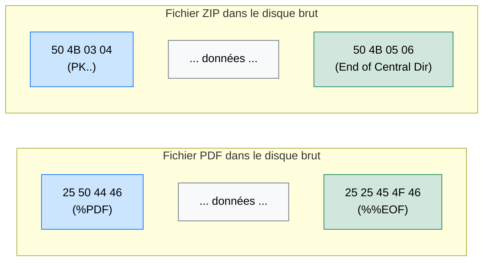

# Disk Carving — Chirurgie Forensique sur les Disques

<div
  class="omny-meta"
  data-level="🔴 Avancé"
  data-version="2024"
  data-time="~25 minutes">
</div>

## Introduction

!!! quote "Analogie pédagogique — Le Shredder et les Confettis"
    Quand vous supprimez un fichier sous Windows ou Linux, le système d'exploitation ne détruit pas les données — il **efface l'index**. C'est comme déchirer l'étiquette d'une boîte sans vider son contenu : la boîte est toujours là, mais le bibliothécaire fait comme si elle n'existait plus.

    **Le Disk Carving** est la technique qui consiste à fouiller les étagères de bibliothèque sans regarder les étiquettes — en cherchant directement le contenu. Chaque type de fichier commence par une **signature binaire** reconnaissable (les "Magic Bytes") : un PDF commence toujours par `%PDF`, un fichier ZIP par `PK`. L'outil de carving scanne le disque secteur par secteur, recherche ces signatures, et reconstitue les fichiers même si leur index est effacé.

Le Disk Carving est une technique d'**investigation numérique (forensique)** utilisée lors d'opérations de réponse à incident pour récupérer des preuves sur des supports compromis, formatés ou endommagés.

<br>

---

## Principes Fondamentaux

### Les Magic Bytes — L'Empreinte de chaque Format



| Format | Signature (hex) | Signature (ASCII) | Footer |
|---|---|---|---|
| **PDF** | `25 50 44 46` | `%PDF` | `%%EOF` |
| **JPEG** | `FF D8 FF` | `ÿØÿ` | `FF D9` |
| **PNG** | `89 50 4E 47` | `‰PNG` | `IEND` |
| **ZIP / DOCX / XLSX** | `50 4B 03 04` | `PK..` | End of Central Dir |
| **EXE / DLL** | `4D 5A` | `MZ` | — |
| **SQLite DB** | `53 51 4C 69 74 65` | `SQLite` | — |

<br>

---

## L'Outil de Référence : Foremost et Scalpel

### 1. Foremost

```bash title="Carving avec Foremost"
# Installer
sudo apt install foremost

# Carving depuis une image disque
foremost -t pdf,jpg,zip -i disk_image.dd -o ./resultats/

# Carving depuis un disque physique (en lecture seule)
foremost -t all -i /dev/sdb -o ./resultats/
```

### 2. Photorec (Interface Guidée)

```bash title="Photorec — Interface interactive"
# Photorec fait partie du paquet TestDisk
sudo apt install testdisk

# Lancer Photorec en mode interactif
photorec disk_image.dd
```

_Photorec est plus convivial que Foremost pour les débutants : il guide l'analyste étape par étape (choix du disque, du système de fichiers, du dossier de sortie). Il reconnaît plus de 480 formats de fichiers différents._

### 3. Autopsy — Interface Graphique Forensique

```bash title="Lancer Autopsy"
autopsy
# → Ouvrir un navigateur sur http://localhost:9999/autopsy
```

Autopsy intègre le Disk Carving parmi ses nombreux modules d'analyse et produit des rapports forensiques complets adaptés à une procédure judiciaire.

<br>

---

## Précautions Légales et Forensiques

!!! danger "Travaillez toujours sur une copie — Jamais sur l'original"
    La règle forensique absolue est de ne jamais travailler directement sur le disque ou le support suspect. Toute modification (même involontaire) de l'original peut **invalider les preuves** devant un tribunal.

    ```bash title="Créer une image bit-à-bit avec dd"
    # Bloquer les écritures sur le disque source (write blocker logiciel)
    sudo blockdev --setro /dev/sdb
    
    # Créer une image forensique avec hash de vérification
    sudo dd if=/dev/sdb of=./disk_image.dd bs=512 status=progress
    
    # Calculer le hash MD5 de l'image (pour preuve d'intégrité)
    md5sum disk_image.dd > disk_image.dd.md5
    sha256sum disk_image.dd > disk_image.dd.sha256
    ```

<br>

---

## Conclusion

!!! quote "Ce qu'il faut retenir"
    Le Disk Carving exploite un principe fondamental des systèmes de fichiers : **la suppression logique n'est pas une destruction physique**. Tant que les secteurs contenant les données n'ont pas été réalloués et réécrits, le contenu des fichiers "effacés" est récupérable. Pour un analyste forensique, c'est une mine d'or de preuves. Pour un professionnel de la sécurité, c'est un rappel que les données sensibles doivent être effacées avec des outils de **secure deletion** (`shred`, `wipe`, `DBAN`) avant la mise au rebut d'un disque.

> [Retour à la section Forensique →](../)
