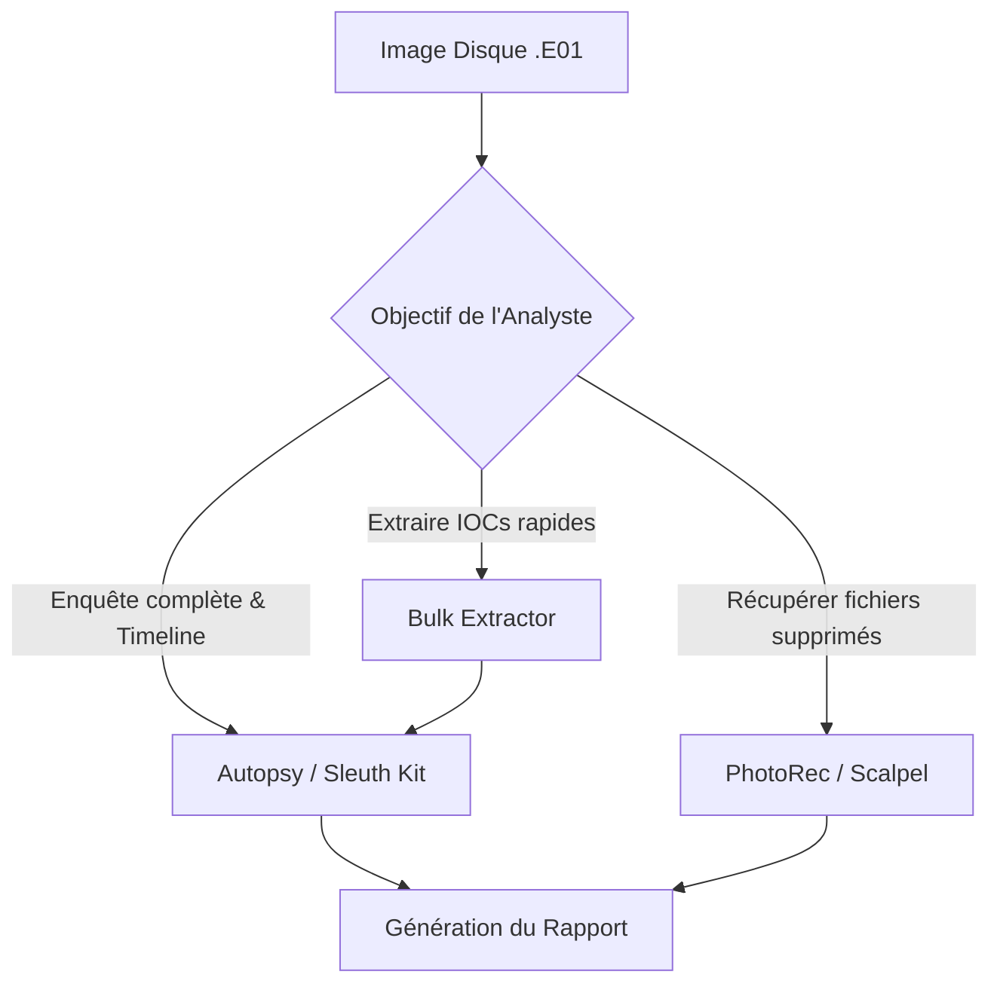

# Analyse Disque (Disk Forensics)

    

## Introduction

!!! quote "Analogie pédagogique — L'Autopsie d'une Scène de Crime"
    Si l'acquisition (la copie) est le fait de sécuriser la scène de crime, l'analyse disque est le travail du médecin légiste. Vous allez examiner le corps (le système de fichiers) pour comprendre la cause de la mort (l'attaque). Vous chercherez des traces cachées (fichiers effacés), des empreintes (métadonnées MACB) et des anomalies (fichiers cachés dans des secteurs défectueux).

L'analyse disque, ou *Disk Forensics*, consiste à extraire des artefacts probants d'un support de stockage physique ou virtuel. Cela inclut la récupération de fichiers supprimés, l'analyse de la Master File Table (MFT) sous NTFS, et la chronologie des événements.

 

---

## 🧭 Navigation du Module

Ce module regroupe les outils phares de l'analyse "morte" (Dead Forensics).

| Outil | Catégorie | Description |
|---|---|---|
| **[Autopsy](./autopsy.md)** | Plateforme globale | L'environnement graphique de référence (Sleuth Kit) pour mener une enquête complète de A à Z. |
| **[PhotoRec](./photorec.md)** | Récupération | Outil spécialisé dans la restauration de fichiers supprimés en ignorant le système de fichiers. |
| **[Bulk Extractor](./bulk_extractor.md)** | Extraction ciblée | Scanne une image disque pour extraire instantanément des IPs, emails et numéros de cartes de crédit. |
| **[Data Carving](./carving.md)** | Méthodologie | Comprendre la théorie derrière la sculpture de données (Headers/Footers, espace non alloué). |

 

---

## 🗺️ Cartographie du Processus

> **Prochaine étape :** Commencez par déployer la plateforme d'analyse principale avec **[Autopsy](./autopsy.md)**.

 

---

## Conclusion

!!! quote "Ce qu'il faut retenir"
    La réponse à incident (IR) demande méthode et sang-froid. La préservation des preuves, l'endiguement rapide et la remédiation structurée sont essentiels pour limiter l'impact d'une compromission et assurer une reprise d'activité sécurisée.

> [Retour à l'index des opérations →](../../index.md)
