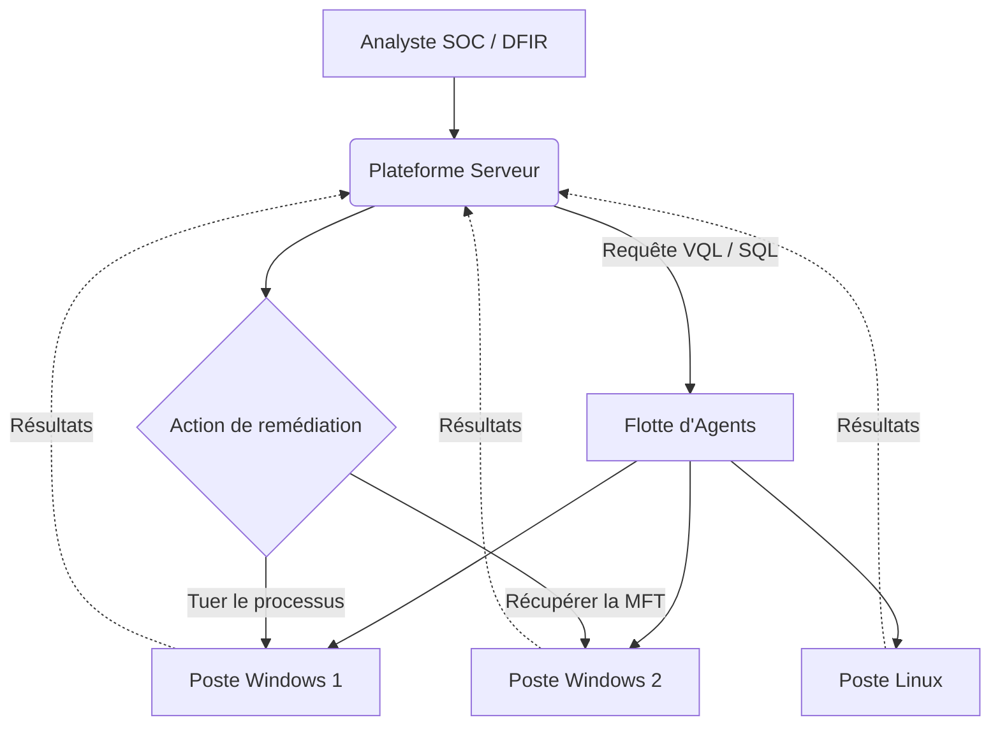

# Outils Endpoint (Télémétrie & Live Forensics)

    

## Introduction

!!! quote "Analogie pédagogique — L'Hélicoptère de Police"
    L'analyse disque traditionnelle, c'est envoyer un inspecteur à pied regarder chaque recoin d'une maison. C'est long. Mais que se passe-t-il si vous avez 10 000 maisons (postes de travail) et qu'un criminel court de l'une à l'autre ? Il vous faut un hélicoptère avec un porte-voix. L'Endpoint Forensics permet d'interroger instantanément tout le parc informatique : "Est-ce qu'une de ces 10 000 machines a ce fichier malveillant précis actuellement en mémoire ?"

L'Endpoint Forensics marque la frontière entre le SOC (Détection continue) et la Réponse à Incident. Il s'agit de déployer des agents (légers) sur tout le parc pour lancer des "chasses" (Threat Hunts) en temps réel.

 

---

## 🧭 Navigation du Module

| Outil | Description | Cas d'usage |
|---|---|---|
| **[osquery](./osquery.md)** | Le SQL du système | Transforme le système d'exploitation en une base de données relationnelle. Idéal pour demander `SELECT * FROM processes WHERE name = 'malware.exe'`. |
| **[Velociraptor](./velociraptor.md)** | Le Super-Prédateur | Le nec plus ultra de l'investigation distribuée (VQL). Permet non seulement de trouver, mais aussi de récupérer des fichiers à distance. |

 

---

## 🗺️ Cartographie de l'Investigation Endpoint

> **Prenez les commandes du parc :** Découvrez le langage VQL et la puissance absolue de **[Velociraptor](./velociraptor.md)**.

 

---

## Conclusion

!!! quote "Ce qu'il faut retenir"
    La réponse à incident (IR) demande méthode et sang-froid. La préservation des preuves, l'endiguement rapide et la remédiation structurée sont essentiels pour limiter l'impact d'une compromission et assurer une reprise d'activité sécurisée.

> [Retour à l'index des opérations →](../../index.md)
