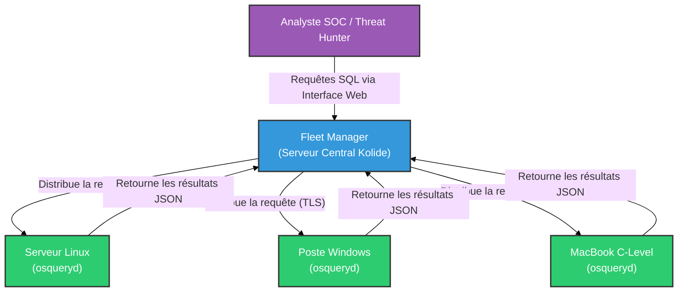

# osquery — L'Infrastructure vue comme une Base de Données

<div
  class="omny-meta"
  data-level="🟡 Intermédiaire"
  data-version="5.0+"
  data-time="~1 heure">
</div>

<div style="text-align: center; margin: 0 auto;">
    
</div>

## Introduction

!!! quote "Analogie pédagogique — Le Recensement Instantané"
    Imaginez que vous êtes le maire d'une ville (votre parc informatique de 10 000 machines). Si vous voulez savoir "Qui porte un chapeau rouge aujourd'hui ?", vous devez normalement envoyer des agents frapper à toutes les portes, ce qui prend des jours. Avec **osquery**, vous avez un microphone géant qui s'adresse à tous les citoyens : "Que ceux qui ont un chapeau rouge lèvent la main". En quelques secondes, vous obtenez la liste exacte. Le microphone, c'est le langage SQL.

Créé par Facebook (Meta) en 2014, **osquery** bouleverse la façon dont les administrateurs et les équipes de sécurité interagissent avec les systèmes d'exploitation (Windows, macOS, Linux). 

Plutôt que d'écrire des scripts complexes en Bash, PowerShell ou Python pour extraire des informations système, osquery présente le système d'exploitation sous la forme d'une base de données SQLite. Une simple requête `SELECT` permet d'obtenir les processus en cours, les ports ouverts, les extensions de navigateurs installées ou les clés USB branchées.

<br>

---

## 🛠️ Concepts Fondamentaux : Les Tables

Dans osquery, tout est table. Il existe plus de 250 tables documentées qui exposent l'état du système.

- `processes` : Liste des processus en cours d'exécution.
- `listening_ports` : Ports réseaux ouverts en écoute.
- `users` : Comptes utilisateurs locaux.
- `startup_items` : Programmes qui se lancent au démarrage (Très ciblé par les malwares pour la persistance).
- `yara` : Permet de scanner des fichiers à la volée avec des règles YARA.

<br>

---

## 🛠️ Usage Opérationnel — Mode Interactif (osqueryi)

Sur une machine unique (lors d'un audit de poste ou d'une réponse à incident locale), on utilise le shell interactif `osqueryi`.

### 1. Démarrage et Exploration
```sql title="Le shell osqueryi"
# Lancer le shell interactif
osqueryi

# Lister toutes les tables disponibles
osquery> .tables

# Voir le schéma d'une table spécifique (ses colonnes)
osquery> .schema processes
```

### 2. Requêtes de base pour l'Administration
```sql title="Requêtes SQL classiques"
-- Quels sont les 5 processus qui consomment le plus de mémoire ?
SELECT name, pid, resident_size FROM processes ORDER BY resident_size DESC LIMIT 5;

-- Quels sont les utilisateurs disposant d'un shell de connexion sur ce Linux ?
SELECT username, uid, shell FROM users WHERE shell NOT LIKE '%nologin%' AND shell NOT LIKE '%false%';
```

### 3. Requêtes avancées pour le Threat Hunting (DFIR)
C'est ici que l'outil montre sa vraie puissance en cybersécurité.

```sql title="Chasse aux menaces (Threat Hunting)"
-- Trouver les processus qui écoutent sur un port réseau MAIS dont le binaire a été supprimé du disque (Comportement typique d'un malware injecté)
SELECT p.pid, p.name, p.path, lp.port 
FROM processes p 
JOIN listening_ports lp ON p.pid = lp.pid 
WHERE p.on_disk = 0;

-- Trouver les programmes qui se lancent automatiquement au démarrage (Persistance)
SELECT name, path, type FROM startup_items WHERE status = 'enabled';

-- Identifier si des extensions Chrome non officielles/malveillantes sont installées
SELECT uid, name, identifier FROM chrome_extensions;
```

<br>

---

## 🏗️ Architecture d'Entreprise (osqueryd & Fleet)

Si `osqueryi` est génial pour une seule machine, son véritable pouvoir se révèle lorsqu'il est déployé en tant qu'agent (Daemon) sur des milliers de serveurs : `osqueryd`.

Cependant, `osqueryd` n'a pas de console centrale intégrée. Il faut le coupler à un gestionnaire de flotte (Fleet Manager) comme **Kolide Fleet** (open-source).



### Le concept des "Queries" programmées
Avec Fleet, l'analyste programme des requêtes SQL qui s'exécutent toutes les 5 minutes sur tout le parc. Si osquery détecte un changement (ex: "Une nouvelle clé USB a été insérée sur le poste du directeur financier"), il envoie une alerte au SIEM ou au SOAR.

<br>

---

## Conclusion

!!! quote "Ce qu'il faut retenir"
    Apprendre le langage SQL n'est plus réservé aux administrateurs de bases de données. Avec osquery, c'est devenu une compétence cruciale pour le Threat Hunter moderne. C'est l'outil qui transforme l'audit et la visibilité d'un parc informatique hétérogène en une tâche simple et unifiée.

> Bien qu'osquery soit excellent pour interroger l'état d'un système, pour récupérer activement des fichiers à distance ou intervenir sur la machine pour bloquer une attaque, il est souvent couplé ou remplacé par des outils DFIR complets comme **[Velociraptor](./velociraptor.md)**.
