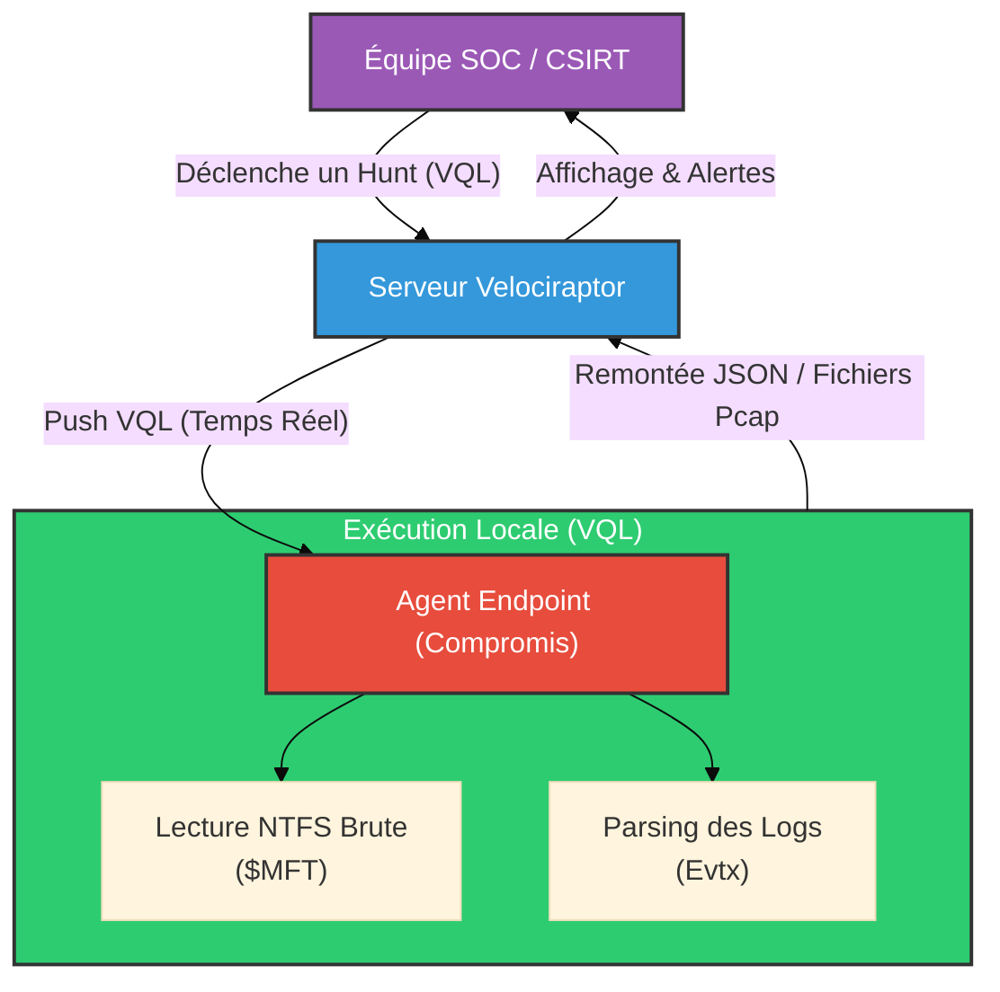

# Velociraptor — La Réponse à Incident à Grande Échelle

<div
  class="omny-meta"
  data-level="🔴 Avancé"
  data-version="0.7+"
  data-time="~1.5 heures">
</div>

<div style="text-align: center; margin: 0 auto;">
    
</div>

## Introduction

!!! quote "Analogie pédagogique — L'Équipe d'Intervention Rapide"
    Si *osquery* est un microphone pour poser des questions à vos 10 000 ordinateurs, **Velociraptor** est une armée de mini-détectives présents sur chaque ordinateur. Non seulement vous pouvez leur poser des questions, mais vous pouvez aussi leur ordonner d'agir : "Récupérez le fichier X", "Fermez la connexion réseau Y", "Copiez la mémoire vive Z et envoyez-la moi". Le tout, en quelques secondes, depuis une console centrale.

**Velociraptor** est un outil open-source de nouvelle génération conçu spécifiquement pour le DFIR. Créé par d'anciens développeurs de Google (les mêmes qui travaillaient sur GRR et Rekall), il est conçu pour être infiniment plus léger, rapide et facile à déployer que ses prédécesseurs.

Il utilise un langage de requêtage unique appelé **VQL** (Velociraptor Query Language), qui ressemble au SQL mais qui est beaucoup plus puissant pour manipuler des données forensiques complexes (fichiers binaires, ruches de registre, logs EVTX).

<br>

---

## 🛠️ Concepts Fondamentaux : Les Artefacts VQL

La vraie magie de Velociraptor réside dans ses **Artefacts**. Ce sont de petits scripts écrits en VQL, partagés par la communauté, qui automatisent des tâches d'investigation complexes. Vous n'avez pas besoin de savoir comment extraire l'historique de Chrome, l'artefact `Windows.Applications.Chrome.History` le fait pour vous.

### Client-Server Architecture (Hunt)
1. **Le Serveur (Frontend)** : Fournit une interface web puissante.
2. **Les Clients (Endpoints)** : Les agents déployés sur les machines Windows, Mac ou Linux. Maintiennent une connexion persistante avec le serveur.
3. **Le "Hunt" (La Chasse)** : Depuis le serveur, vous lancez un artefact (ex: "Trouvez-moi l'adresse IP 192.168.1.50 dans tous les logs réseau"). Le serveur envoie la requête aux milliers de clients. Les clients exécutent l'analyse *localement* (ce qui préserve la bande passante) et ne renvoient que le résultat pertinent au serveur.

<br>

---

## 🛠️ Usage Opérationnel

Velociraptor est un outil hybride. Bien qu'il soit conçu pour l'entreprise, on peut l'utiliser comme un outil portable (standalone) sur une machine isolée lors d'un audit.

### 1. Mode Standalone (Collecteur Triage)

Un consultant en réponse à incident arrive sur une machine compromise. Il n'a pas le temps d'installer un serveur. Il crée un exécutable préconfiguré sur sa machine, le met sur une clé USB, et l'exécute sur la cible.

```bash title="Créer et lancer un collecteur interactif"
# Sur la machine de l'analyste, créer une interface web locale
velociraptor gui

# Le consultant peut alors créer une "Offline Collection" (Triage)
# qui générera un fichier .exe ou .zip autonome.
```

### 2. Démarrage de l'Architecture Serveur

L'installation de Velociraptor est incroyablement simple : un seul binaire contient à la fois le serveur et le client.

```bash title="Déploiement Serveur Rapide"
# Génère les certificats et le fichier de configuration server.config.yaml
velociraptor config generate -i

# Lance le serveur avec l'interface Web (sur le port 8889 par défaut)
velociraptor --config server.config.yaml frontend -v
```

### 3. Exemples d'Artefacts (VQL)

Dans l'interface Web, l'analyste peut lancer des chasses avec des artefacts pré-intégrés.
- `Windows.KapeFiles.Targets` : Imite le célèbre outil KAPE, récupérant automatiquement les fichiers critiques pour le forensic ($MFT, Registre, Event Logs) en quelques minutes, en contournant les verrous Windows (via la lecture NTFS brute).
- `Windows.Detection.Amcache` : Analyse l'Amcache pour prouver qu'un programme spécifique (comme un ransomware effacé) a bien été exécuté dans le passé.
- `Windows.Sysinternals.Autoruns` : Liste absolument toutes les méthodes de persistance utilisées par les malwares pour survivre à un redémarrage.

<br>

---

## 💀 Capacités de Remédiation (Active Response)

Contrairement aux purs outils de visibilité, Velociraptor permet d'intervenir pour stopper une cyberattaque en cours.

1. **Quarantaine Réseau** : L'artefact `Windows.Network.Isolate` modifie le pare-feu de la machine cible pour bloquer toutes les communications, SAUF celle avec le serveur Velociraptor. Le PC infecté est piégé, mais l'analyste peut continuer à enquêter à distance.
2. **Kill Process** : Tuer un processus malveillant silencieusement depuis la console centrale.
3. **Récupération de Fichiers** : Télécharger un malware suspect (même s'il est verrouillé par l'OS) vers le serveur pour le soumettre à une Sandbox.

<br>

---

## 🏗️ Workflow d'Intervention Rapide



<br>

---

## Conclusion

!!! quote "Ce qu'il faut retenir"
    Velociraptor a redéfini le standard du DFIR moderne. Rapide, agile et open-source, il offre une visibilité totale et des capacités de réaction immédiate sur l'ensemble d'un parc informatique. Savoir écrire des requêtes VQL et manipuler Velociraptor est aujourd'hui l'une des compétences les plus recherchées dans un SOC avancé ou une équipe CERT.

> L'analyse post-incident s'appuie souvent sur des fichiers journaux volumineux collectés par Velociraptor. Pour trier efficacement les logs Windows (.evtx) extraits, les analystes utilisent des outils ultra-rapides comme **[Hayabusa](../logs/hayabusa.md)** ou **Chainsaw**.
