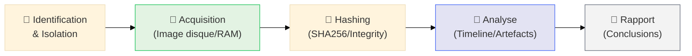

# Investigation Numérique (Forensic)

## Introduction

!!! quote "Analogie pédagogique — L'Archéologue Digital"
    L'investigateur forensic est un **archéologue**. Il arrive sur un site où une bataille a eu lieu. Le sol est jonché de débris, certains visibles, d'autres enfouis sous des couches de poussière (données supprimées). Son rôle est de brosser minutieusement chaque couche, de dater chaque objet, et de **reconstruire la timeline** précise des événements. Son but ultime : produire un rapport incontestable qui explique qui a fait quoi, quand et comment.

L'**investigation numérique** (Digital Forensics) est la science de la collecte, de la préservation et de l'analyse des preuves numériques. Elle intervient après la détection pour comprendre l'étendue réelle d'un incident et identifier les failles exploitées.

 

---

## La Chaine de Preuve (Chain of Custody)

Pour qu'une preuve soit valable (devant un tribunal ou une direction), elle doit être **intègre** et sa manipulation doit être **tracée**.

---

## Domaines d'Investigation

### 🧪 Investigation à Chaud (Live Analysis)
Analyser le système pendant qu'il tourne pour capturer les éléments volatils (RAM, connexions).
[:lucide-microscope: **Accéder au Live Forensics**](./live-analysis.md){ .md-button .md-button--primary }

### 📂 Analyse de Disque (Dead Box)
Analyse post-mortem des fichiers, de la MFT, des artefacts système et des fichiers supprimés.
[:lucide-book-open-check: Cours Analyse de Disque →](./disk/index.md)

### 🧠 Analyse Mémoire
Plonger dans les structures de la RAM pour trouver des malwares injectés.
[:lucide-book-open-check: Cours Volatility & RAM →](./memory/index.md)

### 📑 Analyse de Logs & Réseau
Reconstruire le mouvement de l'attaquant via les traces d'authentification et les captures PCAP.
[:lucide-book-open-check: Cours Log Forensic →](./logs/index.md)

---

## Outils de Référence du Forensic

| Outil | Usage | Type |
|---|---|---|
| **Volatility** | Analyse de la mémoire vive (RAM) | Open Source |
| **Autopsy / SleuthKit** | Analyse complète de disque et timeline | Open Source |
| **KAPE** | Collecte rapide d'artefacts système | Gratuit / Pro |
| **Velociraptor** | Hunting et triage d'artefacts à distance | Open Source |
| **FTK Imager** | Création d'images disque et RAM intègres | Gratuit |

---

## Conclusion

!!! quote "Ce qu'il faut retenir"
    Le forensic n'est pas qu'une question d'outils, c'est une question de **méthodologie**. Un bon investigateur ne tire pas de conclusions hâtives ; il laisse les preuves parler à travers une timeline rigoureuse. Chaque clic sur une machine suspecte modifie son état ; la maîtrise de l'acquisition (imaging) est donc la compétence la plus critique de tout expert DFIR.

> Commencez par comprendre l'**[Acquisition de Preuves →](./acq/index.md)** avant de passer à l'analyse.

 