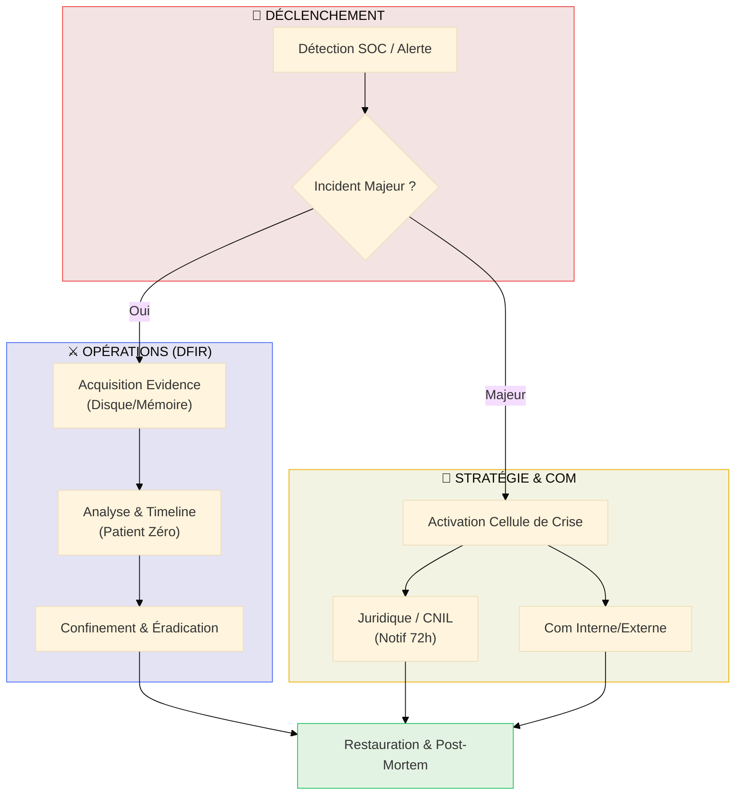

# Incident Response & DFIR

## Introduction

!!! quote "Analogie pédagogique — Les Pompiers et leur Plan d'Intervention"
    Quand les pompiers arrivent sur un incendie, ils ne commencent pas à réfléchir à ce qu'ils vont faire. Leur **plan d'intervention** est prêt, chaque rôle est défini, chaque geste est réflexe. C'est l'entraînement qui permet l'efficacité sous pression. La **gestion d'incident de sécurité** fonctionne de la même façon : les playbooks, les rôles et les procédures doivent être définis **avant** l'incident, pas pendant.

Un **incident de sécurité** est tout événement qui compromet la confidentialité, l'intégrité ou la disponibilité des systèmes. L'**Incident Response (IR)** est la capacité organisée à détecter, contenir, analyser et récupérer d'un incident de manière méthodique.

 

---

## Gestion de Crise & Flux de Réponse

!!! abstract "Au-delà de la technique"
    La réponse à un incident majeur (Ransomware, Fuite de données) n'est pas qu'un défi technique. C'est une **coordination synchronisée** entre les experts DFIR, la direction, le juridique (RGPD) et la communication. Ce module vous apprend à naviguer dans le chaos d'une intrusion réelle.

---

## Modules de formation

### 1 — Playbooks DFIR

Créer les procédures de réponse avant qu'un incident ne survienne. Structure d'un runbook, exemple complet ransomware.

[:lucide-book-open-check: Cours Playbooks DFIR →](./playbooks-dfir.md)

### 2 — CSIRT / CERT

Organisation de l'équipe de réponse, coordination nationale (ANSSI, CERT-FR), communication inter-organisations.

[:lucide-book-open-check: Cours CSIRT/CERT →](./csirt-cert.md)

### 3 — TheHive

Plateforme open-source de gestion d'incidents : cas, observables, tâches, intégration MISP et Cortex.

[:lucide-book-open-check: Cours TheHive →](./thehive.md)

### 4 — Investigation Numérique (Forensic)

Acquisition légale de preuves, analyse disque et mémoire, reconstruction de timeline, analyse de logs.

[:lucide-book-open-check: Hub Forensic →](./forensic/index.md)

 

---

## Conclusion

!!! quote "Ce qu'il faut retenir"
    L'Incident Response n'est pas une compétence qu'on improvise sous pression — c'est une **discipline qui se prépare en amont**. Un SOC qui n'a jamais simulé un incident ne saura pas réagir efficacement lors d'un vrai. Les exercices de type "Purple Team" et les simulations de crise sont aussi importants que la technologie.

> Commencez par **[Playbooks DFIR →](./playbooks-dfir.md)** pour construire vos procédures de réponse.

 