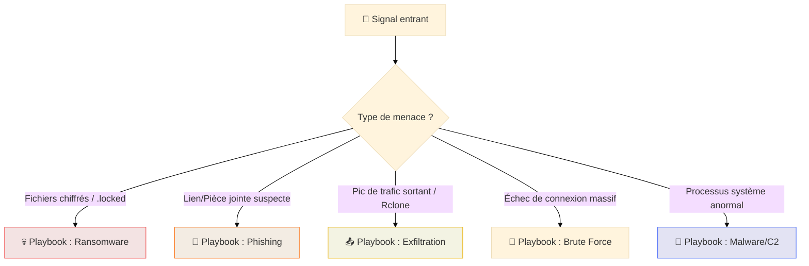
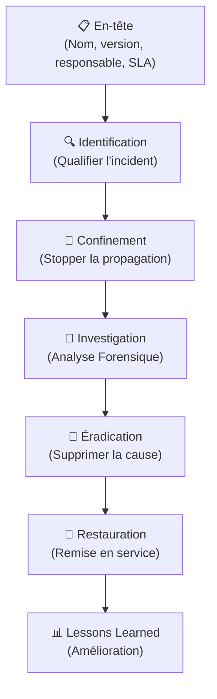

# Playbooks DFIR — Runbooks de Réponse aux Incidents

<div
  class="omny-meta"
  data-level="🟡 Intermédiaire → 🔴 Expert"
  data-version="2025"
  data-time="~4 heures">
</div>

## Introduction

!!! quote "Analogie pédagogique — La Check-list du Pilote"
    Les pilotes de ligne utilisent des **check-lists** même pour les procédures qu'ils connaissent par cœur. Pourquoi ? Parce que sous stress, le cerveau humain oublie des étapes critiques. Un playbook DFIR est cette check-list : il garantit qu'en pleine crise, l'équipe SOC suit toutes les étapes dans le bon ordre, sans rien oublier — même à 3h du matin lors d'un incident majeur.

Un **playbook DFIR** (aussi appelé runbook) est un document procédural qui décrit **exactement** les étapes à suivre pour répondre à un type d'incident spécifique. Il existe un playbook par scénario d'attaque : ransomware, phishing, compromission de compte, exfiltration de données...

<br>

---

## Arbre de Décision : Quel Playbook lancer ?

Tous les incidents ne se ressemblent pas. Le premier rôle du N1 est de choisir la procédure de réponse adaptée dès la qualification.



---

## Structure Standard d'un Playbook DFIR

Un bon playbook doit suivre les 6 phases du cycle NIST de manière granulaire :



<br>

---

## 💀 Scénario 1 — Playbook Ransomware

```markdown title="playbook-ransomware-v1.md"
# Playbook DFIR — Ransomware
**Version :** 1.2 | **SLA de confinement :** 30 min | **Escalade :** Direction + DPO

### Phase 1 — IDENTIFICATION
- [ ] Qualifier : Vrai positif ? (extensions .locked, note README)
- [ ] Périmètre : Quelles autres machines montrent ces patterns (Wazuh query) ?
- [ ] Ouvrir un ticket TheHive (Priorité : Critique)

### Phase 2 — CONFINEMENT
- [ ] Isoler la machine du réseau via Wazuh Active Response
- [ ] Désactiver le compte AD compromis (`Disable-ADAccount`)
- [ ] Snapshot VM si applicable (avant action forensique)
- [ ] Bloquer les IPs C2 identifiées sur le Firewall

### Phase 3 — INVESTIGATION
- [ ] Acquérir la RAM (DumpIt / Magnet RAM Capture)
- [ ] Copie forensique du disque (si machine physique)
- [ ] Identifier le vecteur d'infection (RDP, Phishing, Exploit)
- [ ] Reconstituer la timeline d'attaque (Heure 0 → Chiffrement)

### Phase 4 — ÉRADICATION & RESTAURATION
- [ ] Supprimer le malware et les persistance (clés Run, Tasks)
- [ ] Restaurer les données depuis les sauvegardes saines (Vérifier intégrité !)
- [ ] Monitoring renforcé 72h post-remédiation
```

<br>

---

## 🎣 Scénario 2 — Playbook Phishing (Compromission de Compte)

```markdown title="playbook-phishing-v1.md"
# Playbook DFIR — Phishing & Account Takeover
**Déclencheur :** Signalement utilisateur ou Alerte "Improbable Travel"

### 1. Identification
- [ ] Récupérer l'email original (format .eml) avec headers complets
- [ ] Analyser les headers (IP source, SPF/DKIM) et l'URL (URLscan.io)
- [ ] Vérifier qui d'autre a reçu l'email (E-Discovery / Search-Mailbox)
- [ ] Vérifier les clics : qui a ouvert le lien ? Qui a saisi ses credentials ?

### 2. Confinement
- [ ] Réinitialiser le mot de passe du compte impacté immédiatement
- [ ] Révoquer toutes les sessions actives (Force Sign-out)
- [ ] Supprimer l'email de toutes les boîtes aux lettres (Search-and-Purge)
- [ ] Bloquer l'URL sur le proxy/firewall de l'entreprise

### 3. Investigation & Éradication
- [ ] Vérifier les logs de connexion Success depuis l'IP suspecte
- [ ] Vérifier la création de règles de transfert de mail ("Inbox Rules")
- [ ] Vérifier si l'attaquant a ajouté une méthode MFA frauduleuse
- [ ] Créer une règle de détection pour ce pattern spécifique
```

<br>

---

## 📤 Scénario 3 — Playbook Exfiltration de Données

```markdown title="playbook-exfiltration-v1.md"
# Playbook DFIR — Exfiltration de Données
**Déclencheur :** Alerte NDR (pic volume sortant) ou détection Rclone/Mega

### 1. Identification
- [ ] Identifier l'host source et la destination (IP, Pays, Domaine Cloud)
- [ ] Estimer le volume de données transférées (Logs Netflow/NDR)
- [ ] Identifier les fichiers accédés juste avant le pic (Logs FIM/Audit)

### 2. Confinement
- [ ] Couper la connexion internet du host source immédiatement
- [ ] Bloquer l'IP/Domaine de destination sur le firewall périmétrique
- [ ] Tuer les processus de transfert identifiés (rclone, winscp)

### 3. Analyse & Juridique
- [ ] Déterminer la sensibilité des données volées (RGPD, IP)
- [ ] **Notifier le DPO** si des données personnelles sont touchées
- [ ] Préparer la déclaration CNIL (obligation légale sous 72h)
```

<br>

---

## Bonnes pratiques & Erreurs

!!! tip "Conseils pour des playbooks efficaces"
    - **Tester régulièrement** via des exercices de type "Tabletop"
    - **Définir les SLA** clairs pour chaque phase
    - **Mettre à jour après chaque incident** réel ou simulé

!!! warning "Erreurs critiques en gestion d'incident"
    1. **Éteindre la machine** avant d'avoir capturé la RAM (perte de preuves)
    2. **Ne pas notifier le juridique/DPO** assez tôt (risque légal RGPD)
    3. **Réinitialiser le mot de passe** sans révoquer les sessions (l'attaquant reste connecté)
    4. **Oublier les backups** : l'attaquant a peut-être aussi compromis les sauvegardes.

---

## Conclusion

!!! quote "Ce qu'il faut retenir"
    Un playbook est une arme qui doit être entretenue. La valeur d'un runbook ne réside pas dans son existence, mais dans sa **précision technique**. Chaque commande doit être prête à être copiée-collée. Organisez des simulations régulières pour transformer ces procédures en réflexes d'élite.

> Continuez avec le cours sur **[CSIRT/CERT →](./csirt-cert.md)** pour apprendre à structurer l'équipe qui pilotera ces playbooks.