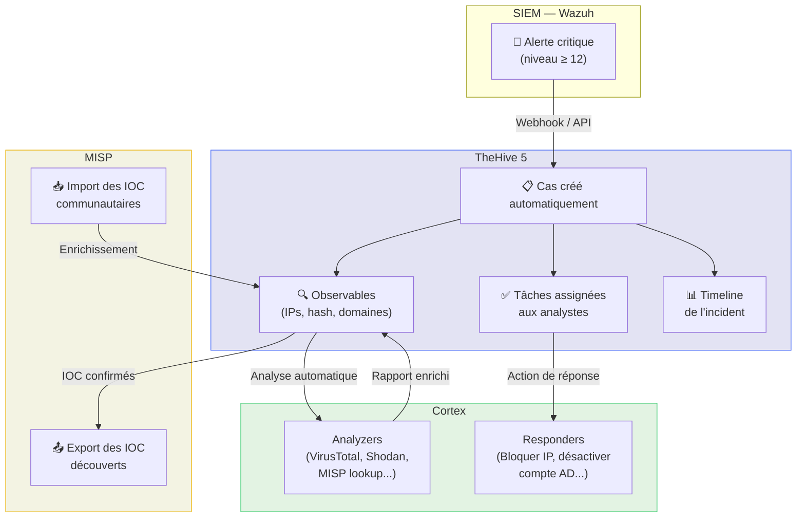

# TheHive — Gestion d'Incidents Open-Source

<div
  class="omny-meta"
  data-level="🟡 Intermédiaire"
  data-version="TheHive 5.x"
  data-time="~3 heures">
</div>

## Introduction

!!! quote "Analogie pédagogique — Le Dossier d'Instruction du Juge"
    Un juge d'instruction ne tient pas son enquête dans sa tête — il constitue un **dossier** où chaque pièce (témoignages, expertises, preuves matérielles) est inventoriée, datée et accessible à tous les acteurs de la procédure. **TheHive** est ce dossier d'instruction pour votre SOC : chaque incident devient un **Cas** qui centralise les alertes, les observables (IOC), les tâches assignées, les preuves et la timeline complète — le tout partagé entre tous les membres de l'équipe en temps réel.

**TheHive** est la plateforme open-source de référence pour la gestion des incidents de sécurité (Case Management). Elle permet à un CSIRT de :

- **Centraliser** tous les incidents dans un système unique
- **Collaborer** : plusieurs analystes sur le même cas simultanément
- **Tracer** chaque action effectuée (audit trail complet)
- **Enrichir** automatiquement les IOC via Cortex
- **Partager** les IOC découverts vers MISP

<br>

---

## Architecture TheHive + Cortex + MISP



<br>

---

## Installation (Docker Compose)

```yaml title="docker-compose.yml — TheHive 5 + Cortex + Elasticsearch"
version: "3.8"

services:
  # Base de données Elasticsearch (backend TheHive)
  elasticsearch:
    image: docker.elastic.co/elasticsearch/elasticsearch:7.17.15
    environment:
      - discovery.type=single-node
      - xpack.security.enabled=false
      - "ES_JAVA_OPTS=-Xms1g -Xmx1g"
    volumes:
      - elasticsearch_data:/usr/share/elasticsearch/data

  # TheHive 5
  thehive:
    image: strangebee/thehive:5.3
    depends_on:
      - elasticsearch
    ports:
      - "9000:9000"   # Interface web TheHive
    environment:
      - JVM_OPTS=-Xms1g -Xmx1g
    volumes:
      - ./config/thehive/application.conf:/etc/thehive/application.conf
      - thehive_data:/opt/thp/thehive/data

  # Cortex — moteur d'analyzers
  cortex:
    image: thehiveproject/cortex:3.1.8
    ports:
      - "9001:9001"   # Interface web Cortex
    volumes:
      - ./config/cortex/application.conf:/etc/cortex/application.conf
      - cortex_data:/opt/cortex/data

volumes:
  elasticsearch_data:
  thehive_data:
  cortex_data:
```

```bash title="Démarrage et premier accès"
# Démarrer la stack
docker compose up -d

# Vérifier que tout est up
docker compose ps

# TheHive : http://localhost:9000
# Compte admin par défaut : admin@thehive.local / secret

# Cortex : http://localhost:9001
# Première connexion → créer le compte admin
```

<br>

---

## Workflow d'un cas TheHive

### Créer un cas depuis une alerte Wazuh

**Via l'API TheHive** (intégration avec Wazuh) :

```python title="Script Python — Créer un cas TheHive depuis une alerte Wazuh"
#!/usr/bin/env python3
# Intégration Wazuh → TheHive
# Placé dans /var/ossec/integrations/custom-thehive

import sys
import json
import requests
from datetime import datetime

THEHIVE_URL = "http://thehive:9000"
THEHIVE_API_KEY = "VOTRE_CLE_API"

def create_case(alert_data):
    """Crée un cas TheHive depuis une alerte Wazuh"""
    case = {
        "title": f"[Wazuh] {alert_data.get('rule', {}).get('description', 'Alerte SOC')}",
        "description": f"""
## Alerte Wazuh

**Règle :** {alert_data.get('rule', {}).get('id')} — {alert_data.get('rule', {}).get('description')}
**Niveau :** {alert_data.get('rule', {}).get('level')}
**Agent :** {alert_data.get('agent', {}).get('name')} ({alert_data.get('agent', {}).get('ip')})
**MITRE :** {', '.join(alert_data.get('rule', {}).get('mitre', {}).get('technique', []))}

## Données brutes
```json
{json.dumps(alert_data, indent=2)}
```
        """,
        "severity": 2,          # 1=Low, 2=Medium, 3=High, 4=Critical
        "tags": ["wazuh", "soc", "automated"],
        "tlp": 2,               # TLP:AMBER
        "status": "New",
        "startDate": int(datetime.now().timestamp() * 1000)
    }

    response = requests.post(
        f"{THEHIVE_URL}/api/case",
        headers={"Authorization": f"Bearer {THEHIVE_API_KEY}",
                 "Content-Type": "application/json"},
        json=case
    )
    return response.json()

# Lire l'alerte depuis stdin
alert = json.loads(sys.stdin.readline())
result = create_case(alert)
print(json.dumps(result))
```

### Ajouter des observables (IOC) à un cas

```bash title="Ajouter des observables via l'API TheHive"
# Ajouter une adresse IP suspecte comme observable
curl -X POST "http://thehive:9000/api/case/CASE_ID/artifact" \
  -H "Authorization: Bearer VOTRE_CLE_API" \
  -H "Content-Type: application/json" \
  -d '{
    "dataType": "ip",
    "data": "185.220.101.45",
    "message": "IP source de l attaque brute force SSH",
    "tlp": 2,
    "tags": ["c2", "ssh-bruteforce"],
    "ioc": true
  }'

# Ajouter un hash SHA256
curl -X POST "http://thehive:9000/api/case/CASE_ID/artifact" \
  -H "Authorization: Bearer VOTRE_CLE_API" \
  -H "Content-Type: application/json" \
  -d '{
    "dataType": "hash",
    "data": "e3b0c44298fc1c149afbf4c8996fb924...",
    "message": "Hash du fichier malveillant droppé"
  }'
```

<br>

---

## Cortex — Analyse automatique des observables

**Cortex** enrichit automatiquement vos observables via des **analyzers** (modules d'analyse) :

| Analyzer | Ce qu'il fait | Gratuit |
|---|---|---|
| **VirusTotal** | Réputation du hash/IP/domaine | ✅ (clé API gratuite) |
| **Shodan** | Informations sur l'IP (ports ouverts, pays) | ✅ |
| **MISP** | Vérifier si l'IOC est dans votre MISP | ✅ |
| **Abuse.ch** | URLhaus, MalwareBazaar lookup | ✅ |
| **MaxMind** | Géolocalisation de l'IP | ✅ |
| **DNSDB** | Historique DNS | Payant |

```bash title="Installer un analyzer Cortex — VirusTotal"
# Dans l'interface Cortex : Organization → Analyzers → Activer VirusTotal
# Configurer votre clé API VirusTotal dans les paramètres de l'analyzer

# Via l'API Cortex
curl -X POST "http://cortex:9001/api/analyzer/VirusTotal_GetReport_3_0/run" \
  -H "Authorization: Bearer CORTEX_API_KEY" \
  -H "Content-Type: application/json" \
  -d '{
    "data": "185.220.101.45",
    "dataType": "ip",
    "tlp": 2
  }'
```

<br>

---

## Conclusion

!!! quote "Ce qu'il faut retenir"
    TheHive + Cortex + MISP forment la **triade open-source de référence** pour la gestion d'incidents. TheHive structure et coordonne le travail d'équipe, Cortex automatise l'enrichissement des IOC, MISP partage la connaissance des menaces. Ensemble, ils permettent à un CSIRT de traiter plus d'incidents en moins de temps, avec une meilleure traçabilité et une meilleure qualité d'investigation — le tout sans licence commerciale.

> Passez à la **[Phase 4 — Malware Analysis →](../../malware/index.md)** pour comprendre les menaces que vous êtes maintenant équipé pour détecter et gérer.

<br>