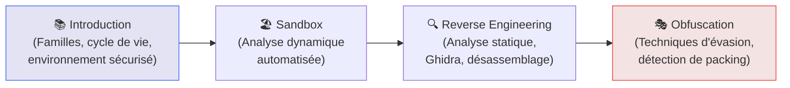

# Malware Analysis — Comprendre l'Adversaire

## Introduction

!!! quote "Analogie pédagogique — L'Autopsie Médico-Légale"
    Un médecin légiste n'examine pas un corps pour le plaisir — il cherche à comprendre **comment et pourquoi** la mort est survenue pour permettre à la justice d'agir. L'**analyste malware** fait de même avec les logiciels malveillants : il disséque le code pour comprendre son fonctionnement, ses cibles, ses mécanismes d'évasion — et ainsi créer des défenses et des signatures qui protègeront contre ses futures apparitions.

L'analyse de malwares est la discipline qui consiste à comprendre le **fonctionnement interne** d'un logiciel malveillant. Elle produit trois types de résultats :
1. **Des IOC** (hash, IPs de C2, domaines, mutex) pour bloquer la menace
2. **Des règles YARA/Sigma** pour détecter les variantes
3. **Des renseignements** sur l'attaquant (outils, infrastructure, objectifs)

 

---

## Parcours pédagogique

 

---

### 1 — Introduction aux malwares

Types de malwares (ransomware, RAT, stealer, rootkit, wiper), cycle de vie d'une infection, mise en place d'un environnement d'analyse sécurisé.

[:lucide-book-open-check: Cours Introduction aux Malwares →](./intro.md)

### 2 — Sandbox — Analyse dynamique

Soumettre un fichier suspect à une sandbox pour observer son comportement en temps réel : processus créés, connexions réseau, modifications registre, fichiers droppés.

[:lucide-book-open-check: Cours Sandbox →](./sandbox.md)

### 3 — Reverse Engineering — Analyse statique

Analyser le code d'un malware sans l'exécuter : Detect-It-Easy pour identifier le format, Ghidra pour décompiler, extraction des chaînes et des imports.

[:lucide-book-open-check: Cours Reverse Engineering →](./reverse.md)

### 4 — Obfuscation & Évasion

Comment les malwares se cachent des défenses : packing, chiffrement, polymorphisme, techniques anti-debug. Comment les détecter malgré tout.

[:lucide-book-open-check: Cours Obfuscation →](./obfuscation.md)

 

---

## Conclusion

!!! quote "Ce qu'il faut retenir"
    Analyser des malwares n'est pas réservé aux chercheurs. Chaque analyste SOC doit être capable d'effectuer une **analyse de premier niveau** : soumettre à une sandbox, lire un rapport, en extraire les IOC. L'analyse avancée (reverse engineering complet) est l'affaire des spécialistes — mais comprendre les concepts permet à toute l'équipe d'interpréter correctement les résultats.

> Commencez par **[Introduction aux Malwares →](./intro.md)** pour comprendre à quoi vous avez affaire avant de les analyser.

 
