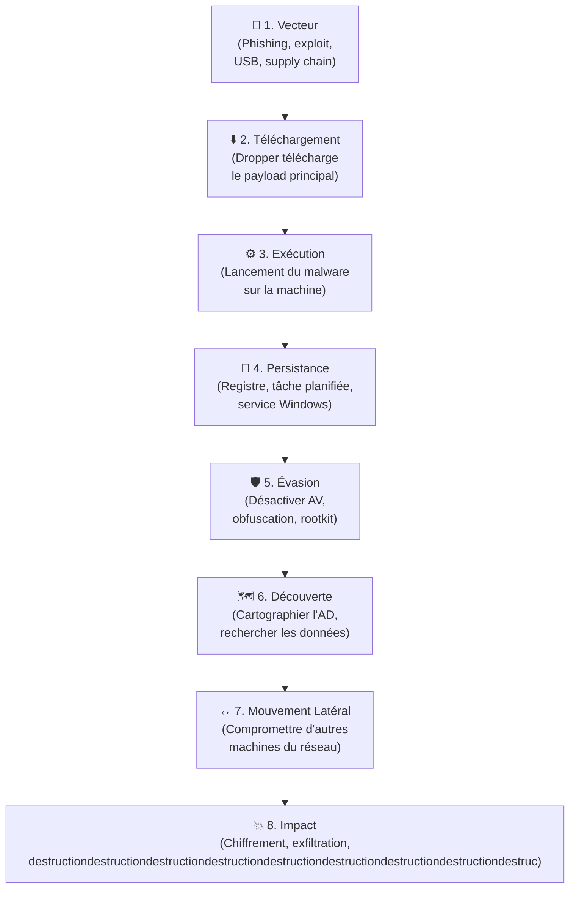

# Introduction aux Malwares

<div
  class="omny-meta"
  data-level="🟡 Intermédiaire"
  data-version="2025"
  data-time="~2 heures">
</div>

## Introduction

!!! quote "Analogie pédagogique — La Taxonomie des Prédateurs"
    Un ornithologue qui part observer les oiseaux connaît leurs familles, leurs comportements et leurs habitats avant de partir sur le terrain. Sans cette connaissance préalable, il serait incapable de distinguer un aigle d'un faucon. De même, un analyste SOC doit connaître les **familles de malwares** et leurs comportements caractéristiques — c'est ce qui lui permet de qualifier rapidement une alerte et de prendre les bonnes décisions.

<br>

---

## Les grandes familles de malwares

| Famille | Objectif principal | Exemple notoire |
|---|---|---|
| **Ransomware** | Chiffrer les données et exiger une rançon | LockBit, Ryuk, WannaCry |
| **RAT** (Remote Access Trojan) | Contrôle à distance de la machine | AsyncRAT, Cobalt Strike, njRAT |
| **Stealer** | Voler des credentials, cookies, cryptomonnaies | Redline, Raccoon, Vidar |
| **Rootkit** | Se cacher dans le système (niveau kernel) | Necurs, ZeroAccess |
| **Wiper** | Détruire les données définitivement | NotPetya, Shamoon |
| **Backdoor** | Maintenir un accès persistant discret | Emotet, TrickBot |
| **Cryptominer** | Miner des cryptomonnaies sur la machine | XMRig (légitimement utilisé) |
| **Botnet** | Créer un réseau de machines zombies | Mirai, Emotet |

<br>

---

## Cycle de vie d'une infection



_Comprendre ce cycle est essentiel pour la détection : chaque phase laisse des **traces** spécifiques. Les analystes SOC cherchent ces traces à chaque étape, de préférence le plus tôt possible (phase 1-3 = confinement facile, phase 7-8 = catastrophe)._

<br>

---

## Environnement d'analyse sécurisé

!!! warning "Ne jamais analyser un malware sur votre machine de production"
    Un malware peut détecter qu'il est analysé et soit se désactiver (anti-sandbox), soit s'exécuter normalement et compromettre votre poste. Utilisez **toujours** un environnement isolé.

### Architecture recommandée

```bash title="Mise en place d'un lab d'analyse malware avec VMware/VirtualBox"
# Configuration réseau isolé pour le lab
# Host-Only : la VM ne peut pas accéder à Internet ni au LAN réel
# Réseau dédié : 192.168.100.0/24

# VM d'analyse Windows (cible)
# OS : Windows 10 22H2 (snapshot propre avant chaque analyse)
# Outils pré-installés : Sysmon, Wireshark, Process Monitor, Autoruns

# VM Linux (observation)
# Tshark/Wireshark pour capturer le trafic réseau
# Serveur INetSim : simule Internet (DNS, HTTP, SMTP) pour le malware

# Snapshot avant chaque analyse → revenir à un état propre après
```

### Outils d'analyse essentiels

| Outil | OS | Rôle |
|---|---|---|
| **Detect-It-Easy (DiE)** | Win/Linux | Identifier format, packer, compilateur |
| **strings** | Linux | Extraire les chaînes lisibles |
| **PEStudio** | Windows | Analyser les PE (imports, exports, sections) |
| **Process Monitor** | Windows | Surveiller processus/registre/réseau en direct |
| **Wireshark** | Win/Linux | Capturer le trafic réseau généré |
| **Autoruns** | Windows | Identifier les mécanismes de persistance |
| **Ghidra** | Win/Linux | Décompiler/désassembler le code |
| **x64dbg** | Windows | Débogueur pour analyse dynamique avancée |

<br>

---

## Conclusion

!!! quote "Ce qu'il faut retenir"
    La connaissance des familles de malwares est votre **première ligne de défense intellectuelle**. Quand vous voyez une alerte, vous devez immédiatement penser : "quel type de malware pourrait générer ce comportement ? Quelle est sa prochaine action probable ?" Cette pensée prédictive vous permet d'anticiper et de contenir **avant** que l'attaquant n'atteigne son objectif final.

> Commencez l'analyse pratique avec **[Sandbox →](./sandbox.md)** — la méthode la plus rapide pour comprendre le comportement d'un fichier suspect.

<br>