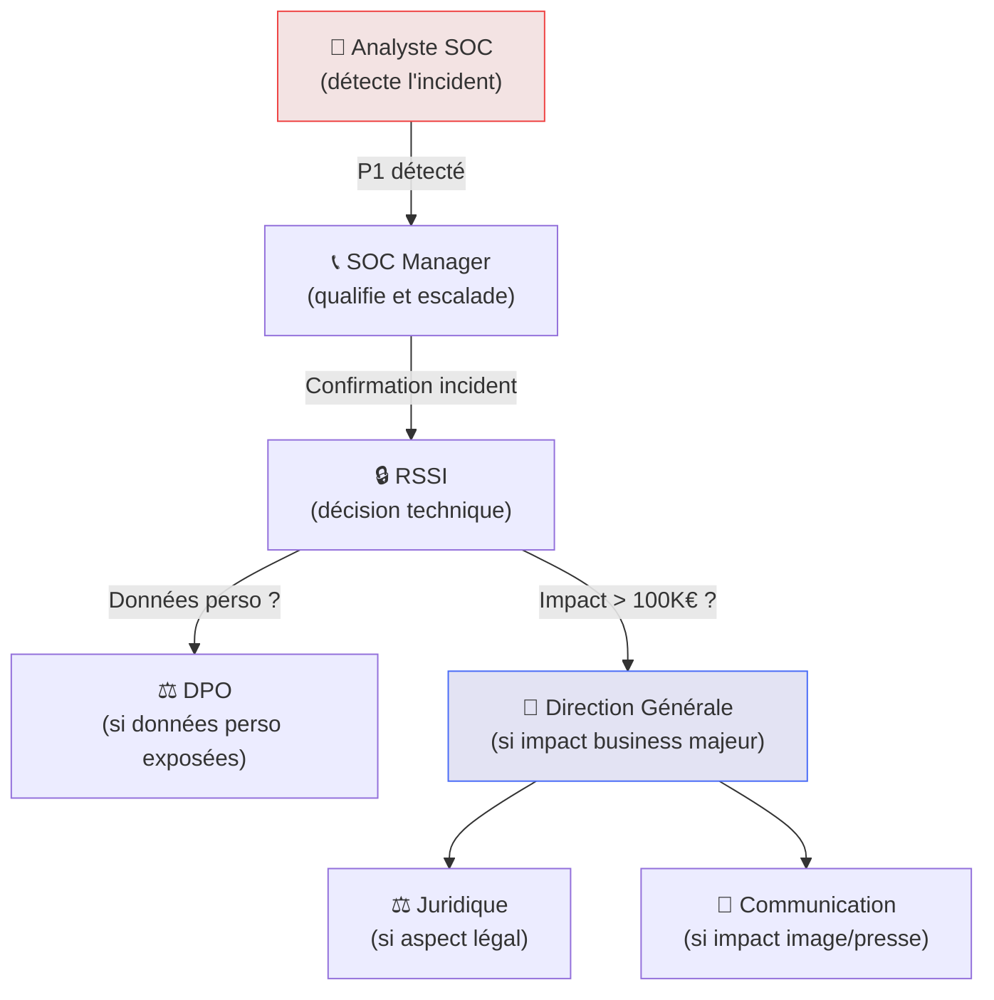

# Communication de Crise

<div
  class="omny-meta"
  data-level="🟡 Intermédiaire"
  data-version="2025"
  data-time="~1-2 heures">
</div>

## Introduction

!!! quote "Analogie pédagogique — Le Porte-Parole en Conférence de Presse"
    Lors d'une catastrophe industrielle, le PDG ne gère pas simultanément l'opérationnel et la presse. Un **porte-parole désigné** gère la communication externe avec des messages préparés et validés, pendant que les équipes techniques se concentrent sur la résolution. La **communication de crise SOC** suit le même principe : des rôles clairement définis, des messages préparés à l'avance, et une séparation nette entre gestion technique et communication.

La **communication de crise** est souvent la partie la plus négligée dans la préparation d'un SOC — et la plus critique lors d'un incident majeur. Une mauvaise communication peut aggraver la crise (panique interne, fuites vers la presse) ou créer des problèmes juridiques (non-respect RGPD, obligation de notification).

<br>

---

## Chaîne de communication interne



<br>

---

## Templates de communication

### Notification initiale (interne — première heure)

```text title="Template — Notification incident P1 (interne)"
[CONFIDENTIEL — NE PAS TRANSFÉRER]

OBJET : [INCIDENT P1] Compromission détectée — {heure} — {date}

Équipe Direction,

Un incident de sécurité de niveau CRITIQUE a été détecté à {heure}.

SITUATION ACTUELLE
- Type d'incident : {type : ransomware / compromission compte / exfiltration...}
- Systèmes impactés : {liste des systèmes}
- Périmètre estimé : {nombre de machines / utilisateurs}
- Données personnelles exposées : OUI / NON / EN COURS D'ÉVALUATION

ACTIONS EN COURS
- Confinement : {statut}
- Investigation : {statut}
- Prochaine mise à jour : dans {N} heures

RISQUES IDENTIFIÉS
- {liste des risques business identifiés}

CONTACT : {nom du RSSI} — {téléphone direct}

Ce message sera mis à jour toutes les {N} heures.
```

### Notification client/partenaire (externe)

```text title="Template — Notification client (externe — si nécessaire)"
Madame, Monsieur,

Nous vous informons qu'un incident de sécurité informatique a été détecté 
au sein de nos systèmes le {date} à {heure}.

Après investigation, {vos données / les données suivantes} pourraient 
avoir été exposées : {liste limitée à ce qui est confirmé}.

Les mesures suivantes ont été immédiatement prises :
- {action 1}
- {action 2}

Si vous constatez des activités suspectes liées à vos informations, 
nous vous invitons à {actions recommandées}.

Pour toute question, notre équipe dédiée est joignable à {contact}.

Nous vous prions d'accepter nos sincères excuses pour la gêne occasionnée.

{Signature}
```

<br>

---

## Notification CNIL — Violation de données personnelles

Si l'incident implique des données personnelles, l'**Article 33 du RGPD** impose une notification à la CNIL dans les **72 heures**.

!!! warning "Délai légal — 72h"
    Le délai commence à partir du moment où vous avez **connaissance** de la violation, pas à partir de sa date de survenance. En cas de doute, notifiez sans attendre — une notification partielle (mise à jour ultérieure) est préférable à une notification tardive.

```markdown title="Notification CNIL — Structure du formulaire (Article 33 RGPD)"
# Notification de violation de données personnelles

## 1. Description de la violation
- Date et heure de survenance : {date}
- Date et heure de détection : {date}
- Nature de la violation : [Confidentialité / Intégrité / Disponibilité]
- Cause probable : {ransomware / intrusion / erreur humaine...}

## 2. Catégories de données concernées
- [x] Données d'identification (nom, prénom, email)
- [ ] Données financières
- [ ] Données de santé
- [ ] Données sensibles (Art. 9 RGPD)

## 3. Nombre de personnes concernées
- Estimation : {nombre}
- Certitude : [Exact / Estimation haute / Inconnue]

## 4. Conséquences probables
- {description des risques pour les personnes}

## 5. Mesures prises
- {actions de confinement, notification, sécurisation}

## 6. Contact DPO
- Nom : {nom}
- Email : {email DPO}
- Téléphone : {téléphone}
```

```bash title="Soumettre la notification CNIL en ligne"
# Portail de notification CNIL :
# https://notifications.cnil.fr/notifications/index

# Téléphone CNIL pour urgences : 01 53 73 22 22
```

<br>

---

## Leçons tirées des grandes crises

!!! tip "Ce que les grandes crises ont appris"
    - **SolarWinds (2020)** : la transparence rapide avec les clients a préservé la confiance malgré l'ampleur
    - **Uber (2022)** : dissimuler un incident (2016) a coûté 148M$ d'amendes et la réputation du RSSI
    - **Colonial Pipeline (2021)** : communication fragmentée a semé la panique et accentué la crise

    **Règle d'or** : communiquez tôt, communiquez honnêtement, ne sur-promettez pas.

<br>

---

## Conclusion

!!! quote "Ce qu'il faut retenir"
    La communication de crise n'est pas une compétence naturelle sous pression — c'est une **discipline qui se prépare à froid**. Les templates, les chaînes d'escalade et les contacts doivent être prêts **avant** l'incident. Lors d'un incident P1, chaque minute compte : vous n'avez pas le temps de rédiger une procédure de communication en partant de zéro.

> **Félicitations — La section Cyber : Opérations est complète !** 🎉 Vous disposez maintenant d'un corpus de formation SOC complet, de l'Architecture jusqu'à la Gestion Opérationnelle.

<br>